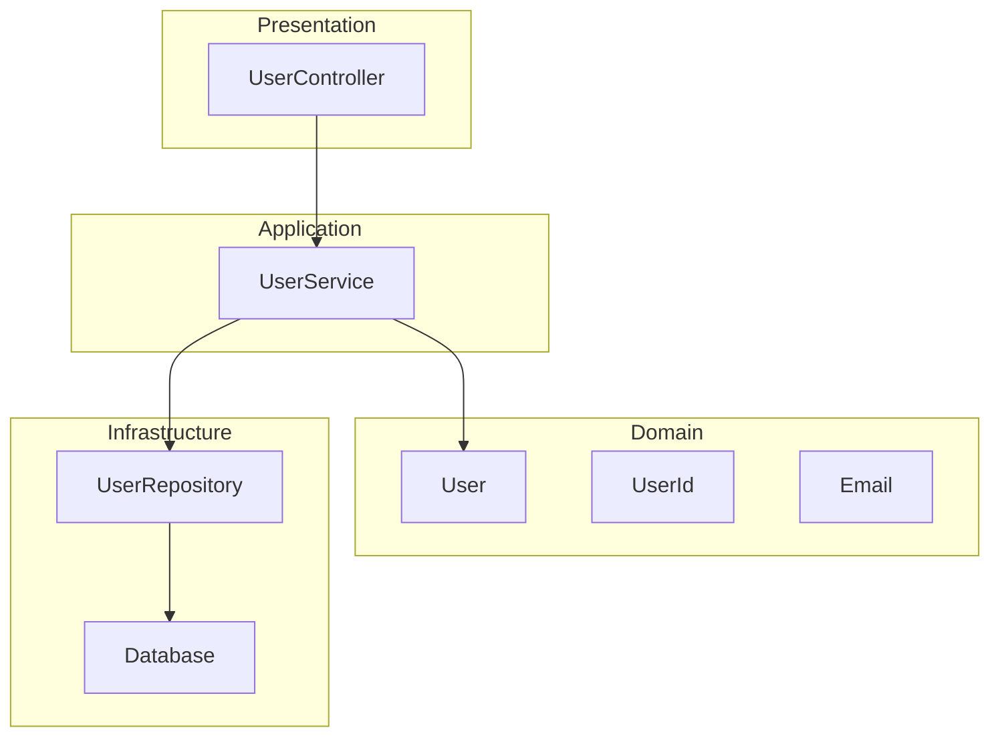
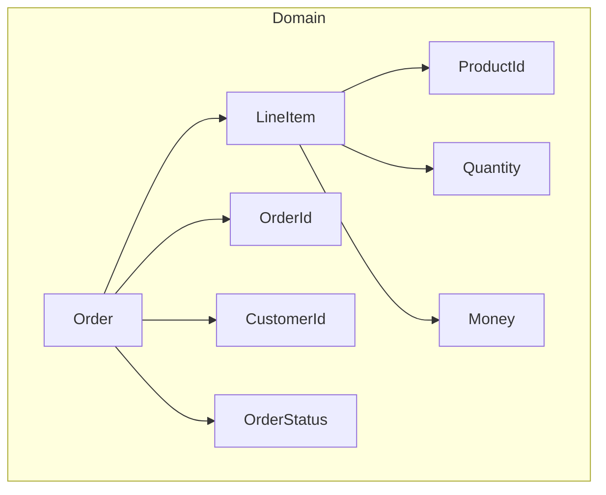

# Architecture Writing Guide

**Purpose:** Design-first development with verification and diagram generation.

---

## Overview

This guide covers the **Skeleton → Verify → Diagram** workflow:

1. **Skeleton First** - Create minimal type structure
2. **Lean Verify** - Generate and verify after each design step
3. **Basic Tests** - Write test cases for skeleton
4. **Diagram Gen** - Generate architecture diagrams from tests

---

## Workflow Diagram

```
┌─────────────────────────────────────────────────────────┐
│                    DESIGN PHASE                         │
├─────────────────────────────────────────────────────────┤
│  1. Skeleton Types    2. Lean Verify    3. Iterate      │
│  ┌───────────────┐   ┌──────────────┐   ┌───────────┐   │
│  │ struct/class  │──▶│ gen-lean     │──▶│ fix types │   │
│  │ trait/enum    │   │ verify       │   │ re-verify │   │
│  └───────────────┘   └──────────────┘   └───────────┘   │
│         │                   │                  │        │
│         └───────────────────┴──────────────────┘        │
│                          │                              │
├──────────────────────────▼──────────────────────────────┤
│                   TEST PHASE                            │
├─────────────────────────────────────────────────────────┤
│  4. Basic Tests       5. Run Tests      6. Diagram Gen  │
│  ┌───────────────┐   ┌──────────────┐   ┌───────────┐   │
│  │ SSpec tests   │──▶│ simple test  │──▶│ arch      │   │
│  │ @architectural│   │ --diagram    │   │ diagrams  │   │
│  └───────────────┘   └──────────────┘   └───────────┘   │
└─────────────────────────────────────────────────────────┘
```

---

## Phase 1: Skeleton Types

### Start with Domain Types

Create minimal type definitions with no implementation.

```simple
# domain/user.spl

## User domain model.
#
# >>> user = User.new(UserId.new(1), Email.new("a@b.com"))
# >>> user.id.value
# 1
@verify(types)
@architectural
struct User:
    id: UserId
    email: Email
    status: UserStatus

@verify(types)
struct UserId:
    value: u64

    fn new(value: u64) -> UserId:
        UserId { value }

@verify(types)
struct Email:
    value: String

    fn new(value: String) -> Email:
        in: value.contains("@"), "invalid email"
        Email { value }

@verify(types)
enum UserStatus:
    Active
    Inactive
    Pending
```

### Skeleton Rules

1. **Types only** - No business logic yet
2. **Domain-driven** - Use domain types, not primitives
3. **Contracts** - Add `in:/out:` for invariants
4. **Annotations** - Mark with `@verify` and `@architectural`

---

## Phase 2: Lean Verification

### Verify After Each Type Addition

```bash
# Generate Lean for new types
simple gen-lean generate --project types

# Check alignment
simple gen-lean compare

# Run Lean proofs
cd verification/type_inference_compile && lake build
```

### Verification Annotations

```simple
# Type-level verification
@verify(types)
struct Money:
    cents: i64

    fn new(cents: i64) -> Money:
        in: cents >= 0, "money cannot be negative"
        Money { cents }

# Memory verification
@verify(memory)
fn transfer(from: mut Account, to: mut Account, amount: Money):
    in: from.balance >= amount, "insufficient funds"
    from.balance -= amount
    to.balance += amount

# Effect verification
@verify(effects)
@io
fn log_transaction(tx: Transaction):
    print("Transaction: {tx}")
```

### Generated Lean Example

```lean
-- Generated from @verify(types) struct Money
structure Money where
  cents : Int
  cents_nonneg : cents ≥ 0

def Money.new (cents : Int) (h : cents ≥ 0) : Money :=
  ⟨cents, h⟩

-- Contract becomes theorem
theorem Money.new_valid : ∀ c, c ≥ 0 → (Money.new c).cents = c := by
  intros c h
  rfl
```

### Verification Levels

| Level | Scope | Use Case |
|-------|-------|----------|
| `types` | Type correctness | Domain models, generics |
| `memory` | Borrow checking | Mutable operations |
| `effects` | Effect tracking | IO, async, capabilities |
| `all` | Full verification | Critical business logic |

---

## Phase 3: Basic Tests with Architecture

### Write Tests for Skeleton

```simple
# test/unit/domain/user_spec.spl

"""
# User Domain Specification

**Status:** In Progress
**Feature IDs:** #100-105

## Overview

User domain model with email validation and status tracking.
"""

import std.spec
import domain.user.{User, UserId, Email, UserStatus}

describe "User":
    """
    ## User Entity

    Core user domain model.

    >>> user = User.new(UserId.new(1), Email.new("test@example.com"))
    >>> user.status
    UserStatus.Active
    """

    # Mark test for diagram generation
    @architectural
    context "creation":
        """
        ### User Creation Flow
        """

        it "creates user with valid email":
            id = UserId.new(1)
            email = Email.new("user@example.com")
            user = User.new(id, email)

            expect user.id.value to eq 1
            expect user.email.value to eq "user@example.com"

        it "rejects invalid email":
            expect_raises ContractError:
                Email.new("invalid-email")

    @architectural
    context "status transitions":
        """
        ### Status State Machine
        """

        it "starts as Active":
            user = User.new(UserId.new(1), Email.new("a@b.com"))
            expect user.status to eq UserStatus.Active

        it "can be deactivated":
            user = User.new(UserId.new(1), Email.new("a@b.com"))
            user.deactivate()
            expect user.status to eq UserStatus.Inactive
```

### Run Tests with Diagram Generation

```bash
# Run tests and generate diagrams
simple test --diagram-all --diagram-output target/diagrams/

# Run specific test with sequence diagram
simple test user_spec.spl --seq-diagram

# Generate architecture diagram only
simple test --arch-diagram --seq-include "domain.*"
```

---

## Phase 4: Architecture Diagram Generation

### Mark Architectural Entities

```simple
# Mark classes/structs for architecture diagrams
@architectural
@architectural_layer(Domain)
struct User:
    ...

@architectural
@architectural_layer(Application)
class UserService:
    ...

@architectural
@architectural_layer(Infrastructure)
class UserRepository:
    ...
```

### Architectural Layers

```simple
enum ArchLayer:
    Presentation    # UI, API controllers
    Application     # Use cases, services
    Domain          # Business entities
    Infrastructure  # Database, external services
```

### Generated Diagram Example

Running tests produces Mermaid diagrams:



### Diagram Config

```simple
# test/arch_config.spl

config = DiagramConfig.new()
    .with_all()                           # All diagram types
    .with_include("domain.*,service.*")   # Include patterns
    .with_exclude("test.*,mock.*")        # Exclude patterns
    .with_output_dir(Path.from("doc/diagrams"))

set_diagram_config(config)
```

---

## Complete Example: Order Domain

### Step 1: Skeleton Types

```simple
# domain/order.spl

"""
# Order Domain

Order aggregate with line items and totals.

## Usage

>>> order = Order.new(CustomerId.new(1))
>>> order.add_item(ProductId.new(100), Quantity.new(2), Money.new(1000))
>>> order.total().cents
2000
"""

@verify(types)
@architectural
@architectural_layer(Domain)
struct Order:
    id: OrderId
    customer_id: CustomerId
    items: List[LineItem]
    status: OrderStatus

    fn new(customer_id: CustomerId) -> Order:
        Order {
            id: OrderId.generate(),
            customer_id: customer_id,
            items: [],
            status: OrderStatus.Draft
        }

    ## Add item to order.
    #
    # >>> order = Order.new(CustomerId.new(1))
    # >>> order.add_item(ProductId.new(1), Quantity.new(2), Money.new(500))
    # >>> order.items.len()
    # 1
    fn add_item(mut self, product: ProductId, qty: Quantity, price: Money):
        in: self.status == OrderStatus.Draft, "can only modify draft orders"
        self.items.append(LineItem { product, qty, price })

    ## Calculate order total.
    #
    # >>> order = Order.new(CustomerId.new(1))
    # >>> order.add_item(ProductId.new(1), Quantity.new(3), Money.new(100))
    # >>> order.total().cents
    # 300
    @verify(types)
    fn total(self) -> Money:
        out(ret): ret.cents >= 0
        self.items.fold(Money.new(0)) |acc, item|
            acc + item.subtotal()

@verify(types)
struct LineItem:
    product: ProductId
    qty: Quantity
    price: Money

    fn subtotal(self) -> Money:
        Money.new(self.price.cents * self.qty.value)

@verify(types)
struct Quantity:
    value: u32

    fn new(value: u32) -> Quantity:
        in: value > 0, "quantity must be positive"
        Quantity { value }

@verify(types)
enum OrderStatus:
    Draft
    Submitted
    Paid
    Shipped
    Completed
    Cancelled
```

### Step 2: Verify

```bash
# Generate and verify
simple gen-lean generate --project types
simple gen-lean compare --diff

# Run Lean proofs
cd verification/type_inference_compile && lake build
```

### Step 3: Write Tests

```simple
# test/unit/domain/order_spec.spl

"""
# Order Specification

**Status:** Complete
**Feature IDs:** #200-210

## Overview

Order aggregate with line items and status transitions.
"""

import std.spec
import domain.order.*

describe "Order":
    """
    ## Order Aggregate

    >>> order = Order.new(CustomerId.new(1))
    >>> order.status
    OrderStatus.Draft
    """

    @architectural
    context "line items":
        """
        ### Adding Items

        >>> order = Order.new(CustomerId.new(1))
        >>> order.add_item(ProductId.new(1), Quantity.new(2), Money.new(500))
        >>> order.total().cents
        1000
        """

        before_each:
            @order = Order.new(CustomerId.new(1))

        it "adds items to draft order":
            @order.add_item(ProductId.new(1), Quantity.new(2), Money.new(500))
            expect @order.items.len() to eq 1

        it "calculates total correctly":
            @order.add_item(ProductId.new(1), Quantity.new(2), Money.new(500))
            @order.add_item(ProductId.new(2), Quantity.new(1), Money.new(1000))
            expect @order.total().cents to eq 2000

        it "rejects zero quantity":
            expect_raises ContractError:
                Quantity.new(0)

    @architectural
    context "status transitions":
        """
        ### Order Status Flow

        ```
        Draft → Submitted → Paid → Shipped → Completed
                    ↓          ↓
                Cancelled  Cancelled
        ```
        """

        it "starts as Draft":
            order = Order.new(CustomerId.new(1))
            expect order.status to eq OrderStatus.Draft

        it "transitions to Submitted":
            order = Order.new(CustomerId.new(1))
            order.add_item(ProductId.new(1), Quantity.new(1), Money.new(100))
            order.submit()
            expect order.status to eq OrderStatus.Submitted

        it "cannot add items after submit":
            order = Order.new(CustomerId.new(1))
            order.add_item(ProductId.new(1), Quantity.new(1), Money.new(100))
            order.submit()

            expect_raises ContractError:
                order.add_item(ProductId.new(2), Quantity.new(1), Money.new(200))
```

### Step 4: Generate Diagrams

```bash
# Run tests with all diagrams
simple test order_spec.spl --diagram-all

# Output:
# target/diagrams/order_spec_sequence.md
# target/diagrams/order_spec_class.md
# target/diagrams/order_spec_architecture.md
```

**Generated Architecture Diagram:**



---

## Quick Reference

### Workflow Commands

```bash
# Phase 1: Create skeleton
simple new module domain/order

# Phase 2: Verify
simple gen-lean generate
simple gen-lean compare
cd verification/type_inference_compile && lake build

# Phase 3: Test
simple test order_spec.spl

# Phase 4: Diagrams
simple test --diagram-all --diagram-output doc/diagrams/
```

### Annotations Summary

| Annotation | Purpose |
|------------|---------|
| `@verify(types)` | Generate Lean type proofs |
| `@verify(memory)` | Generate memory safety proofs |
| `@verify(effects)` | Generate effect tracking proofs |
| `@architectural` | Include in architecture diagrams |
| `@architectural_layer(X)` | Assign to layer (Presentation/Application/Domain/Infrastructure) |

### File Structure

```
feature/
├── domain/
│   ├── __init__.spl           # Module exports
│   ├── order.spl              # Domain types (skeleton)
│   └── customer.spl           # Domain types
├── service/
│   └── order_service.spl      # Application layer
├── repository/
│   └── order_repository.spl   # Infrastructure layer
└── test/
    └── order_spec.spl         # Tests with @architectural
```

---

## Best Practices

### 1. Skeleton Before Logic

```simple
# Good: Types first, logic later
@verify(types)
struct Account:
    balance: Money
    owner: CustomerId

# Add methods only after types verified
impl Account:
    fn deposit(mut self, amount: Money):
        ...
```

### 2. Verify Incrementally

```bash
# After each type addition
simple gen-lean compare

# Don't wait until end - verify continuously
```

### 3. Tests Drive Diagrams

```simple
# Test interactions generate diagrams
@architectural
context "payment flow":
    it "processes payment through gateway":
        # This interaction appears in sequence diagram
        order = Order.new(...)
        payment = PaymentGateway.charge(order)
        order.mark_paid(payment)
```

### 4. Layer Separation

```simple
# Keep layers separate
@architectural_layer(Domain)      # Business rules
@architectural_layer(Application) # Use cases
@architectural_layer(Infrastructure)  # External systems
```

---

## See Also

- [design_writing.md](design_writing.md) - Draft→Test→Generate diagram workflow
- [coding_style.md](coding_style.md) - Coding conventions
- [sspec_writing.md](sspec_writing.md) - Test writing guide
- [.claude/skills/architecture.md](../../.claude/skills/architecture.md) - Architecture skill
- [.claude/skills/design.md](../../.claude/skills/design.md) - Design patterns
- [doc/spec/doctest_readme.md](../spec/doctest_readme.md) - Doctest specification
