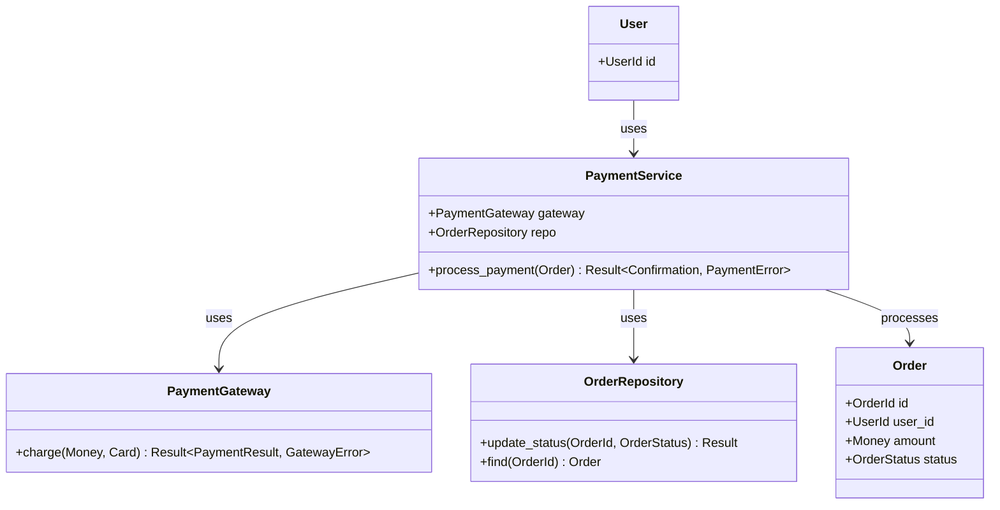
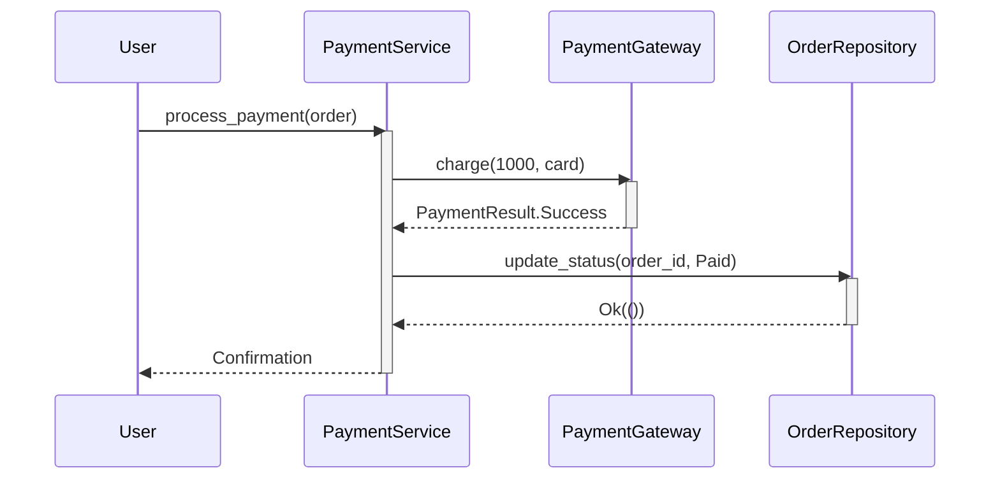
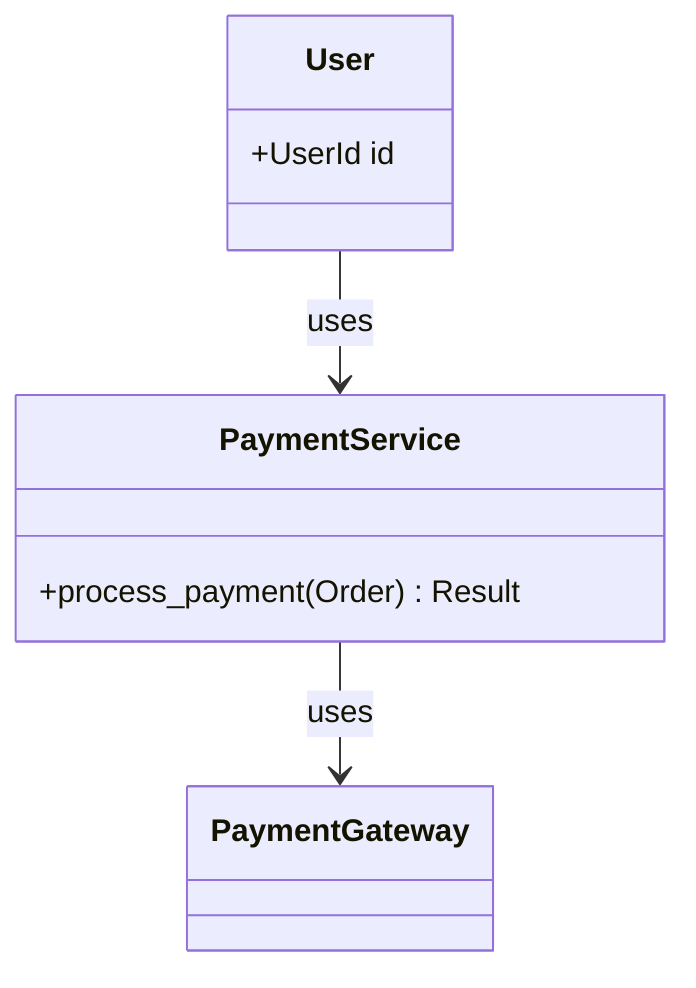
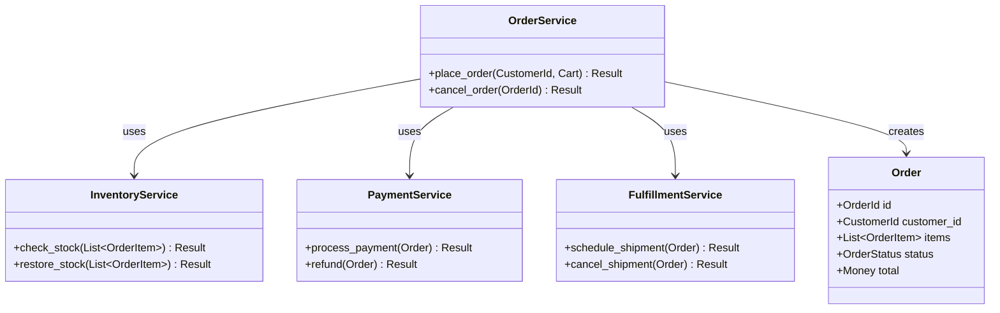
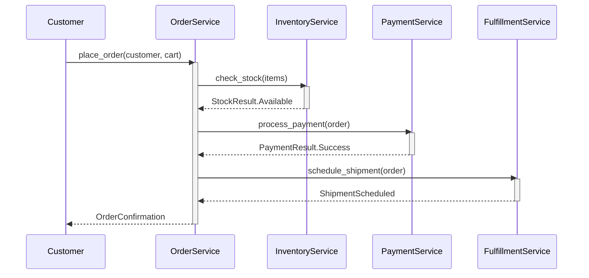
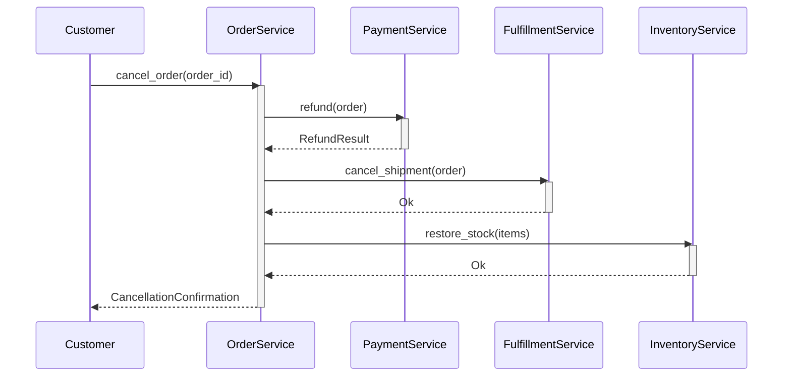

# Design Writing Guide

**Purpose:** Design-first development with draft diagrams replaced by test-generated diagrams.

---

## Overview

This guide covers the **Draft → Test → Generate** workflow:

1. **Draft Diagram** - Sketch initial design (text/rough diagram)
2. **Write Tests** - Create test cases from draft
3. **Generate Diagrams** - Run tests to produce class/sequence diagrams
4. **Replace Draft** - Update documentation with generated diagrams

---

## Workflow Diagram

```
┌─────────────────────────────────────────────────────────┐
│                    DRAFT PHASE                          │
├─────────────────────────────────────────────────────────┤
│  1. Draft Diagram                                       │
│  ┌─────────────────────────────────────────────────┐   │
│  │ <!-- draft:class PaymentFlow -->                │   │
│  │ User -> PaymentService -> Gateway -> Bank       │   │
│  │ <!-- /draft -->                                 │   │
│  └─────────────────────────────────────────────────┘   │
│                          │                              │
├──────────────────────────▼──────────────────────────────┤
│                    TEST PHASE                           │
├─────────────────────────────────────────────────────────┤
│  2. Write Tests from Draft                              │
│  ┌─────────────────────────────────────────────────┐   │
│  │ @architectural                                  │   │
│  │ it "processes payment through gateway":         │   │
│  │     user.pay(order)                             │   │
│  │     service.process(payment)                    │   │
│  │     gateway.charge(card)                        │   │
│  └─────────────────────────────────────────────────┘   │
│                          │                              │
├──────────────────────────▼──────────────────────────────┤
│                  GENERATE PHASE                         │
├─────────────────────────────────────────────────────────┤
│  3. Run Tests with Diagram Generation                   │
│  ┌─────────────────────────────────────────────────┐   │
│  │ simple test --class-diagram --seq-diagram       │   │
│  │                                                 │   │
│  │ Output:                                         │   │
│  │ - payment_flow_class.md    (class diagram)      │   │
│  │ - payment_flow_sequence.md (sequence diagram)   │   │
│  └─────────────────────────────────────────────────┘   │
│                          │                              │
├──────────────────────────▼──────────────────────────────┤
│                  REPLACE PHASE                          │
├─────────────────────────────────────────────────────────┤
│  4. Replace Draft with Generated                        │
│  ┌─────────────────────────────────────────────────┐   │
│  │ <!-- generated:class PaymentFlow -->            │   │
│  │ ```mermaid                                      │   │
│  │ classDiagram                                    │   │
│  │     User --> PaymentService                     │   │
│  │     PaymentService --> Gateway                  │   │
│  │ ```                                             │   │
│  │ <!-- /generated -->                             │   │
│  └─────────────────────────────────────────────────┘   │
└─────────────────────────────────────────────────────────┘
```

---

## Phase 1: Draft Diagram

### Draft Format in Documentation

Use HTML comments to mark draft diagrams that will be replaced:

```markdown
# Payment Flow Design

## Class Relationships

<!-- draft:class PaymentFlow
Rough design - will be replaced by test-generated diagram

Participants:
- User: initiates payment
- PaymentService: orchestrates flow
- PaymentGateway: external payment processor
- OrderRepository: persists order state

Relationships:
- User -> PaymentService (uses)
- PaymentService -> PaymentGateway (uses)
- PaymentService -> OrderRepository (uses)
-->

## Sequence Flow

<!-- draft:sequence PaymentFlow
1. User calls PaymentService.processPayment(order)
2. PaymentService validates order
3. PaymentService calls Gateway.charge(amount)
4. Gateway returns PaymentResult
5. PaymentService updates OrderRepository
6. Return confirmation to User
-->
```

### Draft Skeleton Code

```simple
# design/payment_flow.spl
# Draft skeleton - types only, no implementation

"""
# Payment Flow Design

## Draft Class Diagram

<!-- draft:class PaymentFlow
User --> PaymentService
PaymentService --> PaymentGateway
PaymentService --> OrderRepository
-->

## Draft Sequence

<!-- draft:sequence PaymentFlow
User -> PaymentService: processPayment(order)
PaymentService -> PaymentGateway: charge(amount)
PaymentGateway --> PaymentService: PaymentResult
PaymentService -> OrderRepository: updateStatus()
PaymentService --> User: Confirmation
-->
"""

# Skeleton types from draft
@architectural
struct User:
    id: UserId

@architectural
class PaymentService:
    gateway: PaymentGateway
    repo: OrderRepository

    fn process_payment(self, order: Order) -> Result[Confirmation, PaymentError]:
        ...  # To be implemented

@architectural
class PaymentGateway:
    fn charge(self, amount: Money, card: Card) -> Result[PaymentResult, GatewayError]:
        ...

@architectural
class OrderRepository:
    fn update_status(self, order_id: OrderId, status: OrderStatus) -> Result[(), RepoError]:
        ...
```

---

## Phase 2: Write Tests from Draft

### Convert Draft to Test Cases

Transform each draft interaction into a test:

```simple
# test/integration/payment_flow_spec.spl

"""
# Payment Flow Specification

**Status:** In Progress

## Overview

Tests for the payment processing flow.
Diagrams will be generated from test execution.
"""

import std.spec
import design.payment_flow.*

describe "PaymentFlow":
    """
    ## Payment Processing

    <!-- draft:class PaymentFlow -->
    <!-- will be replaced by generated diagram -->
    """

    # Enable diagram recording for this context
    @architectural
    @record_diagram
    context "successful payment":
        """
        ### Happy Path Sequence

        <!-- draft:sequence PaymentFlow.success -->
        """

        before_each:
            @user = User { id: UserId.new(1) }
            @service = PaymentService.new(
                MockGateway.success(),
                MockRepository.new()
            )
            @order = Order.new(@user.id, Money.new(1000))

        it "processes payment through gateway":
            # This interaction is recorded for sequence diagram
            result = @service.process_payment(@order)

            expect result to be_ok
            expect result.unwrap().status to eq "confirmed"

        it "updates order status after payment":
            @service.process_payment(@order)

            order = @service.repo.find(@order.id)
            expect order.status to eq OrderStatus.Paid

    @architectural
    @record_diagram
    context "failed payment":
        """
        ### Error Path Sequence

        <!-- draft:sequence PaymentFlow.failure -->
        """

        before_each:
            @user = User { id: UserId.new(1) }
            @service = PaymentService.new(
                MockGateway.decline(),  # Will decline
                MockRepository.new()
            )
            @order = Order.new(@user.id, Money.new(1000))

        it "handles gateway decline":
            result = @service.process_payment(@order)

            expect result to be_err
            expect result.unwrap_err() to be_a PaymentDeclined

        it "does not update order on failure":
            @service.process_payment(@order)

            order = @service.repo.find(@order.id)
            expect order.status to eq OrderStatus.Pending
```

### Test-to-Draft Mapping

| Draft Element | Test Element |
|---------------|--------------|
| Class in diagram | `@architectural` on struct/class |
| Arrow in sequence | Method call in test |
| Actor | Test fixture (`@user`, `@service`) |
| Return value | `expect` assertion |

---

## Phase 3: Generate Diagrams from Tests

### Diagram Integration API

Use the `diagram.integration` module to record test execution:

```simple
import diagram.integration.{
    with_sequence_diagram,
    with_class_diagram,
    with_all_diagrams,
    trace_call,
    trace_method,
    trace_return,
    mark_architectural
}

# Option 1: Wrapper function
with_sequence_diagram("PaymentFlow") \:
    service.process_payment(order)
    gateway.charge(amount)

# Option 2: Manual tracing in instrumented code
fn process_payment(self, order: Order) -> Result:
    trace_method("PaymentService", "process_payment", [order.to_string()])
    result = self.gateway.charge(order.total)
    trace_return(Some(result.to_string()))
    result

# Option 3: Mark entities for architecture diagrams
mark_architectural("PaymentService")
mark_architectural("PaymentGateway")
```

### Test File with Diagram Recording

```simple
# test/integration/payment_flow_spec.spl

import std.spec
import diagram.integration.*
import domain.payment.*

describe "PaymentFlow":
    # Configure diagram output
    before_all:
        set_diagram_config(
            DiagramConfig.new()
                .with_all()
                .with_output_dir(Path.from("target/diagrams"))
        )

    @architectural
    context "successful payment":
        it "processes payment through gateway":
            # Start recording
            with_all_diagrams("payment_success") \:
                # All method calls are recorded
                user = User.new(UserId.new(1))
                service = PaymentService.new(gateway, repo)
                order = Order.new(user.id, Money.new(1000))

                result = service.process_payment(order)

                expect result to be_ok
            # Diagrams auto-generated when block ends

    @architectural
    context "payment declined":
        it "handles gateway decline":
            with_sequence_diagram("payment_declined") \:
                service = PaymentService.new(MockGateway.decline(), repo)
                result = service.process_payment(order)
                expect result to be_err
```

### Run Tests with Diagram Generation

```bash
# Generate all diagrams from tests
simple test payment_flow_spec.spl \
    --class-diagram \
    --seq-diagram \
    --diagram-output target/diagrams/

# Output files:
# target/diagrams/payment_success_sequence.md
# target/diagrams/payment_success_class.md
# target/diagrams/payment_success_arch.md
# target/diagrams/payment_declined_sequence.md
```

### Diagram Generator Functions

| Function | Purpose | Output |
|----------|---------|--------|
| `with_sequence_diagram(name, block)` | Record call sequence | `{name}_sequence.md` |
| `with_class_diagram(name, block)` | Record class relationships | `{name}_class.md` |
| `with_arch_diagram(name, block)` | Record architecture | `{name}_arch.md` |
| `with_all_diagrams(name, block)` | All three types | All files |

### Trace Functions for Custom Recording

```simple
# Record a function call
trace_call("validate_order", ["order_id=123"])

# Record a method call on a class
trace_method("PaymentGateway", "charge", ["amount=1000", "card=****"])

# Record a return value
trace_return(Some("PaymentResult.Success"))

# Mark entity as architectural (appears in arch diagrams)
mark_architectural("OrderService")
```

### Generated Class Diagram



### Generated Sequence Diagram



---

## Phase 4: Replace Draft with Generated

### Update Documentation

Replace draft markers with generated diagrams:

**Before (Draft):**
```markdown
## Class Relationships

<!-- draft:class PaymentFlow
User -> PaymentService -> Gateway
-->
```

**After (Generated):**
```markdown
## Class Relationships

<!-- generated:class PaymentFlow -->
<!-- Auto-generated from test/integration/payment_flow_spec.spl -->
<!-- Last updated: 2026-01-09 -->



<!-- /generated -->
```

### Automation Script

```simple
# scripts/update_diagrams.spl

import std.fs
import std.regex

fn update_design_doc(doc_path: Path, diagram_dir: Path):
    content = fs.read(doc_path)

    # Find all draft markers
    draft_pattern = r"<!-- draft:(\w+) (\w+)[\s\S]*?-->"

    for match in regex.find_all(draft_pattern, content):
        diagram_type = match.group(1)  # "class" or "sequence"
        diagram_name = match.group(2)  # "PaymentFlow"

        # Find corresponding generated diagram
        generated_file = diagram_dir.join("{diagram_name}_{diagram_type}.md")

        if generated_file.exists():
            generated_content = fs.read(generated_file)

            # Replace draft with generated
            replacement = """<!-- generated:{diagram_type} {diagram_name} -->
<!-- Auto-generated - do not edit manually -->
<!-- Source: test/integration/{diagram_name.to_snake_case()}_spec.spl -->

{generated_content}

<!-- /generated -->"""

            content = content.replace(match.full(), replacement)

    fs.write(doc_path, content)

# Usage
update_design_doc(
    Path.from("doc/design/payment_flow.md"),
    Path.from("target/diagrams/")
)
```

---

## Complete Example: Order Processing

### Step 1: Draft Design Document

```markdown
# Order Processing Design

**Status:** Draft
**Feature IDs:** #300-310

## Overview

Order processing system with validation, payment, and fulfillment.

## Class Diagram

<!-- draft:class OrderProcessing
Core entities:
- Order: aggregate root
- OrderItem: line items
- Customer: who places order

Services:
- OrderService: orchestrates
- InventoryService: stock check
- PaymentService: payment processing
- FulfillmentService: shipping

Relationships:
- OrderService uses all other services
- Order contains OrderItems
-->

## Sequence: Place Order

<!-- draft:sequence PlaceOrder
1. Customer -> OrderService: placeOrder(cart)
2. OrderService -> InventoryService: checkStock(items)
3. InventoryService --> OrderService: StockResult
4. OrderService -> PaymentService: processPayment(order)
5. PaymentService --> OrderService: PaymentResult
6. OrderService -> FulfillmentService: scheduleShipment(order)
7. FulfillmentService --> OrderService: ShipmentScheduled
8. OrderService --> Customer: OrderConfirmation
-->

## Sequence: Cancel Order

<!-- draft:sequence CancelOrder
1. Customer -> OrderService: cancelOrder(orderId)
2. OrderService -> PaymentService: refund(order)
3. OrderService -> FulfillmentService: cancelShipment(order)
4. OrderService -> InventoryService: restoreStock(items)
5. OrderService --> Customer: CancellationConfirmation
-->
```

### Step 2: Skeleton Types

```simple
# domain/order_processing.spl

@verify(types)
@architectural
@architectural_layer(Domain)
struct Order:
    id: OrderId
    customer_id: CustomerId
    items: List[OrderItem]
    status: OrderStatus
    total: Money

@verify(types)
@architectural
struct OrderItem:
    product_id: ProductId
    quantity: Quantity
    price: Money

@architectural
@architectural_layer(Application)
class OrderService:
    inventory: InventoryService
    payment: PaymentService
    fulfillment: FulfillmentService

    fn place_order(self, customer: CustomerId, cart: Cart) -> Result[OrderConfirmation, OrderError]:
        ...

    fn cancel_order(self, order_id: OrderId) -> Result[CancellationConfirmation, OrderError]:
        ...

@architectural
@architectural_layer(Application)
class InventoryService:
    fn check_stock(self, items: List[OrderItem]) -> Result[StockResult, InventoryError]:
        ...

    fn restore_stock(self, items: List[OrderItem]) -> Result[(), InventoryError]:
        ...

@architectural
@architectural_layer(Application)
class PaymentService:
    fn process_payment(self, order: Order) -> Result[PaymentResult, PaymentError]:
        ...

    fn refund(self, order: Order) -> Result[RefundResult, PaymentError]:
        ...

@architectural
@architectural_layer(Application)
class FulfillmentService:
    fn schedule_shipment(self, order: Order) -> Result[ShipmentScheduled, FulfillmentError]:
        ...

    fn cancel_shipment(self, order: Order) -> Result[(), FulfillmentError]:
        ...
```

### Step 3: Write Tests

```simple
# test/integration/order_processing_spec.spl

"""
# Order Processing Specification

**Status:** In Progress
**Feature IDs:** #300-310

## Class Diagram

<!-- draft:class OrderProcessing -->

## Sequences

<!-- draft:sequence PlaceOrder -->
<!-- draft:sequence CancelOrder -->
"""

import std.spec
import domain.order_processing.*
import test.mocks.*

describe "OrderProcessing":
    """
    ## Order Processing System

    Orchestrates order placement, payment, and fulfillment.
    """

    @architectural
    @record_diagram(name: "PlaceOrder")
    context "place order - happy path":
        """
        ### Place Order Sequence

        Full flow from cart to confirmation.
        """

        before_each:
            @inventory = MockInventoryService.with_stock()
            @payment = MockPaymentService.success()
            @fulfillment = MockFulfillmentService.available()
            @service = OrderService.new(@inventory, @payment, @fulfillment)
            @customer = CustomerId.new(1)
            @cart = Cart.new()
                .add(ProductId.new(100), Quantity.new(2), Money.new(500))
                .add(ProductId.new(200), Quantity.new(1), Money.new(1000))

        it "checks inventory for all items":
            @service.place_order(@customer, @cart)

            expect @inventory.check_stock_called to be true
            expect @inventory.last_items.len() to eq 2

        it "processes payment for order total":
            @service.place_order(@customer, @cart)

            expect @payment.process_called to be true
            expect @payment.last_amount.cents to eq 2000

        it "schedules fulfillment after payment":
            @service.place_order(@customer, @cart)

            expect @fulfillment.schedule_called to be true

        it "returns confirmation with order id":
            result = @service.place_order(@customer, @cart)

            expect result to be_ok
            confirmation = result.unwrap()
            expect confirmation.order_id to not_be_nil
            expect confirmation.status to eq "confirmed"

    @architectural
    @record_diagram(name: "PlaceOrder_OutOfStock")
    context "place order - out of stock":
        """
        ### Out of Stock Flow
        """

        before_each:
            @inventory = MockInventoryService.out_of_stock()
            @payment = MockPaymentService.success()
            @fulfillment = MockFulfillmentService.available()
            @service = OrderService.new(@inventory, @payment, @fulfillment)

        it "fails without processing payment":
            result = @service.place_order(CustomerId.new(1), Cart.new())

            expect result to be_err
            expect @payment.process_called to be false

    @architectural
    @record_diagram(name: "CancelOrder")
    context "cancel order":
        """
        ### Cancel Order Sequence

        Refund and restore stock flow.
        """

        before_each:
            @inventory = MockInventoryService.with_stock()
            @payment = MockPaymentService.success()
            @fulfillment = MockFulfillmentService.available()
            @service = OrderService.new(@inventory, @payment, @fulfillment)

            # Create an order first
            @order_id = @service.place_order(
                CustomerId.new(1),
                Cart.new().add(ProductId.new(100), Quantity.new(1), Money.new(500))
            ).unwrap().order_id

        it "refunds payment":
            @service.cancel_order(@order_id)

            expect @payment.refund_called to be true

        it "cancels shipment":
            @service.cancel_order(@order_id)

            expect @fulfillment.cancel_called to be true

        it "restores inventory":
            @service.cancel_order(@order_id)

            expect @inventory.restore_called to be true

        it "returns cancellation confirmation":
            result = @service.cancel_order(@order_id)

            expect result to be_ok
            expect result.unwrap().refund_amount.cents to eq 500
```

### Step 4: Generate and Replace

```bash
# Run tests with diagram generation
simple test order_processing_spec.spl \
    --class-diagram \
    --seq-diagram \
    --diagram-output target/diagrams/

# Update design document
simple run scripts/update_diagrams.spl \
    --doc doc/design/order_processing.md \
    --diagrams target/diagrams/
```

**Final Document with Generated Diagrams:**

```markdown
# Order Processing Design

**Status:** Complete
**Feature IDs:** #300-310

## Class Diagram

<!-- generated:class OrderProcessing -->
<!-- Auto-generated from test/integration/order_processing_spec.spl -->



<!-- /generated -->

## Sequence: Place Order

<!-- generated:sequence PlaceOrder -->



<!-- /generated -->

## Sequence: Cancel Order

<!-- generated:sequence CancelOrder -->



<!-- /generated -->
```

---

## Quick Reference

### Draft Markers

```markdown
<!-- draft:class DiagramName -->
<!-- draft:sequence DiagramName -->
<!-- draft:arch DiagramName -->
```

### Generated Markers

```markdown
<!-- generated:class DiagramName -->
<!-- generated:sequence DiagramName -->
<!-- generated:arch DiagramName -->
```

### Test Annotations

| Annotation | Purpose |
|------------|---------|
| `@architectural` | Include in diagrams |
| `@record_diagram` | Enable diagram recording |
| `@record_diagram(name: "X")` | Custom diagram name |

### Commands

```bash
# Generate class diagram
simple test --class-diagram

# Generate sequence diagram
simple test --seq-diagram

# Generate all diagrams
simple test --diagram-all

# Specify output directory
simple test --diagram-output target/diagrams/

# Update docs with generated diagrams
simple run scripts/update_diagrams.spl
```

---

## Best Practices

### 1. Draft First, Code Second

```markdown
# Always start with draft in documentation
<!-- draft:sequence MyFeature
Rough flow description here
-->

# Then write skeleton code
# Then write tests
# Then generate actual diagrams
```

### 2. One Diagram Per Context

```simple
# Each @record_diagram context generates one diagram
@architectural
@record_diagram(name: "CreateUser")
context "user creation":
    ...

@architectural
@record_diagram(name: "DeleteUser")
context "user deletion":
    ...
```

### 3. Keep Drafts Until Verified

```markdown
<!-- draft:class MyFeature -->
<!-- Keep draft until tests pass and diagrams generate correctly -->
<!-- Then replace with generated version -->
```

### 4. Version Control Generated Diagrams

```bash
# Commit generated diagrams to track design evolution
jj add doc/design/*.md target/diagrams/*.md
jj commit -m "Update generated diagrams from tests"
```

---

## See Also

- [architecture_writing.md](architecture_writing.md) - Skeleton-first architecture
- [sspec_writing.md](sspec_writing.md) - Test writing guide
- [coding_style.md](coding_style.md) - Coding conventions
- [.claude/skills/design.md](../../.claude/skills/design.md) - Design skill
