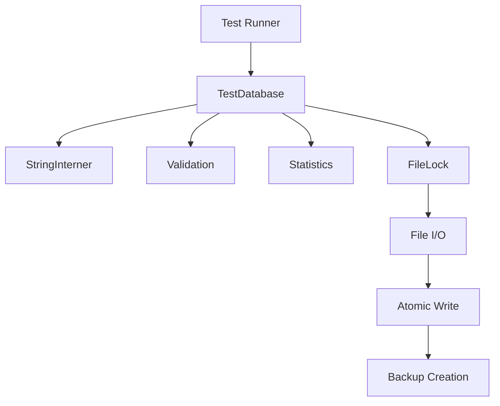

# Test Database Usage Guide

**Version:** 3.0 (SDN format)
**Last Updated:** 2026-02-03

## Table of Contents

1. [Architecture Overview](#architecture-overview)
2. [Safe Usage Patterns](#safe-usage-patterns)
3. [Performance Characteristics](#performance-characteristics)
4. [Concurrency Model](#concurrency-model)
5. [Troubleshooting](#troubleshooting)
6. [API Reference](#api-reference)
7. [Best Practices](#best-practices)

---

## Architecture Overview

The Simple test database system provides persistent storage for test execution data, timing statistics, and run history. It uses a two-file approach for optimal performance:

### File Structure

```
doc/test/
├── test_db.sdn          # Stable data (tests, suites, files)
├── test_db_runs.sdn     # Volatile data (counters, timing, runs)
├── test_db.sdn.bak      # Auto-created backup
└── test_db.sdn.lock     # Lock file (temporary)
```

### Data Model

```
┌─────────────────────────────────────────────────────────┐
│                    TestDatabase                          │
├─────────────────────────────────────────────────────────┤
│  String Interning Layer                                 │
│  ┌────────────┐                                         │
│  │ StringInt- │ ← Deduplicates common strings          │
│  │ erner      │   (paths, suite names, categories)     │
│  └────────────┘                                         │
├─────────────────────────────────────────────────────────┤
│  Stable Data (test_db.sdn)                             │
│  ├─ FileRecord[]        # Test file paths (10-50)      │
│  ├─ SuiteRecord[]       # Test suites (50-200)         │
│  └─ TestRecord[]        # Individual tests (600-2000)  │
├─────────────────────────────────────────────────────────┤
│  Volatile Data (test_db_runs.sdn)                      │
│  ├─ CounterRecord[]     # Execution counts (600-2000)  │
│  ├─ TimingSummary[]     # Statistics (600-2000)        │
│  ├─ TimingRun[]         # Per-run samples (6K-20K)     │
│  ├─ ChangeEvent[]       # Status transitions (1K-5K)   │
│  └─ RunRecord[]         # Top-level runs (50-500)      │
└─────────────────────────────────────────────────────────┘
```

**Typical Size Estimates:**
- **Small project** (100 tests): 50-100 KB
- **Medium project** (1000 tests): 500 KB - 1 MB
- **Large project** (10K tests): 5-10 MB

### Component Relationships



### Safety Mechanisms

| Mechanism | Purpose | Implementation |
|-----------|---------|----------------|
| **File Locking** | Prevent concurrent write corruption | PID-based lock with timeout |
| **Atomic Writes** | All-or-nothing file updates | Write to `.tmp`, then rename |
| **Backup Creation** | Recovery from failed writes | Auto-created `.bak` before write |
| **String Interning** | Memory efficiency | Deduplicate common strings |
| **Window Capping** | Bounded growth | Keep only 10 most recent samples |
| **Validation** | Data integrity | 7-check validation system |

---

## Safe Usage Patterns

### Single-Process Usage (Simple)

**Recommended for most use cases.** The test runner handles all locking and saving automatically.

```simple
use app.test_runner_new.test_db_core.TestDatabase

# Load database
val db_result = TestDatabase.load()
if db_result.err.?:
    print "Failed to load database: {db_result.unwrap_err()}"
    return

val db = db_result.unwrap()

# Update test results
db.update_test_result(
    test_name: "my_test",
    test_file: "test/my_spec.spl",
    suite_name: "My Suite",
    category: "unit",
    status: TestStatus.Passed,
    duration_ms: 42.5
)

# Save changes (with automatic locking)
val save_result = db.save()
if save_result.err.?:
    print "Failed to save: {save_result.unwrap_err()}"
```

**Key Points:**
- ✅ No manual locking required
- ✅ Automatic backup creation
- ✅ Atomic writes guarantee consistency
- ✅ 10-second lock timeout (configurable)

### Multi-Process Usage (Advanced)

**For parallel test execution or CI environments.**

```simple
use app.test_runner_new.test_db_core.TestDatabase
use app.test_runner_new.test_db_lock.FileLock

fn parallel_test_worker():
    # Each worker loads, updates, and saves independently
    # File locking serializes writes automatically

    for i in 0..my_tests.len():
        val db = TestDatabase.load().unwrap()

        # Update one test
        db.update_test_result(...)

        # Save (blocks if another worker holds lock)
        val result = db.save()
        if result.err.?:
            # Retry or report error
            print "Save failed: {result.unwrap_err()}"
```

**Concurrency Guarantees:**
- ✅ File locking prevents corruption
- ✅ Writes are serialized (one at a time)
- ✅ Lock timeout prevents deadlocks
- ✅ Exponential backoff on contention
- ✅ Readers can access concurrently (no lock needed)

**Best Practices:**
1. Keep critical sections short (load → update → save)
2. Handle lock timeout errors gracefully
3. Retry on timeout with exponential backoff
4. Don't hold locks during long computations

### Read-Only Access

No locking required for reading:

```simple
# Safe for concurrent reads
val db = TestDatabase.load().unwrap()

# Query operations don't modify data
val runs = db.list_runs("completed")
val test_count = db.tests.len()
```

---

## Performance Characteristics

### Operation Complexity

| Operation | Complexity | Typical Time | Notes |
|-----------|-----------|--------------|-------|
| **Load database** | O(n) | <1s for 10K tests | Parses SDN, builds data structures |
| **Save database** | O(n) | <1s for 10K tests | Serializes to SDN, atomic write |
| **Update test** | O(1) | <1ms | Amortized with string interning |
| **Compute statistics** | O(k log k) | <1ms | k=10 (window cap) |
| **List runs** | O(n) | <10ms for 500 runs | Linear scan with filter |
| **Prune runs** | O(n) | <100ms for 1K runs | Creates new list |
| **Intern string** | O(1) | <1μs | Hash table lookup |

### Scaling Behavior

```
Load Time vs Database Size
   |
 2s│                                  ╭─
   │                              ╭───
 1s│                         ╭────
   │                    ╭────
500ms│            ╭────
   │      ╭─────
   └──────┴─────┴─────┴─────┴─────┴──────
      1K   2K   5K   10K  15K  20K tests
```

**Memory Usage:**
- **Baseline:** ~10 MB (runtime + structures)
- **Per 1K tests:** ~500 KB - 1 MB
- **10K tests:** ~15-20 MB total
- **String interning savings:** 60-80% for typical projects

### Window Capping

To prevent unbounded growth, timing data is capped:

```simple
# Configuration
val config = TimingConfig.defaults()
config.max_runs_per_test = 10  # Keep 10 most recent samples
```

**Effect on Database Size:**

```
File Size Growth with Window Capping
   |
10MB│     ╭─────────────────────  Steady state
   │    ╱
 5MB│   ╱
   │  ╱
   │ ╱
   │╱
   └────────────────────────────────────
    0   50  100  150  200  250  300 runs
```

After ~100 runs, size stabilizes as old samples are evicted.

---

## Concurrency Model

### File Locking Flow

```
Process A                Process B
    │                        │
    ├─ Lock acquire ─────────┤
    │  (10s timeout)         │
    │                        ├─ Lock acquire (blocks)
    │                        │  waiting...
    ├─ Read DB              │
    ├─ Update data          │
    ├─ Write to .tmp        │
    ├─ Rename .tmp→.sdn     │
    ├─ Lock release ─────────┤
    │                        │
    │                        ├─ Lock acquired!
    │                        ├─ Read DB (sees Process A's writes)
    │                        ├─ Update data
    │                        ├─ Write + Release
```

### Atomic Write Process

```
1. Acquire file lock (10s timeout, exponential backoff)
   ↓
2. Read existing content (if exists)
   ↓
3. Check empty content guard (prevent data loss)
   ↓
4. Create backup (.bak file)
   ↓
5. Write to temp file (.tmp)
   ↓
6. Atomic rename (.tmp → .sdn)  [POSIX atomic]
   ↓
7. Release lock
```

**Why Atomic?**
- **POSIX rename()** is atomic across all filesystems
- Readers never see partial writes
- Crash during write leaves original file intact
- Backup available for recovery

### Lock Timeout Handling

```simple
# Default: 10 seconds
val lock = FileLock.acquire(path, 10)

match lock:
    case Ok(lock):
        # Got lock, proceed
        do_critical_work()
        lock.release()

    case Err(msg):
        # Timeout - retry or fail
        print "Lock timeout: {msg}"
        # Option 1: Retry with backoff
        sleep(100)
        retry()
        # Option 2: Fail gracefully
        return Err("Could not acquire lock")
```

### Stale Lock Detection

Locks are automatically cleaned if:
- Lock file is >60 seconds old
- Process ID in lock file doesn't exist

```rust
// In FFI (rt_file_lock)
if lock_age > 60_seconds && !process_exists(pid) {
    remove_stale_lock();
    acquire_fresh_lock();
}
```

---

## Troubleshooting

### Common Issues

#### 1. Lock Timeout Errors

**Symptom:**
```
Failed to acquire lock for doc/test/test_db.sdn (timeout: 10s)
```

**Causes:**
- Another process holds the lock
- Stale lock file from crashed process
- Very slow disk I/O

**Solutions:**

```bash
# Check for stale .lock files
ls -la doc/test/*.lock

# Check lock file age
stat doc/test/test_db.sdn.lock

# Remove stale lock manually (if process is dead)
rm doc/test/test_db.sdn.lock

# Increase timeout in code (if needed)
val lock = FileLock.acquire(path, 30)  # 30 seconds
```

#### 2. Corruption Recovery

**Symptom:**
```
Failed to parse V3 SDN: Invalid table row: expected 2 columns, found 1
```

**Recovery Steps:**

```bash
# 1. Check if backup exists
ls -la doc/test/test_db.sdn.bak

# 2. Restore from backup
cp doc/test/test_db.sdn.bak doc/test/test_db.sdn

# 3. Run validation
simple test-analysis validate-db

# 4. If no backup, start fresh (last resort)
mv doc/test/test_db.sdn doc/test/test_db.sdn.corrupt
# Database will regenerate on next test run
```

#### 3. Validation Warnings

**Symptom:**
```
DB ERROR: Run run_123 has status Running but no end_time
Database has 2 error(s) and 5 warning(s)
```

**Fix:**

```bash
# Run cleanup to mark stale runs as crashed
simple test --cleanup-runs

# Validate after cleanup
simple test-analysis validate-db

# If warnings persist, check specific issues
cat doc/test/test_db_runs.sdn | grep run_123
```

#### 4. Slow Performance

**Symptoms:**
- Load/save takes >5 seconds
- Test runner feels sluggish

**Diagnosis:**

```simple
# Check database size
val db = TestDatabase.load().unwrap()
print "Tests: {db.tests.len()}"
print "Timing runs: {db.timing_runs.len()}"
print "Test runs: {db.test_runs.len()}"

# Check file sizes
ls -lh doc/test/test_db*.sdn
```

**Solutions:**

```bash
# Prune old run history (keep last 100)
simple test --prune-runs=100

# Clear old timing data
# (TODO: Add cleanup command)

# If database is huge (>100 MB), consider archiving
mv doc/test/test_db.sdn doc/test/archive/test_db_old.sdn
# Fresh database starts on next run
```

---

## API Reference

### TestDatabase

#### Constructor

```simple
static fn empty() -> TestDatabase
    # Creates empty database with no records
```

#### Loading and Saving

```simple
static fn load() -> Result<TestDatabase, text>
    # Loads from doc/test/test_db*.sdn
    # Returns empty database if files don't exist

fn save() -> Result<(), text>
    # Saves to doc/test/test_db*.sdn with atomic write
    # Automatically acquires lock, creates backup
```

#### Test Updates

```simple
me update_test_result(
    test_name: text,
    test_file: text,
    suite_name: text,
    category: text,
    status: TestStatus,
    duration_ms: f64
)
    # Updates or creates test record
    # Computes statistics automatically
    # Tracks status changes
    # Applies window capping
```

#### Run Tracking

```simple
me start_run() -> text
    # Creates new run record with status "running"
    # Returns run_id

me complete_run(run_id: text, test_count: i64, passed: i64, failed: i64, timed_out: i64)
    # Marks run as completed with final counts

me cleanup_stale_runs(max_age_hours: i64)
    # Marks runs >max_age_hours old as crashed

me prune_runs(keep_count: i64)
    # Keeps only N most recent runs

fn list_runs(status_filter: text) -> List<RunRecord>
    # Lists runs with optional status filter ("all", "running", "completed", "crashed")
```

### FileLock

```simple
static fn acquire(path: text, timeout_secs: i64) -> Result<FileLock, text>
    # Acquires file lock with timeout
    # Returns error if timeout exceeded

fn release() -> bool
    # Releases lock
    # Returns true if successful

fn is_valid() -> bool
    # Checks if lock is still valid
```

### ValidationReport

```simple
fn has_violations() -> bool
    # Returns true if any violations detected

fn max_severity() -> text
    # Returns "Critical", "Error", "Warning", or "Info"

struct ValidationIssue:
    violation_type: text     # e.g., "StaleRunning", "DeadProcess"
    severity: text           # "Critical", "Error", "Warning", "Info"
    message: text            # Human-readable description
    auto_fixable: bool       # Can be automatically fixed?
```

---

## Best Practices

### 1. Always Use Result Types

```simple
# ❌ BAD: Ignores errors
val db = TestDatabase.load().unwrap()

# ✅ GOOD: Handles errors
val db_result = TestDatabase.load()
if db_result.err.?:
    print "Failed to load: {db_result.unwrap_err()}"
    return Err("Database unavailable")
val db = db_result.unwrap()
```

### 2. Keep Critical Sections Short

```simple
# ❌ BAD: Holds lock during long computation
val db = TestDatabase.load().unwrap()
for test in all_tests:
    run_test(test)  # Long operation
    db.update_test_result(...)
db.save()  # Lock held for entire test run!

# ✅ GOOD: Acquire lock only for updates
for test in all_tests:
    run_test(test)
    # Quick load-update-save cycle
    val db = TestDatabase.load().unwrap()
    db.update_test_result(...)
    db.save()
```

### 3. Handle Lock Timeouts Gracefully

```simple
fn save_with_retry(db: TestDatabase, max_retries: i64) -> Result<(), text>:
    var retries = 0

    while retries < max_retries:
        val result = db.save()
        if result.ok.?:
            return Ok(())

        # Exponential backoff
        val delay_ms = 100 * (2 ** retries)
        sleep_ms(delay_ms)
        retries = retries + 1

    Err("Failed to save after {max_retries} retries")
```

### 4. Validate Data Regularly

```bash
# In CI pipeline
simple test
simple test-analysis validate-db

# Before releases
simple test --cleanup-runs
simple test --prune-runs=100
```

### 5. Monitor Database Growth

```bash
# Add to monitoring script
du -sh doc/test/test_db*.sdn

# Alert if >50 MB
if [ $(du -sm doc/test/test_db.sdn | cut -f1) -gt 50 ]; then
    echo "WARNING: Test database exceeds 50 MB"
    echo "Consider pruning run history"
fi
```

### 6. Backup Important Data

```bash
# Before major changes
cp doc/test/test_db.sdn doc/test/backup/test_db_$(date +%Y%m%d).sdn

# Automatic backups in CI
- name: Backup test database
  run: |
    mkdir -p artifacts
    cp doc/test/test_db*.sdn artifacts/
```

---

## Performance Tuning

### For Large Test Suites (10K+ tests)

```simple
# 1. Increase window cap if needed (default: 10)
val config = TimingConfig(
    max_runs_per_test: 20,  # More samples for better statistics
    outlier_iqr_multiplier: 1.5,
    baseline_change_threshold: 0.3
)

# 2. Prune more aggressively
db.prune_runs(50)  # Keep only 50 runs

# 3. Consider splitting into multiple databases
# (Advanced: separate databases per test suite)
```

### For High-Frequency Updates

```simple
# Batch updates
val updates = collect_test_results()
val db = TestDatabase.load().unwrap()
for result in updates:
    db.update_test_result(...)
db.save()  # Single save for all updates
```

### For CI Environments

```yaml
# .gitlab-ci.yml or .github/workflows
- name: Run tests with cleanup
  run: |
    simple test
    simple test --cleanup-runs
    simple test --prune-runs=100
```

---

## Appendix: File Format (SDN V3)

The test database uses SDN (Simple Data Notation) format:

```sdn
# test_db.sdn - Stable data

# String interning table
strings |id, value|
    0, test/my_spec.spl
    1, My Suite
    2, my_test
    3, unit

# File records
files |file_id, path_str|
    0, 0

# Suite records
suites |suite_id, file_id, name_str|
    0, 0, 1

# Test records
tests |suite_id, name_str, category_str, status_str, ...|
    0, 2, 3, passed, ...
```

**Key Features:**
- Human-readable text format
- Efficient string interning reduces size
- Easy to version control (diffable)
- Self-documenting with field names

---

## Further Reading

- **Implementation:** `src/app/test_runner_new/test_db_*.spl`
- **Test Examples:** `test/lib/std/unit/tooling/test_db_*_spec.spl`
- **FFI Layer:** `rust/compiler/src/interpreter_extern/file_io.rs`
- **Design Decisions:** `doc/design/test_database_v3.md`

## Support

For issues or questions:
- **GitHub Issues:** https://github.com/simple-lang/simple/issues
- **Documentation:** https://simple-lang.org/docs/test-database
- **Community:** https://discord.gg/simple-lang
