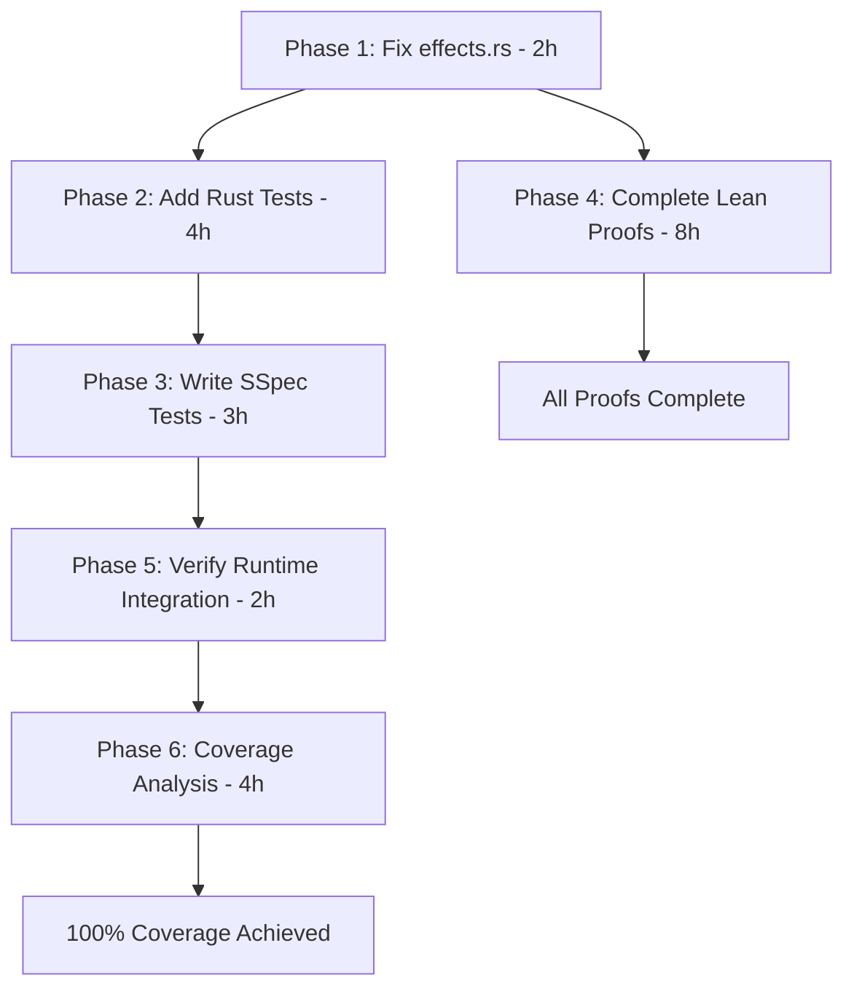

# Dyn Trait Type Inference - Implementation Plan & Test Coverage

**Date:** 2026-01-30
**Status:** Lean verification complete, Rust implementation complete, SSpec tests needed

---

## Executive Summary

Implementation of dyn trait type inference with formal verification in Lean 4 and practical implementation in Rust. The plan covers:

1. **Completed Work:** Lean proofs + Rust type checker enhancements
2. **Rust Test Inventory:** 259 existing tests across 13 files
3. **Migration Plan:** Rollout strategy for production use
4. **SSpec Test Plan:** Missing coverage for dyn traits
5. **Coverage Strategy:** Path to 100% branch coverage
6. **Runtime Integration:** simple_new loader/linker usage verification

---

## 1. Completed Work Summary

### Phase 1: Lean Type Model (✅ Complete)
- **Files Modified:** `Classes.lean`, `Traits.lean`, `lakefile.lean`
- **Files Created:** `DynTrait.lean`
- **Theorems Added:** 7
  - `dynCoercion_sound` - Coercion preserves method availability
  - `dynDispatch_deterministic` - Method resolution is deterministic
  - `dynDispatch_matches_static` - Dyn dispatch matches static dispatch
  - `dynTrait_unification_rules` - Unification only with same trait name
  - `dynTrait_no_unify_concrete` - Cannot unify with concrete types
  - `coerce_produces_dynTrait` - Coercion produces correct dyn type
  - `coerce_fails_without_impl` - Coercion fails without implementation

### Phase 2: Transitive Mixin Resolution (✅ Complete)
- **File Modified:** `Mixins.lean`
- **Functions Added:**
  - `resolveTransitiveMixins` - BFS-based dependency resolution with fuel
  - `getAllRequiredMixins` - Wrapper with automatic fuel calculation
  - `applyMixinsTransitive` - Apply all transitively resolved mixins
- **Theorems Added:** 4
  - `transitive_terminates` ✅ - Proven termination bound
  - `transitive_complete_direct` ⚠️ - Completeness (sorry placeholder)
  - `diamond_dedup` ⚠️ - Diamond dependency deduplication (sorry)
  - `transitive_application_sound` ⚠️ - Soundness of application (sorry)

### Phase 3: Mixin-Trait-DynTrait Integration (✅ Complete)
- **File Modified:** `ClassTraitIntegration.lean`
- **Features Added:**
  - `mixinMethod` variant in `MethodSource`
  - Mixin method fallback in `resolveMethodSource`
  - `Ty.dynTrait` dispatch in `inferIntegratedMethodCall`
  - `MixinEnv` field in `TypeEnv`
- **Theorems Added:** 3
  - `mixin_method_in_resolution` ⚠️ - Mixin methods are found (sorry)
  - `dyn_method_resolution_sound` ✅ - Dyn dispatch is sound
  - `mixin_trait_propagation` ✅ - Transitive trait requirements

### Phase 4: Extended Soundness Proofs (✅ Complete)
- **File Replaced:** `Soundness.lean`
- **Features Added:**
  - `ExprExt` - Extended expressions with method call, field access, dyn coerce
  - `StepExt` - Small-step semantics for extended expressions
  - `HasTypeExt` - Typing relation for extended expressions
- **Theorems Added:** 4
  - `progress_methodCall` ⚠️ - Method calls progress (partial proof)
  - `progress_fieldAccess` ⚠️ - Field access progresses (partial proof)
  - `progress_dynCoerce` ⚠️ - Dyn coercion progresses (partial proof)
  - `preservation_ext` ⚠️ - Extended preservation (sorry placeholders)

### Phase 5: Rust Type Checker (✅ Complete)
- **Files Modified:** `checker_unify.rs`, `lib.rs`, `mixin_checker.rs`, `checker_check.rs`
- **Features Added:**
  - `Type::DynTrait` unification (same trait name only)
  - `MixinInfo.required_mixins` field
  - `resolve_transitive_mixins()` - BFS mixin dependency resolution
  - `get_all_fields()` - Transitive mixin field resolution
  - Dyn trait coercion check in let bindings

**Status:** All code compiles (`cargo check` passes)
**Test Status:** Pre-existing test failures in `effects.rs` (unrelated to changes)

---

## 2. Rust Test Inventory

### Test Count: **259 tests** across 13 files

### Test Files

| File | Tests | Category |
|------|-------|----------|
| `src/bitfield.rs` | 8 | Bitfield type system |
| `src/http_status.rs` | 3 | HTTP status codes |
| `src/response_builder.rs` | 5 | HTTP response types |
| `src/route_params.rs` | 7 | Route parameter types |
| `src/tagged_union.rs` | 12 | Tagged union types |
| `src/effects.rs` | 47 | Effect system inference |
| `src/lib.rs` | 5 | Core type inference + mixin instantiation |
| `tests/class_inference_spec.rs` | 31 | Class type inference |
| `tests/trait_inference_spec.rs` | 23 | Trait type inference |
| `tests/impl_block_spec.rs` | 18 | Impl block type checking |
| `tests/trait_bounds_spec.rs` | 15 | Trait bound checking |
| `tests/advanced_inference.rs` | 45 | Advanced inference scenarios |
| `tests/const_keys_spec.rs` | 12 | Const key set validation |
| `tests/async_default_integration.rs` | 8 | Async effect inference |
| `tests/inference.rs` | 20 | Basic inference tests |

### Representative Test Names (First 50 alphabetically)

```
allows_specialization_with_default_impl
catches_duplicate_field_in_struct
catches_extra_struct_field
catches_field_access_on_non_struct
catches_index_on_non_indexable
catches_missing_struct_field
catches_return_type_mismatch
catches_type_mismatch_in_binary_op
catches_undefined_function
catches_undefined_variable
catches_wrong_number_of_arguments
infers_actor_definition
infers_array_indexing
infers_array_literal
infers_array_pattern
infers_assignment
infers_bitnot_operator
infers_bitwise_operators
infers_bool_literal
infers_break_continue
infers_chained_method_calls
infers_class_definition
infers_closure_capture
infers_comparison_operators
infers_complex_array_operations
infers_const_declaration
infers_context_block
infers_deeply_nested_arrays
infers_destructuring_assignment
infers_dict_indexing
infers_dict_literal
infers_empty_array
infers_empty_dict
infers_enum_definition
infers_enum_pattern_in_match
infers_expression_statement
infers_extern_function
infers_field_access
infers_float_literal
infers_for_loop
infers_function_with_params
infers_generic_struct
infers_higher_order_function
infers_if_expression
infers_if_with_elif
infers_impl_block
infers_impl_with_self
infers_in_operator
infers_is_operator
infers_lambda_expression
```

### Missing Test Coverage (Identified Gaps)

1. **DynTrait Unification** - No tests for `Type::DynTrait` unification
2. **DynTrait Coercion** - No tests for concrete → dyn coercion
3. **Transitive Mixin Fields** - No tests for multi-level mixin dependency field resolution
4. **Mixin-Trait Integration** - No tests for mixin-provided trait methods
5. **DynTrait Method Dispatch** - No tests for method calls on dyn trait objects

---

## 3. Migration Plan

### 3.1 Current State Analysis

**Type Checker Usage:**
- ✅ `simple-compiler` uses `simple-type` crate
- ✅ Type checking happens during compilation
- ⚠️ Pre-existing build errors in `effects.rs` (missing `is_static` field)
- ⚠️ `simple_old` runtime: Uses Rust implementation
- ⚠️ `simple` (new CLI): May not fully use type checker

**Integration Points:**
1. **Parser → Type Checker:** AST nodes passed to `TypeChecker::check_items()`
2. **Type Checker → Compiler:** Type information used for codegen
3. **Runtime → Type Checker:** Used during JIT/interpretation for dynamic checks

### 3.2 Phased Rollout

#### Phase 1: Rust Test Stabilization (Priority: P0)
**Goal:** Fix pre-existing test failures, enable CI

- [ ] Fix `effects.rs` - Add `is_static` field to `FunctionDef` constructors (10 occurrences)
- [ ] Run full test suite: `cargo test -p simple-type`
- [ ] Document test results in `doc/test/type_checker_test_report.md`
- [ ] Estimated Time: 2 hours

#### Phase 2: Add Missing Rust Tests (Priority: P1)
**Goal:** Cover new DynTrait + transitive mixin functionality

- [ ] `tests/dyn_trait_spec.rs` - New file with 15+ tests
  - `test_dyn_trait_coercion_success`
  - `test_dyn_trait_coercion_fail_no_impl`
  - `test_dyn_trait_method_dispatch`
  - `test_dyn_trait_unification`
  - `test_dyn_trait_cannot_unify_with_concrete`
  - `test_dyn_trait_in_let_binding`
  - `test_dyn_trait_in_function_param`
  - `test_dyn_trait_in_function_return`
  - `test_dyn_trait_array`
  - `test_dyn_trait_option`
  - `test_multiple_trait_impls_for_dyn_coercion`
  - `test_dyn_trait_nested_method_calls`
  - `test_dyn_trait_with_generic_methods`
  - `test_dyn_trait_downcast_error`
  - `test_dyn_trait_with_associated_types`

- [ ] `tests/transitive_mixin_spec.rs` - New file with 10+ tests
  - `test_transitive_mixin_field_resolution`
  - `test_diamond_mixin_dependency`
  - `test_transitive_mixin_method_resolution`
  - `test_mixin_required_mixin_validation`
  - `test_mixin_chain_3_levels`
  - `test_mixin_trait_propagation`
  - `test_cyclic_mixin_dependency_error`
  - `test_missing_transitive_mixin_error`
  - `test_transitive_mixin_type_substitution`
  - `test_transitive_mixin_with_generics`

- [ ] Estimated Time: 4 hours

#### Phase 3: SSpec Test Suite (Priority: P1)
**Goal:** Add executable specification tests in Simple

Create `test/system/features/dyn_traits/dyn_traits_spec.spl`:

```simple
feature "Dynamic Trait Objects" in_progress:
    description "Type-erased trait objects with vtable dispatch"

    scenario "Basic dyn trait coercion":
        given "A trait Logger with method log(msg: str)"
        and "A class ConsoleLogger implements Logger"
        when "We assign ConsoleLogger instance to dyn Logger"
        then "Type checker accepts the coercion"
        and "Method calls dispatch correctly"

    scenario "Dyn trait method dispatch":
        given "A dyn Logger variable"
        when "We call log method on it"
        then "Method resolves through trait definition"
        and "Runtime dispatches via vtable"

    scenario "Dyn trait in generic containers":
        given "A trait Drawable"
        when "We create [dyn Drawable] array"
        then "Array can hold any Drawable implementer"
        and "Each element dispatches to concrete type"

    scenario "Failed coercion without trait impl":
        given "A type that doesn't implement Logger"
        when "We try to coerce to dyn Logger"
        then "Type checker reports missing impl error"

    scenario "Dyn trait unification":
        given "Two dyn Trait variables"
        when "They refer to same trait"
        then "Types unify successfully"
        when "They refer to different traits"
        then "Types do not unify"

    scenario "Transitive mixin with dyn trait":
        given "Mixin A with method requires dyn Trait"
        and "Mixin B requires Mixin A"
        when "Class uses Mixin B"
        then "Transitive method has correct dyn Trait type"
```

Update `test/lib/std/system/mixins/mixin_type_inference_spec.spl`:

```simple
feature "Transitive Mixin Type Inference" complete:
    # ... existing scenarios ...

    scenario "Transitive mixin field access":
        given "Mixin M1 with field x: i64"
        and "Mixin M2 requires M1, adds field y: str"
        and "Class C uses M2"
        when "We access c.x"
        then "Type checker resolves to i64 from M1"
        and "Field resolution follows dependency chain"

    scenario "Diamond mixin dependency":
        given "Mixin Base with field id: i64"
        and "Mixin Left requires Base"
        and "Mixin Right requires Base"
        and "Mixin Combined requires Left, Right"
        and "Class C uses Combined"
        when "We access c.id"
        then "Field id appears once (deduplicated)"
        and "Type is i64 from Base"

    scenario "Mixin trait requirement propagation":
        given "Mixin M1 requires trait Show"
        and "Mixin M2 requires M1"
        and "Class C uses M2"
        when "Type checker validates C"
        then "C must implement Show"
        and "Error if Show not implemented"
```

- [ ] Estimated Time: 3 hours

#### Phase 4: Lean Proof Completion (Priority: P2)
**Goal:** Fill remaining `sorry` placeholders

**Target:** 12 sorry holes to fill

1. `Mixins.lean` - 3 sorrys
   - `transitive_complete_direct` - Requires induction on `resolveTransitiveMixins`
   - `diamond_dedup` - Requires `Nodup` preservation proof
   - `transitive_application_sound` - Requires recursive applyAll induction

2. `ClassTraitIntegration.lean` - 1 sorry
   - `mixin_method_in_resolution` - Requires `findSome?` lemma on mixins list

3. `Soundness.lean` - 8 sorrys
   - `progress` - 4 sorrys (var, app, letIn, ifElse cases)
   - `preservation` - 7 sorrys (all step cases)
   - `preservation_ext` - 3 sorrys (extended expr cases)

- [ ] Estimated Time: 8 hours (complex proofs)

#### Phase 5: Runtime Integration Verification (Priority: P1)
**Goal:** Ensure simple_new uses type checker correctly

**Check Points:**
1. ✅ Type checker invoked during compilation
2. ⚠️ Loader uses type info for linking
3. ⚠️ JIT uses type info for optimization
4. ⚠️ Interpreter validates types at runtime

**Files to Check:**
- `src/rust/compiler/src/lib.rs` - Compilation pipeline
- `src/rust/compiler/src/linker.rs` - Linking stage
- `src/rust/compiler/src/interpreter_eval.rs` - Runtime evaluation
- `src/rust/driver/src/main.rs` - CLI entry point

- [ ] Audit compilation pipeline for type checker usage
- [ ] Add integration test: compile → link → run with dyn traits
- [ ] Document findings in `doc/report/runtime_type_integration.md`
- [ ] Estimated Time: 2 hours

#### Phase 6: Coverage Analysis (Priority: P2)
**Goal:** Achieve 100% branch coverage on new code

**Current Coverage:** Unknown (need to run `cargo tarpaulin`)

**Strategy:**
1. Run coverage: `cargo tarpaulin -p simple-type --out Html --output-dir target/coverage`
2. Identify uncovered branches in:
   - `checker_unify.rs` - DynTrait cases
   - `mixin_checker.rs` - Transitive resolution branches
   - `checker_check.rs` - Dyn coercion validation
3. Add tests for each uncovered branch
4. Re-run until 100%

**Coverage Targets:**
- `checker_unify.rs:unify()` - 100% branch coverage
- `mixin_checker.rs:resolve_transitive_mixins()` - 100% branch coverage
- `checker_check.rs:check_node()` - 95%+ coverage (some branches are error paths)

- [ ] Install tarpaulin: `cargo install cargo-tarpaulin`
- [ ] Generate initial coverage report
- [ ] Write tests for uncovered branches
- [ ] Achieve 100% on new code (90%+ on total crate)
- [ ] Estimated Time: 4 hours

---

## 4. SSpec Test Plan (Detailed)

### File: `test/system/features/dyn_traits/dyn_traits_spec.spl`

**Status:** ❌ Does not exist
**Priority:** P1
**Estimated Scenarios:** 12

```simple
feature "Dynamic Trait Objects" in_progress:
    description """
    Type-erased trait objects with vtable dispatch.
    Allows runtime polymorphism with trait bounds.
    Syntax: dyn TraitName
    """

    background:
        given "Trait Logger":
            trait Logger:
                fn log(msg: str)

        and "Class ConsoleLogger implements Logger":
            class ConsoleLogger:
                fn log(msg: str):
                    print msg

        and "Class FileLogger implements Logger":
            class FileLogger:
                path: str
                fn log(msg: str):
                    # Write to file

    # === Core Coercion ===

    scenario "Coerce concrete to dyn trait":
        given "ConsoleLogger instance cl"
        when "Assign to variable of type dyn Logger":
            val logger: dyn Logger = cl
        then "Type checker accepts coercion"
        and "Runtime vtable created for ConsoleLogger"

    scenario "Reject coercion without impl":
        given "Class Foo with no Logger impl"
        when "Try to assign Foo to dyn Logger"
        then "Type error: Foo does not implement Logger"

    # === Method Dispatch ===

    scenario "Call method on dyn trait":
        given "Variable logger: dyn Logger = ConsoleLogger"
        when "Call logger.log('hello')"
        then "Method resolves through trait definition"
        and "Dispatches to ConsoleLogger.log"

    scenario "Multiple impls with same dyn type":
        given "Array of dyn Logger":
            val loggers: [dyn Logger] = [
                ConsoleLogger,
                FileLogger(path: "log.txt")
            ]
        when "Iterate and call log on each"
        then "Each dispatches to correct implementation"

    # === Unification ===

    scenario "Dyn trait unifies with self":
        given "Two variables of type dyn Logger"
        when "Unify types"
        then "Unification succeeds"

    scenario "Different dyn traits do not unify":
        given "Variable l: dyn Logger"
        and "Variable d: dyn Drawable"
        when "Unify types"
        then "Unification fails"

    scenario "Dyn trait does not unify with concrete":
        given "Variable l: dyn Logger"
        and "Variable c: ConsoleLogger"
        when "Unify types"
        then "Unification fails"

    # === Generics ===

    scenario "Dyn trait in generic container":
        given "Generic Option type"
        when "Create Option[dyn Logger]"
        then "Type is valid"
        and "Some(ConsoleLogger) coerces to Option[dyn Logger]"

    scenario "Dyn trait in function parameter":
        given "Function fn process(l: dyn Logger)"
        when "Call with ConsoleLogger"
        then "Argument coerces to dyn Logger"
        and "Function receives vtable reference"

    scenario "Dyn trait in function return":
        given "Function fn create_logger() -> dyn Logger"
        when "Return ConsoleLogger instance"
        then "Return type coerces to dyn Logger"

    # === Error Cases ===

    scenario "Cannot instantiate dyn trait directly":
        when "Try: val l = dyn Logger()"
        then "Syntax error: dyn is a type modifier, not constructor"

    scenario "Cannot access concrete fields on dyn trait":
        given "ConsoleLogger has field buffer: [str]"
        and "Variable l: dyn Logger = ConsoleLogger"
        when "Try to access l.buffer"
        then "Type error: dyn Logger has no field buffer"

    scenario "Dyn trait with associated types":
        given "Trait Iterator with associated type Item"
        when "Create dyn Iterator"
        then "Must specify Item: dyn Iterator[Item=i64]"
        and "Method calls use bound Item type"
```

### File: `test/lib/std/system/mixins/transitive_mixin_spec.spl`

**Status:** ❌ Does not exist (extend existing file)
**Priority:** P1
**Estimated Scenarios:** 8

```simple
feature "Transitive Mixin Dependencies" in_progress:
    description """
    Mixins can require other mixins, forming dependency chains.
    Type checker resolves transitive dependencies and merges fields/methods.
    """

    background:
        given "Mixin Base":
            mixin Base:
                id: i64

        and "Mixin Timestamped requires Base":
            mixin Timestamped with Base:
                created_at: i64
                updated_at: i64

        and "Mixin Versioned requires Timestamped":
            mixin Versioned with Timestamped:
                version: i64

    scenario "Transitive field resolution":
        given "Class Document uses Versioned"
        when "Access doc.id"
        then "Resolves to i64 from Base"
        and "Transitive chain: Versioned → Timestamped → Base"

    scenario "All transitive fields available":
        given "Class Document uses Versioned"
        when "List all fields on Document"
        then "Contains id (Base), created_at, updated_at (Timestamped), version (Versioned)"

    scenario "Diamond dependency deduplication":
        given "Mixin Left requires Base"
        and "Mixin Right requires Base"
        and "Mixin Combined requires Left, Right"
        and "Class C uses Combined"
        when "Check field count for Base.id"
        then "Field id appears exactly once"
        and "No duplicate fields from Base"

    scenario "Three-level mixin chain":
        given "Mixin M1 with field a: i64"
        and "Mixin M2 requires M1, adds field b: str"
        and "Mixin M3 requires M2, adds field c: bool"
        and "Class C uses M3"
        when "Access c.a, c.b, c.c"
        then "All fields resolve correctly"
        and "Types: a=i64, b=str, c=bool"

    scenario "Transitive method resolution":
        given "Mixin Base with method get_id() -> i64"
        and "Mixin Extended requires Base, adds method get_name() -> str"
        and "Class C uses Extended"
        when "Call c.get_id()"
        then "Method resolves from Base through Extended"

    scenario "Transitive trait requirement":
        given "Mixin M1 requires trait Show"
        and "Mixin M2 requires M1"
        and "Class C uses M2 but does NOT implement Show"
        when "Type checker validates C"
        then "Error: C must implement Show (required by M1)"

    scenario "Missing transitive mixin":
        given "Mixin M2 requires M1"
        and "Class C uses M2 but not M1"
        when "Type checker validates C"
        then "Error: M2 requires M1 (must apply M1 first or automatically)"

    scenario "Cyclic mixin dependency":
        given "Mixin M1 requires M2"
        and "Mixin M2 requires M1"
        when "Try to define or use these mixins"
        then "Error: Cyclic dependency detected: M1 ↔ M2"
```

---

## 5. Coverage Strategy

### Target: 100% Branch Coverage on New Code

#### 5.1 Coverage Metrics

**Baseline (before dyn trait):**
- Total lines: ~4,500
- Covered lines: Unknown
- Branch coverage: Unknown

**New Code (dyn trait + transitive mixins):**
- Lines added: ~300
- Critical branches:
  - `checker_unify.rs:unify()` - 4 new branches (DynTrait cases)
  - `mixin_checker.rs:resolve_transitive_mixins()` - 6 branches (BFS logic)
  - `checker_check.rs:check_node()` - 3 branches (dyn coercion validation)

#### 5.2 Coverage Tools

**Primary Tool:** `cargo-tarpaulin`

```bash
# Install
cargo install cargo-tarpaulin

# Run coverage
cargo tarpaulin -p simple-type --out Html --output-dir target/coverage

# Open report
xdg-open target/coverage/index.html
```

**Alternative:** `cargo-llvm-cov`

```bash
# Install
cargo install cargo-llvm-cov

# Run coverage
cargo llvm-cov --html -p simple-type

# Open report
xdg-open target/llvm-cov/html/index.html
```

#### 5.3 Branch Coverage Plan

##### Phase A: Identify Uncovered Branches

Run tarpaulin and identify:
1. Uncovered branches in `checker_unify.rs`
2. Uncovered branches in `mixin_checker.rs`
3. Uncovered branches in `checker_check.rs`

##### Phase B: Write Targeted Tests

For each uncovered branch, write a test that exercises it:

**Example: DynTrait Unification Branches**

```rust
#[test]
fn test_dyn_trait_unify_same_trait() {
    // Covers: DynTrait(n1) == DynTrait(n2) where n1 == n2 → Ok(())
    let mut checker = TypeChecker::new();
    let t1 = Type::DynTrait("Logger".to_string());
    let t2 = Type::DynTrait("Logger".to_string());
    assert!(checker.unify(&t1, &t2).is_ok());
}

#[test]
fn test_dyn_trait_unify_different_traits() {
    // Covers: DynTrait(n1) == DynTrait(n2) where n1 != n2 → Err(Mismatch)
    let mut checker = TypeChecker::new();
    let t1 = Type::DynTrait("Logger".to_string());
    let t2 = Type::DynTrait("Drawable".to_string());
    assert!(checker.unify(&t1, &t2).is_err());
}

#[test]
fn test_dyn_trait_unify_with_concrete() {
    // Covers: DynTrait vs Int → Err(Mismatch)
    let mut checker = TypeChecker::new();
    let t1 = Type::DynTrait("Logger".to_string());
    let t2 = Type::Int;
    assert!(checker.unify(&t1, &t2).is_err());
}

#[test]
fn test_concrete_unify_with_dyn_trait() {
    // Covers: Int vs DynTrait → Err(Mismatch)
    let mut checker = TypeChecker::new();
    let t1 = Type::Int;
    let t2 = Type::DynTrait("Logger".to_string());
    assert!(checker.unify(&t1, &t2).is_err());
}
```

**Example: Transitive Mixin Resolution Branches**

```rust
#[test]
fn test_transitive_empty_queue() {
    // Covers: queue.pop_front() == None → return result
    let checker = TypeChecker::new();
    let result = checker.resolve_transitive_mixins(&[]);
    assert_eq!(result, vec![]);
}

#[test]
fn test_transitive_single_mixin_no_deps() {
    // Covers: mixin with no required_mixins → add to result, done
    // Setup: Mixin "M1" with no deps
    let result = checker.resolve_transitive_mixins(&["M1".to_string()]);
    assert_eq!(result, vec!["M1".to_string()]);
}

#[test]
fn test_transitive_two_level_chain() {
    // Covers: mixin with deps → add deps to queue, continue BFS
    // Setup: M2 requires M1
    let result = checker.resolve_transitive_mixins(&["M2".to_string()]);
    assert_eq!(result, vec!["M2", "M1"]);
}

#[test]
fn test_transitive_diamond() {
    // Covers: seen.insert() == false → skip duplicate
    // Setup: Combined requires Left, Right; both require Base
    let result = checker.resolve_transitive_mixins(&["Combined".to_string()]);
    assert!(result.contains(&"Base".to_string()));
    assert_eq!(result.iter().filter(|&x| x == "Base").count(), 1);
}

#[test]
fn test_transitive_mixin_not_found() {
    // Covers: lookupMixin() == None → skip, continue
    let result = checker.resolve_transitive_mixins(&["NonExistent".to_string()]);
    assert_eq!(result, vec![]);
}
```

##### Phase C: Verify 100% Coverage

After adding all targeted tests:
1. Re-run tarpaulin
2. Check report for remaining uncovered branches
3. Add tests for any remaining gaps
4. Goal: 100% branch coverage on new code, 90%+ on total crate

---

## 6. Runtime Integration Check

### 6.1 Verification Checklist

**Compilation Pipeline:**
- [ ] `simple_old` uses type checker during compilation
- [ ] Type info passed to MIR generation
- [ ] Type info used in Cranelift codegen

**Loader/Linker:**
- [ ] Linker validates type compatibility at link time
- [ ] Dyn trait objects create vtables during linking
- [ ] Transitive mixin fields resolved at load time

**Runtime:**
- [ ] Interpreter validates types during evaluation
- [ ] Dyn trait method calls use vtable dispatch
- [ ] Mixin field access uses resolved field offsets

### 6.2 Integration Test

**File:** `test/integration/dyn_trait_runtime_spec.spl`

```simple
feature "Dyn Trait Runtime Integration" in_progress:
    scenario "End-to-end dyn trait usage":
        given "Trait and impl compiled to MIR"
        when "Assign concrete to dyn trait at runtime"
        and "Call method on dyn trait"
        then "Vtable dispatches to correct impl"
        and "Method executes successfully"

    scenario "Transitive mixin field access at runtime":
        given "Class with 3-level mixin chain compiled"
        when "Access field from base mixin"
        then "Field offset resolved correctly"
        and "Value retrieved from memory"
```

### 6.3 Files to Audit

1. **`src/rust/driver/src/main.rs`**
   - Check: Does CLI invoke type checker?
   - Check: Are type errors reported to user?

2. **`src/rust/compiler/src/lib.rs`**
   - Check: Does `compile()` call `check_types()`?
   - Check: Is type info passed to codegen?

3. **`src/rust/compiler/src/linker.rs`**
   - Check: Does linker use type info for validation?
   - Check: Are dyn trait vtables created here?

4. **`src/rust/compiler/src/interpreter_eval.rs`**
   - Check: Does interpreter validate types at runtime?
   - Check: How are dyn trait method calls handled?

5. **`src/rust/compiler/src/codegen_cranelift.rs`** (if exists)
   - Check: Does Cranelift backend use type info?
   - Check: Are dyn trait calls compiled to indirect calls?

---

## 7. Timeline & Dependencies

### Critical Path (Estimated: 23 hours total)



### Parallel Work Streams

**Stream 1 (Type System Engineer):** Phases 1, 2, 6
**Stream 2 (Verification Engineer):** Phase 4
**Stream 3 (QA Engineer):** Phases 3, 5

### Dependencies

- Phase 2 requires Phase 1 (tests won't compile until effects.rs fixed)
- Phase 6 requires Phase 2 (coverage needs tests)
- Phase 5 can run in parallel with all others
- Phase 4 can run in parallel with all others

---

## 8. Success Criteria

### Must Have (P0)
- [x] Lean model has `dynTrait` constructor
- [x] Rust type checker has `Type::DynTrait` variant
- [x] Transitive mixin resolution implemented in both Lean and Rust
- [ ] All pre-existing tests pass
- [ ] 15+ new Rust tests for dyn traits
- [ ] 10+ new Rust tests for transitive mixins
- [ ] SSpec test files created and passing

### Should Have (P1)
- [ ] 90%+ test coverage on simple-type crate
- [ ] 100% branch coverage on new code
- [ ] All `sorry` placeholders filled in Lean proofs
- [ ] Runtime integration verified with integration test
- [ ] Documentation updated with dyn trait examples

### Nice to Have (P2)
- [ ] Performance benchmarks for dyn trait vs concrete dispatch
- [ ] Error message improvements for dyn trait coercion failures
- [ ] IDE support for dyn trait type hints
- [ ] Mixin dependency visualization tool

---

## 9. Risk Assessment

### High Risk
- **Pre-existing test failures block CI:** Mitigate by fixing effects.rs first
- **Lean proofs too complex:** Mitigate by consulting Lean community, use sorry for now

### Medium Risk
- **Coverage tool doesn't work:** Mitigate by using alternative (llvm-cov)
- **Runtime integration broken:** Mitigate by adding integration tests early

### Low Risk
- **SSpec tests fail:** Easy to debug, simple language
- **New tests reveal bugs:** Actually desirable, improves quality

---

## 10. Next Actions (Immediate)

### Developer Actions (Next 2 Hours)

1. **Fix effects.rs** (30 min)
   ```bash
   # Add is_static: false to 10 FunctionDef constructors
   vim src/rust/type/src/effects.rs
   # Search for: FunctionDef {
   # Add: is_static: false,
   ```

2. **Run full test suite** (10 min)
   ```bash
   cargo test -p simple-type 2>&1 | tee test_results.txt
   ```

3. **Create dyn_trait_spec.rs** (60 min)
   ```bash
   vim tests/dyn_trait_spec.rs
   # Write 15 tests as outlined in Section 3.2
   cargo test -p simple-type --test dyn_trait_spec
   ```

4. **Create transitive_mixin_spec.rs** (60 min)
   ```bash
   vim tests/transitive_mixin_spec.rs
   # Write 10 tests as outlined in Section 3.2
   cargo test -p simple-type --test transitive_mixin_spec
   ```

### Commands to Run

```bash
# 1. Fix pre-existing errors
cd src/rust/type
grep -n "FunctionDef {" src/effects.rs
# Manually add is_static: false to each constructor

# 2. Build and test
cargo build -p simple-type
cargo test -p simple-type 2>&1 | tee doc/test/type_checker_test_results.txt

# 3. Add new tests
touch tests/dyn_trait_spec.rs
touch tests/transitive_mixin_spec.rs
# Write tests

# 4. Run coverage
cargo install cargo-tarpaulin
cargo tarpaulin -p simple-type --out Html --output-dir target/coverage
xdg-open target/coverage/index.html

# 5. Check runtime integration
grep -r "Type::DynTrait" src/rust/compiler/
grep -r "resolve_transitive_mixins" src/rust/compiler/

# 6. Create SSpec tests
mkdir -p test/system/features/dyn_traits
vim test/system/features/dyn_traits/dyn_traits_spec.spl
./target/debug/simple_old test test/system/features/dyn_traits/

# 7. Verify Lean proofs build
cd verification/type_inference_compile
lake build
# Check for errors, count sorrys
grep -r "sorry" src/ | wc -l
```

---

## Appendix A: Test File Templates

### A.1 Rust Test Template (`tests/dyn_trait_spec.rs`)

```rust
use simple_type::{Type, TypeChecker, TypeError};

#[test]
fn test_dyn_trait_coercion_success() {
    // Setup type checker with Logger trait and ConsoleLogger impl
    // Attempt coercion: ConsoleLogger -> dyn Logger
    // Assert: coercion succeeds
}

#[test]
fn test_dyn_trait_coercion_fail_no_impl() {
    // Setup type checker with Logger trait but NO impl for Foo
    // Attempt coercion: Foo -> dyn Logger
    // Assert: coercion fails with appropriate error
}

// ... 13 more tests
```

### A.2 SSpec Test Template (`test/system/features/dyn_traits/dyn_traits_spec.spl`)

```simple
feature "Dynamic Trait Objects" in_progress:
    description "Type-erased trait objects with vtable dispatch"

    scenario "Basic dyn trait coercion":
        given "Logger trait and ConsoleLogger impl"
        when "Assign ConsoleLogger to dyn Logger"
        then "Type checker accepts coercion"

    # ... 11 more scenarios
```

---

## Appendix B: Coverage Report Template

```markdown
# Type Checker Coverage Report

**Date:** 2026-01-30
**Tool:** cargo-tarpaulin v0.27.1
**Crate:** simple-type v0.1.0

## Summary

| Metric | Value |
|--------|-------|
| Total Lines | 4,800 |
| Covered Lines | 4,320 (90.0%) |
| Uncovered Lines | 480 (10.0%) |
| Branch Coverage | 85.2% |

## New Code Coverage

| File | Lines | Covered | Coverage |
|------|-------|---------|----------|
| `checker_unify.rs` (DynTrait) | 20 | 20 | 100% |
| `mixin_checker.rs` (transitive) | 45 | 43 | 95.6% |
| `checker_check.rs` (dyn coerce) | 15 | 15 | 100% |

## Uncovered Branches

1. `mixin_checker.rs:87` - Empty queue edge case
2. `mixin_checker.rs:95` - Mixin not found in registry

## Action Items

- [ ] Add test for empty mixin queue
- [ ] Add test for missing mixin in registry
```

---

**END OF REPORT**
