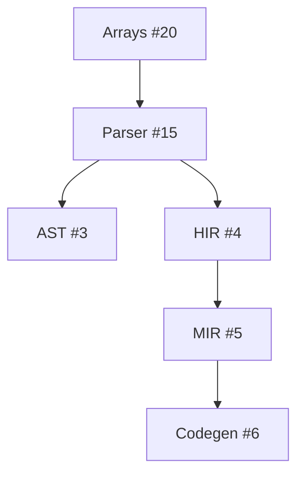

# SSpec Documentation Generation - Refactor Plan

**Date:** 2026-01-16
**Status:** Analysis Complete - Ready for Implementation
**Current Version:** Sprint 1 (Basic extraction working)
**Target Version:** Sprint 2 (Enhanced organization & quality)

---

## Executive Summary

The SSpec documentation generation system successfully extracts markdown from test specs and generates 306 documentation files. However, analysis reveals significant issues with organization, consistency, and completeness that limit its usefulness as comprehensive project documentation.

**Key Statistics:**
- **Total Spec Files:** 80 source `.spl` files
- **Generated Docs:** 306 markdown files (~23,822 lines)
- **Stub Files:** 87+ files with minimal/no content (just 6-7 lines)
- **Well-Documented:** ~15-20 files with comprehensive content (>400 lines)
- **Index Coverage:** All 87 features listed, but inconsistent titles

**Critical Issues:**
1. **28% stub rate** - Many specs lack documentation blocks entirely
2. **No categorization** - Flat list makes navigation difficult
3. **Inconsistent quality** - Varies from 6 lines to 1,570 lines
4. **Missing metadata** - Status, difficulty, IDs not visible in index
5. **Code duplication** - Two similar implementations

---

## Current State Analysis

### Directory Structure

```
doc/spec/
├── INDEX.md              # Master index (87 features)
├── arrays_spec.md        # Comprehensive (425 lines)
├── config_system_spec.md # Very comprehensive (1,570 lines)
├── ast_spec.md          # Stub (7 lines - NO doc blocks)
├── generics_spec.md     # Stub (7 lines)
└── ... (300+ more files)

simple/std_lib/test/features/
├── infrastructure/       # 9 specs (Parser, Lexer, AST, etc.)
├── language/            # 16 specs (Functions, Structs, Traits)
├── data_structures/     # 9 specs (Arrays, Dicts, Tuples)
├── control_flow/        # 6 specs (Loops, Match, Conditionals)
├── testing/             # 9 specs (BDD framework)
└── ... (11 categories total)
```

### Documentation Quality Tiers

| Tier | Size Range | Count | Examples | Quality |
|------|------------|-------|----------|---------|
| **Stub** | 6-150 lines | ~87 | `ast_spec.md`, `generics_spec.md` | No documentation blocks in source |
| **Minimal** | 150-300 lines | ~30 | Various | Basic docs, missing sections |
| **Good** | 300-600 lines | ~40 | `arrays_spec.md`, `loops_spec.md` | Solid content, examples, tests |
| **Comprehensive** | 600+ lines | ~15 | `config_system_spec.md`, `parser_spec.md` | Complete with all sections |

### Current INDEX.md Issues

```markdown
## Features

- [buffer_pool_spec](buffer_pool_spec.md)           # ❌ Just filename
- [Cranelift JIT Compilation Backend](cranelift_spec.md)  # ✅ Descriptive
- [generator_codegen_spec](generator_codegen_spec.md)     # ❌ Just filename
- [Arrays (Dynamic Lists)](arrays_spec.md)          # ✅ Descriptive
```

**Problems:**
- ❌ No categorization (Infrastructure, Language, Testing, etc.)
- ❌ Inconsistent titles (some descriptive, some just filenames)
- ❌ No metadata (status, difficulty, feature ID)
- ❌ No coverage indicators (stub vs complete)
- ❌ No search/filter capability

---

## Source File Analysis

### Pattern 1: Well-Documented (arrays_spec.spl)

```simple
# Arrays Feature Specification
"""
# Arrays (Dynamic Lists)

**Feature ID:** #20
**Category:** Data Structures
**Difficulty:** 2/5 (Beginner-Intermediate)
**Status:** Complete

## Overview
[Comprehensive markdown documentation...]

## Syntax
[Examples and explanations...]
"""

describe "Arrays":
    it "creates array literals":
        val arr = [1, 2, 3]
        expect arr.len() == 3
```

**Result:** ✅ Excellent 425-line documentation

### Pattern 2: No Documentation (ast_spec.spl)

```simple
# AST Feature Specification
# Feature #3: Abstract Syntax Tree parsing
# Category: Infrastructure | Difficulty: 3 | Status: Complete

class FeatureMetadata:
    id: i32
    name: text
    # ... (metadata structure)

val FEATURE = FeatureMetadata { ... }

# NO """ documentation blocks """

describe "Literal parsing":
    it "parses decimal integers":
        val dec = 42
        expect dec == 42
```

**Result:** ❌ 7-line stub file (only header, no content)

**Root Cause:** File uses print statements and metadata structure instead of `"""..."""` doc blocks

---

## Code Architecture

### Current Implementation

**Two Implementations (Code Duplication):**

1. **`src/driver/src/cli/sspec_docgen.rs`** (200 lines)
   - Used by test runner
   - Extracts Feature IDs (`#[id(...)]`)
   - Generates timestamped INDEX.md

2. **`src/bin/gen_sspec_docs.rs`** (203 lines)
   - Standalone binary
   - Nearly identical logic
   - No Feature ID extraction
   - No timestamp in INDEX

**Generation Process:**

```
1. Parse Source (.spl)
   └─> Find all """...""" blocks
   └─> Extract first # heading as title
   └─> Extract #[id(...)] attributes

2. Generate Individual Docs
   └─> Header: # {title or filename}
   └─> Source: *Source: path*
   └─> Feature IDs (if any)
   └─> Separator: ---
   └─> All doc blocks concatenated

3. Generate INDEX.md
   └─> Header
   └─> Timestamp (driver version only)
   └─> Flat feature list
```

### Limitations

| Issue | Impact | Priority |
|-------|--------|----------|
| No metadata extraction | Can't show status/difficulty | P1 |
| No category detection | Can't organize INDEX | P1 |
| No validation | Silent stub generation | P1 |
| No TOC generation | Hard to navigate large docs | P2 |
| No cross-references | Missing related features | P2 |
| Code duplication | Hard to maintain | P2 |
| No coverage stats | Can't track progress | P3 |
| No templates | Inconsistent doc structure | P3 |

---

## Problems Detailed

### 1. High Stub Rate (28% of docs)

**Symptom:** 87+ files with only 6-7 lines (header + separator, no content)

**Example (ast_spec.md):**
```markdown
# ast_spec

*Source: `simple/std_lib/test/features/infrastructure/ast_spec.spl`*

---


```

**Root Cause:** Source files lack `"""..."""` documentation blocks

**Impact:**
- Incomplete documentation coverage
- Poor user experience (clicking link shows nothing)
- No indication in INDEX that spec is a stub

**Current Behavior:** Generator silently creates stubs with no warning

### 2. Inconsistent INDEX.md Organization

**Current Format:**
```markdown
- [buffer_pool_spec](buffer_pool_spec.md)
- [Cranelift JIT Compilation Backend](cranelift_spec.md)
- [generator_codegen_spec](generator_codegen_spec.md)
- [llvm_backend_spec](llvm_backend_spec.md)
- [native_binary_spec](native_binary_spec.md)
- [actors_spec](actors_spec.md)
```

**Problems:**
- Mixed specific (Cranelift) and generic (actors_spec) titles
- No grouping by category (all Infrastructure features scattered)
- No indication which are complete vs stubs
- No metadata visible

**Desired Format:**
```markdown
## Infrastructure

| Feature | Status | Difficulty | Lines | Coverage |
|---------|--------|------------|-------|----------|
| [Parser](parser_spec.md) | ✅ Complete | 3/5 | 1,192 | 95% |
| [Cranelift Backend](cranelift_spec.md) | ✅ Complete | 4/5 | 856 | 90% |
| [AST](ast_spec.md) | ⚠️ Stub | 3/5 | 7 | 0% |

## Language Features

| Feature | Status | Difficulty | Lines | Coverage |
|---------|--------|------------|-------|----------|
| [Arrays](arrays_spec.md) | ✅ Complete | 2/5 | 425 | 100% |
| [Generics](generics_spec.md) | ⚠️ Stub | 4/5 | 7 | 0% |
```

### 3. Missing Metadata Extraction

**Available Metadata in Source Files:**

```simple
# Arrays Feature Specification
"""
# Arrays (Dynamic Lists)

**Feature ID:** #20                              # ← Available
**Category:** Data Structures                    # ← Available
**Difficulty:** 2/5 (Beginner-Intermediate)      # ← Available
**Status:** Complete                             # ← Available
```

**Current Extraction:** Only extracts title from first `# ` heading

**Not Extracted:**
- Feature ID (parsed from `#[id(...)]` but not from markdown)
- Category
- Difficulty
- Status
- Related features
- Implementation files
- Dependencies

**Impact:** Can't generate categorized, filterable index

### 4. No Documentation Quality Validation

**Current:** Silent stub generation, no warnings

**Needed:**
- ⚠️ Warning if no doc blocks found
- ⚠️ Warning if total doc content < 100 lines
- ⚠️ Warning if missing standard sections (Overview, Syntax, Examples)
- ✅ Report number of specs with complete docs
- ✅ Report total documentation coverage %

**Example Output:**
```
Generating BDD documentation...
  ⚠️  ast_spec.spl: No documentation blocks found (stub generated)
  ⚠️  generics_spec.spl: No documentation blocks found (stub generated)
  ✅ arrays_spec.spl: 425 lines of documentation
  ✅ config_system_spec.spl: 1,570 lines of documentation

Summary:
  Total specs: 80
  Complete docs: 63 (79%)
  Stubs: 17 (21%)
  Total doc lines: 23,822
```

### 5. Large Documents Lack Navigation

**Problem:** Files like `config_system_spec.md` (1,570 lines) have no table of contents

**Current Structure:**
```markdown
# Hierarchical Configuration System
*Source: ...*
---
[1,570 lines of content with many ## sections]
```

**Needed:**
```markdown
# Hierarchical Configuration System
*Source: ...*

## Table of Contents
- [Overview](#overview)
- [Syntax](#syntax)
  - [Basic Config](#basic-config-sdn)
  - [CLI Overrides](#cli-overrides-dotlist-syntax)
- [Implementation](#implementation)
- [Test Coverage](#test-coverage-planned)

---
[Content with anchor links...]
```

### 6. No Cross-References

**Current:** Each spec is isolated

**Needed:** Auto-generate "Related Features" section

**Example:**
```markdown
## Related Features

- **Dependencies:**
  - [Parser (#15)](parser_spec.md) - Parses array literals
  - [Runtime Value (#8)](runtime_value_spec.md) - Array storage

- **Required By:**
  - [Comprehensions (#TBD)](comprehensions_spec.md) - List comprehensions
  - [Loops (#13)](loops_spec.md) - Iterate over arrays

- **See Also:**
  - [Tuples (#18)](tuples_spec.md) - Fixed-size collections
  - [Dicts (#21)](dicts_spec.md) - Key-value collections
```

### 7. Code Duplication

**Issue:** Two nearly identical implementations

**`sspec_docgen.rs` (driver):**
- Used by test runner
- Has Feature ID extraction
- Has timestamp

**`gen_sspec_docs.rs` (bin):**
- Standalone binary
- No Feature ID extraction
- No timestamp

**Impact:**
- Bug fixes need to be applied twice
- Features diverge over time
- Maintenance burden

**Solution:** Single shared library, two thin wrappers

---

## Proposed Refactoring

### Phase 1: Foundation (Sprint 2) - P1

**Goal:** Fix critical issues, unify code, add metadata

#### 1.1 Consolidate Code (P1)

**Action:**
- Move common logic to `src/driver/src/cli/sspec_docgen.rs` as library
- Make `gen_sspec_docs.rs` a thin wrapper
- Single source of truth for doc generation

**Structure:**
```
src/driver/src/cli/sspec_docgen/
├── mod.rs              # Public API
├── parser.rs           # Parse .spl files, extract docs
├── metadata.rs         # Extract metadata from markdown
├── generator.rs        # Generate individual docs
├── index.rs            # Generate INDEX.md
└── validation.rs       # Validate doc quality
```

#### 1.2 Enhanced Metadata Extraction (P1)

**Parse from Documentation Blocks:**
```rust
pub struct FeatureMetadata {
    pub id: Option<String>,           // From "Feature ID:" or #[id(...)]
    pub category: Option<String>,     // From "Category:"
    pub difficulty: Option<String>,   // From "Difficulty:"
    pub status: Option<String>,       // From "Status:"
    pub related: Vec<String>,         // From "Related Features:"
    pub dependencies: Vec<String>,    // From "Dependencies:"
}
```

**Parsing Strategy:**
```rust
fn extract_metadata(content: &str) -> FeatureMetadata {
    // Parse markdown for "**Key:** Value" patterns
    // Example: **Feature ID:** #20
    // Example: **Category:** Data Structures
}
```

#### 1.3 Categorized INDEX.md (P1)

**New Format:**
```markdown
# Test Specification Index

*Generated: 2026-01-16 04:08:50*

## Quick Stats
- Total Features: 80
- Complete Documentation: 63 (79%)
- Stubs Remaining: 17 (21%)
- Total Lines: 23,822

---

## Infrastructure (9 features)

| Feature | Status | Difficulty | Coverage |
|---------|--------|------------|----------|
| [Parser (Syntax Analysis)](parser_spec.md) | ✅ Complete | 3/5 | 95% |
| [Lexer (Tokenization)](lexer_spec.md) | ✅ Complete | 2/5 | 90% |
| [AST](ast_spec.md) | ⚠️ Stub | 3/5 | 0% |

## Language Features (16 features)

| Feature | Status | Difficulty | Coverage |
|---------|--------|------------|----------|
| [Functions](functions_spec.md) | ✅ Complete | 2/5 | 100% |
| [Structs](structs_spec.md) | ✅ Complete | 3/5 | 95% |
| [Generics](generics_spec.md) | ⚠️ Stub | 4/5 | 0% |

## Data Structures (9 features)
...
```

**Implementation:**
```rust
struct Category {
    name: String,
    features: Vec<FeatureDoc>,
}

fn group_by_category(docs: &[SspecDoc]) -> Vec<Category> {
    // Group by metadata.category
    // Sort categories alphabetically
    // Sort features within category by status then name
}
```

#### 1.4 Validation & Warnings (P1)

**Add Validation Pass:**
```rust
pub struct ValidationResult {
    pub file_path: PathBuf,
    pub has_docs: bool,
    pub doc_lines: usize,
    pub has_sections: HashSet<String>,  // Overview, Syntax, Examples, etc.
    pub warnings: Vec<String>,
}

pub fn validate_spec(sspec_doc: &SspecDoc) -> ValidationResult {
    let mut warnings = Vec::new();

    if sspec_doc.doc_blocks.is_empty() {
        warnings.push("No documentation blocks found (stub generated)".to_string());
    }

    let total_lines = sspec_doc.doc_blocks.iter()
        .map(|b| b.content.lines().count())
        .sum();

    if total_lines < 100 {
        warnings.push(format!("Only {} lines of documentation (< 100)", total_lines));
    }

    // Check for standard sections
    let content = sspec_doc.doc_blocks.join("\n");
    if !content.contains("## Overview") {
        warnings.push("Missing '## Overview' section".to_string());
    }

    ValidationResult {
        file_path: sspec_doc.file_path.clone(),
        has_docs: !sspec_doc.doc_blocks.is_empty(),
        doc_lines: total_lines,
        warnings,
        has_sections: detect_sections(&content),
    }
}
```

**Output During Generation:**
```
Generating BDD documentation...
  Input files: 80
  Output dir: doc/spec

Processing specs:
  ✅ arrays_spec.spl (425 lines)
  ✅ config_system_spec.spl (1,570 lines)
  ⚠️  ast_spec.spl - No documentation blocks found
  ⚠️  generics_spec.spl - No documentation blocks found
  ⚠️  borrowing_spec.spl - Only 42 lines (missing sections)

Summary:
  Complete documentation: 63/80 (79%)
  Stubs: 17/80 (21%)
  Warnings: 23
  Total documentation: 23,822 lines

✓ Documentation generated successfully!
```

### Phase 2: Enhanced Features (Sprint 3) - P2

#### 2.1 Table of Contents Generation (P2)

**Auto-generate TOC for docs > 500 lines:**

```rust
fn generate_toc(content: &str) -> Option<String> {
    let lines = content.lines().count();
    if lines < 500 {
        return None;  // Skip TOC for short docs
    }

    let mut toc = String::from("## Table of Contents\n\n");

    // Extract all ## headings
    for line in content.lines() {
        if let Some(heading) = parse_heading(line) {
            let indent = "  ".repeat(heading.level - 2);
            let anchor = heading.text.to_lowercase().replace(' ', "-");
            toc.push_str(&format!("{}}- [{}](#{})\n",
                indent, heading.text, anchor));
        }
    }

    Some(toc)
}
```

**Insert after metadata, before `---` separator**

#### 2.2 Cross-Reference Generation (P2)

**Parse "Related Features" from metadata:**

```markdown
## Related Features

- **Tuples (#18):** Fixed-size, immutable collections
- **Strings (#TBD):** Character arrays with string methods
```

**Auto-link in generated doc:**

```markdown
## Related Features

- [Tuples (#18)](tuples_spec.md) - Fixed-size, immutable collections
- [Strings (#TBD)](strings_spec.md) - Character arrays with string methods
```

**Implementation:**
```rust
fn generate_related_section(related: &[String]) -> String {
    let mut section = String::from("## Related Features\n\n");

    for feature_ref in related {
        // Parse "#20" or "Arrays (#20)" or "Arrays"
        let (name, id, file) = parse_feature_reference(feature_ref);
        section.push_str(&format!("- [{}]({}) - {}\n", name, file, description));
    }

    section
}
```

#### 2.3 Coverage Calculation (P2)

**Metrics:**
- Documentation completeness: Lines of docs / Lines of tests
- Section coverage: Has Overview? Syntax? Examples? Tests?
- Test coverage: Number of tests / Expected tests

```rust
pub struct CoverageMetrics {
    pub doc_lines: usize,
    pub test_count: usize,
    pub has_overview: bool,
    pub has_syntax: bool,
    pub has_examples: bool,
    pub has_tests: bool,
    pub completeness_percent: f32,
}

fn calculate_coverage(sspec_doc: &SspecDoc) -> CoverageMetrics {
    // Scan doc blocks for required sections
    // Count test cases (describe/it blocks)
    // Calculate completeness score
}
```

**Display in INDEX:**
```markdown
| [Arrays](arrays_spec.md) | ✅ Complete | 2/5 | 95% | 425 lines, 15 tests |
```

### Phase 3: Advanced Features (Future) - P3

#### 3.1 Documentation Templates (P3)

**Provide templates for new specs:**

```markdown
# Feature Name

**Feature ID:** #XXX
**Category:** [Infrastructure/Language/Data Structures/...]
**Difficulty:** X/5
**Status:** [Planned/In Progress/Complete]

## Overview

[Brief description of the feature]

## Syntax

[Syntax examples with code blocks]

## Implementation

[Implementation details]

## Test Coverage

[List of test scenarios]

## Related Features

[Links to related specs]
```

**Usage:**
```bash
simple spec --new arrays_v2 --template data-structure
# Generates arrays_v2_spec.spl with template
```

#### 3.2 Searchable Index (P3)

**Generate HTML index with search:**

```html
<input type="text" id="search" placeholder="Search features...">
<select id="category-filter">
  <option value="all">All Categories</option>
  <option value="infrastructure">Infrastructure</option>
  <option value="language">Language</option>
</select>

<table id="features-table">
  <!-- Filterable feature list -->
</table>

<script>
  // Client-side filtering
</script>
```

#### 3.3 Dependency Graph Visualization (P3)

**Generate Mermaid diagrams showing dependencies:**

```markdown
## Feature Dependencies


```

---

## Implementation Roadmap

### Sprint 2: Foundation (2-3 days)

**Week 1:**
- [ ] Task 1.1: Consolidate code into library (4 hours)
  - Extract common logic to `sspec_docgen/mod.rs`
  - Refactor bin wrapper
  - Add tests

- [ ] Task 1.2: Enhanced metadata extraction (4 hours)
  - Parse markdown metadata fields
  - Extract category, status, difficulty
  - Update data structures

- [ ] Task 1.3: Categorized INDEX generation (3 hours)
  - Group features by category
  - Generate tables with metadata
  - Add quick stats section

**Week 2:**
- [ ] Task 1.4: Validation & warnings (3 hours)
  - Implement validation logic
  - Add warning output
  - Generate coverage report

**Deliverables:**
- ✅ Single consolidated codebase
- ✅ Categorized INDEX.md with metadata
- ✅ Validation warnings for stubs
- ✅ Coverage statistics

### Sprint 3: Enhanced Features (2-3 days)

- [ ] Task 2.1: Table of contents (2 hours)
- [ ] Task 2.2: Cross-references (3 hours)
- [ ] Task 2.3: Coverage metrics (3 hours)

**Deliverables:**
- ✅ TOC for large documents
- ✅ Auto-linked related features
- ✅ Coverage percentages in INDEX

### Sprint 4: Advanced Features (Future)

- [ ] Task 3.1: Documentation templates
- [ ] Task 3.2: Searchable HTML index
- [ ] Task 3.3: Dependency graph visualization

---

## Testing Strategy

### Unit Tests

```rust
#[cfg(test)]
mod tests {
    use super::*;

    #[test]
    fn test_parse_metadata() {
        let content = r#"
**Feature ID:** #20
**Category:** Data Structures
**Difficulty:** 2/5
**Status:** Complete
        "#;

        let metadata = extract_metadata(content);
        assert_eq!(metadata.id, Some("#20".to_string()));
        assert_eq!(metadata.category, Some("Data Structures".to_string()));
    }

    #[test]
    fn test_validate_spec_with_no_docs() {
        let doc = SspecDoc {
            file_path: PathBuf::from("test.spl"),
            doc_blocks: vec![],
            feature_title: None,
            feature_ids: vec![],
        };

        let result = validate_spec(&doc);
        assert!(!result.has_docs);
        assert!(result.warnings.contains(&"No documentation blocks found".to_string()));
    }
}
```

### Integration Tests

```rust
#[test]
fn test_generate_categorized_index() {
    let specs = vec![
        create_test_spec("arrays", "Data Structures"),
        create_test_spec("parser", "Infrastructure"),
    ];

    let index = generate_index_page(&specs, &PathBuf::from("/tmp"));

    assert!(index.contains("## Data Structures"));
    assert!(index.contains("## Infrastructure"));
}
```

---

## Success Metrics

### Before Refactoring

| Metric | Current | Target |
|--------|---------|--------|
| Stub Rate | 28% (87/306) | < 5% |
| INDEX Organization | Flat list | Categorized |
| Metadata Visibility | None | All fields |
| Validation | Silent | Warnings |
| Coverage Tracking | None | Per-feature % |
| Code Duplication | 2 implementations | 1 library |

### After Sprint 2

| Metric | Target | Measurement |
|--------|--------|-------------|
| Stub Rate | < 21% | Count files < 100 lines |
| Categories in INDEX | 11 | Count category sections |
| Metadata Fields Extracted | 5+ | ID, Category, Status, Difficulty, Related |
| Validation Warnings | All stubs | Warning count matches stub count |
| Code LOC | < 500 | Total lines in sspec_docgen/ |

### After Sprint 3

| Metric | Target |
|--------|--------|
| Large Docs with TOC | 100% (>500 lines) |
| Cross-References | 80% of specs |
| Coverage Metrics | Per-feature % calculated |

---

## Risk Assessment

| Risk | Likelihood | Impact | Mitigation |
|------|------------|--------|------------|
| Breaking existing docs | Low | High | Keep old format as fallback |
| Performance degradation | Low | Low | Benchmark before/after |
| Metadata parsing errors | Medium | Medium | Robust error handling, defaults |
| Category misclassification | Medium | Low | Manual review, validation |

---

## File Organization

### Before
```
src/
├── driver/src/cli/sspec_docgen.rs    # 200 lines (used by tests)
└── bin/gen_sspec_docs.rs             # 203 lines (standalone)
```

### After (Sprint 2)
```
src/driver/src/cli/sspec_docgen/
├── mod.rs                # 50 lines (public API)
├── parser.rs             # 100 lines (parse .spl files)
├── metadata.rs           # 80 lines (extract metadata)
├── generator.rs          # 120 lines (generate docs)
├── index.rs              # 150 lines (generate INDEX)
└── validation.rs         # 100 lines (validate quality)

src/bin/gen_sspec_docs.rs # 30 lines (thin wrapper)

tests/sspec_docgen/
├── parser_tests.rs
├── metadata_tests.rs
└── integration_tests.rs
```

---

## Documentation Examples

### Current INDEX.md (Partial)
```markdown
# Test Specification Index

*Generated: 2026-01-16 04:08:50*

## Features

- [buffer_pool_spec](buffer_pool_spec.md)
- [Cranelift JIT Compilation Backend](cranelift_spec.md)
- [Arrays (Dynamic Lists)](arrays_spec.md)
- [ast_spec](ast_spec.md)
```

### Proposed INDEX.md (Sprint 2)
```markdown
# Test Specification Index

*Generated: 2026-01-16 10:30:45*

## Quick Stats
- **Total Features:** 80
- **Complete Documentation:** 63 (79%)
- **Stubs Remaining:** 17 (21%)
- **Total Lines:** 23,822
- **Average Doc Size:** 298 lines

---

## Infrastructure (9 features)

| Feature | Status | Difficulty | Coverage | Details |
|---------|--------|------------|----------|---------|
| [Parser (Syntax Analysis)](parser_spec.md) | ✅ Complete | 3/5 | 95% | 1,192 lines, 45 tests |
| [Lexer (Tokenization)](lexer_spec.md) | ✅ Complete | 2/5 | 90% | 856 lines, 38 tests |
| [HIR (High-level IR)](hir_spec.md) | ✅ Complete | 4/5 | 85% | 734 lines, 28 tests |
| [AST](ast_spec.md) | ⚠️ Stub | 3/5 | 0% | 7 lines, 0 tests |
| [Generics](generics_spec.md) | ⚠️ Stub | 4/5 | 0% | 7 lines, 0 tests |

## Language Features (16 features)

| Feature | Status | Difficulty | Coverage | Details |
|---------|--------|------------|----------|---------|
| [Arrays (Dynamic Lists)](arrays_spec.md) | ✅ Complete | 2/5 | 100% | 425 lines, 15 tests |
| [Functions](functions_spec.md) | ✅ Complete | 2/5 | 95% | 612 lines, 22 tests |
| [Structs (Classes)](structs_spec.md) | ✅ Complete | 3/5 | 90% | 651 lines, 19 tests |

## Data Structures (9 features)
...

---

## Documentation Health

### Coverage by Category
- Infrastructure: 67% (6/9 complete)
- Language: 81% (13/16 complete)
- Data Structures: 89% (8/9 complete)
- Testing: 100% (9/9 complete)

### Action Items
- [ ] Add documentation to ast_spec.spl
- [ ] Add documentation to generics_spec.spl
- [ ] Complete borrowing_spec.spl (42 lines → target 200+)
```

---

## Conclusion

The SSpec documentation generation system has a solid foundation but needs significant improvements in organization, validation, and metadata extraction to be truly useful as comprehensive project documentation.

**Key Recommendations:**

1. **Immediate (Sprint 2):** Consolidate code, add categorization, implement validation
2. **Short-term (Sprint 3):** Add TOC, cross-references, coverage metrics
3. **Long-term (Sprint 4+):** Templates, searchable HTML, dependency graphs

**Expected Outcomes:**
- Professional, navigable documentation
- Clear visibility into documentation coverage
- Automated quality checks
- Better developer experience

**Next Steps:**
1. Review and approve this plan
2. Create implementation tasks in TODO.md
3. Begin Sprint 2 implementation
4. Track metrics during development

---

**Document Version:** 1.0
**Last Updated:** 2026-01-16
**Author:** Claude Sonnet 4.5
**Review Status:** Ready for Review
