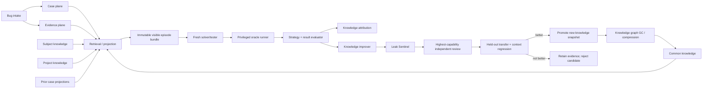
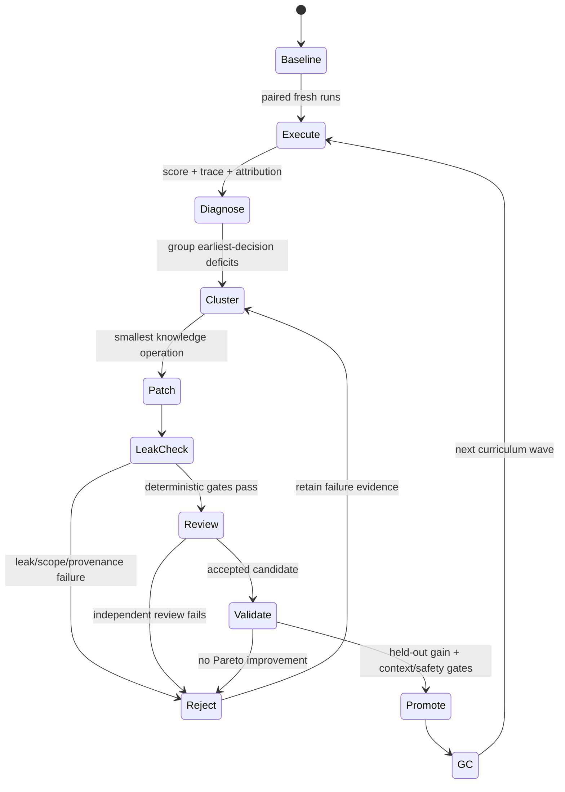

# SPipe Skill Foundry

## Execution-grounded debugging training, evaluation, and knowledge-refinement platform

**Status:** implementation-ready design plus dependency-free reference scaffold  
**Date:** 2026-09-04  
**Primary repositories:** `ormastes/Spipe`, `ormastes/simple`  
**Initial domain pack:** debugging  
**Later domain packs:** profiling, optimization, coding/refactoring, testing/review, security, architecture  
**Design rule:** reusable knowledge is a decision aid, never an answer key

---

## 1. Executive decision

Add a fifth plane to SPipe's existing case/evidence/knowledge/retrieval architecture:

1. **Case plane** — the immutable chronology of a concrete bug.
2. **Evidence plane** — reports, dumps, logs, traces, binaries, source snapshots, reproduction files, and execution receipts.
3. **Knowledge plane** — compact common, subject, and project procedures with explicit applicability boundaries.
4. **Retrieval/projection plane** — snapshot-bound search, graph traversal, and generated provider-specific skill views.
5. **Curriculum/evaluation/refinement plane** — frozen training episodes, isolated solvers, hidden oracles, deterministic and model-assisted graders, attribution, anti-leak review, knowledge revision, compression, promotion, and garbage collection.

Call the new subsystem **SPipe Skill Foundry**. It is not model fine-tuning. It is a provider-neutral external-skill laboratory that repeatedly asks a fresh solver to diagnose and repair bugs using controlled evidence and controlled knowledge, then retains only knowledge changes that transfer to held-out cases with less or equal context.

The first implementation must be a dependency-free JavaScript SPipe core, following the repository's existing versioned-contract and exact-field-validation pattern. Simple-language providers can later accelerate indexing, graph search, statistics, and execution, but SPipe remains usable without Simple.

The most important architectural separation is:

```text
operational debugging  !=  benchmark evaluation  !=  knowledge refinement
```

Operational debugging may use every authorized clue. Evaluation receives only a frozen visible bundle. Refinement receives sanitized failure diagnostics and aggregate evidence, not the hidden answer. A solver, improver, or common-knowledge author must never be able to query the current episode's hidden oracle.

---

## 2. Current-state audit and integration constraints

### 2.1 What already exists

SPipe already contains:

- provider projections for Claude, Codex, and Gemini;
- debug and debug-analyst agents;
- a reusable debug skill with logging, IR export, query, DAP/LSP, and bootstrap commands;
- a bounded daily-debug loop;
- strict release/review contracts and receipt-based review flows;
- a dependency-free Node.js CLI and MCP server;
- a designed Knowledge Compiler with immutable snapshots, typed graph records, search providers, common-knowledge promotion, skill compilation, and virtual views.

Simple already contains:

- a canonical SDN bug database;
- `bug-add` and `bug-gen` tools;
- bug descriptions, free-form fix strategies, and investigation logs;
- a large historical bug corpus;
- executable test infrastructure and many debug-related tools.

### 2.2 Missing capabilities

The current debug material is static procedural guidance. The bug database is useful for tracking but does not yet encode:

- immutable source/build/environment identities;
- typed observations, hypotheses, experiments, or causal claims;
- content-addressed evidence manifests;
- exact reproduction bundles;
- visible versus hidden evaluation partitions;
- solver trajectories and tool-call receipts;
- prediction-before-execution;
- objective strategy scoring;
- knowledge-unit attribution and ablation;
- answer-leak prevention;
- curriculum splits and temporal holdouts;
- context-budgeted knowledge selection;
- transfer validation and garbage collection.

The Knowledge Compiler is still being implemented. Therefore Skill Foundry must use a **port boundary**:

```text
TrainingCore -> KnowledgePort

BootstrapKnowledgePort   dependency-free local manifests/search
CompilerKnowledgePort    future adapter to accepted Knowledge Compiler snapshots
```

There must be one canonical knowledge graph, not a training-only duplicate graph.

### 2.3 Compatibility decisions

- Do not hand-edit `doc/08_tracking/bug/bug_db.sdn`; retain its current canonical writer and CRC discipline.
- Introduce sidecar typed case records first, linked by stable bug ID.
- Keep large dumps, firmware images, traces, and cores out of Git. Store them in a content-addressed artifact vault; commit only manifests and small reproduction fixtures.
- Preserve existing flat CLI commands as compatibility dispatchers while adding cohesive modules under `src/training/`.
- MCP hidden-oracle resources are served by a separate privileged process or capability, never by the ordinary SPipe MCP resource handler.
- Generated history views and provider skill files are read-only projections. Canonical case and knowledge artifacts remain the only writable sources.

---

## 3. Research-derived design rules

The research does not justify unconstrained self-improvement. It supports a conservative, execution-grounded and validation-filtered system.

### 3.1 Skills help, but excess context hurts

SkillsBench reports a substantial average benefit from curated skills, but also negative-transfer cases. Its design ablations favor one to three focused skills over four or more, and compact/standard procedural guidance over comprehensive prose. SkillReducer independently reports sizeable description/body compression with preserved or slightly improved functional quality. The platform should therefore optimize **loaded decision utility per token**, not document volume.

Resulting rule:

```text
Default initial hydration: 0-3 knowledge units.
Load deeper references only after an explicit evidence or decision need.
A knowledge revision is not an improvement unless held-out utility survives
with equal or lower loaded-context cost, or the extra cost is justified by
unique safety/correctness coverage.
```

### 3.2 Improvement is sparse, not monotonic

Execution-grounded revision can improve skills, but multi-round studies show that few candidate revisions become new validation bests and that failed trajectories are especially informative. Therefore:

- every revision is a candidate, never an automatic upgrade;
- validation selects an immutable best snapshot;
- repeated no-gain rounds stop;
- failed and low-scoring trajectories are clustered by deficit;
- the system prefers editing/deleting/splitting existing knowledge before adding more.

### 3.3 Persistent knowledge has a lifecycle safety problem

A successful trajectory can still contain unsafe or brittle procedure. Once distilled, that behavior can transfer to unrelated tasks. Therefore success is insufficient for promotion. Common knowledge needs independent safety, leakage, applicability, and transfer gates before future retrieval.

### 3.4 Public historical bugs are not trustworthy sealed exams

Public coding benchmarks increasingly face contamination and weak-test problems. SPipe must assume that public Simple issues, commits, reports, and solutions may be present in model training data. Official release scores therefore require:

- private post-cutoff episodes;
- temporal splits;
- project/family holdouts;
- answer canaries;
- counterfactual and mutation-generated sibling bugs;
- adversarial tests that reject hard-coded or gold-patch imitation;
- rolling re-curation and multi-run stability checks.

Historical public bugs remain useful for training, regression, taxonomy building, and process evaluation; they are not sufficient evidence of uncontaminated debugging ability.

### 3.5 Runtime feedback is not automatically useful

DebugBench found that runtime feedback can help or hurt. Skill Foundry must reward **the least expensive discriminating observation**, not tool activity. An unnecessary full reproduction, full suite, or giant log capture is a strategy defect when existing dump/state already distinguishes the hypotheses.

### 3.6 Human learning should use retrieval and transfer

For human or human-agent training, use worked examples initially, fade guidance, require self-explanation, mix nearby bug families, revisit after delay, and test transfer rather than rereading. Human learning metrics stay separate from model benchmark metrics.

---

## 4. Goals and non-goals

### 4.1 Goals

1. Preserve complete, reproducible, auditable bug histories and artifacts.
2. Represent common, subject, project, and case-history knowledge with the same retrievable interface while preserving different authority and visibility.
3. Train an agent to decide whether current evidence is sufficient before asking for more.
4. Evaluate diagnosis, strategy, experiment prediction, causal proof, fix quality, and tests—not only final patch pass/fail.
5. Generate reproducibility, regression, and prevention tests after a correct fix.
6. Improve knowledge from failures while preventing current-case answer leakage.
7. Measure which knowledge actually helped through traces, self-report, and ablation.
8. Minimize context through progressive disclosure and graph-aware retrieval.
9. Support multiple models/harnesses through Caret/SPipe adapters.
10. Generalize the engine to profiling, optimization, coding, and other domains.

### 4.2 Non-goals

- Treating a long bug wiki as a prompt to inject wholesale.
- Automatically publishing generated common knowledge.
- Calling a case solved merely because a model guessed the gold patch.
- Requiring reproduction when existing evidence already proves the cause.
- Penalizing a solver for correctly declaring a case underdetermined.
- Allowing the evaluator to disclose hidden root-cause or fix text to the improver.
- Replacing the project issue tracker or the existing Simple bug database.
- Making semantic similarity or an LLM judge the sole source of truth.
- Claiming that repeated exposure to every historical bug proves general debugging capability.

---

## 5. Five-plane architecture



### 5.1 Ownership

**SPipe owns** schemas, policy, canonical records, snapshot identities, retrieval contracts, score calculations, capability boundaries, audit receipts, CLI/MCP surfaces, knowledge lifecycle, and provider-neutral event semantics.

**Caret/runner owns** provider sessions, model selection, worktree/container isolation, tool execution, normalized events, cancellation, resource limits, and hidden-oracle process separation.

**Simple owns** its project source, tests, bug DB, optional native providers, compiler/runtime instrumentation, firmware/HIL adapters, and domain-specific execution tools.

### 5.2 Trust zones

| Zone | Can read | Can write | Must not access |
|---|---|---|---|
| Solver | visible bundle, authorized tools, hydrated knowledge | run workspace, proposed patch/tests, run events | hidden oracle, future history, knowledge candidate drafts |
| Oracle runner | hidden verifier, visible run output, isolated repo snapshots | execution receipts only | common-knowledge canonical files |
| Evaluator | solver run, oracle receipts, rubric, sanitized hidden facts | score receipt, sanitized deficit report | solver workspace mutation |
| Knowledge improver | aggregate/deficit packets, allowed traces, current knowledge | candidate knowledge patch | raw hidden patch/root-cause text for target episodes |
| Leak Sentinel | candidate, visible/hidden manifests, provenance, canaries | leak report only | promotion capability |
| Independent reviewer | candidate, leak report, validation results | admission/rejection receipt | direct canonical publication |
| Publisher | admitted exact candidate + receipts | new immutable knowledge snapshot | candidate rewriting |

No role may both create a common candidate and unilaterally admit it.

---

## 6. Canonical information model

### 6.1 Common envelope

All mutable concepts use immutable versioned records and append-only events. A logical entity advances by creating a new version; history is never rewritten.

```text
RecordEnvelopeV1 = {
  schema,
  uid,
  version,
  created_at,
  created_by,
  content_sha256,
  source_snapshot_uid,
  visibility,
  trust_scope,
  provenance_refs[]
}
```

Unknown fields fail closed at contract boundaries. Canonical JSON or canonical SDN field order is fixed per schema. Hashes bind the exact bytes.

### 6.2 CaseRecordV1

A bug case is not a prose page. It is the stable root of observations, evidence, hypotheses, experiments, fixes, and verification.

```text
CaseRecordV1 = {
  schema, case_uid, project_uid, legacy_bug_id?,
  source_receipts[], title, severity, lifecycle_state,
  first_observed_at, normalized_at?, closed_at?,
  source_snapshot_uid, build_identity_uid, environment_identity_uid,
  symptom_uids[], failure_signature_uids[],
  evidence_manifest_uid, chronology_uid,
  reproduction_bundle_uids[],
  causal_claim_uids[], fix_claim_uids[], verification_claim_uids[],
  privacy_class, safety_class, retention_policy_uid
}
```

Lifecycle:

```text
reported -> normalized -> triaged -> investigating -> cause-supported
-> fix-candidate -> fixed-unverified -> verified -> closed
```

`blocked`, `unsafe`, `duplicate`, and `inconclusive` are explicit outcomes, not prose comments.

### 6.3 Observation, hypothesis, and experiment

```text
ObservationV1 = {
  observation_uid, case_uid, observed_at,
  source_evidence_uid, extraction_method,
  statement, confidence, falsifiability,
  source_span_or_locator, author
}

HypothesisV1 = {
  hypothesis_uid, case_uid, statement,
  mechanism_uid?, prior_probability,
  predicts[], contradicts[],
  status: active|supported|refuted|superseded,
  evidence_for[], evidence_against[]
}

ExperimentProposalV1 = {
  experiment_uid, case_uid, question,
  target_hypothesis_uids[], action,
  reproduction_level,
  preconditions, possible_outcomes[],
  predicted_probabilities,
  update_rule,
  expected_information_gain,
  estimated_cost, safety_requirements,
  stop_conditions
}
```

The predicted outcome is sealed before execution. This enables calibration scoring and prevents post-hoc storytelling.

### 6.4 EvidenceManifestV1

```text
EvidenceItemV1 = {
  evidence_uid, case_uid, kind,
  sha256, byte_size, media_type,
  captured_at, captured_by,
  source_identity, collection_command?,
  parser_uid?, parser_version?,
  trust: untrusted|quarantined|verified,
  sensitivity, encryption_ref?, retention,
  local_or_vault_locator,
  compatible_build_uids[],
  derived_from[], signature_receipt?
}
```

Kinds include report, source tree, source file, build manifest, test output, log, trace, core dump, minidump, register dump, memory dump, firmware image, ELF/PDB/DWARF, configuration, input corpus, NAND/SSD telemetry, profiler capture, packet trace, screenshot, and environment snapshot.

Artifacts are data by default. Parsing and execution require separate allowlisted capabilities.

### 6.5 ReproductionBundleV1

A reproducer is a versioned executable contract:

```text
ReproductionBundleV1 = {
  bundle_uid, case_uid, purpose,
  reproduction_level,
  repo_snapshot_uid, submodule_snapshot_uids[],
  build_identity_uid, environment_identity_uid,
  toolchain_manifest_uid,
  hardware_or_firmware_identity_uids[],
  fixture_evidence_uids[],
  setup_steps[], run_steps[], cleanup_steps[],
  seeds[], repetitions, timeout_ms,
  expected_pre_fix, expected_post_fix,
  positive_control, negative_controls[],
  safety_constraints[],
  deterministic, known_flake_rate,
  result_parser_uid, oracle_uid
}
```

### 6.6 KnowledgeUnitV1

Common knowledge is deliberately structured so it cannot silently become a case answer.

```text
KnowledgeUnitV1 = {
  schema, knowledge_uid, version,
  scope: common|subject|project,
  domain, kind,
  title, routing_description,
  trigger,
  applicability,
  exclusions,
  preconditions,
  mechanism,
  procedure_steps[],
  decision_points[],
  expected_observations[],
  failure_modes[],
  lightweight_fallback?,
  tool_requirements[],
  safety_constraints[],
  evidence_refs[],
  validation_episode_refs[],
  unique_coverage_tags[],
  estimated_token_cost,
  estimated_execution_cost,
  trust_state,
  anticipatory,
  supersedes[], conflicts_with[], extends[]
}
```

Allowed `kind` values initially:

- invariant;
- symptom-to-check map;
- evidence interpretation rule;
- hypothesis template;
- discriminating-check recipe;
- reproduction recipe;
- instrumentation/capture recipe;
- fix-pattern constraint;
- verification/prevention recipe;
- tool recipe;
- safety/stop rule.

Common knowledge must state applicability and exclusions. “Always run the full suite” and similarly unconditional heavyweight advice is invalid unless it is a final release gate, not an investigation strategy.

### 6.7 Same structure for history and common knowledge

Case history is not copied into common knowledge. Instead, a read-only projection maps a closed case to the shared retrieval shape:

```text
RetrievableKnowledgeViewV1 = {
  view_uid,
  source_kind: case_history|project|subject|common,
  source_uid,
  valid_at_snapshot,
  trigger,
  applicability,
  mechanism_summary,
  useful_checks[],
  observed_outcomes[],
  fix_pattern_summary?,
  verification_summary?,
  caveats[],
  provenance_refs[],
  visibility,
  answer_leak_risk
}
```

This gives the tester one retrieval interface while preserving authority:

```text
current case evidence
  > project knowledge
  > subject knowledge
  > pinned common knowledge
  > approved prior case projections
  > external references
```

A prior case is eligible only when its closure time is earlier than the episode cutoff and the episode's history policy admits it.

### 6.8 TrainingEpisodeV1

```text
TrainingEpisodeV1 = {
  schema, episode_uid, domain,
  source_case_uid, family_uid,
  created_at, temporal_cutoff,
  split: train|development|private_test|safety_test,
  visible_manifest_uid,
  hidden_oracle_manifest_uid,
  knowledge_snapshot_uid,
  project_knowledge_snapshot_uid?,
  history_policy_uid,
  runner_profile_uid,
  solvability:
    visible_sufficient|experiment_required|environment_required|underdetermined,
  allowed_reproduction_levels[],
  resource_budget,
  safety_policy_uid,
  deterministic, required_repetitions,
  contamination_canary_uids[],
  evaluator_policy_uid
}
```

### 6.9 SolverRunV1

```text
SolverRunV1 = {
  run_uid, episode_uid,
  model_identity, harness_identity,
  seed, effort_profile,
  exact_visible_manifest_sha256,
  exact_knowledge_snapshot_sha256,
  started_at, ended_at,
  retrieval_events[], evidence_access_events[],
  observations[], hypotheses[],
  experiment_proposals[], experiment_predictions[],
  data_requests[], causal_claim,
  patch_manifest_uid?, test_manifest_uid?,
  final_status, final_confidence,
  knowledge_attribution_response,
  tool_receipts[], resource_usage
}
```

### 6.10 ScoreReceiptV1

The score receipt binds the exact episode, run, oracle, evaluator, rubric, and all component scores. A changed test, hidden manifest, model, harness, or knowledge snapshot creates a different result.

---

## 7. Bug structuring manual: what becomes what

| Input | Transform | Canonical output | Gate | Primary owner |
|---|---|---|---|---|
| Email/issue/chat/CI alert | Preserve original and assign identity | `SourceReceiptV1` | source bytes/hash retained | intake adapter |
| Attachments/dumps/logs | quarantine, hash, classify | `EvidenceItemV1[]` | no implicit execution | evidence service |
| Reported wording | normalize without deleting source wording | symptom + observed/expected behavior | fact/inference separated | case normalizer |
| Commit/build/env details | resolve exact immutable identities | source/build/environment snapshots | no floating branch/tag | identity resolver |
| Repeated error/state | canonicalize stable and volatile portions | `FailureSignatureV1` | normalization explained | signature extractor |
| Facts from dump/log | source-bound extraction | `ObservationV1[]` | every fact cites evidence locator | analyst/extractor |
| Possible mechanisms | create alternatives | `HypothesisV1[]` | at least one falsifier each | solver |
| Current evidence inventory | assess discriminating power | sufficiency decision | oracle labels known sufficiency for eval | solver/evaluator |
| Needed next check | predict outcomes before run | `ExperimentProposalV1` | probabilities sum to one; cost/safety stated | solver |
| Executed check | immutable result receipt | `ExperimentResultV1` | exact inputs/tools/time/hash | runner |
| Supported mechanism | causal argument | `CausalClaimV1` | alternatives addressed; evidence chain complete | solver/evaluator |
| Code/config change | bind diff and rationale | `FixClaimV1` | exact base/head and changed behavior | solver |
| Small failure script/input | package exact setup/run/oracle | `ReproductionBundleV1` | pre-fix failure demonstrated | reproducer author |
| New tests | classify purpose | reproduction/regression/prevention tests | fail-to-pass + pass-to-pass + near-miss checks | test author/oracle |
| Closed case | generate read-only projection | `CaseKnowledgeProjectionV1` | closure evidence and cutoff attached | projection service |
| Reusable lesson | generalize and remove case identifiers | `KnowledgePatchV1` | leak, scope, provenance, transfer, token gates | improver |
| Accepted candidate | publish immutable snapshot | `KnowledgeSnapshotV1` | independent highest-capability admission | publisher |

### 7.1 Required investigation sequence

```text
1. Identify exact source/build/environment.
2. Inventory already available evidence.
3. Separate observations from interpretations.
4. Normalize the symptom and failure signature.
5. Retrieve at most three applicable knowledge units initially.
6. Construct competing hypotheses and explicit falsifiers.
7. Decide whether existing evidence is already sufficient.
8. If insufficient, choose the lowest-cost, safest discriminating check.
9. Predict possible results and hypothesis updates before execution.
10. Execute through a receipt-producing runner.
11. Establish a causal claim, or explicitly remain underdetermined.
12. Apply a minimal cause-addressing fix.
13. Create exact reproduction, regression, and prevention tests.
14. Run focused tests, related tests, then required whole gates once.
15. Close the case only with exact verification evidence.
16. Project history; propose reusable knowledge separately.
```

### 7.2 Reproduction ladder

Use the lowest sufficient level:

| Level | Name | Typical use |
|---|---|---|
| R0 | Offline evidence replay | Parse an existing dump/log/trace; no target rerun |
| R1 | Deterministic trace/event replay | Replay recorded events or simulator input |
| R2 | Unit/component fixture | Minimal source/input reproducer |
| R3 | Integration/system simulation | Multiple modules or services |
| R4 | Full system/HIL/firmware | Timing, hardware, power, boot, NAND, real controller |
| R5 | Field recurrence/observability | Rare production-only condition; enhanced capture |

A root cause established from R0 may still require an R2/R3 regression test after the fix. The score distinguishes **diagnostic necessity** from **post-fix prevention**.

---

## 8. Training episode construction

### 8.1 Three immutable partitions

Each episode has:

1. **Visible bundle** — exactly what the solver may inspect.
2. **Hidden oracle bundle** — root-cause proof, approved fixes, hidden tests, counterexamples, and scoring facts.
3. **Knowledge snapshot** — exact common/project/history units available to the solver.

Changing any partition creates a new episode version.

### 8.2 Visible bundle

May contain:

- original report as it existed at cutoff;
- pre-fix repository snapshot;
- pre-fix build and environment manifests;
- existing dumps, logs, traces, and reproduction inputs known at cutoff;
- authorized tools;
- pinned common/subject/project knowledge;
- prior case history allowed by chronological policy.

Must not contain:

- fix commit or later commits that reveal it;
- post-fix comments, release notes, tests, or docs;
- gold root-cause labels;
- filenames/symbol names introduced only by the fix;
- future cases or future knowledge derived from the current case;
- evaluator-only solvability evidence;
- contamination canaries.

### 8.3 Hidden oracle bundle

Contains:

- accepted causal explanation and minimal evidence chain;
- alternative valid explanations, where applicable;
- pre-fix/fixed/bad-fix snapshots;
- fail-to-pass and pass-to-pass tests;
- near-miss patches and mutation operators;
- evidence-sufficiency oracle;
- permitted solution equivalence rules;
- flaky/blocked/environment constraints;
- hidden canary tokens;
- evaluator rubric version.

The hidden oracle is not necessarily one gold patch. It must allow functionally equivalent fixes and reject implementation-specific overfitting.

### 8.4 Solvability labels

- `visible_sufficient`: present artifacts can establish the cause without target execution.
- `experiment_required`: one or more executable checks are necessary.
- `environment_required`: the next valid step requires a specific real/HIL environment.
- `underdetermined`: multiple causes remain observationally equivalent under the allowed budget.

A solver receives points for a correct `underdetermined` or `environment_required` conclusion with a minimal next-data plan. It must not be forced to invent a cause.

### 8.5 Chronological history modes

Run distinct experimental conditions:

| Condition | Available prior information | Purpose |
|---|---|---|
| N | no persistent knowledge | native model baseline |
| C | common knowledge only | common-skill effect |
| CP | common + subject/project | project specialization effect |
| CPH | CP + sanitized prior-case projections | historical retrieval effect |
| FULL-HISTORY | full authorized earlier cases/solutions | training aid only, not official clean benchmark |

Paired comparisons must hold episode, model, harness, effort, seed set, and tool policy constant.

---

## 9. Agent roles and protocol

### 9.1 Episode Curator

Creates source-bound episodes and verifies temporal visibility. It does not grade runs.

### 9.2 Solver/Tester

Receives the visible bundle. It must emit structured observations, hypotheses, sufficiency decisions, experiment predictions, cause/fix/test artifacts, and knowledge-help feedback.

### 9.3 Oracle Runner

Runs approved experiments and tests in isolated snapshots. It returns normalized receipts, not the hidden solution.

### 9.4 Strategy Evaluator

Scores the sequence of decisions and the final artifacts. It assesses what each proposed experiment would distinguish and compares predictions with actual outcomes.

### 9.5 Leak Sentinel — highest-priority adversarial role

Checks whether common knowledge or feedback contains current-case answers. It combines deterministic provenance/identifier/canary checks with independent semantic red-team review.

Reject examples:

- current bug ID, exact title, fix commit, changed line, or unique symbol;
- a rare error substring found only in the target case;
- an instruction that effectively states the hidden root cause;
- an example whose constants, path, or ordering recreate the target;
- evidence references from after the episode cutoff;
- a candidate derived from the same bug and evaluated as transfer on that bug.

Allow examples:

- the underlying ownership/lifetime invariant;
- a generic “compare producer versus consumer representation” procedure;
- an applicability-bounded dump-field interpretation rule;
- a general test pattern with different identifiers and counterexamples;
- a hardware safety stop condition.

### 9.6 Knowledge Attributor

Collects three kinds of evidence:

1. solver self-report;
2. retrieval/read/action traces;
3. controlled ablation or substitution results.

The solver is always asked:

```text
For every cited knowledge UID:
- Did you use it?
- Which exact decision did it change?
- Which evidence or action did it affect?
- Would your result likely differ without it?
- Was it misleading, redundant, too broad, or too late?
- What missing knowledge would have changed your earliest wrong decision?
```

Self-report alone never establishes utility.

### 9.7 Knowledge Improver

Receives sanitized deficit clusters and attribution data. Preferred operation order:

```text
delete stale/redundant
-> correct wrong guidance
-> narrow applicability
-> split mixed responsibilities
-> relocate project-specific content
-> merge/factor duplicates
-> improve routing/fallback
-> add new content only when no smaller operation closes the gap
```

### 9.8 Highest-capability Independent Reviewer

Reviews common candidates for correctness, generality, safety, leakage, contradiction, token economy, and evidence. The best available authorized model is required for common promotion; model identity and effort are recorded in the admission receipt. Human review can be additionally required for safety-critical knowledge.

### 9.9 Knowledge GC/Context Compiler

Builds the smallest dependency-complete retrieval bundle and emits non-destructive keep/merge/split/demote/tombstone proposals.

### 9.10 Curriculum Scheduler

Selects episodes by deficiency, novelty, spacing, family coverage, and information value. It cannot see private-test results at candidate-selection time.

---

## 10. Anti-cheat and contamination controls

### 10.1 Threat model

Leakage can occur through:

- common/project skill text;
- prior case projections;
- filenames, IDs, paths, examples, or constants;
- post-cutoff source/docs/tests;
- retrieval index metadata;
- model parametric memory;
- evaluator feedback;
- logs or caches shared across sessions;
- generated provider files;
- tool descriptions;
- accidental oracle mounting;
- same-bug validation of a same-bug-derived candidate.

### 10.2 Deterministic gates

1. Exact temporal provenance: every source has capture/commit time and hash.
2. Deny-list of current bug/fix IDs, hashes, paths, symbols, line anchors, rare strings, and canaries.
3. N-gram and normalized-fingerprint overlap against hidden facts.
4. Source-edge validation: no current/future case source for common candidate evaluation.
5. Generated-example mutation: examples must not preserve the target's distinguishing constants and topology.
6. Filesystem/capability isolation: hidden mount absent from solver namespace.
7. Cache isolation by episode/run/model/knowledge snapshot.
8. Network policy recorded and normally disabled for sealed evaluation.
9. Fresh worktree/container and fresh agent memory per official run.
10. Signed visible manifest; solver reports its exact digest.

### 10.3 Semantic gates

Two independent reviewers answer:

- Could this unit reduce the target to one unique known answer without examining evidence?
- Does the example encode the target through renamed identifiers?
- Is the advice more specific than its claimed scope/provenance supports?
- Would the unit remain useful on counterfactual sibling bugs?
- Does it prescribe the fix rather than a mechanism/check/invariant?

A red-team reviewer attempts to identify the target bug or hidden patch from the candidate alone. Confident identification is a rejection signal.

### 10.4 Parametric contamination

No wrapper can prove that a closed model never saw a public bug. Mitigations:

- private post-training-cutoff cases;
- newly generated but human-validated fault injections;
- counterfactual variants whose correct fix differs from public history;
- renamed/restructured code with changed constants and control flow;
- model cross-examination for exact memorized details;
- canary strings;
- public-training scores reported separately from sealed-release scores.

### 10.5 Feedback firewall

Evaluator feedback to the improver is a **sanitized deficit packet**:

```text
- failed rubric dimensions;
- earliest wrong decision class;
- missing/incorrect knowledge capability;
- aggregate counterexample category;
- evidence that the current unit helped/hurt;
- no root-cause text, patch lines, hidden identifiers, or unique outcome strings.
```

The improver cannot ask follow-up questions of the hidden evaluator about a specific episode.

---

## 11. Evaluation and scoring

### 11.1 Hard gates

Any of the following invalidates or caps the run regardless of total points:

- hidden-oracle access or canary disclosure;
- fabricated command, test, or result receipt;
- wrong repository/build/environment snapshot;
- unsafe or unauthorized action;
- evaluator/test tampering;
- false `PASS` when execution is blocked, flaky, missing, or inconclusive;
- unsupported causal certainty;
- patch that only hard-codes the hidden test;
- loss of mandatory pass-to-pass behavior.

### 11.2 100-point rubric

| Dimension | Points | Required evidence |
|---|---:|---|
| A. Source grounding and normalization | 8 | exact identities; observed versus inferred facts |
| B. Evidence sufficiency decision | 12 | correct use of existing evidence; correct need/no-need decision |
| C. Hypothesis quality and calibration | 10 | alternatives, priors, falsifiers, uncertainty |
| D. Discriminating strategy | 14 | information gain, cost, safety, stop rule, minimality |
| E. Prediction accuracy/calibration | 8 | sealed pre-run outcome probabilities versus result |
| F. Causal localization and proof | 14 | mechanism, evidence chain, alternatives addressed |
| G. Fix correctness and minimality | 14 | cause-addressing, safe, scoped, maintainable patch |
| H. Reproduction/regression/prevention tests | 14 | F2P, P2P, near-miss rejection, prevention invariant |
| I. Attribution, generalization, and context economy | 6 | cited helpful/harmful units; reusable lesson; token discipline |
| **Total** | **100** | |

### 11.3 Strategy adjustments

Apply only when supported by the episode's hidden sufficiency oracle:

| Condition | Adjustment |
|---|---:|
| Proves cause from already available evidence before requesting a rerun | +4 |
| Selects the lowest-cost check that separates leading hypotheses | +3 |
| Correctly declares blocked/underdetermined and requests the minimal discriminator | +2 |
| Requests data already present and discoverable in the visible manifest | -6 |
| Requests avoidable full-system reproduction before using sufficient dump/trace data | -8 |
| Uses shotgun logging/full-suite/tool calls before a discriminating question | -1 each, max -5 |
| Makes an exact-cause claim when evidence is underdetermined | -10 and causal-proof cap |
| Adds a valid post-fix reproducer after evidence-first diagnosis | no penalty; scored under tests |

The same action can be reasonable in one episode and wasteful in another. The oracle, not a global rule, decides whether existing evidence was sufficient.

### 11.4 Experiment prediction score

Before execution, the solver assigns probabilities to normalized outcomes. Use multiclass Brier score:

```text
brier = sum((p_i - y_i)^2)
prediction_score = max(0, 1 - brier / 2)
```

Also require an update map: what each outcome would do to each hypothesis. A correct lucky guess with no discriminating logic cannot receive full strategy or causal-proof credit.

For repeated flaky reproduction, score predicted outcome frequencies against observed frequencies and confidence intervals rather than one binary result.

### 11.5 Final status

```text
PASS   >= 85, no hard gate, every critical slice >= 80
LEARN  70..84, or a non-critical slice below 80
FAIL   < 70, or hard-gate failure
```

Maintain family/project/language/environment slice floors so aggregate gains cannot hide regressions.

### 11.6 Test-quality scoring

A proper test portfolio includes:

1. **Reproduction test:** fails on exact pre-fix snapshot and passes on valid fixes.
2. **Pass-to-pass tests:** preserve existing behavior.
3. **Near-miss rejection:** fails against plausible wrong fixes/hard-coded patches.
4. **Stability:** repeated execution and fixed/random seeds as appropriate.
5. **Prevention test:** asserts a broader invariant, property, metamorphic relation, static rule, or contract when justified.

Accepted execution states are `PASS`, `FAIL`, `BLOCKED`, `FLAKY`, `UNSAFE`, and `INCONCLUSIVE`. Never collapse all non-pass states into failure.

---

## 12. Knowledge refinement loop



### 12.1 Dataset splits

- **Training/mastery:** repeatable; optimizer may see scores and sanitized feedback.
- **Development:** candidate selection; no raw hidden solutions.
- **Private release test:** used only for final admission, never for iterative candidate selection.
- **Safety/adversarial:** unsafe tool use, prompt injection, poisoned trajectories, evidence tampering.
- **Retention:** previously solved cases to catch forgetting.
- **Transfer:** different project/family/language/environment.

Split by time, project, and mechanism family, not random file row alone.

### 12.2 Paired evaluation

For each selected episode and seed set:

```text
no knowledge
common only
common + project
common + project + prior history
candidate snapshot
```

Keep model, harness, effort, tools, repository, and visible evidence identical. Run multiple seeds for stochastic agents. Report mean, confidence interval, solve rate, strategy score, context tokens, tool cost, and safety events.

### 12.3 Candidate selection objective

Use a Pareto gate, not one scalar alone:

1. zero new safety/leak violations;
2. no critical-slice regression;
3. higher held-out task/strategy utility;
4. no loss of unique rare coverage;
5. lower or equal p95 loaded tokens and execution cost, unless justified;
6. stable across at least two authorized model/harness configurations for common knowledge;
7. reproducible result receipts.

One useful ranking metric after hard gates is:

```text
marginal_utility =
  (heldout_score_delta + 0.5 * transfer_delta + 0.25 * safety_delta)
  / max(1, added_p95_loaded_tokens)
```

Do not optimize this ratio across candidates that fail a hard gate or slice floor.

### 12.4 No circular validation

A candidate derived from bug X may use X for **retention**—does it preserve the lesson? It may not use X as evidence of transfer. Promotion needs other cases, synthetic counterfactuals, independent invariant proof, or future cases.

### 12.5 Stopping

Stop a refinement batch when any is true:

- target validation and slice floors pass;
- no candidate becomes a new byte-distinct validation best for the configured patience window;
- remaining errors require project knowledge rather than common knowledge;
- added context exceeds the budget without unique benefit;
- feedback begins to encode hidden-case specifics;
- execution budget is exhausted;
- evaluator disagreement remains unresolved.

“Pass all bugs” means mastery of the declared training/retention set while still passing unseen release and transfer sets. It does not mean memorizing every historical fix.

---

## 13. Anticipatory knowledge before a bug occurs

Reusable rules may be created without a historical occurrence, but they require a distinct provenance and trust state.

Sources:

- language/runtime/OS/hardware contracts;
- formal invariants and model-checking results;
- standards and authoritative manuals;
- FMEA/STPA/hazard analysis;
- static-analysis rules;
- mutation operators and fault injection;
- property-based/metamorphic tests;
- near-miss incidents;
- profiler/telemetry patterns;
- architecture constraints.

Admission path:

```text
anticipatory proposal
-> explicit invariant and applicability boundary
-> construct at least two positive and two negative synthetic scenarios
-> independent source verification
-> Leak Sentinel
-> best-model review
-> development/safety evaluation
-> provisional scoped publication
-> promote to ordinary common knowledge only after observed transfer utility
```

Anticipatory knowledge defaults to on-demand retrieval and must not crowd the Tier-0 core unless it is a rare but critical safety rule.

---

## 14. Context minimization and knowledge garbage collection

### 14.1 Progressive disclosure

| Tier | Typical content | Loading rule |
|---|---|---|
| 0 | compact safety/correctness invariants and investigation protocol | always, tightly budgeted |
| 1 | 0–3 routed decision cards | initial task match |
| 2 | detailed playbook/tool/reproduction recipe | explicit decision dependency |
| 3 | approved prior case projections | explicit history query |
| 4 | raw evidence/reference files | exact on-demand access |

Stored knowledge may be large. Loaded context must remain small.

### 14.2 Graph-aware hydration

Retrieve a seed by exact signature/term and lexical match, then traverse only required dependencies:

```text
symptom/signature
  -> applicable mechanism or invariant
  -> discriminating check
  -> required evidence interpretation/tool
  -> expected outcomes and stop rule
```

Do not hydrate neighboring history, examples, or tools merely because they are semantically similar.

### 14.3 GC metrics

For each knowledge unit and version track:

- retrieval count;
- actual read count;
- cited-use count;
- self-reported helpful/harmful count;
- leave-one-out ablation delta;
- unique episode/family coverage;
- token and tool cost;
- contradiction count;
- stale source references;
- last successful validation;
- safety-critical/rare-exception flag;
- downstream dependency count.

### 14.4 GC actions

- `keep`: unique positive value.
- `compress`: same semantics at lower cost.
- `merge`: duplicated obligations/procedure.
- `split`: broad unit helps one slice but harms another.
- `narrow`: applicability boundary missing.
- `demote`: common content is actually project/subject-specific.
- `deprecate`: superseded but needed for old snapshots.
- `tombstone`: no unique coverage or unsafe/incorrect.
- `quarantine`: suspected poisoning/leakage.

Never physically erase an admitted version from audit history. New snapshots omit or tombstone it.

### 14.5 Optimization order

Use a lexicographic objective:

1. safety and no leakage;
2. correctness and critical-slice coverage;
3. held-out utility and calibration;
4. p95 loaded-token and tool-cost reduction;
5. maintenance burden and graph simplicity.

A default starting budget is at most three initially hydrated units and a configurable p95 loaded-knowledge budget; establish the actual token threshold from SPipe telemetry rather than treating one fixed number as universal.

---

## 15. Knowledge graph

### 15.1 Node kinds

- symptom;
- failure signature;
- invariant;
- mechanism;
- hypothesis template;
- check/experiment;
- evidence kind;
- observation pattern;
- cause;
- fix pattern;
- reproduction recipe;
- test oracle;
- prevention invariant;
- tool;
- environment;
- component/layer/feature/project;
- knowledge unit;
- case-history projection;
- training episode;
- score/attribution/promotion receipt.

### 15.2 Edge kinds

```text
suggests, specializes, applies_to, excludes,
requires, consumes, produces,
discriminates, predicts, confirms, refutes,
causes, fixed_by, verified_by, prevents,
derived_from, validated_by, helped, harmed,
contradicts, supersedes, depends_on
```

Every edge has provenance, scope, validity interval, trust state, and snapshot identity.

### 15.3 Retrieval explanations

Every hydrated unit returns:

- exact query/signature match;
- graph path from target to unit;
- applicability and exclusions;
- source scope;
- trust/validation status;
- token cost;
- why it outranked alternatives;
- conflicts and fallbacks.

---

## 16. Human and pair-training mode

Use the same episodes with `learner_kind=agent|human|pair` but separate score dashboards.

Curriculum stages:

1. **Worked example:** show a complete evidence-to-cause-to-test chain.
2. **Faded example:** remove later decisions and require completion.
3. **Hinted episode:** provide knowledge routing but not solution.
4. **Cold episode:** no procedural hint beyond Tier 0.
5. **Transfer episode:** different project/language but same mechanism.
6. **Delayed retest:** revisit after increasing interval.

Require learners to state:

- observation versus inference;
- competing hypotheses;
- why the next check is discriminating;
- predicted outcomes;
- confidence before and after evidence;
- which knowledge changed the decision.

Interleave nearby bug families that are easy to confuse. Do not mix completely unfamiliar families before the base procedure is learned.

For layer/feature pair programming, record which expert contributed which hypothesis, evidence interpretation, and test. Team credit must not hide an individual inability to perform the safety-critical step.

---

## 17. General domain-pack interface

The training engine must not contain debug-specific assumptions. Define:

```text
SkillDomainPackV1 = {
  domain,
  observation_schema,
  action_ontology,
  artifact_kinds,
  episode_curator,
  oracle_adapter,
  rubric_adapter,
  knowledge_namespace,
  graph_extension,
  safety_policy,
  curriculum_generator,
  default_context_policy
}
```

Initial packs:

| Pack | Core evaluated decisions | Example oracle |
|---|---|---|
| debug | evidence sufficiency, hypothesis discrimination, cause/fix/test | pre/fixed/bad-fix execution |
| profile | measurement validity, noise, bottleneck localization | stable profiles and known injected costs |
| optimize | equivalence, bottleneck choice, resource improvement | output equivalence + time/memory/energy |
| coding/refactor | requirement understanding, design, implementation, regression | executable spec + architecture gates |
| testing/review | risk selection, test discriminativeness, finding validity | mutation/near-miss patches + hidden checks |
| security | threat model, exploitability, safe remediation | adversarial fixtures and policy checks |
| architecture | trade-off reasoning, dependency/quality constraints | scenario simulation + invariant checks |

Knowledge stays namespaced but may extend shared units such as evidence integrity, experiment design, calibration, and verification.

---

## 18. Physical layout

### 18.1 SPipe common module

```text
Spipe/
  src/training/
    contract.js
    canonical.js
    episode.js
    manifest.js
    runner_port.js
    evaluator.js
    scoring.js
    leakage.js
    attribution.js
    refinement.js
    context_compiler.js
    gc.js
    curriculum.js
    promotion.js
    domain.js
    domains/debug.js
  src/cli/training_commands.js
  mcp/protocol/training_tools.js
  mcp/protocol/training_resources.js
  schemas/training/
  policy/training/
  doc/00_llm_process/
    common_knowledge/debug/
    skill_src/debug/
    spipe/skill_foundry.md
  test/training/
```

### 18.2 Simple project sidecars

```text
simple/
  doc/08_tracking/bug/
    bug_db.sdn                       # existing canonical tracker
    case_index.sdn                   # legacy ID -> typed case UID/version
    case/<case_uid>/
      case.sdn
      chronology.sdn
      observations.sdn
      hypotheses.sdn
      experiments.sdn
      evidence_manifest.sdn
      verification.sdn
      repro/                         # only small safe fixtures/scripts
  .spipe/
    training/config.sdn
    training/splits.sdn
    knowledge/project/debug/
    artifact-vault/                  # local/cache locator; large files ignored
```

Subject knowledge may live in a reusable linked project/package:

```text
knowledge/subject/compiler/
knowledge/subject/embedded/
knowledge/subject/firmware/
knowledge/subject/nvme_ssd/
knowledge/subject/statistics/
```

### 18.3 Case artifact policy

- Small deterministic fixture: Git-eligible.
- Large/restricted dump: vault only.
- Secrets/personal data: redact/encrypt before training admission.
- Proprietary firmware/binaries: access-controlled manifest and hash; never copied into public common SPipe.
- Tool/parser output: derived evidence with exact parser version and parent hash.

---

## 19. CLI design

```text
spipe training capabilities
spipe training init <host>

spipe case admit <source>
spipe case normalize <case_uid>
spipe case evidence add <case_uid> <manifest.json>
spipe case repro add <case_uid> <bundle.json>
spipe case validate <case_uid>

spipe training episode create <spec.json>
spipe training episode validate <episode_uid>
spipe training split audit
spipe training run <episode_uid> --condition common-project-history
spipe training evaluate <run_uid>
spipe training replay <run_uid>
spipe training compare <run_uid...>

spipe knowledge attribute <run_uid>
spipe knowledge refine <batch_uid>
spipe knowledge leak-check <candidate_uid>
spipe knowledge review <candidate_uid>
spipe knowledge validate <candidate_uid>
spipe knowledge promote <candidate_uid> <admission_receipt>
spipe knowledge gc --snapshot <uid> --dry-run
spipe knowledge context-report <snapshot_uid>

spipe training report <batch_uid>
spipe training doctor
```

All mutation commands support plan/dry-run where meaningful and return revision receipts. Compatibility aliases may remain flat in the current CLI, but domain logic belongs in modules.

---

## 20. MCP resources and tools

### 20.1 Public/read-authorized resources

```text
spipe://training/snapshots/{snapshot_uid}
spipe://training/episodes/{episode_uid}/visible
spipe://training/runs/{run_uid}/trace
spipe://training/runs/{run_uid}/score
spipe://training/batches/{batch_uid}/report
spipe://knowledge/{snapshot_uid}/units/{knowledge_uid}
spipe://knowledge/{snapshot_uid}/graph?...bounded query...
spipe://cases/{case_uid}/history-projection
```

Every page is snapshot-bound and deterministically paged.

### 20.2 Privileged oracle surface

Use a separate capability/transport:

```text
spipe-oracle://episodes/{episode_uid}/manifest
spipe-oracle://runs/{run_uid}/execute
spipe-oracle://runs/{run_uid}/grade
```

Ordinary MCP discovery must not reveal the existence, names, sizes, or paths of hidden items. Authorization errors must not become an oracle through timing or differing messages.

### 20.3 Tools

```text
spipe_training_episode_get_visible
spipe_training_knowledge_search
spipe_training_evidence_read
spipe_training_hypothesis_record
spipe_training_experiment_propose
spipe_training_experiment_execute
spipe_training_submit
spipe_training_score_read
spipe_training_attribution_submit
```

Tool schemas use exact required fields and `additionalProperties:false`. Tool output includes source/receipt IDs so the trajectory is attributable.

---

## 21. Events and observability

Canonical event types:

```text
episode.created
episode.visibility_rejected
run.started
knowledge.retrieved
knowledge.read
evidence.opened
observation.recorded
hypothesis.updated
experiment.proposed
experiment.prediction_sealed
experiment.executed
cause.submitted
patch.submitted
tests.submitted
run.finished
score.issued
attribution.issued
knowledge.patch_proposed
knowledge.leak_rejected
knowledge.review_admitted
knowledge.validation_failed
knowledge.promoted
knowledge.deprecated
knowledge.tombstoned
```

Each event carries run/episode/snapshot IDs, monotonic sequence, timestamp, actor, input/output hashes, and authorization receipt where needed. Free-form provider logs are retained separately and normalized into these events.

Metrics:

- solve/pass rate and rubric dimensions;
- evidence-first rate;
- unnecessary reproduction/data-request rate;
- average and p95 time/tool calls/tokens to first discriminating check;
- prediction Brier score/calibration;
- causal-proof accuracy;
- reproducer F2P/P2P/near-miss/stability rates;
- knowledge retrieval/read/citation/ablation utility;
- context tokens per solved episode;
- common/project/history marginal gains;
- negative-transfer rate;
- leakage/safety rejections;
- reviewer disagreement;
- knowledge graph size, duplicate load, tombstone rate, and stale-reference rate.

---

## 22. Security, privacy, and safety

1. Treat reports and artifacts as untrusted input, including prompt injection in logs/source/comments.
2. Never execute an attachment directly from intake.
3. Quarantine, hash, classify, and scan before parsing.
4. Run parsers and reproducers under least privilege, resource bounds, and network policy.
5. Separate proprietary/private/project/common visibility at storage, index, MCP, cache, and generated-view layers.
6. Redact secrets and personal data before episode admission; retain a signed redaction map only in an authorized vault.
7. Bind firmware/HIL actions to device ID, image compatibility, rollback, power/safety limits, and stop conditions.
8. Never let a training agent disable watchdogs, integrity checks, or safety features merely to obtain a score unless an explicitly authorized safe simulation profile permits it.
9. Sign score, review, and promotion receipts; reject expired, wrong-head, or wrong-snapshot receipts.
10. Poisoned or unsafe successful trajectories go to quarantine, not knowledge refinement.

---

## 23. Implementation plan

### Wave 0 — freeze contracts and threats

Deliver:

- threat model and trust zones;
- exact V1 schemas;
- canonical hashing;
- capability matrix;
- score policy and hard gates;
- tiny synthetic fixtures;
- negative tests for hidden path/canary/provenance leakage.

Exit gate: deterministic same-input/same-hash behavior, exact-field rejection, and no solver path to oracle bytes.

### Wave 1 — typed case/evidence/reproducer sidecars

Deliver:

- `case_index.sdn` adapter for existing Simple bug IDs;
- case/evidence/reproduction records;
- content-addressed vault manifest;
- R0 offline evidence parser and R2 fixture runner;
- migration/import report without changing legacy bug semantics.

Exit gate: one real historical Simple bug can be reconstructed from exact pre-fix source, evidence, and a verified reproducer; legacy `bug-add`/`bug-gen` behavior remains unchanged.

### Wave 2 — frozen episodes and scoring

Deliver:

- visible/hidden/knowledge manifests;
- temporal-cutoff auditor;
- solver-run event log;
- oracle runner;
- score receipt and Brier calculation;
- F2P/P2P/near-miss/stability checks;
- blocked/flaky/inconclusive state handling.

Exit gate: deterministic replay of at least five synthetic and five historical cases with human-audited scores.

### Wave 3 — Caret/provider runner integration

Deliver:

- adapters for Claude, Codex, Gemini, Kimi, and generic terminal harness;
- fresh-session/worktree/container execution;
- paired condition runner;
- resource/token/tool telemetry;
- normalized events and cancellation.

Exit gate: same episode/knowledge snapshot runs across at least two model families and two harness paths with comparable receipts.

### Wave 4 — anti-cheat and private evaluation

Deliver:

- deterministic leak scanner;
- semantic Leak Sentinel protocol;
- canaries and private mounts;
- temporal/project/family split auditor;
- counterfactual sibling generator;
- private post-cutoff episode pipeline;
- feedback firewall.

Exit gate: seeded answer leaks are rejected; solver cannot infer hidden resource names; same-bug circular validation is impossible by schema/policy.

### Wave 5 — attribution, refinement, and GC

Deliver:

- mandatory helpful-content questionnaire;
- retrieval/read/action attribution;
- top-unit leave-one-out ablation;
- deficit clustering;
- knowledge patch operations;
- Pareto validation;
- compression and GC proposals;
- highest-capability independent review/admission.

Exit gate: at least one candidate improves held-out score without increased p95 context, and at least one harmful/redundant candidate is correctly rejected or deleted.

### Wave 6 — Knowledge Compiler integration

Deliver after the relevant Knowledge Compiler ports are accepted:

- `CompilerKnowledgePort`;
- typed graph edges and snapshot search;
- generated Claude/Codex/Gemini/agents skills;
- read-only MCP/materialized views;
- transactional common promotion and project override/extends.

Exit gate: bootstrap and compiler ports produce semantically equivalent retrieval bundles and provider projections from one canonical source.

### Wave 7 — domain packs and human curriculum

Deliver:

- profiling and optimization packs first;
- coding/refactor and review packs;
- human worked/faded/transfer/delayed modes;
- pair-expert attribution;
- cross-domain shared experiment-design knowledge.

Exit gate: domain-specific rubrics work through the same core contracts with no debug-only branch in orchestration.

---

## 24. Parallel agent ownership

| Lane | Owns | Must not edit |
|---|---|---|
| A. Contracts/security | schemas, IDs, canonicalization, capabilities | domain scoring logic |
| B. Case/evidence | sidecars, vault manifests, migration | hidden oracle policy |
| C. Runner/oracle | isolation, execution, receipts | common knowledge |
| D. Scoring | rubric, calibration, test quality | solver prompts/skills |
| E. Leak/safety | deterministic and semantic gates | candidate content |
| F. Knowledge/refinement | units, patches, attribution, GC | release/private oracle |
| G. CLI/MCP | dispatch, schemas, resources | canonical domain behavior |
| H. Simple integration | bug DB adapter, tests, instrumentation | SPipe common contracts |
| I. Docs/specs | manuals, SSpecs, trace matrix | implementation claims without evidence |

One merge owner controls shared contract files and snapshot schemas. Sidecar agents publish interface proposals before implementation and use isolated worktrees.

---

## 25. Verification plan

### 25.1 Contract tests

- unknown/missing/malformed fields fail;
- canonical hash stable across process/platform;
- path traversal and symlink escape rejected;
- timestamp/cutoff and hash mismatch rejected;
- wrong-snapshot score/promotion receipt rejected.

### 25.2 Episode isolation tests

- hidden paths absent from solver namespace;
- cache keys include episode/run/knowledge/model/harness;
- no hidden filename/size/timing oracle;
- canary never appears in run output;
- future commit/docs/tests excluded.

### 25.3 Evaluator tests

- evidence-sufficient solver rewarded for R0 reasoning;
- unnecessary R4 request penalized;
- legitimate R4-only firmware problem not penalized;
- underdetermined answer rewarded when correct;
- lucky exact guess capped without causal proof;
- equivalent correct patch accepted;
- gold-shaped hard-coded patch rejected;
- flaky result remains FLAKY, not PASS/FAIL.

### 25.4 Knowledge tests

- same-bug-derived candidate cannot count same bug as transfer;
- project path/symbol in common candidate rejected;
- generic invariant with valid scope accepted;
- broad rule causing negative transfer is split/narrowed;
- top-unit ablation matches attribution within tolerance;
- compression preserves triggers, obligations, safety, and output contract;
- stale provider projection fails build verification.

### 25.5 End-to-end SSpec scenarios

1. Diagnose from an existing dump without rerun.
2. Choose a minimal reproducer when dump is insufficient.
3. Escalate safely to firmware/HIL with exact image/device identity.
4. Correctly report underdetermined evidence.
5. Reject a leaked common skill.
6. Improve a weak skill from failures and reject a non-improving edit.
7. GC redundant knowledge while preserving a rare safety exception.
8. Transfer a general compiler rule to a different project/language.
9. Compare common versus project versus history contribution.
10. Run a human faded-example and delayed-retention episode.

---

## 26. Acceptance criteria

- **AC-1:** Every admitted bug has stable case, source, source/build/environment, evidence, and chronology identities.
- **AC-2:** Reproduction files and large artifacts are hash-bound, safe, and reproducible or explicitly blocked.
- **AC-3:** Common, subject, project, and case-history knowledge share one retrieval interface without sharing authority.
- **AC-4:** Current-episode hidden facts cannot enter visible knowledge, history, index metadata, cache, or feedback.
- **AC-5:** A solver must make and seal an evidence-sufficiency decision before requesting expensive reproduction.
- **AC-6:** Scoring rewards existing-evidence use and minimally discriminating checks, while treating post-fix reproducer creation separately.
- **AC-7:** A correct blocked/underdetermined result with a minimal next-data strategy can pass the relevant reasoning gates.
- **AC-8:** Fix evaluation accepts equivalent solutions and rejects shortcut/hard-coded solutions through near-miss and mutation tests.
- **AC-9:** Every solver submits knowledge-help attribution; promotion uses trace and ablation evidence in addition to self-report.
- **AC-10:** Common promotion requires deterministic leak/provenance gates, independent highest-capability review, held-out transfer, slice floors, and context regression checks.
- **AC-11:** Candidate evolution is validation-filtered and stops after no gain; it never overwrites the current best snapshot.
- **AC-12:** Knowledge refinement prioritizes deletion, correction, narrowing, splitting, relocation, and factoring before addition.
- **AC-13:** Context hydration is progressive and graph-aware, initially bounded to at most three routed units by default.
- **AC-14:** GC is non-destructive, snapshot-bound, explainable, and preserves rare safety/unique coverage.
- **AC-15:** Public historical scores are labeled as contamination-prone; official release uses private/post-cutoff/counterfactual evidence.
- **AC-16:** Multiple model/harness conditions are supported through normalized provider-neutral events.
- **AC-17:** The core remains dependency-free and does not wait on unfinished Knowledge Compiler waves.
- **AC-18:** Existing SPipe CLI/MCP and Simple bug DB workflows remain compatible during sidecar migration.
- **AC-19:** Profiling, optimization, and coding packs use the same engine through `SkillDomainPackV1`.
- **AC-20:** Human mode implements worked examples, fading, self-explanation, interleaving, transfer, and delayed retrieval with separate metrics.

---

## 27. Initial deliverable cut

The smallest useful production increment is not the full self-improvement loop. It is:

1. V1 contracts and threat model.
2. Sidecar import of 10 carefully selected Simple bugs.
3. Exact evidence/reproduction bundles for those bugs.
4. Frozen visible/hidden manifests.
5. A deterministic solver-run/score format.
6. One evidence-sufficient R0 case, one R2 case, one integration case, one environment-required case, and one underdetermined case.
7. A no-knowledge/common/common+project paired runner.
8. Deterministic leak checks plus an independent semantic reviewer protocol.
9. A read-only report showing score, context, tool cost, attribution, and proposed knowledge edits.
10. No automatic promotion yet.

This cut produces trustworthy data for deciding how the later improver and GC should behave.

---

## 28. Reference-scaffold boundary

The accompanying scaffold implements only:

- sample V1 JSON Schemas;
- a deterministic reference score calculator;
- a deterministic first-line leak/provenance scanner;
- a context-GC proposal engine;
- a tiny CLI and tests;
- example episode, knowledge, run, and hidden oracle inputs.

It deliberately does **not** claim:

- semantic answer-leak detection;
- repository/container isolation;
- real artifact-vault storage;
- Simple SDN migration;
- Caret/provider execution;
- highest-model review brokerage;
- Knowledge Compiler integration;
- production security certification.

Those are implementation waves, not simulated successes.

---

## 29. Research references

The 2026 agent-skill papers below are mostly recent preprints. They are useful design evidence, not universal or independently replicated laws.

1. **SkillsBench: Benchmarking How Well Agent Skills Work Across Diverse Tasks**, arXiv:2602.12670. <https://arxiv.org/abs/2602.12670>
2. **SkillRevise: Improving LLM-Authored Agent Skills via Trace-Conditioned Skill Revision**, arXiv:2606.01139. <https://arxiv.org/abs/2606.01139>
3. **Rethinking Self-Evolving Agent Skills: Feedback Dynamics over Multiple Rounds**, arXiv:2608.02636. <https://arxiv.org/abs/2608.02636>
4. **Practice Makes Unsafe: Skill Misevolution in Self-Improving LLM Agents**, arXiv:2608.12851. <https://arxiv.org/abs/2608.12851>
5. **SkillReducer: Optimizing LLM Agent Skills for Token Efficiency**, arXiv:2603.29919. <https://arxiv.org/abs/2603.29919>
6. **SkillZip: Evaluation-Free Skill Compression for Self-Evolving Agents**, arXiv:2608.11079. <https://arxiv.org/abs/2608.11079>
7. **Graph-of-Skills: Dependency-Aware Structural Retrieval for Agent Skill Libraries**, arXiv:2604.05333. <https://arxiv.org/abs/2604.05333>
8. **GenericAgent: A Token-Efficient Self-Evolving LLM Agent**, arXiv:2604.17091. <https://arxiv.org/abs/2604.17091>
9. **DebugBench: Evaluating Debugging Capability of Large Language Models**, arXiv:2401.04621. <https://arxiv.org/abs/2401.04621>
10. **REAP: Automatic Curation of Coding Agent Benchmarks from Interactive Production Usage**, arXiv:2604.01527. <https://arxiv.org/abs/2604.01527>
11. **Why SWE-bench Verified no longer measures frontier coding capabilities**, OpenAI, 2026-02-23. <https://openai.com/index/why-we-no-longer-evaluate-swe-bench-verified/>
12. Karpicke & Blunt, **Retrieval Practice Produces More Learning than Elaborative Studying with Concept Mapping**, Science 331, 2011. <https://doi.org/10.1126/science.1199327>
13. Chi et al., **Self-Explanations: How Students Study and Use Examples in Learning to Solve Problems**, Cognitive Science 13, 1989. <https://doi.org/10.1207/s15516709cog1302_1>
14. Latimier et al., **A Meta-Analytic Review of the Benefit of Spacing out Retrieval Practice Episodes on Retention**, Educational Psychology Review, 2021. <https://doi.org/10.1007/s10648-020-09572-8>
15. Birnbaum et al., **Why Interleaving Enhances Inductive Learning: The Roles of Discrimination and Retrieval**, Memory & Cognition, 2013. <https://doi.org/10.3758/s13421-012-0272-7>

---

## 30. Final recommendation

Implement Skill Foundry as a conservative evidence-and-evaluation system first, not as an autonomous knowledge writer. The correct flywheel is:

```text
better frozen episodes
-> better causal/strategy evaluation
-> better attribution
-> smaller knowledge edits
-> stronger anti-leak review
-> held-out transfer
-> less context
```

The wrong flywheel is:

```text
more bug history
-> longer common prompt
-> same bugs score higher
-> publish everything
```

SPipe should optimize for a solver that can extract the maximum justified conclusion from the evidence already present, ask for the minimum additional information when necessary, prove the cause, fix it safely, and leave behind tests and compact reusable decision knowledge—not a solver that merely recognizes historical answers.


---

# Addendum: Simple Dump, Rewind, Firmware Replay, and SPipe/DevHub Analysis Infrastructure


## SPipe Skill Foundry addendum: state capsules, deterministic replay, T32, SimpleEMU, and CPU/GPU profiling

**Status:** research-backed architecture and phased implementation plan  
**Date:** 2026-09-05  
**Repositories audited:** `ormastes/simple` and `ormastes/Spipe`  
**Simple revision observed by GitHub code search:** `320e6d99e4b8b8540a65078f68ce8ffca15fd2b6`  
**Related design:** `spipe_skill_foundry_debug_training_design_plan_2026-09-04.md`  
**Existing architecture to extend:** `DebugServiceV1`, `DebugEvidenceBundleV1`, SPipe Skill Foundry, T32 MCP, and the SimpleEMU/NVMe emulation workstream  

---

## 1. Executive decision

Do **not** create a third debugger, a second evidence vault, or a separate replay product. Extend the already-designed `DebugServiceV1` and evidence bundle with one normalized state contract:

```text
StateCapsuleV1
```

A portable Simple-produced capsule may use the `.sdump` suffix, but `.sdump` is only a packaging convention. Native artifacts remain native: ELF core, Windows minidump, Apple crash/core, TRACE32 RAM/register dumps and CMM scripts, current Simple `.sr`/`.sst` traces, profiler captures, raw firmware images, and RTL simulator save files. The evidence bundle stores those originals and adds a normalized `StateCapsuleV1` index.

The capsule must never imply capabilities merely because it contains memory bytes. Every capsule carries a tested `StateCapabilityReceiptV1` with independent statuses for:

```text
analyze
resume_forward
exact_replay
reverse_execution
counterfactual_fork
profile_correlation
```

The main decisions are:

1. **Strict zero release runtime overhead is achievable only through compile-time omission.** When dump/replay/profiling is `off`, no hook call, branch, ring, global, relocation, or linked helper may remain in the release image. External build identity and split debug symbols may remain because they do not execute. A runtime-disabled branch or patched NOP is near-zero, not zero.
2. **There is no all-dimensions-free on-target crash dump.** Firmware can have zero normal-path cycles while retaining a fault-only handler, but that still costs flash and usually reserved RAM/flash. Truly zero code/flash/RAM overhead requires an external collector such as OS core dumping, JTAG, hardware trace, or a hypervisor/emulator.
3. **A core dump is normally analysis-only.** Forward continuation requires a resource-complete checkpoint. Reverse execution requires an earlier checkpoint plus a deterministic record of every nondeterministic input or an equivalent undo log.
4. **The Simple interpreter is the first realistic full resume/rewind target.** Its evaluator, logical stack, lexical environments, heap, tasks, and external effects can be made explicit and serializable without adding anything to release native binaries.
5. **SimpleEMU is the first realistic firmware replay target.** Implement it only after the current minimal machine plane exists. Do not put `Snapshot` into the first `AddressMap`/`SfrBus`/`MachineGraph` increment; add checkpointing as the next consumer-driven increment after one real device and one firmware case execute correctly.
6. **Native Simple, Rust, C, and C++ should initially delegate replay to proven platform backends.** Use rr or GDB record/replay on supported Linux cases, WinDbg TTD on Windows, QEMU for whole-system execution, CRIU for compatible checkpoint/restore cases, and LLDB/GDB/WinDbg for post-mortem analysis. SPipe and DevHub normalize and orchestrate; they do not reimplement an instruction recorder.
7. **A TRACE32 dump is not automatically executable.** TRACE32 Viewer reconstructs state for offline inspection but cannot run it. TRACE32 Simulator can execute, but only when the core, memory, peripheral assumptions, and restore script are sufficient. Physical-target restoration is a separate mutating operation with strong safety gates.
8. **“Ignore assert and continue” is a counterfactual fork, not replay.** Resume from the last valid checkpoint, inject an explicit assertion outcome or recovery action, mark the branch tainted, and prohibit bypass of safety/security/hardware invariants.
9. **CPU/GPU/framegraph profiling needs adapters, not another low-level profiler.** Capture a backend-neutral logical framegraph and correlation IDs in Simple; ingest platform-native captures from perf/ETW/Instruments and Nsight/RGP/PIX/Metal tools through DevHub; let SPipe analyze bottlenecks and train strategy selection.

---

## 2. Feasibility and cost summary

### 2.1 Capability matrix

Legend:

- **Yes** — technically supportable with the stated state.
- **Partial** — only at declared granularity or with resource restrictions.
- **No** — the artifact cannot provide the capability by itself.
- **Fork** — possible only as a tainted counterfactual branch, not exact replay.
- **External** — delegated to a platform tool rather than implemented by Simple runtime code.

| Target / artifact | Post-mortem analysis | Continue forward | Exact replay | Rewind | Continue beyond recorded future | Strict release-off runtime cost | Main limitation | Recommended status |
|---|---:|---:|---:|---:|---:|---:|---|---|
| Current Simple heap TSV snapshot | Yes, allocator statistics only | No | No | No | No | Capture code may be omitted; current API is an observation tool | No registers, stack, memory graph, resources, or execution cursor | Keep as `ObservationSnapshotV1` |
| Host OS ELF core / minidump plus exact symbols | Yes | No | No | No | No | Zero application-path cost when capture is external | State at one instant; missing history and live resources | Implement first |
| Firmware fault capsule: registers + fault status + stack | Yes | No | No | No | No | Zero normal-path cycles is possible; nonzero flash/storage | Partial memory and device state | Implement first for one target |
| Firmware full RAM dump without peripheral model | Stronger analysis | Usually no | No | No | No | Fault-only capture cost; large storage/pause | MMIO, timers, DMA, interrupts, flash/NAND and external inputs absent | Analysis-only |
| Simple interpreter safe-point checkpoint | Yes | Yes, if every resource adapter is restorable | No, unless events are recorded | Partial | Fork | No release-native cost; debug/interpreter cost only | Must serialize logical evaluator, heap, scheduler and resources | First full resume target |
| Simple interpreter checkpoint + nondeterministic event log | Yes | Yes | Yes at supported semantic granularity | Yes by restore + replay | Fork after trace tail | No release-native cost; active debug cost can be high | External resources need record/replay adapters | First full reverse target |
| Current SReplay process checkpoint prototype | Limited | Unsafe/incomplete | No | No | No | Tool-side only | Reads limited memory and does not restore registers/resources | Relabel as prototype |
| Linux native process through rr | Yes | Replay only | External yes | External yes | Normally no exact continuation after trace tail; fork is experimental policy | Zero when not recording; active recording cost | Platform/workload restrictions | Adapter, not reimplementation |
| Windows process through TTD | Yes | Replay only | External yes | External yes | Counterfactual mutation is debugger-specific and tainted | Zero when not recording; recording can be invasive | Large traces, permissions and platform constraints | Adapter |
| CRIU-compatible process/container checkpoint | Yes | External yes | Not a deterministic history recorder | No by itself | Yes from checkpoint under compatible environment | Zero before an explicit checkpoint tool attaches | Unsupported resources and environment compatibility | Optional adapter |
| Current SReplay RV32I VM snapshot | Limited | **No, not honestly** | No | No | No | Debug-only | Saves dirty-page addresses but not page bytes; device state empty; restore restores CPU only | `prototype` until fixed |
| Future SimpleEMU architectural checkpoint | Yes | Yes | With event log | With checkpoints + event log | Fork | No firmware release-image cost when emulator-only | Requires complete CPU/RAM/device/clock/DMA/IRQ state | Main firmware replay path |
| TRACE32 RAM/register dump in Viewer | Yes | No | No | No | No | External capture; target halt cost may exist | Viewer cannot execute | Analysis adapter |
| TRACE32 restore script in Instruction Set Simulator | Yes | Partial/Yes | Only if inputs and modeled devices are deterministic | Possible through simulator snapshots/replay, not from RAM dump alone | Fork | External | Simulator/peripheral fidelity and completeness | Capability-tested adapter |
| Restore bytes/registers to physical firmware target | Risky analysis aid | Partial and target-specific | No | No | Fork only | External but highly perturbing | SFR side effects, device state, cores, DMA, analog state | Default deny |
| RTL simulator full checkpoint | Yes | Yes within the same model/build | With wrapper input/time record | Yes through periodic restore + replay | Fork | No release-silicon cost; simulation build/storage cost high | Model/version-specific internal state; wrapper state must be saved | Late debug-simulation mode |
| “Ignore assert” from a plain crash dump | Yes | No | No | No | No | N/A | Failure may occur after state corruption; no safe cursor | Prohibit |
| “Ignore assert” from a valid earlier checkpoint | Yes | Fork | No after override | Return to checkpoint first | Fork | Debug/emulator only | New world diverges from recorded execution | Explicit counterfactual mode |
| CPU/GPU/framegraph profiling | Yes | N/A | N/A | N/A | N/A | Zero only when probes/markers are omitted; active capture has cost | Clock correlation and vendor capture formats | Adapter + normalized profile |

### 2.2 Runtime, size, and engineering cost

“Overhead” must be reported as a vector, not one number:

```text
steady_state_cpu
latency_and_jitter
normal_path_ram
binary_or_flash_size
reserved_dump_storage
capture_pause
trace_bandwidth_and_size
replay_slowdown
implementation_complexity
```

| Mode | Normal-path CPU | Normal-path RAM | Binary/flash | Capture/storage | Capability | Relative implementation effort |
|---|---:|---:|---:|---:|---|---|
| `off` | **0 by proof** | **0** | **0 diagnostic runtime code**; optional build-ID/debug-link metadata | None | External post-mortem only | Medium initially because proof gates are required |
| `external-postmortem` | 0 in application | 0 in application | 0 app instrumentation; split symbols stored externally | Core/minidump/JTAG file | Analyze | Small–Medium |
| `fault-capsule` | 0 before failure if no hot-path writes | Optional reserved emergency stack/buffer | Nonzero fault handler and codec | Bounded flash/UART/NVRAM | Analyze | Medium per architecture/RTOS |
| `probeable` | NOP/static-key/hardware-dependent, therefore not strict zero | Small metadata possible | Patchpoints/probe tables | Event-dependent | Observe dynamically | Medium–Large |
| `checkpoint` | Usually near zero between explicit safepoints, but safepoint/resource bookkeeping may cost | Snapshot staging | Serializer and adapters | Potentially RAM-sized | Resume | Large |
| `record` | Nonzero on each nondeterministic event; semantic full tracing can be high | Ring/buffers | Recorder | Potentially unbounded without policy | Exact replay | Large |
| `reverse-interpreter` | High only in interpreter/debug mode | Checkpoints + event log | No native release effect | Bounded by checkpoint/log policy | Rewind | Large but contained |
| `full-RTL-save` | Simulator-only | Large host memory | Debug simulator only | Potentially very large/version-bound | RTL resume/reverse | Very large |
| `profile-capture` | Sampling/markers/timestamps/tool overhead while active | Collector buffers | Optional markers | Capture files | Performance diagnosis | Medium with external adapters |

### 2.3 Indicative engineering bands

These are planning bands, not commitments. They assume two to three experienced engineers, an independent firmware/debug reviewer, and reuse of existing Simple/SPipe/T32 code.

| Increment | Indicative band | Why |
|---|---:|---|
| Capability schema, truth audit, and zero-overhead binary gate | 1–3 weeks | Mostly contracts, build tooling, tests, and documentation correction |
| Cross-language dump ingestion + exact symbol lookup | 3–6 weeks | ELF/minidump/T32 import, build-ID service, sandboxed debugger adapters |
| Interpreter safe-point checkpoint/resume | 4–8 weeks | Evaluator/heap/frame serialization plus initial resource ledger |
| Interpreter deterministic replay/reverse | Additional 4–10 weeks | Event capture, checkpoint scheduling, divergence detection, reverse commands |
| One firmware fault-capsule target | 3–6 weeks | Architecture frame, RTOS/task data, safe writer, decoder, tests |
| Minimal machine plane needed before firmware replay | 4–8 weeks | Must align with the existing NVMe/SimpleEMU plan and bootstrap constraints |
| One complete SimpleEMU replayable board slice | Additional 8–16 weeks | Device/SFR/DMA/IRQ/time models dominate effort |
| T32 normalized capture/import/restore orchestration | 3–7 weeks | Existing MCP/RCL/CMM base reduces work; safety and capability proof remain |
| Rust/C/C++ analysis adapters on Linux/Windows/macOS | 4–9 weeks | Symbol identity, tool sandbox, normalized stacks/state, fixtures |
| CPU/GPU/framegraph correlation | 5–10 weeks | Multiple collector formats, clock calibration, graph/timeline UX |
| RTL save/restore and ISA↔RTL handoff | 3–6 months or more | Internal-state completeness, simulator versioning, differential replay |

The largest cost is not serializing bytes. It is proving that every stateful resource and device is either restored, deterministically replayed, deliberately replaced by a scenario model, or declared unsupported.

---
## 3. Research comparison: what established systems actually provide

The useful pattern across mature systems is not “one dump that does everything.” It is a layered combination of immutable build identity, post-mortem state, executable checkpoints, nondeterministic event logs, and tool-specific profile captures.

| System / technique | What it does well | What it does **not** prove | Design lesson for Simple, SPipe, and DevHub |
|---|---|---|---|
| Rust conditional compilation (`cfg`) | Removes disabled forms before native code generation | Does not by itself prove that unused runtime modules, metadata, or link artifacts disappeared | Make `dump=off`, `replay=off`, and `profile=off` compile-time capabilities and verify final artifacts, not only source predicates |
| Linux static keys / jump labels | Makes a dynamically switchable disabled branch extremely cheap | Leaves a patchable instruction site and supporting machinery; it is not strict zero | Offer a separate `probeable` build, but never call it zero-overhead |
| Split DWARF, PDB symbol servers, dSYM archives | Preserves offline symbolization without executing instrumentation | Does not add historical inputs or restorable resources | Keep symbols out of production firmware/application payloads and bind them by exact identity |
| Zephyr coredump | Captures architecture state and configured memory regions for offline GDB analysis | Is not a complete board/peripheral checkpoint | Use a small, versioned firmware fault capsule and state its memory-selection policy |
| ESP-IDF core dump | Captures crashed task information, task stacks, registers, and selected memory subject to storage limits | Cannot reconstruct omitted memory or arbitrary peripheral state | Make target storage budgets and truncation explicit in the capability receipt |
| GDB process record/replay | Supports forward/reverse debugging for supported instruction or process-record modes | Coverage and performance depend on target/backend; a normal core file is not such a record | Integrate as an external backend and truthfully expose its supported scope |
| rr | Records Linux user-space execution deterministically and replays it | Is not a generic firmware, kernel, GPU, or every-workload solution | Delegate Linux native reverse debugging rather than writing another recorder first |
| WinDbg Time Travel Debugging | Records and replays Windows execution with navigation in both time directions | Active recording is not free and captures can be large | Treat it as a DevHub/SPipe backend with storage, privacy, and perturbation receipts |
| CRIU | Checkpoints and restores compatible Linux processes/containers and resources | Does not provide the prior execution history needed for reverse debugging | Classify it as `resume_forward`, not `exact_replay` or `reverse_execution` |
| QEMU record/replay | Replays whole-system nondeterministic events, including machine-level activity, when supported | A QEMU save snapshot alone is not a deterministic history | Use checkpoint plus event log as the firmware/OS replay model |
| Renode snapshots and reverse execution | Saves emulated platform state and implements reverse by restoring snapshots and running forward | Support depends on modeled machines/devices and current reverse-debug constraints | Make every peripheral implement a state and determinism contract; expose partial support |
| Verilator save/restore | Serializes generated-model state when built for it | Wrapper time, pending inputs, external queues, and non-model state still need serialization | A Simple RTL checkpoint must include the generated model **and** the simulation harness |
| TRACE32 RAM/register dump + restore script | Efficiently captures target state for offline viewing and can seed an instruction-set simulator | Viewer state is not executable; simulator continuation still depends on modeled peripherals and inputs | Separate `t32-viewer` and `t32-sim` capabilities and test each target profile |
| Nsight Graphics, Radeon GPU Profiler, PIX, Metal capture/counters | Provide vendor-specific GPU queue, pass, barrier, marker, counter, and timing evidence | Do not share one portable raw format or automatically know Simple framegraph semantics | Preserve native captures and add Simple correlation metadata instead of replacing vendor tools |

### 3.1 General rule derived from the comparison

A system can only claim a capability when it owns all state required by that capability:

```text
post-mortem analysis
    = stopped architectural state + exact symbols + interpretation metadata

resume_forward
    = post-mortem state + restorable process/machine/resource state

exact_replay
    = resume_forward + authoritative nondeterministic event stream

reverse_execution
    = exact_replay + checkpoint/index strategy, or a complete undo log

counterfactual_fork
    = resumable checkpoint + an explicit mutation/injected event + taint record
```

No amount of LLM reasoning can reconstruct state that was never captured. SPipe may infer hypotheses and construct a minimal scenario, but it must not upgrade an `analysis-only` dump into a claimed executable checkpoint.

---

## 4. Current-state audit and required truth reset

### 4.1 Useful existing infrastructure

The repository already contains major pieces that should be retained:

- the `DebugServiceV1` research architecture, normalized evidence bundles, target graph, capability model, receipts, and adapters;
- the `simple mem` TSV heap-observation snapshot;
- Simple interpreter debug hooks for breakpoints, stepping, stack inspection, and locals;
- MIR semantic-trace injection that returns without rewriting MIR when disabled;
- SimpleOS kernel replay event types and hook call sites;
- process, QEMU, VM, container, and semantic SReplay namespaces;
- a minimal RV32I VM, dirty-page tracking, and a declared replayable-device trait;
- a SimpleEMU/NVMe plan for `AddressMap`, `SfrBus`, and `MachineGraph`;
- TRACE32 RCL, GDB, DAP, MCP, CMM, trace, coverage, flash, reset, and session infrastructure;
- a backend-neutral 3D render graph with pass, draw, and resource identities;
- DevHub as the user-facing facade and read-only dashboard layer.

The goal is to converge these pieces under one capability contract, not replace them.

### 4.2 Claims that must be downgraded until proven

| Existing claim or name | Current implementation reality | Required truthful label |
|---|---|---|
| “zero cost when replay is off” in kernel replay | Every integrated call still performs a function call or inlining decision, reads a global mode, and branches; the current test only checks 1,000 calls finish under 100 ms | `runtime-switchable-near-zero`, until a compile-time-off binary-identity gate exists |
| SReplay process “recorder” | Batch path shells out to `strace`; parsed syscall numbers are not reconstructed and the trace is not a complete deterministic execution record | `syscall-observation-prototype` |
| SReplay process “checkpoint” | Reads a limited subset of writable mappings and partial register information; register restore is not implemented | `partial-process-state-prototype` |
| Process reverse step | Moves an event cursor after selecting a placeholder checkpoint; it does not restore and re-execute a process | `trace-navigation-prototype` |
| SimpleOS container checkpoint/restore | Scheduler freeze/thaw, register restore, page mapping, FD reconstruction, and filesystem writes are comments or no-ops | `schema-and-orchestration-prototype` |
| RV32 VM snapshot | Stores register values, PC, cycle count, dirty-page addresses, and an empty device-state list; restore applies CPU state only | `cpu-register-snapshot-prototype` |
| Replayable device bus | Declares a device trait but stores only descriptors and I/O log entries, not live device instances | `device-contract-prototype` |
| Full reverse support described by the SReplay guide | Several tracks have interfaces and tests for data structures, but executable end-to-end state restoration is not established | `planned-capability` per track until a live replay receipt passes |

This truth reset is important for the training platform: a solver must not receive a “working replay” tool description when the tool only advances an in-memory event cursor.

### 4.3 Current zero-overhead opportunity

The compiler’s MIR trace pass already has the correct high-level shape: `apply_debug_trace()` returns when the option is empty or `none`, and the injection pass returns the original MIR when disabled. This makes strict zero instrumentation plausible. The missing work is downstream proof:

- prove the trace writer is not in the reachable link graph;
- prove no trace symbols or relocations remain;
- prove no per-function or per-statement call site remains;
- prove no diagnostic global changes data/BSS or startup work;
- prove generated machine code and stack layout are unchanged;
- prove every backend follows the same off contract.

---

## 5. Vocabulary and capability contract

Use five artifact classes. Do not use “dump” as a synonym for all of them.

```text
ObservationSnapshotV1
    Statistics or a projected view; not sufficient to reconstruct execution.

CrashDumpV1
    State captured at or after a fault for post-mortem inspection.

ExecutionCheckpointV1
    A state image captured at a declared safe boundary and accepted by a restore engine.

ReplayLogV1
    Ordered nondeterministic inputs/decisions required to reproduce execution.

ProfileCaptureV1
    Samples, spans, counters, GPU commands, framegraph data, and clock correlation.
```

### 5.1 `StateCapabilityReceiptV1`

```text
struct StateCapabilityReceiptV1:
    receipt_version
    artifact_id
    raw_artifact_digests
    normalized_capsule_digest
    target_id
    target_revision
    build_identity
    engine_id
    engine_version
    machine_config_digest
    state_granularity
    capture_boundary
    capture_perturbation
    components_present
    components_missing
    resource_dispositions
    analyze: CapabilityStatus
    resume_forward: CapabilityStatus
    exact_replay: CapabilityStatus
    reverse_execution: CapabilityStatus
    counterfactual_fork: CapabilityStatus
    profile_correlation: CapabilityStatus
    proof_receipts
    taints
    safety_class
    redaction_receipt
```

`CapabilityStatus` is not Boolean:

```text
Supported
Partial(reason, boundary)
Blocked(reason, missing_evidence)
Unavailable(reason)
Prohibited(policy)
Unverified(claim_source)
```

### 5.2 Required state-component inventory

Every importer and producer reports these independently:

| Component | Examples | Why it matters |
|---|---|---|
| Build identity | binary digest, ELF build ID, PDB GUID/age, dSYM UUID, firmware manifest | Wrong symbols produce convincing but false stacks and values |
| CPU architectural state | PC, SP, GPRs, flags/CSRs, vector/FPU registers | Minimum state for code location and potential execution |
| Memory | mappings, permissions, pages, stacks, heap, retention RAM | Registers without referenced memory are rarely resumable |
| Threads/tasks/ISRs | contexts, run states, wait reasons, priorities | Scheduler state changes the next instruction sequence |
| Scheduler/event queues | runnable queues, timers, wakeups, promises, IPC | Required for deterministic continuation |
| Time and entropy | clocks, timers, cycle count, RNG state/results | Common nondeterministic inputs |
| Files and storage | offsets, file identity/content, overlays, flash/NAND/media state | File descriptors alone do not recreate external state |
| Sockets and external peers | queues, packets, protocol state | Usually replayed or virtualized, not restored directly |
| MMIO/SFR/device state | register fields, FIFOs, latches, self-clear state | Raw RAM cannot represent a running SoC |
| DMA/interconnect | descriptors, in-flight transactions, completion state | A hidden write may occur immediately after resume |
| IRQ state | pending, masked, active, routing, controller state | Determines control flow after restore |
| GPU state | queues, resources, shaders, descriptor state, fences | Normally requires vendor capture/replay rather than a process core |
| RTL microstate | pipeline, cache, predictors, arbiters, simulator delta cycle | Needed only for exact same-model RTL continuation |
| External-input history | syscalls, packets, interrupts, host commands, user input | Required for deterministic replay |

A missing component may be acceptable only when its disposition is explicit:

```text
Restored | Replayed | Recreated | Proxied | Frozen | ResetAtBoundary
ModeledByScenario | OmittedAnalysisOnly | Unsupported | Prohibited
```

---

## 6. Unified evidence and `.sdump` packaging

### 6.1 Package layout

`.sdump` is a content-addressed directory or deterministic archive inside the existing evidence-bundle model:

```text
case.bundle/
  manifest.sdn
  receipts.sdn
  raw/
    app.core
    app.dmp
    firmware.ram.bin
    t32_registers.txt
    restore.cmm
    trace.etm
    capture.rdc
    capture.nsys-rep
  normalized/
    state_capsule.sdn
    capability_receipt.sdn
    build_identity.sdn
    thread_index.sdn
    memory_map.sdn
    device_state.sdn
    event_index.sdn
    framegraph.sdn
    profile_correlation.sdn
  chunks/
    sha256-...               # deduplicated memory/device/profile chunks
  symbols/
    symbol_manifest.sdn      # references, not necessarily embedded symbol bytes
  scenarios/
    machine.sdn
    device_overrides.sdn
    injected_events.sdn
  profiles/
    cpu_profile.sdn
    gpu_profile.sdn
    framegraph_profile.sdn
  reports/
    inspection.md
    replay_divergence.md
    profile_analysis.md
```

Native files remain immutable. Normalization is append-only and names the importer version. A new importer never overwrites raw evidence or silently changes a prior verdict.

### 6.2 Build and symbol identity

Use exact matching, never filename matching:

- ELF/native Simple/Rust/C/C++: executable digest, ELF build ID when present, load bias, module build IDs, architecture, ABI, and separate-debug association;
- Windows: executable digest, PE timestamp/image size as supplemental fields, PDB GUID and age as the symbol authority;
- Apple: Mach-O UUID and dSYM UUID;
- firmware: payload digest, link map digest, target profile, load address, compiler/backend version, linker script digest, generated SFR/board contract digest;
- interpreter: source closure digest, parsed/typed program digest, interpreter ABI, package-lock digest;
- emulator/RTL: firmware digest plus machine model, device model, simulator, and generated RTL digests.

For a byte-identical minimal release, use an external signed mapping from the production binary digest to symbol artifacts. An in-binary debug link is convenient but is not necessary.

### 6.3 Security and privacy

Dumps may contain credentials, keys, customer data, source paths, proprietary register contents, and arbitrary attacker-controlled bytes. Therefore:

- import in a sandbox with no network by default;
- disable automatic debugger init files, pretty-printer scripts, symbol-server scripts, and executable extensions unless allowlisted;
- never run the dumped binary as part of “inspection”;
- treat PDB/DWARF/debugger extensions as untrusted input;
- redact by typed region and field policy, not only regular expressions;
- encrypt content-addressed chunks at rest and separate tenant/project keys;
- require explicit policy for memory, GPU resource, packet, SQL bind, and firmware key-region retention;
- retain a redaction map and hashes so evaluators know which evidence is unavailable;
- make every mutating restore/fork operation opt-in and separately authorized.

---
## 7. Strict zero-overhead design for Simple release builds

### 7.1 Define “zero” precisely

A release claim must name the dimensions it covers:

| Claim | Required evidence |
|---|---|
| Zero steady-state CPU | No executed instructions attributable to dump/replay/profile support |
| Zero hot-path latency/jitter | No branches, calls, loads, patchpoints, fences, or sampling interrupts in the measured path |
| Zero normal-path RAM | No rings, flags, TLS, counters, stacks, lookup tables, or initialized runtime objects |
| Zero binary/flash growth | No extra text, read-only data, writable data, BSS, unwind/debug section, export, relocation, constructor, or dependency caused by the feature |
| Zero startup/shutdown cost | No initialization, signal registration, thread, finalizer, file open, or environment/config check |
| Zero capture capability inside the program | This follows from the previous requirements; capture must be performed externally |

It is possible to satisfy the first five while retaining an **external** ability to capture and symbolize the process. It is impossible for an application-managed crash handler to consume no code or storage at all.

### 7.2 Build profiles

Use separate profiles instead of one runtime flag:

```text
release-minimal
    dump=off, replay=off, semantic_trace=off, profile_markers=off
    no diagnostic code or metadata added to the production payload

release-symbolized
    same executable code as release-minimal
    external split symbols and signed digest mapping retained by the build system

release-fault-capsule
    no normal-path logging
    bounded architecture-specific fault handler and reserved sink

release-probeable
    static-key, patchpoint, USDT, ETW, or platform probe metadata allowed
    explicitly near-zero, not strict-zero

debug-checkpoint
    safe points and checkpoint serializers enabled

debug-record
    nondeterministic event capture enabled

interpreter-reversible
    semantic checkpoints, event recording, and reverse commands enabled

profile-capture
    CPU/GPU/framegraph correlation and vendor marker adapters enabled
```

### 7.3 Compiler and linker architecture

The compile-time capability must be resolved before MIR instrumentation and dependency closure:

```text
ResolvedBuildCapabilities
  ├─ dump_capture
  ├─ replay_record
  ├─ checkpoint
  ├─ semantic_trace
  ├─ profile_markers
  ├─ fault_capsule
  └─ dynamic_probe_sites
```

Rules:

1. `off` is represented as a compile-time type/capability, not a mutable global.
2. The driver does not invoke a rewrite pass for an off capability.
3. Modules that contain writers, rings, codecs, signal handlers, and replay state are not added to the reachable package graph.
4. Generic code specializes an off provider to an empty implementation that the compiler proves unreachable and removes; the preferred form is no reference at all.
5. LTO and dead stripping are defenses, not the contract. A front-end/MIR reachability test must already show no diagnostic call.
6. AOP, macros, generated code, SFFI, plugins, and backend-specific prologues are included in the audit.
7. The linker map and relocation table must contain no dump/replay/profile runtime symbol.
8. `release-minimal` cannot dynamically turn recording on. That requirement belongs to `release-probeable`.

### 7.4 Zero-overhead proof gate

For each supported backend and architecture, build two artifacts from the same source and deterministic toolchain inputs:

```text
A = release baseline before the feature exists or a feature-free reference pipeline
B = release-minimal with dump/replay/profile capabilities resolved Off
```

The gate checks:

1. normalized HIR/MIR function hashes;
2. normalized LLVM/Cranelift/backend IR where applicable;
3. function-by-function disassembly hashes;
4. `.text`, `.rodata`, `.data`, and `.bss` sizes and normalized bytes;
5. exported/imported symbols;
6. relocations and dynamic dependencies;
7. constructors/destructors and TLS;
8. stack-size and frame-layout reports for selected critical functions;
9. startup syscall and allocation trace;
10. performance counter equivalence for critical loops as a secondary check.

Allowed differences are limited to predeclared nondiagnostic build metadata such as a timestamp that is removed by normalization. A size or disassembly difference is a failure requiring explanation, not an automatically accepted “compiler variation.”

The current `<100 ms for 1,000 disabled calls` test should remain as a `probeable` smoke benchmark, but it is not a zero-overhead acceptance test.

### 7.5 Practical release recommendation

Default products should use:

```text
release-symbolized + external OS/JTAG dump collection
```

This gives zero application execution overhead and keeps production code optimizable, while preserving post-mortem analysis. Use `release-fault-capsule` only where the platform has no reliable external crash collector or where power-loss/field constraints justify the flash/RAM cost.

---

## 8. Simple interpreter checkpoint, resume, and rewind

The interpreter is the best first target because execution is already represented by Simple-owned semantic objects rather than an opaque native stack. The work is still substantial: the current debugger can pause, step, list stack frames, and inspect locals, but it does not serialize the evaluator or restore external resources.

### 8.1 Checkpoint boundary

Only create an executable interpreter checkpoint at a declared semantic safe point:

- after a statement/effect has completed and before the next begins;
- before entering an SFFI/native call, or after it returns;
- at an async suspension point with a stable continuation ID;
- after module initialization reaches a committed boundary;
- outside allocator, GC, unwinding, signal, and internal lock critical sections;
- with no partially applied container mutation unless the mutation protocol itself is serializable.

An emergency crash capture may occur elsewhere, but it is `CrashDumpV1`, not `ExecutionCheckpointV1`.

### 8.2 Required interpreter state

```text
InterpreterCheckpointV1
  program_identity
    source closure / package lock / compiler-interpreter ABI
    stable module, function, AST/HIR node and source-anchor tables
  execution
    current semantic PC: function + block/statement/expression cursor
    frame stack, arguments, locals, temporaries, return destinations
    lexical environments and closure captures
    pending exception/result/unwind state
  values
    object graph with stable object IDs
    arrays, dictionaries, strings, variants, references, ownership/borrow state
    globals, module initialization state, intern tables
  concurrency
    tasks, promises, continuations, run queues, wait queues, timers
    deterministic scheduler cursor and pending wakeups
  effects
    logical clock, RNG state or recorded RNG result stream
    stdin/user events, files, sockets, subprocesses, environment, signals
    SFFI call ledger and adapter state
  replay
    event cursor, checkpoint lineage, state hash, divergence policy
```

Never serialize host pointers as identities. Use stable IDs and reconstruct pointer relationships during restore.

### 8.3 Resource adapter contract

Every resource reachable from the interpreter must choose one disposition:

```text
trait CheckpointResourceV1:
    fn classify() -> ResourceDisposition
    fn quiesce(deadline) -> Result<QuiesceReceipt>
    fn snapshot(writer) -> Result<ResourceSnapshotRef>
    fn restore(snapshot, context) -> Result<ResourceHandle>
    fn record_event(event) -> Result<Nil>
    fn replay_event(event) -> Result<Nil>
    fn verify_live(expected) -> Result<VerificationReceipt>
```

Initial adapters:

- immutable source/package data: `Recreated` by digest;
- regular file opened read-only: `Recreated` and content/metadata verified, or reads replayed;
- temporary file owned by the session: `Restored` into an isolated overlay;
- time and randomness: `Replayed`;
- terminal/input: `Replayed` from event stream;
- network: `Replayed` against a virtual peer, never silently reconnected to production;
- subprocess: `Unsupported` initially unless separately checkpointed;
- arbitrary SFFI/native handle: `Unsupported` unless the provider implements this trait;
- GPU object: logical resource recreated only in a designated replay backend; otherwise analysis-only.

A checkpoint request fails closed if a reachable required resource is `Unsupported`. An explicit `analysis-only` capture may still be written.

### 8.4 Forward continuation modes

| Mode | Meaning | Authority after restore |
|---|---|---|
| `resume-live` | Continue from a checkpoint with recreated/proxied external resources | New live world; not deterministic replay |
| `replay-exact` | Consume the recorded input/event stream and verify state hashes | Recorded log |
| `replay-verify` | Execute selected real operations and compare with recorded outcomes | Both live operation and log; divergence is surfaced |
| `fork-scenario` | Replace one or more future inputs with a frozen scenario | Explicit scenario, tainted branch |
| `fork-live` | Replay to the end of the log and then attach to new live inputs | Exact only through the trace tail; fork afterward |

“From dump to future” is therefore possible only for a valid checkpoint. From a plain crash dump, the system may generate a reproducer or create a modeled scenario, but must not claim continuation.

### 8.5 Reverse execution algorithm

Simple should not attempt to execute arbitrary semantics backward. Use checkpoint restore plus deterministic forward replay:

```text
reverse_to(target_event):
    cp = nearest checkpoint with cp.event_id <= target_event
    restore(cp)
    replay authoritative events to target_event
    verify periodic state hashes and the target observation
```

Indexes:

- source anchor → event IDs;
- object/field write → event IDs;
- task/promise transition → event IDs;
- exception/assert site → event IDs;
- external effect → event IDs;
- checkpoint interval and state-hash index.

Start with statement/effect granularity. Expression- or write-level reverse stepping can be added selectively because full variable-write recording is expensive.

### 8.6 Adaptive checkpoint policy

Checkpointing every event wastes storage; replaying from process start wastes time. Use an adaptive policy:

- base interval by event count and dirty-byte estimate;
- force before risky SFFI, assertion, exception boundary, module reload, or external mutation;
- shorten interval near a known failure or user breakpoint;
- coalesce immutable or unchanged object chunks by content hash;
- retain a sparse long-term hierarchy and a dense local window;
- record restore/replay cost and tune for a target reverse latency budget.

### 8.7 Assertion continuation

In interpreter/debug mode, lower assertions to an explicit semantic effect:

```text
AssertEventV1
  site_id
  condition_result
  captured_operands
  category
  default_action
  permitted_debug_actions
```

Permitted actions may include `raise`, `break`, `return-error`, `use-default`, or `continue`, depending on the declaration and safety policy. The debugger does not advance a raw PC past an instruction. It restores the pre-assert safe point and injects a typed `AssertOverrideEventV1`.

Policy:

- memory-safety, authorization, cryptographic verification, bounds protecting MMIO/DMA, and hardware-safety assertions: bypass prohibited;
- diagnostic “unreachable during development,” recoverable data-quality checks, or optional feature assertions: counterfactual fork may be allowed;
- every override produces a visible taint, invalidates exact-replay status after that event, and cannot be used as proof that a fix works.

---
## 9. Firmware dump architecture

Firmware support must be tiered because many products cannot afford, safely capture, or faithfully restore every component.

### 9.1 Firmware capability tiers

| Tier | Captured state | Main use | Resume/replay status |
|---|---|---|---|
| `FW-D0` | fault reason, build ID, PC/SP, architecture fault registers, small stack window | Triage and symbolized crash location | Analysis only |
| `FW-D1` | D0 + all core registers, RTOS task control blocks/stacks, ISR/nesting state, bounded event-ring tail | Deadlock, corruption, task/ISR analysis | Analysis only |
| `FW-D2` | D1 + selected RAM regions, queue/control state, firmware-owned SFR shadows, flash/media metadata | Strong post-mortem and emulator scenario construction | Usually analysis only |
| `FW-C0` | quiescent CPU/register/RAM checkpoint at a declared board-safe boundary | Continue in a compatible emulator | Partial resume |
| `FW-C1` | C0 + serialized device/SFR/DMA/IRQ/timer state | Architectural machine continuation | Resume |
| `FW-R0` | C1 + external input, scheduler, interrupt, DMA, clock, and host-command log | Deterministic firmware replay | Exact replay at architectural level |
| `FW-RTL0` | RTL simulator state + harness clocks/events/queues/random seeds | Same-build RTL continuation | Simulator-specific resume |
| `FW-RTL1` | RTL checkpoints + authoritative harness inputs + trace indexes | RTL reverse debugging | Restore + replay |

### 9.2 Bounded fault-capsule format

```text
FirmwareFaultCapsuleV1
  header
    magic, version, total_length, CRC/hash
    target_id, architecture, endianness
    firmware/build/linker-script/config digests
    boot_counter, reset_reason, capture_reason, timestamp source
  cores[]
    core_id, halt/fault state, complete register schema
    exception/fault CSRs, interrupt mask/pending, stack bounds
  tasks[]
    task_id, state, priority, core, wait object, saved context
    bounded stack bytes or stack digest/truncation marker
  memory_regions[]
    address_space, base, length, policy, compression, digest, data
  firmware_state
    queues, allocator/object-pool summaries, async tasks/promises
    log/event ring tail, assert record, watchdog/power state
  device_observations[]
    generated safe SFR projection and firmware-owned shadow state
  omissions[]
    missing region/component and reason
  integrity
    completion marker, per-region checksums, capture interruptions
```

### 9.3 Fault-path rules

The on-target capture path must be smaller and stricter than the normal debug runtime:

- no heap allocation;
- no blocking locks or dependence on a failed scheduler;
- no ordinary filesystem requirement;
- architecture-specific emergency stack where required;
- fixed-size writes into a pre-erased slot, retention RAM, host mailbox, UART, or debugger-visible region;
- double-buffer/commit-marker scheme so a reset or power loss cannot make a partial capsule appear complete;
- recursion guard for faults inside the dump handler;
- bounded per-core stop protocol and explicit record of cores that did not stop;
- watchdog policy declared and restored after capture when appropriate;
- safe memory-copy primitive that records unreadable ranges instead of repeatedly faulting;
- no blind reads of read-to-clear, FIFO, acknowledge-on-read, security-sensitive, or destructive SFRs;
- no flash erase in the fault handler unless the product has a pre-erased reserved slot and power budget;
- optional compression only when bounded and proven not to obscure a more reliable raw minimal header.

### 9.4 Zero-normal-cycle firmware capture options

| Mechanism | Normal cycles | Flash/RAM cost | Failure coverage | Notes |
|---|---:|---:|---|---|
| External JTAG halt/read | 0 software cycles | 0 target code; optional symbol metadata external | Target/probe must remain reachable | Best strict-zero target option |
| Existing architecture vector redirected by linker to minimal handler | 0 before fault | Nonzero handler; optional emergency stack/sink | CPU reaches fault vector and storage works | Practical field option |
| Always-writing event ring | Nonzero | Ring and writer | Adds history useful for races/hangs | Belongs to `record-lite`, not zero mode |
| Hardware trace (ETM/Nexus/processor trace) | Usually 0 software instructions | Hardware trace buffer/probe bandwidth | Control-flow/event scope depends on hardware | External trace still has system/energy/bandwidth costs |
| Periodic firmware checkpoints | Nonzero and potentially high | Snapshot buffers/storage | Enables restart/replay | Debug/test mode only |

### 9.5 Capturing SFR state safely

A raw “dump all MMIO addresses” command is unsafe and frequently incorrect. Generate a `SafeObservationPlanV1` from RegisterIR or the board register specification:

```text
SfrFieldPolicyV1
  block_id
  register_id
  field_id
  address
  width
  access_mode
  reset_value
  writable_mask
  volatility
  read_effect
  write_effect
  safe_to_read_while_running
  safe_to_read_when_halted
  capture_source
  restore_policy
  redaction_policy
```

`capture_source` is one of:

```text
HardwareRead
FirmwareShadow
TraceDerived
DebuggerWindow
OmittedDestructive
OmittedSensitive
```

For W1C/W0C, read-to-clear, FIFO, self-clearing, latched, alias, and write-only registers, the generated decoder must explain what the captured value means and whether it is restorable.

---

## 10. SimpleEMU firmware reproduction and machine-state support

### 10.1 Sequence relative to the current SimpleEMU/NVMe plan

The current measured machine-plane buildout intentionally starts with only:

```text
AddressMap + SfrBus + MachineGraph
```

and explicitly defers `Snapshot`, `VirtualTime`, `DmaFabric`, and `IrqFabric` until a real use requires them. Preserve that sequencing:

1. make one real firmware/device case execute with fail-closed unmapped access;
2. establish typed SFR effects and deterministic single-thread stepping;
3. add `MachineStateV1` and complete snapshot/restore for that slice;
4. add event recording for external inputs and scheduling decisions;
5. broaden devices, DMA, IRQ, timers, and multi-core only with live cases.

Do not block the first machine-plane increment on a general checkpoint framework, but make every stateful type structurally serializable and avoid hidden callbacks/global state that would prevent the next increment.

### 10.2 Machine configuration

```sdn
machine:
  schema: simple-machine-v1
  target_id: nvme-rv32-devboard-a
  architecture: riscv32
  endian: little
  firmware:
    elf: fw.elf
    build_id: sha256:...
    entry: 0x80000000
  clocks:
    cpu_hz: 400000000
    peripheral_hz: 100000000
  memory:
    - { id: rom, base: 0x00000000, size: 0x00200000, kind: flash, image: boot.bin }
    - { id: dram, base: 0x80000000, size: 0x10000000, kind: ram }
    - { id: retention, base: 0x90000000, size: 0x00010000, kind: ram }
  devices:
    - id: uart0
      model: uart16550-v1
      base: 0x10000000
      size: 0x1000
      irq: 5
      handler: uart0-handler
    - id: nvme0
      model: simple-nvme-controller-v1
      base: 0x20000000
      size: 0x10000
      irq: 16
  scenario: scenarios/repro-17.sdn
  unknown_access: fault
```

The manifest pins every model and source digest. Loading a dump with a different model requires an explicit migration and invalidates exact replay until requalified.

### 10.3 SFR handler model

```text
trait SfrHandlerV1:
    fn describe() -> SfrSchemaRef
    fn read(ctx, offset, width) -> Result<SfrReadResult>
    fn write(ctx, offset, width, value) -> Result<SfrWriteResult>
    fn tick(ctx, elapsed) -> Result<[MachineEffect]>
    fn snapshot(writer) -> Result<StateRef>
    fn restore(state, restore_context) -> Result<RestoreReceipt>
    fn determinism() -> DeterminismClass
```

Results contain effects rather than mutating unrelated components directly:

```text
MachineEffect =
    RaiseIrq | LowerIrq | ScheduleTimer | DmaRead | DmaWrite
  | QueueCompletion | ClearField | SetField | EmitTrace | Fault
```

The central scheduler applies effects in a canonical order. This makes event recording, replay, and differential testing possible.

### 10.4 Declarative return/change rules

For simple peripherals and test fixtures, allow a bounded declarative handler:

```sdn
handler:
  id: temperature-sensor-repro-17
  registers:
    STATUS:
      read:
        sequence: [0x01, 0x01, 0x05]
        then: 0x05
    DATA:
      read:
        formula: "clamp(base + read_count * step, 0, 4095)"
        params: { base: 1100, step: 4 }
    CONTROL:
      write:
        - when: "value & 1 == 1"
          effects:
            - { schedule_irq: 9, after_cycles: 40 }
```

Supported handler sources, in increasing trust cost:

1. `constant` / `sequence` / finite table;
2. bounded expression DSL;
3. compiled Simple handler implementing `SfrHandlerV1`;
4. immutable trace replay from real hardware;
5. remote deterministic co-simulation adapter;
6. interactive human/LLM response, exploration-only.

Every path must declare state, latency, side effects, and determinism. A plain callback that can read arbitrary host state is not replay-safe.

### 10.5 LLM-assisted SFR behavior

Do **not** call an LLM synchronously for every MMIO read. It is slow, nondeterministic, expensive, vulnerable to prompt/data injection, and impossible to use as authoritative replay evidence.

Use this workflow instead:

```text
1. SPipe presents the dump, register schema, observed trace, active hypotheses,
   and missing peripheral behavior to a scenario-author agent.
2. The agent emits ScenarioPatchV1: finite rules, assumptions, expected effects,
   uncertainty, and the observations each rule is based on.
3. A deterministic validator checks types, address bounds, access semantics,
   termination, event limits, safety policy, and hidden-oracle leakage.
4. The scenario is normalized, content-hashed, reviewed, and frozen.
5. SimpleEMU runs only the frozen deterministic scenario.
6. The evaluator labels conclusions as original-state proof, trace-constrained
   inference, or counterfactual exploration.
```

Optional interactive mode may expose a tool such as `scenario_next_sfr_value`, but all responses are recorded and the run is labeled `NonDeterministicInteractive` until converted into and replayed from a frozen scenario.

### 10.6 Importing a firmware dump into SimpleEMU

Import is a mapping operation, not a blind memory copy:

```text
physical dump
  -> verify build and board identity
  -> decode CPU/task/memory/SFR observations
  -> bind address regions to MachineGraph
  -> restore authoritative RAM and CPU state
  -> restore device state fields with exact semantics
  -> assign each missing field a disposition
  -> create StateCapabilityReceiptV1
  -> run restore self-test without advancing architectural time
  -> optionally continue/replay
```

Restore self-test requirements:

- reading state back yields the same normalized state hash;
- restore emits no unexpected IRQ, DMA, FIFO pop, or read-to-clear side effect;
- the first step is predicted and compared with a trace or hidden oracle when available;
- unsupported state blocks `resume_forward` rather than silently resetting;
- resetting a device at a declared quiescent boundary is allowed only when that boundary is proven.

### 10.7 Firmware reproducer generation

SPipe may derive a smaller reproduction from a dump:

```text
ReproductionScenarioV1
  starting_capsule
  machine_config
  firmware/build identity
  required memory regions
  required device models
  external event sequence
  stop condition
  expected failure signature
  mechanism_equivalence_claim
```

The generated reproducer earns “same bug” status only when it preserves the causal mechanism, not merely the final assert string or PC. Verification should compare an invariant violation, first divergent state, or owner-boundary effect.

---
## 11. TRACE32 capture, analysis, and reproduction through SPipe/DevHub

The existing T32 stack is already substantial: RCL control, a GDB bridge, DAP, MCP tools, CMM execution, trace/coverage, flash/reset, headless setup, window capture, and container lifecycle. Extend it with state-capsule operations instead of creating another T32 client.

### 11.1 Three distinct TRACE32 modes

| Mode | Purpose | May execute? | Required capability label |
|---|---|---:|---|
| `t32-capture` | Halt/quiesce and export registers, memory, task state, trace, target/config metadata | Target may be controlled during capture | `analyze`; capture perturbation recorded |
| `t32-viewer` | Load dump and symbols for offline windows, stack, variables, and memory inspection | No | `analyze` only |
| `t32-sim` | Load an executable image, memory/register restore script, and modeled target into TRACE32 Instruction Set Simulator | Yes, if setup is sufficient | `resume_forward=Partial/Supported` only after proof |

Do not present Viewer as a replay backend. Do not present an instruction-set simulator as exact hardware replay unless external inputs and peripheral behavior are recorded or deterministically modeled.

### 11.2 T32 capture profile

```sdn
capture_profile:
  schema: t32-state-capture-v1
  target_id: stm32h7-board-a
  connection: t32-session-profile
  stop_policy: cooperative_then_halt
  multicore_policy: halt_all_or_mark_partial
  build_identity:
    elf: build/fw.elf
    digest: sha256:...
  registers:
    schema: cortex-m7-v1
    include_fpu: true
  tasks:
    adapter: freertos-v1
  memory:
    - { region: ram, base: 0x20000000, size: 0x00080000, policy: capture }
    - { region: retention, base: 0x38800000, size: 0x00001000, policy: capture }
    - { region: keys, base: 0x2007f000, size: 0x00001000, policy: redact }
  sfr:
    policy: generated-safe-observation
    schema: generated/stm32h7-sfr-policy.sdn
  trace:
    include: [etm, itm, task-switch]
    optional: true
  output: case.bundle/raw/t32/
```

The generated CMM should be deterministic, reviewable, and stored with the case. It records command outcomes and missing windows/regions instead of treating an unavailable command as empty state.

### 11.3 T32 restore and simulator reproduction

A restore package contains:

- exact executable and symbol identity;
- core and simulator selection;
- memory map and load order;
- RAM image fragments;
- register restoration;
- virtual peripheral setup or SFR scenario bindings;
- interrupt/timer initial state where supported;
- external event schedule;
- stop/failure oracle;
- restore verification commands;
- capability receipt.

Restore order matters. A safe generic order is:

```text
create/configure simulator while stopped
→ reset machine model
→ load executable/ROM
→ load RAM
→ restore model-owned peripheral state
→ restore core registers except PC/run state
→ restore pending events/interrupt policy
→ restore PC last
→ compare normalized state
→ run only after explicit command
```

The exact target adapter may override this order. Writing observed SFR values back to hardware or a simulator is never assumed safe.

### 11.4 Physical-target restoration

Default policy is `Prohibited` because writing RAM/register/SFR state into a live board can:

- repeat a destructive flash/NAND operation;
- issue stale DMA descriptors;
- violate clock/power sequencing;
- duplicate network/storage commands;
- acknowledge or reassert interrupts;
- operate actuators with stale safety state;
- expose or overwrite keys.

A project may enable a narrowly scoped restore only with a target-specific safety proof, isolated lab target, power/actuator controls, write allowlist, and explicit mutation receipt. SPipe should prefer T32 Simulator or SimpleEMU reproduction.

### 11.5 DevHub/T32 command surface

```text
devhub debug capability --backend t32 --profile board.sdn
devhub debug capture --backend t32 --profile capture.sdn --case BUG-123
devhub debug inspect case.bundle --view stack,task,sfr
devhub debug reproduce case.bundle --engine t32-sim
devhub debug compare case.bundle run.bundle --first-divergence
devhub debug scenario propose case.bundle --device uart0
devhub debug scenario validate scenarios/repro.sdn
devhub debug restore case.bundle --engine physical-t32 --policy lab-only
```

Long capture, trace, simulator startup, and reproduction operations use the existing proposed job/resource pattern. Tool responses return concise status/diffs; raw windows, traces, and memory remain resources in the evidence bundle.

### 11.6 SPipe T32 analysis skill additions

The skill should teach and enforce:

1. identify Viewer versus Simulator versus live target;
2. verify target, core, executable, and symbol identity before interpretation;
3. classify every memory/SFR region as captured, omitted, redacted, destructive, or unavailable;
4. analyze existing dump/trace before asking for another hardware run;
5. distinguish architectural CPU state from external peripheral state;
6. construct the minimum deterministic simulator scenario;
7. predict the first restored execution effects before running;
8. compare real trace and simulated trace at the earliest owner boundary;
9. never treat a successful CMM command as proof that the original bug reproduced;
10. retain CMM, output windows, command receipts, simulator/model versions, and state hashes.

---

## 12. Rust, C, C++, and native Simple dump analysis

SPipe and DevHub should support native-language dumps through out-of-process adapters behind `DebugServiceV1`. The common normalized representation is more valuable than a language-specific debugger rewrite.

### 12.1 Platform adapter matrix

| Platform | Primary raw artifacts | Analysis adapters | Replay/checkpoint adapters | Initial scope |
|---|---|---|---|---|
| Linux | ELF core, `coredumpctl` export, executable/shared objects, split DWARF, sanitizer logs | GDB/LLDB batch, ELF parser, debuginfod/symbol cache | rr, GDB record where supported, optional CRIU | x86-64 first, then AArch64/RISC-V |
| Windows | minidump/full dump, PE modules, PDBs, WER metadata | DbgEng/WinDbg/cdb adapter | TTD when a trace exists | x64 first |
| macOS | crash report, core where available, Mach-O modules, dSYM | LLDB and native crash-report parser | external platform-specific capture; no invented generic replay | Apple silicon first |
| Bare metal/RTOS | custom fault capsule, ELF, map file, T32/OpenOCD/JTAG dump | architecture decoder + GDB/T32 adapter | SimpleEMU, T32 Simulator, QEMU where faithful | one Cortex-M or RV32 target first |

### 12.2 Normalized native state

```text
NativeCrashStateV1
  exception_or_signal
  fault_address_and_access_kind
  process/module/build identity
  threads[]
    id, name, state, registers, frames, stack bounds
  modules[]
    base, size, exact symbol identity
  memory_regions[]
  exception_chain
  allocator/sanitizer observations
  language_observations
  optimized_out_or_unavailable_values
```

Every value has provenance:

```text
RawDump | DebuggerDerived | UnwindHeuristic | PrettyPrinterDerived
StaticAnalysis | LLMInference
```

LLM-inferred values are never written into the raw/normalized factual layer; they belong in a hypothesis report.

### 12.3 Language-aware analysis

**Rust**

- demangle symbols and preserve crate/module/monomorphization identity;
- classify panic versus signal/abort and extract panic payload/location when present;
- decode `Result`, `Option`, enum discriminants, slices, strings, and trait objects only when DWARF/layout evidence supports it;
- surface poisoned locks, async task/waker state, and allocator evidence when runtime-specific adapters exist;
- correlate Miri, AddressSanitizer, ThreadSanitizer, UBSan, and panic/backtrace outputs with dump frames;
- avoid assuming Rust safety when `unsafe`, FFI, signal handlers, or memory corruption are involved.

**C++**

- exception type/current exception where recoverable;
- RTTI/vtable and dynamic-type evidence with module identity;
- standard-library container adapters versioned by ABI/library implementation;
- terminate/pure-virtual/assert/sanitizer paths;
- ownership and lifetime hypotheses based on evidence, not pretty-printer output alone.

**C**

- signal/fault/errno and system-call context;
- stack/register/memory ownership based on symbols and explicit project schemas;
- common corruption signatures, but no fabricated types for untyped memory;
- sanitizer, allocator, and lock-state adapters.

**Native Simple**

- source anchors, desugaring/AOP/macro provenance, Simple type/layout manifest, async task/ownership metadata, and SFFI boundary frames;
- exact compiler/runtime ABI digest;
- optimized-out values explicitly marked rather than reconstructed as facts.

### 12.4 Safe debugger execution

Adapters invoke debuggers in a sandboxed batch mode:

- no target process execution for a post-mortem inspection job;
- no auto-loading project/user `.gdbinit`, LLDB scripts, WinDbg extensions, Python pretty printers, or NatVis outside an allowlist;
- no network except a configured read-only symbol service;
- resource/time/output limits;
- debugger command templates generated by the adapter, not unrestricted LLM text;
- raw debugger transcript retained;
- parser and debugger versions recorded;
- a second lightweight parser verifies module/build identity independently.

### 12.5 From native dump to reproducer

A plain native crash dump normally cannot continue. The useful automated result is a reproduction package:

```text
NativeReproductionPlanV1
  suspected owner and mechanism
  minimum input/config/environment derived from evidence
  required build and feature flags
  deterministic harness strategy
  sanitizer/debugger/replay backend
  expected first divergence and final failure
  regression/prevention test candidates
```

When an rr or TTD trace exists, use it directly. When only CRIU-compatible checkpoint data exists, classify it as resume without historical rewind. When only a core/minidump exists, generate and validate a reproducer rather than pretending to resume it.

### 12.6 Symbol service under DevHub

DevHub should expose a provider-neutral symbol facade backed by object storage:

```text
devhub symbols publish <manifest> <artifacts...>
devhub symbols resolve --build-id ...
devhub symbols verify <dump-or-binary>
devhub symbols gc --retain-policy ...
```

The service stores identity, provenance, signatures, access policy, retention, and project ownership. It may proxy debuginfod, Microsoft-compatible symbol layouts, or dSYM archives, but the `DebugServiceV1` adapter owns debugger semantics.

---

## 13. Instruction-level, QEMU, and RTL replay

### 13.1 Architectural versus microarchitectural state

A firmware dump usually captures software-visible architectural state. Exact RTL continuation may additionally require:

- pipeline and reorder state;
- cache contents, tags, replacement state, and outstanding misses;
- branch-predictor/history state;
- coherence/interconnect arbitration state;
- in-flight DMA/bus transactions;
- internal peripheral FSM state;
- simulator time, delta-cycle queues, clock phases, reset sequencing;
- random seeds and testbench queues.

Therefore:

```text
physical architectural dump -> exact same RTL microstate
```

is generally impossible. Two honest alternatives are:

1. **Architectural handoff:** restore CPU/RAM/device architectural state at a proven quiescent boundary and begin a new RTL execution; or
2. **Native simulator checkpoint:** save the complete RTL model and harness state during that simulator run.

### 13.2 Fast ISA to RTL handoff

Use the instruction-level emulator for speed and the RTL model only near the suspected boundary:

```text
SimpleEMU fast run
  -> periodic architectural checkpoints
  -> detect trigger / N events before failure
  -> restore nearest quiescent architectural checkpoint into RTL
  -> replay frozen external events
  -> compare retirement/MMIO/DMA/IRQ traces
```

The handoff receipt declares whether caches/pipelines were reset, warmed deterministically, or restored. A run with reset microstate is a new execution constrained to the same architectural prefix, not an exact continuation of hardware.

### 13.3 RTL checkpoint contract

```text
RtlCheckpointV1
  generated_rtl_digest
  simulator_id_version_build
  top_module_and_parameters
  serialized_model_state
  wrapper_and_foreign_model_state
  simulation_time_and_delta_cycle
  clock/reset phases
  pending scheduled events
  input/output queues
  random seeds
  external file/socket positions or replay streams
  waveform cursor and trace indexes
```

For Verilator-like generated simulators, model save/restore support must be enabled in the debug simulator build and the wrapper must serialize its own state. For VHDL/GHDL or commercial simulators, use a verified native save database when possible; otherwise provide generated architectural-state extraction only and label it accordingly.

### 13.4 Differential replay oracle

Compare engines through a canonical event stream:

```text
RetireEvent
MemoryAccessEvent
MmioAccessEvent
DmaEvent
IrqEvent
ExceptionEvent
QueueDoorbellEvent
CompletionEvent
```

Find the first mismatch, not only the final assertion. This makes ISA↔RTL, behavioral-device↔RTL-device, and real-trace↔emulator comparisons useful to SPipe training.

---
## 14. CPU, GPU, and framegraph profile support

### 14.1 Product boundary

Do not create a new profiler product unless an adapter cannot fit `DebugServiceV1`. Use:

```text
collectors and parsers       -> DebugServiceV1 adapter host
storage, symbol/cache, jobs  -> DevHub
analysis and strategy        -> SPipe
human timeline/dashboard     -> DevHub GUI or IDE/DAP extension
```

The native vendor capture remains authoritative. The normalized profile lets SPipe compare captures and relate them to Simple source, tasks, DrawIR/GuiIR, framegraph passes, queues, and GPU resources.

### 14.2 Normalized types

```text
CpuProfileV1
  processes, threads, tasks
  samples, call trees, spans, waits, locks, allocations
  scheduler and I/O events
  source/build identity

GpuProfileV1
  adapter/device/driver identity
  queues and submissions
  command buffers/encoders
  GPU begin/end timestamps
  barriers, waits, semaphores/fences
  pipelines, shaders, draws/dispatches/copies
  counters and vendor observations

FrameGraphSnapshotV1
  frame_id
  passes and DAG edges
  resource versions, aliases, lifetimes, sizes
  queue assignment
  declared dependencies and barriers
  CPU construction/record/submit spans
  GPU timestamps and native-marker correlation
  present/acquire and frame-pacing events

ProfileCorrelationV1
  clock domains
  calibration points and estimated error
  source anchor / task / frame / pass / queue IDs
  native capture object references
```

### 14.3 Framegraph instrumentation levels

| Level | Data | Runtime effect | Intended use |
|---|---|---:|---|
| `off` | Existing graph executes normally; no export, marker, or timestamp query added | Strict zero by binary proof | Production minimal |
| `logical-snapshot` | Serialize the graph already constructed by the program at an explicit request | Capture-time CPU/storage only; no per-pass GPU markers required | Dependency/resource analysis |
| `markers` | Stable pass/resource IDs emitted to Vulkan/Metal/D3D/vendor marker APIs | Low but nonzero command-recording/metadata cost | Correlate Simple graph to native capture |
| `timestamps` | Per-pass or sampled GPU timestamp queries plus CPU submit timestamps | Nonzero GPU query/readback and CPU cost | Timing and critical path |
| `counters` | Vendor counter sessions or selected hardware counters | Potentially intrusive; may serialize or alter workload | Deep bottleneck diagnosis |
| `full-capture` | Vendor frame capture, resources, shaders, pipeline state | High storage and potentially high perturbation | Detailed single-frame debugging |

The compiler and render backend omit marker/timestamp calls entirely at `off`. Runtime-disabled marker calls belong to a probeable profile, not strict zero.

### 14.4 Required framegraph analyses

- CPU frame construction, command recording, and submission time;
- GPU pass duration and queue occupancy;
- CPU↔GPU bubbles and present/acquire waits;
- critical path across pass dependencies;
- parallel work that could overlap but does not;
- over-broad barriers and queue ownership transfers;
- resource lifetime, alias opportunities, peak resident bytes, transient-resource churn;
- repeated pipeline/descriptor/resource binding changes;
- upload/readback and CPU/GPU synchronization costs;
- shader/pipeline identity and vendor counter links;
- frame pacing, missed deadlines, and variance/outlier grouping;
- cross-run diff by build, device, driver, scene, and input digest.

The existing backend-neutral graph already gives pass, draw, pipeline, texture, and buffer identities. Extend it with stable source anchors, queue/dependency/resource-lifetime metadata and optional capture hooks rather than building a parallel graph.

### 14.5 Adapter matrix

| Domain | Initial collectors | Raw artifact retained | Normalized focus |
|---|---|---|---|
| Linux CPU | `perf`, eBPF/uprobes where policy allows, scheduler trace | perf data/trace | samples, off-CPU waits, locks, source/build IDs |
| Windows CPU | ETW/WPA-compatible traces and optional TTD correlation | ETL/TTD | CPU, scheduler, I/O, module/PDB identity |
| Apple CPU | Instruments/signposts | native trace | samples, spans, allocations, waits |
| Vulkan/NVIDIA | Vulkan timestamps/markers, Nsight Graphics/Systems, optional RenderDoc | native capture | queues, passes, barriers, shaders, resources |
| Vulkan/AMD | Vulkan timestamps/markers, Radeon GPU Profiler | native capture | queue overlap, barriers, wave/counter observations |
| Direct3D | PIX markers/timing/capture | PIX capture | command queues/lists, events, waits, resources |
| Metal | Metal frame capture, counters, signposts | Xcode/Metal capture | encoders, command buffers, counters, resources |
| Simple software renderer | native Simple spans/counters, CPU samples | `.sprofile` | tile/pass/task/SIMD timing and memory |

### 14.6 Profile-to-debug transition

A profile episode may identify a failing frame/pass or race but is not itself an execution checkpoint. DevHub can launch a follow-up capture:

```text
profile outlier
  -> select frame/pass/task window
  -> enable bounded record/checkpoint mode in a nonproduction run
  -> reproduce same workload/input digest
  -> capture state immediately before the suspect pass/effect
  -> compare first divergence
```

This keeps profiling and replay connected without conflating their artifacts.

---

## 15. Service ownership and interfaces

### 15.1 Ownership matrix

| Component | Owns | Must not own |
|---|---|---|
| Simple compiler/runtime | Compile-time capability resolution, Simple metadata, interpreter checkpoints, optional firmware capsule producer | Project-wide dump storage, vendor symbol server UI |
| Simple `DebugServiceV1` | Session/capability contracts, importer/collector/replay/profile adapters, normalized state APIs | Training policy and common-knowledge promotion |
| SimpleEMU/SReplay engines | Deterministic machine/interpreter execution, state restore, replay, divergence | Pretending unsupported resources are restored |
| DevHub | CLI/facade, jobs, artifact/symbol storage, access control, dashboard, provider adapters | Low-level instruction emulation or LLM diagnosis policy |
| SPipe | Evidence-driven workflow, hypothesis/strategy, tool orchestration, reproduction/test generation, Skill Foundry training | Mutating raw evidence or inventing state |
| Project-specific plugin | SFR/RTOS/device/product dump schema, redaction, safety, restore policy | Editing common knowledge with case-specific answer leakage |

### 15.2 `DebugServiceV1` domain extension

Add versioned domain operations rather than a new root service:

```text
state.inspect
state.normalize
state.capabilities
state.diff
state.checkpoint
state.restore
state.replay
state.reverse_seek
state.fork
scenario.validate
scenario.freeze
profile.capture
profile.import
profile.correlate
profile.diff
symbols.resolve
```

Every operation returns a receipt with:

- input/output digests;
- exact engine/tool version;
- target/build/model identity;
- perturbation and mutation classification;
- capability before and after;
- warnings, omissions, redactions, taints;
- raw transcript/resource references;
- truthful `PASS | FAIL | BLOCKED | INCOMPLETE | UNSAFE` verdict.

### 15.3 CLI shape

Keep a small stable CLI and put detailed target data in SDN profiles:

```text
simple debug inspect <bundle-or-dump>
simple debug capability <bundle-or-profile>
simple debug checkpoint <session> --profile checkpoint.sdn
simple debug restore <bundle> --engine interpreter|simpleemu|qemu|t32-sim
simple debug replay <bundle> [--to event-or-anchor]
simple debug reverse <session> --step|--continue-to ...
simple debug fork <bundle> --scenario scenario.sdn
simple debug profile capture --profile profile.sdn
simple debug profile import <native-capture>
simple debug profile diff <capture-a> <capture-b>
```

DevHub mirrors these under `devhub debug` for provider/storage/job integration. IDE/DAP and MCP are clients of the same service.

### 15.4 LLM tool constraints

Expose high-level typed tools rather than raw debugger shells:

```text
debug_state_summary
debug_list_threads
debug_stack
debug_read_typed_value
debug_memory_region
debug_sfr_projection
debug_capability_report
debug_replay_to
debug_first_divergence
debug_scenario_propose
debug_scenario_validate
profile_critical_path
profile_resource_lifetimes
profile_compare
```

Raw GDB/LLDB/WinDbg/T32 commands remain an expert escape hatch with project policy, explicit mutation classification, and transcript retention. The evaluator should penalize broad raw command use when a narrower typed query was available.

---

## 16. Integration with the SPipe Skill Foundry

The dump/replay platform becomes both a debugging tool and a training environment. The same structured state supports agent evaluation without exposing hidden fixes.

### 16.1 Episode structure

```text
DumpDebugEpisodeV1
  visible:
    bug report and environment
    raw/normalized dump evidence allowed for the episode
    exact public/project/common knowledge slice
    available tool capabilities and costs
    prior bug-history projection when permitted
  hidden:
    root cause and owner
    trusted first-divergence point
    minimal decisive observations
    correct capability classification
    reference reproducer
    fix and prevention tests
  mutable run:
    hypotheses
    predicted tool outcomes
    queries/actions and costs
    strategy
    diagnosis
    reproducer/test proposal
    knowledge attribution
```

### 16.2 Evaluator additions

The existing debugging score should add a dump/replay subscore:

| Dimension | Points | Important behavior |
|---|---:|---|
| Capability honesty | 12 | Never claim resume/reverse from an analysis-only artifact |
| Existing-evidence extraction | 12 | Find decisive registers, stacks, task, memory, SFR, trace, or profile evidence before rerun |
| Build/symbol identity | 8 | Reject mismatched or unverified symbols |
| State-completeness reasoning | 10 | Identify missing devices/resources and their consequences |
| Lowest-cost next action | 10 | Prefer typed dump query or small emulator scenario over full hardware rerun |
| Prediction and divergence | 10 | Predict the next effect and identify first divergence |
| Reproducer fidelity | 14 | Preserve the causal mechanism, not only the symptom |
| Fix and prevention tests | 14 | Include owner-level regression plus appropriate system/firmware evidence |
| Safety/privacy | 6 | Avoid destructive restore and sensitive capture |
| Context/knowledge economy | 4 | Attribute useful units and remove noncontributing context |

Suggested bonuses and penalties:

- `+5`: diagnose from the original dump without unnecessary reproduction;
- `+4`: prove why a dump cannot resume and request exactly one missing state component;
- `+3`: convert a trace-constrained unknown device into a minimal frozen scenario;
- `−8`: request a real-board rerun before inspecting sufficient retained state;
- `−10`: use mismatched symbols without detecting it;
- `−12`: label a counterfactual assert bypass as exact replay;
- `−15`: write SFR/physical state without a mutating-action safety gate;
- fail the episode: fabricate memory/register/device values or treat redacted data as observed.

### 16.3 Common knowledge units

Good common knowledge contains mechanisms and checks such as:

- core dump versus checkpoint versus replay distinctions;
- exact symbol-identity verification;
- stack-unwind confidence rules;
- firmware fault-register interpretation procedure;
- RTOS task/ISR deadlock checks;
- safe SFR access semantics;
- device-state completeness checklist;
- deterministic replay divergence procedure;
- profile critical-path and synchronization analysis;
- when to prefer rr, TTD, CRIU, QEMU, T32 Viewer, T32 Simulator, SimpleEMU, or interpreter mode.

It must not contain:

- a current episode’s exact fault PC, rare log fragment, changed symbol, patch, or device value;
- a machine scenario copied from the hidden solution;
- a mapping from a unique dump fingerprint to the answer;
- post-cutoff root-cause information used to solve the same case.

### 16.4 Knowledge refinement through attribution and ablation

After every episode, ask the solver:

```text
Which knowledge units changed a decision?
Which unit prevented a wrong action?
Which unit was loaded but unused?
What missing rule would have reduced tool use or context?
Could an existing unit be narrowed, merged, or replaced instead of adding text?
```

The refiner then uses held-out replays and ablations:

- remove a unit and rerun matched episodes;
- measure score, action cost, context tokens, and safety failures;
- retain rare safety coverage even when usage is low;
- merge duplicate checklists into a routed graph node;
- move project-specific device details out of common knowledge;
- tombstone stale tool instructions while preserving version provenance;
- compile an episode-specific slice, normally a few highly relevant units.

### 16.5 Curriculum

```text
Level 0: identify artifact class and symbol/build identity
Level 1: extract cause from a complete application dump
Level 2: recognize an underdetermined dump and request minimum evidence
Level 3: generate a unit/integration reproducer from dump evidence
Level 4: restore an interpreter checkpoint and replay to divergence
Level 5: construct a deterministic firmware SFR scenario
Level 6: compare real T32 trace with SimpleEMU
Level 7: perform ISA↔RTL differential replay
Level 8: diagnose CPU/GPU/framegraph performance across correlated captures
```

Use interleaved cases where the right answer is sometimes “the dump is sufficient,” sometimes “create a small replay,” and sometimes “a real environment is unavoidable.” This prevents the tester from learning a fixed tool sequence.

---
## 17. Phased implementation plan

### Wave 0 — Capability truth and contract lock

**Goal:** prevent prototype structure from being exposed as a working replay capability.

Deliverables:

- freeze `StateCapabilityReceiptV1`, artifact classes, component inventory, dispositions, and taints;
- audit every current SReplay track and register `Supported | Partial | Blocked | Unverified` based on live evidence;
- update CLI/MCP descriptions to match measured capabilities;
- add `UNVERIFIED` as the default for newly registered engines;
- define the `.sdump`/evidence-package schema and deterministic canonicalization;
- add security classification, raw-evidence immutability, and redaction receipts.

Gate:

- no capability is `Supported` without a runnable acceptance receipt tied to source revision, tool version, target/build identity, and artifact digest.

### Wave 1 — Strict-off compiler and binary proof

Deliverables:

- resolve dump/replay/profile capabilities before MIR and package reachability;
- guarantee no semantic trace/runtime module dependency when off;
- add normalized MIR/backend-IR/object/disassembly comparison tooling;
- inspect symbols, relocations, constructors, TLS, dependencies, and stack reports;
- split `release-minimal`, `release-symbolized`, `release-fault-capsule`, and `release-probeable` profiles;
- retain the current branch benchmark under the probeable profile.

Gate:

- feature-off and feature-free reference artifacts pass the declared zero vector on all release-gated backends; any exception is named and prevents the word `zero`.

### Wave 2 — Import, normalization, and symbol identity

Deliverables:

- raw evidence vault and content-addressed chunking;
- ELF core + exact split-DWARF/build-ID pipeline;
- Windows minidump/PDB identity pipeline;
- Apple crash/Mach-O/dSYM identity pipeline;
- firmware fault-capsule importer;
- T32 raw/CMM/window/trace importer;
- sandboxed batch-debugger adapters;
- DevHub symbol resolve/publish/verify facade;
- normalized thread, frame, register, module, memory, and capability views.

Gate:

- mismatched symbols always fail closed; golden dumps from Simple, Rust, C, and C++ produce stable normalized results across repeated imports.

### Wave 3 — Interpreter checkpoint/resume

Deliverables:

- stable semantic program counters and frame IDs;
- object graph and environment serialization;
- module/global state;
- task/promise/scheduler state;
- resource ledger and initial adapters for immutable data, files, time, RNG, and input;
- safe-point checkpoint command and round-trip state hash;
- explicit analysis-only fallback for unsupported resources.

Gate:

- restore produces the same normalized state without executing user semantics, then continues to the same deterministic result for pure and supported-resource fixtures.

### Wave 4 — Interpreter replay/reverse/fork

Deliverables:

- authoritative event log for time, RNG, input, file reads, scheduling, and supported SFFI;
- divergence detection and periodic state hashes;
- adaptive checkpoints and indexes;
- reverse step/continue at statement/effect granularity;
- assertion event and typed counterfactual override;
- `fork-live` and frozen-scenario modes;
- DAP/MCP reverse commands backed by real restore and replay.

Gate:

- the same run reproduces outputs/state hashes; an altered event causes a deterministic first-divergence report; reverse-to-anchor lands on the expected semantic state.

### Wave 5 — One production-quality firmware fault capsule

Choose one target already exercised by the T32 or firmware test lanes, preferably one Cortex-M target for mature fault/RTOS support or RV32 if it directly accelerates the NVMe firmware path.

Deliverables:

- architecture register/fault schema;
- exact firmware/build identity;
- bounded fault writer with integrity/partial-write handling;
- RTOS task/stack capture when applicable;
- generated safe SFR projection;
- host decoder and GDB/T32 import;
- nested-fault, corrupt-capsule, power-cut/partial-write, and redaction tests.

Gate:

- a real or hardware-faithful fault produces a capsule that independently identifies the expected faulting source, task/core, and relevant state with a truthful omission list.

### Wave 6 — Minimal machine plane, then one replayable SimpleEMU slice

Dependency: the existing `AddressMap`/`SfrBus`/`MachineGraph` first increment must be live; do not create a competing machine plane.

Deliverables:

- one device with pure typed effects and fail-closed unmapped access;
- complete CPU/RAM/device state serialization for that slice;
- canonical event scheduler and virtual time required by the selected case;
- snapshot/restore with no-advance state equality;
- frozen external event/scenario log;
- import mapping from the firmware capsule;
- first-step prediction and divergence report;
- generated reproduction scenario.

Gate:

- restore and replay reproduce the same mechanism as the hardware/firmware case, not merely the same final message.

### Wave 7 — TRACE32 state workflow

Deliverables:

- `t32-capture`, `t32-viewer`, and `t32-sim` adapters;
- generated capture/restore CMM and exact target profile;
- job/resource integration and concise window diffs;
- Viewer analysis receipt that explicitly denies execution;
- simulator restore self-test, scenario binding, and first-divergence comparison;
- physical restore policy gate, disabled by default.

Gate:

- the same bundle is correctly classified in Viewer and Simulator; only the simulator profile that passes live continuation tests receives `resume_forward`.

### Wave 8 — Native replay/checkpoint adapters

Deliverables:

- rr session import/control for supported Linux workloads;
- GDB process-record adapter where useful;
- optional CRIU checkpoint/restore adapter with compatibility doctor;
- WinDbg TTD trace import/control;
- normalized reverse navigation and tool-cost receipts;
- unsupported-platform and missing-trace handling.

Gate:

- SPipe can distinguish a core, CRIU checkpoint, rr trace, and TTD trace and chooses only operations supported by the artifact.

### Wave 9 — CPU/GPU/framegraph profiling

Deliverables:

- normalized CPU/GPU/framegraph schemas;
- Simple graph snapshot and optional marker/timestamp injection;
- Vulkan first, then Metal and Direct3D adapters;
- Nsight/RGP/PIX/Metal/native-capture references and parsers for selected stable exports;
- clock calibration and uncertainty;
- critical path, queue overlap, barrier, resource lifetime, peak-memory, and cross-run diff reports;
- DevHub read-only timeline/dashboard.

Gate:

- a known synthetic bottleneck is attributed to the correct pass/resource/wait; off builds pass the strict zero gate.

### Wave 10 — RTL checkpoint and ISA↔RTL differential replay

Deliverables:

- simulator-specific save/restore adapter and wrapper-state contract;
- quiescent architectural handoff;
- retirement/MMIO/DMA/IRQ canonical stream;
- checkpoint hierarchy and reverse seek;
- exact same-model versus reset-microstate distinction;
- hybrid behavioral/RTL device comparison.

Gate:

- a seeded RTL defect is localized at the first canonical divergence and reproduced from a saved simulator state with the same build/model versions.

### Wave 11 — Skill Foundry curriculum and continuous refinement

Deliverables:

- frozen dump/replay/profile episodes across all supported languages/targets;
- hidden capability and first-divergence oracles;
- evidence-sufficiency and safety scoring;
- knowledge attribution, ablation, compression, graph routing, and GC;
- private rolling cases and counterfactual siblings;
- human worked/faded/cold exercises.

Gate:

- knowledge changes improve held-out diagnosis/reproducer scores without increasing leakage, unsafe actions, or p95 loaded context beyond the accepted Pareto boundary.

---

## 18. Parallel-agent work decomposition

Freeze schemas and names before parallel implementation. Only the contract owner may change shared state/evidence/capability wire types during a wave.

| Agent | Ownership | First deliverable | Must not modify |
|---|---|---|---|
| A0 Contract lead | State capsule, capability, resource disposition, receipts, interface lock | Canonical schemas and compatibility tests | Backend implementation |
| A1 Zero-cost lead | compiler reachability, MIR/backend/object proof, release profiles | strict-off gate | Replay semantics |
| A2 Evidence/symbol lead | raw vault, symbol identity, normalized native state | ELF build-ID + core path | Compiler instrumentation |
| A3 Interpreter lead | safe points, frames/environments/object graph/resource ledger | pure checkpoint round trip | Firmware machine plane |
| A4 Replay lead | event authority, hashes, indexes, reverse/fork | deterministic interpreter replay | Native debugger adapters |
| A5 Firmware-capsule lead | fault path, RTOS, memory/SFR policy, decoder | one target capsule | Emulator internals |
| A6 SimpleEMU lead | machine state, device handlers, scheduler, scenario runner | one replayable device | Shared state schemas |
| A7 T32 lead | capture/viewer/simulator/CMM/jobs | normalized T32 bundle | Generic symbol service internals |
| A8 Native-adapter lead | GDB/LLDB/DbgEng/rr/TTD/CRIU | sandboxed Rust/C/C++ dump analysis | LLM scoring |
| A9 Profile lead | CPU/GPU/framegraph schemas and collectors | Vulkan framegraph correlation | Core dump format |
| A10 Training lead | episodes, hidden oracles, evaluator, attribution/GC | ten mixed dump cases | Hidden solution into common knowledge |
| A11 Security lead | sandbox, redaction, retention, mutating restore policy | threat model and adversarial fixtures | Raw evidence mutation |
| A12 Verification lead | independent live acceptance and claim audit | capability receipt verifier | Feature implementation |

Every agent returns:

```text
scope and owned files
interface-lock digest
source and tool revisions
implemented versus stubbed behavior
tests and live evidence
performance/storage/perturbation measurements
security/privacy implications
blocked capabilities
rollback and migration notes
```

---

## 19. Acceptance test matrix

### 19.1 Strict-off tests

- trace/dump/profile modules absent from dependency closure;
- no related machine instruction, symbol, relocation, constructor, TLS, global, or library;
- normalized critical-function disassembly identical;
- text/data/BSS and stack reports identical under declared rules;
- no startup signal handler, thread, allocation, environment read, or file operation;
- separate symbols successfully resolve an externally collected core.

### 19.2 Import and symbol tests

- correct symbols resolve every test module;
- one-bit/wrong-build symbol mismatch fails before stack interpretation;
- ASLR/load-bias handling produces stable source anchors;
- truncated/corrupt dump reports partial evidence without parser crash;
- malicious debugger init/pretty-printer content is not executed;
- raw artifact digest remains unchanged after every analysis.

### 19.3 Interpreter tests

- checkpoint/restore state hash round trip;
- aliases/cycles/closures and ownership relationships preserved;
- task/promise/run/wait queues preserved;
- time/RNG/file/input replay exact;
- unsupported socket/subprocess/SFFI blocks resume;
- reverse step restores then replays rather than decrementing a cursor;
- a deliberately changed event yields the expected first divergence;
- assertion override is tainted and blocked for prohibited categories.

### 19.4 Firmware tests

- hard fault, stack overflow, nested ISR fault, watchdog path, and corrupted allocator fixture;
- multicore partial-stop and inaccessible memory are recorded honestly;
- partial write/power interruption never produces a valid completion marker;
- dump handler recursion terminates safely;
- safe SFR plan never reads destructive registers;
- redacted key region cannot be recovered from normalized or report output;
- exact build mismatch blocks symbolization and emulator import.

### 19.5 SimpleEMU tests

- save/restore does not advance time or trigger effects;
- RAM bytes, registers, device FSM, timers, pending IRQ/DMA, and event queue hash match;
- W1C/read-to-clear/FIFO semantics survive snapshot and restore;
- constant/sequence/formula/trace handlers replay deterministically;
- frozen LLM-authored scenario is type-safe, bounded, and hash-stable;
- missing device state blocks resume unless an explicit scenario disposition exists;
- first step and full failure mechanism match the hidden trace oracle.

### 19.6 T32 tests

- Viewer loads and analyzes but rejects run/step commands;
- Simulator loads exact build/state and passes restore self-test;
- unavailable OS-awareness or trace data is `Blocked`, not empty/pass;
- CMM blocking/interactive commands are rejected or run as controlled jobs;
- physical restore is denied by default and audited when a test policy permits it;
- window/resource diffs are concise while full raw evidence remains retrievable.

### 19.7 Profile tests

- marker/timestamp code absent in off build;
- cross-clock calibration error is reported;
- synthetic CPU submit stall, GPU barrier bubble, nonoverlapped async compute, and oversized transient resource are identified;
- logical pass maps to the correct native GPU event;
- resource lifetime/alias and peak-memory calculation matches a hand oracle;
- two captures with different builds/drivers are never merged without explicit comparison dimensions.

### 19.8 Training tests

- sufficient dump case rewards no rerun;
- incomplete dump case rewards the minimum missing evidence request;
- same visible symptom with different causes prevents fingerprint memorization;
- common knowledge leak canaries are detected;
- hidden root cause/fix never enters scenario-author context;
- high-scoring solver uses correct capability vocabulary and safe tool scope;
- knowledge removal/merge reduces context without losing unique safety coverage.

---

## 20. Key risks and controls

| Risk | Consequence | Control |
|---|---|---|
| Documentation outruns implementation | Agents rely on nonexistent replay | Live capability receipts; `Unverified` default; independent audit |
| Wrong symbols/model/build | Convincing false diagnosis or unsafe restore | Exact identities and fail-closed matching |
| Dump capture perturbs failure | Race/timing issue disappears or changes | Perturbation receipt; hardware/external capture; compare modes |
| Incomplete resource/device state | Resume diverges immediately or causes damage | Component inventory and explicit dispositions |
| Raw SFR capture has side effects | State destruction or new IRQ/DMA | Generated safe-observation policy and firmware shadows |
| Native dump parser/debugger is exploited | Host compromise or data exfiltration | Sandboxing, no init scripts/extensions/network by default |
| LLM scenario overfits hidden bug | Benchmark leakage and false confidence | Visible-evidence-only authoring, frozen DSL, held-out sibling cases |
| Counterfactual continuation is mistaken for proof | Invalid fix or safety conclusion | Taint propagation and exact-replay status termination at fork point |
| Snapshot format becomes ABI prison | Old cases stop loading | Versioned normalized schema, migration tools, raw evidence retention |
| Multi-core replay is declared too early | Unreproducible schedules | Single-core first; scheduler/event authority before multi-core claim |
| GPU capture volume/privacy | Excess storage and sensitive textures/buffers | Selective capture, redaction, retention, native-file access policy |
| Zero-overhead claim ignores size/startup | Misleading release promise | Vector definition and final-artifact proof |

---

## 21. Recommended first production slice

Implement this bounded vertical slice before generalizing:

1. **Capability truth pass:** downgrade all current SReplay placeholders and publish the capability matrix through CLI/MCP.
2. **Strict release-off proof:** one native backend and one RV32/firmware backend; zero diagnostic code/data/calls when disabled.
3. **External post-mortem lane:** ELF core analysis for Simple, Rust, C, and C++ with exact build-ID/split-symbol resolution and sandboxing.
4. **Interpreter checkpoint lane:** pure Simple program plus deterministic file/time/RNG/input adapters; checkpoint, resume, replay, and reverse to a source anchor.
5. **One firmware capsule:** exact registers/fault/task/stack/selected RAM/SFR-shadow data, decoded into the common bundle.
6. **One SimpleEMU device:** use the existing machine-plane workstream, then make that device and RAM/CPU state genuinely restorable.
7. **One T32 lane:** capture the same firmware target, inspect in Viewer, reproduce the supported subset in T32 Simulator or explicitly report why it cannot resume.
8. **One Vulkan framegraph lane:** logical graph snapshot plus optional markers/timestamps and one native profiler adapter.
9. **Ten Skill Foundry episodes:** include dump-sufficient, wrong-symbol, truncated dump, unsupported resource, assert-fork, SFR side-effect, firmware scenario, rr/TTD trace, and CPU/GPU bottleneck cases.

Success means the platform is excellent at saying both **“here is the cause”** and **“this artifact cannot establish the cause or resume execution; here is the smallest missing evidence.”** It does not mean every dump becomes executable.

---

## 22. Proposed repository placement

Names should be reconciled with existing modules before implementation, but the ownership shape should be:

```text
src/lib/common/debug/state/
  artifact_kind.spl
  capability.spl
  component_inventory.spl
  resource_disposition.spl
  receipt.spl

src/lib/nogc_sync_mut/debug/state/
  capsule_codec.spl
  chunk_store.spl
  normalizer.spl
  diff.spl

src/app/debug/state/
  inspect.spl
  checkpoint.spl
  restore.spl
  replay.spl
  scenario.spl
  profile.spl

src/app/debug/import/
  elf_core.spl
  windows_minidump.spl
  apple_crash.spl
  firmware_capsule.spl
  t32.spl

src/lib/nogc_sync_mut/replay/interpreter/
  checkpoint_state.spl
  resource_adapter.spl
  event_log.spl
  reverse_index.spl

src/lib/nogc_async_mut_noalloc/debug/fault_capsule/
  header.spl
  arch/
  writer.spl
  integrity.spl

src/lib/.../simpleemu/
  machine_state.spl
  state_codec.spl
  scenario.spl
  event_authority.spl

src/app/devhub/
  cmd_debug.spl
  cmd_symbols.spl
  debug_jobs.spl
  debug_resources.spl

Spipe/
  skills/debug/state_capsule/
  skills/debug/native_dump/
  skills/debug/firmware_dump/
  skills/debug/t32_reproduction/
  skills/profile/framegraph/
  training/domain/debug_dump/
```

Do not move existing SReplay code only to satisfy this drawing. First place shared contracts, then migrate each current track behind adapters with characterization tests.

---

## 23. Research sources

### Repository evidence

- [Simple unified debugging and evidence design](https://github.com/ormastes/simple/blob/main/doc/01_research/app/tools/simple_unified_debugging_evidence_2026-08-14.md)
- [Current Simple memory snapshot](https://github.com/ormastes/simple/blob/main/src/lib/nogc_sync_mut/mem/dump.spl)
- [SReplay guide](https://github.com/ormastes/simple/blob/main/doc/07_guide/app/tools/sreplay.md)
- [Kernel replay mode and runtime-off branch](https://github.com/ormastes/simple/blob/main/src/os/kernel/replay/mode.spl)
- [Current off-mode benchmark](https://github.com/ormastes/simple/blob/main/test/03_system/tools/replay_offmode_overhead_spec.spl)
- [MIR debug-trace injection](https://github.com/ormastes/simple/blob/main/src/compiler/50.mir/mir_debug_trace_injection.spl)
- [Process recorder prototype](https://github.com/ormastes/simple/blob/main/src/lib/nogc_sync_mut/replay/process/recorder.spl)
- [Process checkpoint prototype](https://github.com/ormastes/simple/blob/main/src/lib/nogc_sync_mut/replay/process/checkpoint.spl)
- [RV32 VM replay driver](https://github.com/ormastes/simple/blob/main/src/lib/nogc_sync_mut/replay/vm/replay_driver.spl)
- [RV32 VM virtual memory](https://github.com/ormastes/simple/blob/main/src/lib/nogc_sync_mut/replay/vm/vmem.spl)
- [Replayable-device contract prototype](https://github.com/ormastes/simple/blob/main/src/lib/nogc_sync_mut/replay/vm/device_bus.spl)
- [Current NVMe emulation buildout plan](https://github.com/ormastes/simple/blob/main/doc/03_plan/hardware/nvme_emulation_buildout_plan.md)
- [Unified SimpleEMU research plan](https://github.com/ormastes/simple/blob/main/doc/03_plan/hardware/simpleemu_unified_emulator_nvme_riscv_test_infra_plan.md)
- [DevHub overview](https://github.com/ormastes/simple/blob/main/doc/05_design/app/devhub/devhub_overview.md)
- [T32 MCP/CLI/async/window research](https://github.com/ormastes/simple/blob/main/doc/01_research/hardware/t32/t32_mcp_cli_async_and_window_ux.md)
- [SPipe TRACE32 skill](https://github.com/ormastes/Spipe/blob/main/.claude/skills/lib/t32.md)

### External primary/official sources

- [Rust Reference: conditional compilation](https://doc.rust-lang.org/reference/conditional-compilation.html)
- [Linux kernel documentation: static keys](https://docs.kernel.org/staging/static-keys.html)
- [GDB: separate debug files](https://www.sourceware.org/gdb/current/onlinedocs/gdb.html/Separate-Debug-Files.html)
- [GNU debuginfod](https://sourceware.org/binutils/docs/binutils/debuginfod.html)
- [rr deterministic record/replay](https://rr-project.org/)
- [GDB process record and replay](https://sourceware.org/gdb/current/onlinedocs/gdb.html/Process-Record-and-Replay.html)
- [CRIU project](https://criu.org/)
- [Microsoft Time Travel Debugging overview](https://learn.microsoft.com/en-us/windows-hardware/drivers/debuggercmds/time-travel-debugging-overview)
- [Microsoft debugger symbol paths](https://learn.microsoft.com/en-us/windows-hardware/drivers/debugger/symbol-path)
- [QEMU record/replay](https://www.qemu.org/docs/master/system/replay.html)
- [Renode state saving/loading](https://renode.readthedocs.io/en/latest/basic/saving.html)
- [Renode reverse execution](https://renode.io/news/initial-support-for-reverse-execution-in-renode/)
- [Verilator model save/restore](https://verilator.org/guide/latest/simulating.html#save-restore)
- [Zephyr core dump](https://docs.zephyrproject.org/latest/services/debugging/coredump.html)
- [ESP-IDF core dump](https://docs.espressif.com/projects/esp-idf/en/stable/esp32/api-guides/core_dump.html)
- [Lauterbach offline OS analysis and generated RAM-dump restore script](https://support.lauterbach.com/news/posts/off-line-analysis-of-os-scenarios)
- [Lauterbach TRACE32 Simulator versus Viewer](https://support.lauterbach.com/kb/articles/what-is-the-difference-between-the-operation-modes-trace32-simulator-and-trace32-viewer)
- [NVIDIA Nsight Graphics](https://developer.nvidia.com/nsight-graphics)
- [AMD Radeon GPU Profiler manual](https://gpuopen.com/manuals/rgp_manual/)
- [Microsoft PIX API](https://learn.microsoft.com/en-us/gaming/gdk/docs/reference/tools/pix3/pix3_members)
- [Apple Metal workload capture](https://developer.apple.com/documentation/xcode/capturing-a-metal-workload-in-xcode)

---

## 24. Final architectural rule

```text
A dump is evidence.
A checkpoint is restorable state.
A replay log is historical authority.
Reverse execution is restore plus deterministic forward replay.
An override creates a new, tainted world.
A profiler capture explains cost, not program history.
```

Simple should make each of these excellent and composable, but it should never collapse them into one optimistic “dump/replay supported” flag.
