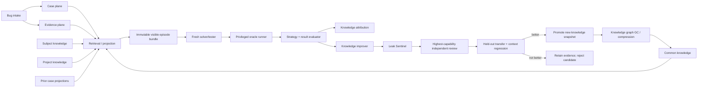
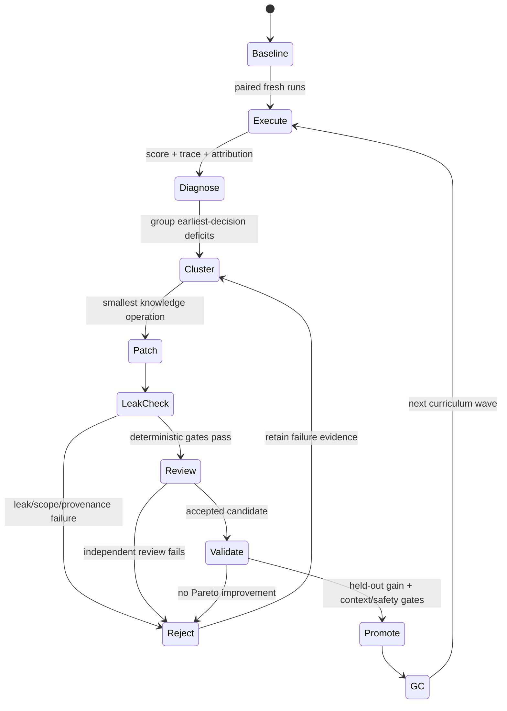

<!-- PROVENANCE (added on import, 2026-09-05) -->
<!--
Source: ~/Downloads/spipe_skill_foundry_debug_training_design_plan_2026-09-04.md
sha256 2d99dc7d585b6db2a5110c021d06dcb70a34b14cccf86a43eec7ce6e1b690411 — VERIFIED
against spipe_skill_foundry_debug_training_checksums_2026-09-04.txt on import.

TWO CAVEATS, both load-bearing:

1. The companion artifact named in the same checksums file,
   spipe_skill_foundry_debug_training_platform_2026-09-04.zip
   (sha256 0d1e0f17...b1f3f03), was NEVER DOWNLOADED and is absent from this
   machine. Everything below that describes running code refers to that zip.

2. VALIDATION_REPORT.md (2026-09-04) reports `npm run check` PASS, `npm test`
   8/8, and JSON Schema Draft 2020-12 validation across ten example types — but
   it validates the MISSING zip, so none of it can be re-verified here. Treat
   those results as claims about an artifact this repo does not hold, not as
   evidence about anything in this tree. That report also lists what it did NOT
   validate, including semantic answer-leak detection, real model/harness
   isolation, real repository or HIL execution, and integration with the
   SPipe/Simple main branches.

Repo-fit note: the artifact is JavaScript/npm with JSON Schema. This repository
requires ALL code in .spl/.shs and SDN rather than JSON/YAML (CLAUDE.md), so the
design is imported here as RESEARCH — a source of concepts to port, not a
component to install.
-->

# SPipe Skill Foundry

## Execution-grounded debugging training, evaluation, and knowledge-refinement platform

**Status:** implementation-ready design plus dependency-free reference scaffold  
**Date:** 2026-09-04  
**Primary repositories:** `ormastes/Spipe`, `ormastes/simple`  
**Initial domain pack:** debugging  
**Later domain packs:** profiling, optimization, coding/refactoring, testing/review, security, architecture  
**Design rule:** reusable knowledge is a decision aid, never an answer key

---

## 1. Executive decision

Add a fifth plane to SPipe's existing case/evidence/knowledge/retrieval architecture:

1. **Case plane** — the immutable chronology of a concrete bug.
2. **Evidence plane** — reports, dumps, logs, traces, binaries, source snapshots, reproduction files, and execution receipts.
3. **Knowledge plane** — compact common, subject, and project procedures with explicit applicability boundaries.
4. **Retrieval/projection plane** — snapshot-bound search, graph traversal, and generated provider-specific skill views.
5. **Curriculum/evaluation/refinement plane** — frozen training episodes, isolated solvers, hidden oracles, deterministic and model-assisted graders, attribution, anti-leak review, knowledge revision, compression, promotion, and garbage collection.

Call the new subsystem **SPipe Skill Foundry**. It is not model fine-tuning. It is a provider-neutral external-skill laboratory that repeatedly asks a fresh solver to diagnose and repair bugs using controlled evidence and controlled knowledge, then retains only knowledge changes that transfer to held-out cases with less or equal context.

The first implementation must be a dependency-free JavaScript SPipe core, following the repository's existing versioned-contract and exact-field-validation pattern. Simple-language providers can later accelerate indexing, graph search, statistics, and execution, but SPipe remains usable without Simple.

The most important architectural separation is:

```text
operational debugging  !=  benchmark evaluation  !=  knowledge refinement
```

Operational debugging may use every authorized clue. Evaluation receives only a frozen visible bundle. Refinement receives sanitized failure diagnostics and aggregate evidence, not the hidden answer. A solver, improver, or common-knowledge author must never be able to query the current episode's hidden oracle.

---

## 2. Current-state audit and integration constraints

### 2.1 What already exists

SPipe already contains:

- provider projections for Claude, Codex, and Gemini;
- debug and debug-analyst agents;
- a reusable debug skill with logging, IR export, query, DAP/LSP, and bootstrap commands;
- a bounded daily-debug loop;
- strict release/review contracts and receipt-based review flows;
- a dependency-free Node.js CLI and MCP server;
- a designed Knowledge Compiler with immutable snapshots, typed graph records, search providers, common-knowledge promotion, skill compilation, and virtual views.

Simple already contains:

- a canonical SDN bug database;
- `bug-add` and `bug-gen` tools;
- bug descriptions, free-form fix strategies, and investigation logs;
- a large historical bug corpus;
- executable test infrastructure and many debug-related tools.

### 2.2 Missing capabilities

The current debug material is static procedural guidance. The bug database is useful for tracking but does not yet encode:

- immutable source/build/environment identities;
- typed observations, hypotheses, experiments, or causal claims;
- content-addressed evidence manifests;
- exact reproduction bundles;
- visible versus hidden evaluation partitions;
- solver trajectories and tool-call receipts;
- prediction-before-execution;
- objective strategy scoring;
- knowledge-unit attribution and ablation;
- answer-leak prevention;
- curriculum splits and temporal holdouts;
- context-budgeted knowledge selection;
- transfer validation and garbage collection.

The Knowledge Compiler is still being implemented. Therefore Skill Foundry must use a **port boundary**:

```text
TrainingCore -> KnowledgePort

BootstrapKnowledgePort   dependency-free local manifests/search
CompilerKnowledgePort    future adapter to accepted Knowledge Compiler snapshots
```

There must be one canonical knowledge graph, not a training-only duplicate graph.

### 2.3 Compatibility decisions

- Do not hand-edit `doc/08_tracking/bug/bug_db.sdn`; retain its current canonical writer and CRC discipline.
- Introduce sidecar typed case records first, linked by stable bug ID.
- Keep large dumps, firmware images, traces, and cores out of Git. Store them in a content-addressed artifact vault; commit only manifests and small reproduction fixtures.
- Preserve existing flat CLI commands as compatibility dispatchers while adding cohesive modules under `src/training/`.
- MCP hidden-oracle resources are served by a separate privileged process or capability, never by the ordinary SPipe MCP resource handler.
- Generated history views and provider skill files are read-only projections. Canonical case and knowledge artifacts remain the only writable sources.

---

## 3. Research-derived design rules

The research does not justify unconstrained self-improvement. It supports a conservative, execution-grounded and validation-filtered system.

### 3.1 Skills help, but excess context hurts

SkillsBench reports a substantial average benefit from curated skills, but also negative-transfer cases. Its design ablations favor one to three focused skills over four or more, and compact/standard procedural guidance over comprehensive prose. SkillReducer independently reports sizeable description/body compression with preserved or slightly improved functional quality. The platform should therefore optimize **loaded decision utility per token**, not document volume.

Resulting rule:

```text
Default initial hydration: 0-3 knowledge units.
Load deeper references only after an explicit evidence or decision need.
A knowledge revision is not an improvement unless held-out utility survives
with equal or lower loaded-context cost, or the extra cost is justified by
unique safety/correctness coverage.
```

### 3.2 Improvement is sparse, not monotonic

Execution-grounded revision can improve skills, but multi-round studies show that few candidate revisions become new validation bests and that failed trajectories are especially informative. Therefore:

- every revision is a candidate, never an automatic upgrade;
- validation selects an immutable best snapshot;
- repeated no-gain rounds stop;
- failed and low-scoring trajectories are clustered by deficit;
- the system prefers editing/deleting/splitting existing knowledge before adding more.

### 3.3 Persistent knowledge has a lifecycle safety problem

A successful trajectory can still contain unsafe or brittle procedure. Once distilled, that behavior can transfer to unrelated tasks. Therefore success is insufficient for promotion. Common knowledge needs independent safety, leakage, applicability, and transfer gates before future retrieval.

### 3.4 Public historical bugs are not trustworthy sealed exams

Public coding benchmarks increasingly face contamination and weak-test problems. SPipe must assume that public Simple issues, commits, reports, and solutions may be present in model training data. Official release scores therefore require:

- private post-cutoff episodes;
- temporal splits;
- project/family holdouts;
- answer canaries;
- counterfactual and mutation-generated sibling bugs;
- adversarial tests that reject hard-coded or gold-patch imitation;
- rolling re-curation and multi-run stability checks.

Historical public bugs remain useful for training, regression, taxonomy building, and process evaluation; they are not sufficient evidence of uncontaminated debugging ability.

### 3.5 Runtime feedback is not automatically useful

DebugBench found that runtime feedback can help or hurt. Skill Foundry must reward **the least expensive discriminating observation**, not tool activity. An unnecessary full reproduction, full suite, or giant log capture is a strategy defect when existing dump/state already distinguishes the hypotheses.

### 3.6 Human learning should use retrieval and transfer

For human or human-agent training, use worked examples initially, fade guidance, require self-explanation, mix nearby bug families, revisit after delay, and test transfer rather than rereading. Human learning metrics stay separate from model benchmark metrics.

---

## 4. Goals and non-goals

### 4.1 Goals

1. Preserve complete, reproducible, auditable bug histories and artifacts.
2. Represent common, subject, project, and case-history knowledge with the same retrievable interface while preserving different authority and visibility.
3. Train an agent to decide whether current evidence is sufficient before asking for more.
4. Evaluate diagnosis, strategy, experiment prediction, causal proof, fix quality, and tests—not only final patch pass/fail.
5. Generate reproducibility, regression, and prevention tests after a correct fix.
6. Improve knowledge from failures while preventing current-case answer leakage.
7. Measure which knowledge actually helped through traces, self-report, and ablation.
8. Minimize context through progressive disclosure and graph-aware retrieval.
9. Support multiple models/harnesses through Caret/SPipe adapters.
10. Generalize the engine to profiling, optimization, coding, and other domains.

### 4.2 Non-goals

- Treating a long bug wiki as a prompt to inject wholesale.
- Automatically publishing generated common knowledge.
- Calling a case solved merely because a model guessed the gold patch.
- Requiring reproduction when existing evidence already proves the cause.
- Penalizing a solver for correctly declaring a case underdetermined.
- Allowing the evaluator to disclose hidden root-cause or fix text to the improver.
- Replacing the project issue tracker or the existing Simple bug database.
- Making semantic similarity or an LLM judge the sole source of truth.
- Claiming that repeated exposure to every historical bug proves general debugging capability.

---

## 5. Five-plane architecture



### 5.1 Ownership

**SPipe owns** schemas, policy, canonical records, snapshot identities, retrieval contracts, score calculations, capability boundaries, audit receipts, CLI/MCP surfaces, knowledge lifecycle, and provider-neutral event semantics.

**Caret/runner owns** provider sessions, model selection, worktree/container isolation, tool execution, normalized events, cancellation, resource limits, and hidden-oracle process separation.

**Simple owns** its project source, tests, bug DB, optional native providers, compiler/runtime instrumentation, firmware/HIL adapters, and domain-specific execution tools.

### 5.2 Trust zones

| Zone | Can read | Can write | Must not access |
|---|---|---|---|
| Solver | visible bundle, authorized tools, hydrated knowledge | run workspace, proposed patch/tests, run events | hidden oracle, future history, knowledge candidate drafts |
| Oracle runner | hidden verifier, visible run output, isolated repo snapshots | execution receipts only | common-knowledge canonical files |
| Evaluator | solver run, oracle receipts, rubric, sanitized hidden facts | score receipt, sanitized deficit report | solver workspace mutation |
| Knowledge improver | aggregate/deficit packets, allowed traces, current knowledge | candidate knowledge patch | raw hidden patch/root-cause text for target episodes |
| Leak Sentinel | candidate, visible/hidden manifests, provenance, canaries | leak report only | promotion capability |
| Independent reviewer | candidate, leak report, validation results | admission/rejection receipt | direct canonical publication |
| Publisher | admitted exact candidate + receipts | new immutable knowledge snapshot | candidate rewriting |

No role may both create a common candidate and unilaterally admit it.

---

## 6. Canonical information model

### 6.1 Common envelope

All mutable concepts use immutable versioned records and append-only events. A logical entity advances by creating a new version; history is never rewritten.

```text
RecordEnvelopeV1 = {
  schema,
  uid,
  version,
  created_at,
  created_by,
  content_sha256,
  source_snapshot_uid,
  visibility,
  trust_scope,
  provenance_refs[]
}
```

Unknown fields fail closed at contract boundaries. Canonical JSON or canonical SDN field order is fixed per schema. Hashes bind the exact bytes.

### 6.2 CaseRecordV1

A bug case is not a prose page. It is the stable root of observations, evidence, hypotheses, experiments, fixes, and verification.

```text
CaseRecordV1 = {
  schema, case_uid, project_uid, legacy_bug_id?,
  source_receipts[], title, severity, lifecycle_state,
  first_observed_at, normalized_at?, closed_at?,
  source_snapshot_uid, build_identity_uid, environment_identity_uid,
  symptom_uids[], failure_signature_uids[],
  evidence_manifest_uid, chronology_uid,
  reproduction_bundle_uids[],
  causal_claim_uids[], fix_claim_uids[], verification_claim_uids[],
  privacy_class, safety_class, retention_policy_uid
}
```

Lifecycle:

```text
reported -> normalized -> triaged -> investigating -> cause-supported
-> fix-candidate -> fixed-unverified -> verified -> closed
```

`blocked`, `unsafe`, `duplicate`, and `inconclusive` are explicit outcomes, not prose comments.

### 6.3 Observation, hypothesis, and experiment

```text
ObservationV1 = {
  observation_uid, case_uid, observed_at,
  source_evidence_uid, extraction_method,
  statement, confidence, falsifiability,
  source_span_or_locator, author
}

HypothesisV1 = {
  hypothesis_uid, case_uid, statement,
  mechanism_uid?, prior_probability,
  predicts[], contradicts[],
  status: active|supported|refuted|superseded,
  evidence_for[], evidence_against[]
}

ExperimentProposalV1 = {
  experiment_uid, case_uid, question,
  target_hypothesis_uids[], action,
  reproduction_level,
  preconditions, possible_outcomes[],
  predicted_probabilities,
  update_rule,
  expected_information_gain,
  estimated_cost, safety_requirements,
  stop_conditions
}
```

The predicted outcome is sealed before execution. This enables calibration scoring and prevents post-hoc storytelling.

### 6.4 EvidenceManifestV1

```text
EvidenceItemV1 = {
  evidence_uid, case_uid, kind,
  sha256, byte_size, media_type,
  captured_at, captured_by,
  source_identity, collection_command?,
  parser_uid?, parser_version?,
  trust: untrusted|quarantined|verified,
  sensitivity, encryption_ref?, retention,
  local_or_vault_locator,
  compatible_build_uids[],
  derived_from[], signature_receipt?
}
```

Kinds include report, source tree, source file, build manifest, test output, log, trace, core dump, minidump, register dump, memory dump, firmware image, ELF/PDB/DWARF, configuration, input corpus, NAND/SSD telemetry, profiler capture, packet trace, screenshot, and environment snapshot.

Artifacts are data by default. Parsing and execution require separate allowlisted capabilities.

### 6.5 ReproductionBundleV1

A reproducer is a versioned executable contract:

```text
ReproductionBundleV1 = {
  bundle_uid, case_uid, purpose,
  reproduction_level,
  repo_snapshot_uid, submodule_snapshot_uids[],
  build_identity_uid, environment_identity_uid,
  toolchain_manifest_uid,
  hardware_or_firmware_identity_uids[],
  fixture_evidence_uids[],
  setup_steps[], run_steps[], cleanup_steps[],
  seeds[], repetitions, timeout_ms,
  expected_pre_fix, expected_post_fix,
  positive_control, negative_controls[],
  safety_constraints[],
  deterministic, known_flake_rate,
  result_parser_uid, oracle_uid
}
```

### 6.6 KnowledgeUnitV1

Common knowledge is deliberately structured so it cannot silently become a case answer.

```text
KnowledgeUnitV1 = {
  schema, knowledge_uid, version,
  scope: common|subject|project,
  domain, kind,
  title, routing_description,
  trigger,
  applicability,
  exclusions,
  preconditions,
  mechanism,
  procedure_steps[],
  decision_points[],
  expected_observations[],
  failure_modes[],
  lightweight_fallback?,
  tool_requirements[],
  safety_constraints[],
  evidence_refs[],
  validation_episode_refs[],
  unique_coverage_tags[],
  estimated_token_cost,
  estimated_execution_cost,
  trust_state,
  anticipatory,
  supersedes[], conflicts_with[], extends[]
}
```

Allowed `kind` values initially:

- invariant;
- symptom-to-check map;
- evidence interpretation rule;
- hypothesis template;
- discriminating-check recipe;
- reproduction recipe;
- instrumentation/capture recipe;
- fix-pattern constraint;
- verification/prevention recipe;
- tool recipe;
- safety/stop rule.

Common knowledge must state applicability and exclusions. “Always run the full suite” and similarly unconditional heavyweight advice is invalid unless it is a final release gate, not an investigation strategy.

### 6.7 Same structure for history and common knowledge

Case history is not copied into common knowledge. Instead, a read-only projection maps a closed case to the shared retrieval shape:

```text
RetrievableKnowledgeViewV1 = {
  view_uid,
  source_kind: case_history|project|subject|common,
  source_uid,
  valid_at_snapshot,
  trigger,
  applicability,
  mechanism_summary,
  useful_checks[],
  observed_outcomes[],
  fix_pattern_summary?,
  verification_summary?,
  caveats[],
  provenance_refs[],
  visibility,
  answer_leak_risk
}
```

This gives the tester one retrieval interface while preserving authority:

```text
current case evidence
  > project knowledge
  > subject knowledge
  > pinned common knowledge
  > approved prior case projections
  > external references
```

A prior case is eligible only when its closure time is earlier than the episode cutoff and the episode's history policy admits it.

### 6.8 TrainingEpisodeV1

```text
TrainingEpisodeV1 = {
  schema, episode_uid, domain,
  source_case_uid, family_uid,
  created_at, temporal_cutoff,
  split: train|development|private_test|safety_test,
  visible_manifest_uid,
  hidden_oracle_manifest_uid,
  knowledge_snapshot_uid,
  project_knowledge_snapshot_uid?,
  history_policy_uid,
  runner_profile_uid,
  solvability:
    visible_sufficient|experiment_required|environment_required|underdetermined,
  allowed_reproduction_levels[],
  resource_budget,
  safety_policy_uid,
  deterministic, required_repetitions,
  contamination_canary_uids[],
  evaluator_policy_uid
}
```

### 6.9 SolverRunV1

```text
SolverRunV1 = {
  run_uid, episode_uid,
  model_identity, harness_identity,
  seed, effort_profile,
  exact_visible_manifest_sha256,
  exact_knowledge_snapshot_sha256,
  started_at, ended_at,
  retrieval_events[], evidence_access_events[],
  observations[], hypotheses[],
  experiment_proposals[], experiment_predictions[],
  data_requests[], causal_claim,
  patch_manifest_uid?, test_manifest_uid?,
  final_status, final_confidence,
  knowledge_attribution_response,
  tool_receipts[], resource_usage
}
```

### 6.10 ScoreReceiptV1

The score receipt binds the exact episode, run, oracle, evaluator, rubric, and all component scores. A changed test, hidden manifest, model, harness, or knowledge snapshot creates a different result.

---

## 7. Bug structuring manual: what becomes what

| Input | Transform | Canonical output | Gate | Primary owner |
|---|---|---|---|---|
| Email/issue/chat/CI alert | Preserve original and assign identity | `SourceReceiptV1` | source bytes/hash retained | intake adapter |
| Attachments/dumps/logs | quarantine, hash, classify | `EvidenceItemV1[]` | no implicit execution | evidence service |
| Reported wording | normalize without deleting source wording | symptom + observed/expected behavior | fact/inference separated | case normalizer |
| Commit/build/env details | resolve exact immutable identities | source/build/environment snapshots | no floating branch/tag | identity resolver |
| Repeated error/state | canonicalize stable and volatile portions | `FailureSignatureV1` | normalization explained | signature extractor |
| Facts from dump/log | source-bound extraction | `ObservationV1[]` | every fact cites evidence locator | analyst/extractor |
| Possible mechanisms | create alternatives | `HypothesisV1[]` | at least one falsifier each | solver |
| Current evidence inventory | assess discriminating power | sufficiency decision | oracle labels known sufficiency for eval | solver/evaluator |
| Needed next check | predict outcomes before run | `ExperimentProposalV1` | probabilities sum to one; cost/safety stated | solver |
| Executed check | immutable result receipt | `ExperimentResultV1` | exact inputs/tools/time/hash | runner |
| Supported mechanism | causal argument | `CausalClaimV1` | alternatives addressed; evidence chain complete | solver/evaluator |
| Code/config change | bind diff and rationale | `FixClaimV1` | exact base/head and changed behavior | solver |
| Small failure script/input | package exact setup/run/oracle | `ReproductionBundleV1` | pre-fix failure demonstrated | reproducer author |
| New tests | classify purpose | reproduction/regression/prevention tests | fail-to-pass + pass-to-pass + near-miss checks | test author/oracle |
| Closed case | generate read-only projection | `CaseKnowledgeProjectionV1` | closure evidence and cutoff attached | projection service |
| Reusable lesson | generalize and remove case identifiers | `KnowledgePatchV1` | leak, scope, provenance, transfer, token gates | improver |
| Accepted candidate | publish immutable snapshot | `KnowledgeSnapshotV1` | independent highest-capability admission | publisher |

### 7.1 Required investigation sequence

```text
1. Identify exact source/build/environment.
2. Inventory already available evidence.
3. Separate observations from interpretations.
4. Normalize the symptom and failure signature.
5. Retrieve at most three applicable knowledge units initially.
6. Construct competing hypotheses and explicit falsifiers.
7. Decide whether existing evidence is already sufficient.
8. If insufficient, choose the lowest-cost, safest discriminating check.
9. Predict possible results and hypothesis updates before execution.
10. Execute through a receipt-producing runner.
11. Establish a causal claim, or explicitly remain underdetermined.
12. Apply a minimal cause-addressing fix.
13. Create exact reproduction, regression, and prevention tests.
14. Run focused tests, related tests, then required whole gates once.
15. Close the case only with exact verification evidence.
16. Project history; propose reusable knowledge separately.
```

### 7.2 Reproduction ladder

Use the lowest sufficient level:

| Level | Name | Typical use |
|---|---|---|
| R0 | Offline evidence replay | Parse an existing dump/log/trace; no target rerun |
| R1 | Deterministic trace/event replay | Replay recorded events or simulator input |
| R2 | Unit/component fixture | Minimal source/input reproducer |
| R3 | Integration/system simulation | Multiple modules or services |
| R4 | Full system/HIL/firmware | Timing, hardware, power, boot, NAND, real controller |
| R5 | Field recurrence/observability | Rare production-only condition; enhanced capture |

A root cause established from R0 may still require an R2/R3 regression test after the fix. The score distinguishes **diagnostic necessity** from **post-fix prevention**.

---

## 8. Training episode construction

### 8.1 Three immutable partitions

Each episode has:

1. **Visible bundle** — exactly what the solver may inspect.
2. **Hidden oracle bundle** — root-cause proof, approved fixes, hidden tests, counterexamples, and scoring facts.
3. **Knowledge snapshot** — exact common/project/history units available to the solver.

Changing any partition creates a new episode version.

### 8.2 Visible bundle

May contain:

- original report as it existed at cutoff;
- pre-fix repository snapshot;
- pre-fix build and environment manifests;
- existing dumps, logs, traces, and reproduction inputs known at cutoff;
- authorized tools;
- pinned common/subject/project knowledge;
- prior case history allowed by chronological policy.

Must not contain:

- fix commit or later commits that reveal it;
- post-fix comments, release notes, tests, or docs;
- gold root-cause labels;
- filenames/symbol names introduced only by the fix;
- future cases or future knowledge derived from the current case;
- evaluator-only solvability evidence;
- contamination canaries.

### 8.3 Hidden oracle bundle

Contains:

- accepted causal explanation and minimal evidence chain;
- alternative valid explanations, where applicable;
- pre-fix/fixed/bad-fix snapshots;
- fail-to-pass and pass-to-pass tests;
- near-miss patches and mutation operators;
- evidence-sufficiency oracle;
- permitted solution equivalence rules;
- flaky/blocked/environment constraints;
- hidden canary tokens;
- evaluator rubric version.

The hidden oracle is not necessarily one gold patch. It must allow functionally equivalent fixes and reject implementation-specific overfitting.

### 8.4 Solvability labels

- `visible_sufficient`: present artifacts can establish the cause without target execution.
- `experiment_required`: one or more executable checks are necessary.
- `environment_required`: the next valid step requires a specific real/HIL environment.
- `underdetermined`: multiple causes remain observationally equivalent under the allowed budget.

A solver receives points for a correct `underdetermined` or `environment_required` conclusion with a minimal next-data plan. It must not be forced to invent a cause.

### 8.5 Chronological history modes

Run distinct experimental conditions:

| Condition | Available prior information | Purpose |
|---|---|---|
| N | no persistent knowledge | native model baseline |
| C | common knowledge only | common-skill effect |
| CP | common + subject/project | project specialization effect |
| CPH | CP + sanitized prior-case projections | historical retrieval effect |
| FULL-HISTORY | full authorized earlier cases/solutions | training aid only, not official clean benchmark |

Paired comparisons must hold episode, model, harness, effort, seed set, and tool policy constant.

---

## 9. Agent roles and protocol

### 9.1 Episode Curator

Creates source-bound episodes and verifies temporal visibility. It does not grade runs.

### 9.2 Solver/Tester

Receives the visible bundle. It must emit structured observations, hypotheses, sufficiency decisions, experiment predictions, cause/fix/test artifacts, and knowledge-help feedback.

### 9.3 Oracle Runner

Runs approved experiments and tests in isolated snapshots. It returns normalized receipts, not the hidden solution.

### 9.4 Strategy Evaluator

Scores the sequence of decisions and the final artifacts. It assesses what each proposed experiment would distinguish and compares predictions with actual outcomes.

### 9.5 Leak Sentinel — highest-priority adversarial role

Checks whether common knowledge or feedback contains current-case answers. It combines deterministic provenance/identifier/canary checks with independent semantic red-team review.

Reject examples:

- current bug ID, exact title, fix commit, changed line, or unique symbol;
- a rare error substring found only in the target case;
- an instruction that effectively states the hidden root cause;
- an example whose constants, path, or ordering recreate the target;
- evidence references from after the episode cutoff;
- a candidate derived from the same bug and evaluated as transfer on that bug.

Allow examples:

- the underlying ownership/lifetime invariant;
- a generic “compare producer versus consumer representation” procedure;
- an applicability-bounded dump-field interpretation rule;
- a general test pattern with different identifiers and counterexamples;
- a hardware safety stop condition.

### 9.6 Knowledge Attributor

Collects three kinds of evidence:

1. solver self-report;
2. retrieval/read/action traces;
3. controlled ablation or substitution results.

The solver is always asked:

```text
For every cited knowledge UID:
- Did you use it?
- Which exact decision did it change?
- Which evidence or action did it affect?
- Would your result likely differ without it?
- Was it misleading, redundant, too broad, or too late?
- What missing knowledge would have changed your earliest wrong decision?
```

Self-report alone never establishes utility.

### 9.7 Knowledge Improver

Receives sanitized deficit clusters and attribution data. Preferred operation order:

```text
delete stale/redundant
-> correct wrong guidance
-> narrow applicability
-> split mixed responsibilities
-> relocate project-specific content
-> merge/factor duplicates
-> improve routing/fallback
-> add new content only when no smaller operation closes the gap
```

### 9.8 Highest-capability Independent Reviewer

Reviews common candidates for correctness, generality, safety, leakage, contradiction, token economy, and evidence. The best available authorized model is required for common promotion; model identity and effort are recorded in the admission receipt. Human review can be additionally required for safety-critical knowledge.

### 9.9 Knowledge GC/Context Compiler

Builds the smallest dependency-complete retrieval bundle and emits non-destructive keep/merge/split/demote/tombstone proposals.

### 9.10 Curriculum Scheduler

Selects episodes by deficiency, novelty, spacing, family coverage, and information value. It cannot see private-test results at candidate-selection time.

---

## 10. Anti-cheat and contamination controls

### 10.1 Threat model

Leakage can occur through:

- common/project skill text;
- prior case projections;
- filenames, IDs, paths, examples, or constants;
- post-cutoff source/docs/tests;
- retrieval index metadata;
- model parametric memory;
- evaluator feedback;
- logs or caches shared across sessions;
- generated provider files;
- tool descriptions;
- accidental oracle mounting;
- same-bug validation of a same-bug-derived candidate.

### 10.2 Deterministic gates

1. Exact temporal provenance: every source has capture/commit time and hash.
2. Deny-list of current bug/fix IDs, hashes, paths, symbols, line anchors, rare strings, and canaries.
3. N-gram and normalized-fingerprint overlap against hidden facts.
4. Source-edge validation: no current/future case source for common candidate evaluation.
5. Generated-example mutation: examples must not preserve the target's distinguishing constants and topology.
6. Filesystem/capability isolation: hidden mount absent from solver namespace.
7. Cache isolation by episode/run/model/knowledge snapshot.
8. Network policy recorded and normally disabled for sealed evaluation.
9. Fresh worktree/container and fresh agent memory per official run.
10. Signed visible manifest; solver reports its exact digest.

### 10.3 Semantic gates

Two independent reviewers answer:

- Could this unit reduce the target to one unique known answer without examining evidence?
- Does the example encode the target through renamed identifiers?
- Is the advice more specific than its claimed scope/provenance supports?
- Would the unit remain useful on counterfactual sibling bugs?
- Does it prescribe the fix rather than a mechanism/check/invariant?

A red-team reviewer attempts to identify the target bug or hidden patch from the candidate alone. Confident identification is a rejection signal.

### 10.4 Parametric contamination

No wrapper can prove that a closed model never saw a public bug. Mitigations:

- private post-training-cutoff cases;
- newly generated but human-validated fault injections;
- counterfactual variants whose correct fix differs from public history;
- renamed/restructured code with changed constants and control flow;
- model cross-examination for exact memorized details;
- canary strings;
- public-training scores reported separately from sealed-release scores.

### 10.5 Feedback firewall

Evaluator feedback to the improver is a **sanitized deficit packet**:

```text
- failed rubric dimensions;
- earliest wrong decision class;
- missing/incorrect knowledge capability;
- aggregate counterexample category;
- evidence that the current unit helped/hurt;
- no root-cause text, patch lines, hidden identifiers, or unique outcome strings.
```

The improver cannot ask follow-up questions of the hidden evaluator about a specific episode.

---

## 11. Evaluation and scoring

### 11.1 Hard gates

Any of the following invalidates or caps the run regardless of total points:

- hidden-oracle access or canary disclosure;
- fabricated command, test, or result receipt;
- wrong repository/build/environment snapshot;
- unsafe or unauthorized action;
- evaluator/test tampering;
- false `PASS` when execution is blocked, flaky, missing, or inconclusive;
- unsupported causal certainty;
- patch that only hard-codes the hidden test;
- loss of mandatory pass-to-pass behavior.

### 11.2 100-point rubric

| Dimension | Points | Required evidence |
|---|---:|---|
| A. Source grounding and normalization | 8 | exact identities; observed versus inferred facts |
| B. Evidence sufficiency decision | 12 | correct use of existing evidence; correct need/no-need decision |
| C. Hypothesis quality and calibration | 10 | alternatives, priors, falsifiers, uncertainty |
| D. Discriminating strategy | 14 | information gain, cost, safety, stop rule, minimality |
| E. Prediction accuracy/calibration | 8 | sealed pre-run outcome probabilities versus result |
| F. Causal localization and proof | 14 | mechanism, evidence chain, alternatives addressed |
| G. Fix correctness and minimality | 14 | cause-addressing, safe, scoped, maintainable patch |
| H. Reproduction/regression/prevention tests | 14 | F2P, P2P, near-miss rejection, prevention invariant |
| I. Attribution, generalization, and context economy | 6 | cited helpful/harmful units; reusable lesson; token discipline |
| **Total** | **100** | |

### 11.3 Strategy adjustments

Apply only when supported by the episode's hidden sufficiency oracle:

| Condition | Adjustment |
|---|---:|
| Proves cause from already available evidence before requesting a rerun | +4 |
| Selects the lowest-cost check that separates leading hypotheses | +3 |
| Correctly declares blocked/underdetermined and requests the minimal discriminator | +2 |
| Requests data already present and discoverable in the visible manifest | -6 |
| Requests avoidable full-system reproduction before using sufficient dump/trace data | -8 |
| Uses shotgun logging/full-suite/tool calls before a discriminating question | -1 each, max -5 |
| Makes an exact-cause claim when evidence is underdetermined | -10 and causal-proof cap |
| Adds a valid post-fix reproducer after evidence-first diagnosis | no penalty; scored under tests |

The same action can be reasonable in one episode and wasteful in another. The oracle, not a global rule, decides whether existing evidence was sufficient.

### 11.4 Experiment prediction score

Before execution, the solver assigns probabilities to normalized outcomes. Use multiclass Brier score:

```text
brier = sum((p_i - y_i)^2)
prediction_score = max(0, 1 - brier / 2)
```

Also require an update map: what each outcome would do to each hypothesis. A correct lucky guess with no discriminating logic cannot receive full strategy or causal-proof credit.

For repeated flaky reproduction, score predicted outcome frequencies against observed frequencies and confidence intervals rather than one binary result.

### 11.5 Final status

```text
PASS   >= 85, no hard gate, every critical slice >= 80
LEARN  70..84, or a non-critical slice below 80
FAIL   < 70, or hard-gate failure
```

Maintain family/project/language/environment slice floors so aggregate gains cannot hide regressions.

### 11.6 Test-quality scoring

A proper test portfolio includes:

1. **Reproduction test:** fails on exact pre-fix snapshot and passes on valid fixes.
2. **Pass-to-pass tests:** preserve existing behavior.
3. **Near-miss rejection:** fails against plausible wrong fixes/hard-coded patches.
4. **Stability:** repeated execution and fixed/random seeds as appropriate.
5. **Prevention test:** asserts a broader invariant, property, metamorphic relation, static rule, or contract when justified.

Accepted execution states are `PASS`, `FAIL`, `BLOCKED`, `FLAKY`, `UNSAFE`, and `INCONCLUSIVE`. Never collapse all non-pass states into failure.

---

## 12. Knowledge refinement loop



### 12.1 Dataset splits

- **Training/mastery:** repeatable; optimizer may see scores and sanitized feedback.
- **Development:** candidate selection; no raw hidden solutions.
- **Private release test:** used only for final admission, never for iterative candidate selection.
- **Safety/adversarial:** unsafe tool use, prompt injection, poisoned trajectories, evidence tampering.
- **Retention:** previously solved cases to catch forgetting.
- **Transfer:** different project/family/language/environment.

Split by time, project, and mechanism family, not random file row alone.

### 12.2 Paired evaluation

For each selected episode and seed set:

```text
no knowledge
common only
common + project
common + project + prior history
candidate snapshot
```

Keep model, harness, effort, tools, repository, and visible evidence identical. Run multiple seeds for stochastic agents. Report mean, confidence interval, solve rate, strategy score, context tokens, tool cost, and safety events.

### 12.3 Candidate selection objective

Use a Pareto gate, not one scalar alone:

1. zero new safety/leak violations;
2. no critical-slice regression;
3. higher held-out task/strategy utility;
4. no loss of unique rare coverage;
5. lower or equal p95 loaded tokens and execution cost, unless justified;
6. stable across at least two authorized model/harness configurations for common knowledge;
7. reproducible result receipts.

One useful ranking metric after hard gates is:

```text
marginal_utility =
  (heldout_score_delta + 0.5 * transfer_delta + 0.25 * safety_delta)
  / max(1, added_p95_loaded_tokens)
```

Do not optimize this ratio across candidates that fail a hard gate or slice floor.

### 12.4 No circular validation

A candidate derived from bug X may use X for **retention**—does it preserve the lesson? It may not use X as evidence of transfer. Promotion needs other cases, synthetic counterfactuals, independent invariant proof, or future cases.

### 12.5 Stopping

Stop a refinement batch when any is true:

- target validation and slice floors pass;
- no candidate becomes a new byte-distinct validation best for the configured patience window;
- remaining errors require project knowledge rather than common knowledge;
- added context exceeds the budget without unique benefit;
- feedback begins to encode hidden-case specifics;
- execution budget is exhausted;
- evaluator disagreement remains unresolved.

“Pass all bugs” means mastery of the declared training/retention set while still passing unseen release and transfer sets. It does not mean memorizing every historical fix.

---

## 13. Anticipatory knowledge before a bug occurs

Reusable rules may be created without a historical occurrence, but they require a distinct provenance and trust state.

Sources:

- language/runtime/OS/hardware contracts;
- formal invariants and model-checking results;
- standards and authoritative manuals;
- FMEA/STPA/hazard analysis;
- static-analysis rules;
- mutation operators and fault injection;
- property-based/metamorphic tests;
- near-miss incidents;
- profiler/telemetry patterns;
- architecture constraints.

Admission path:

```text
anticipatory proposal
-> explicit invariant and applicability boundary
-> construct at least two positive and two negative synthetic scenarios
-> independent source verification
-> Leak Sentinel
-> best-model review
-> development/safety evaluation
-> provisional scoped publication
-> promote to ordinary common knowledge only after observed transfer utility
```

Anticipatory knowledge defaults to on-demand retrieval and must not crowd the Tier-0 core unless it is a rare but critical safety rule.

---

## 14. Context minimization and knowledge garbage collection

### 14.1 Progressive disclosure

| Tier | Typical content | Loading rule |
|---|---|---|
| 0 | compact safety/correctness invariants and investigation protocol | always, tightly budgeted |
| 1 | 0–3 routed decision cards | initial task match |
| 2 | detailed playbook/tool/reproduction recipe | explicit decision dependency |
| 3 | approved prior case projections | explicit history query |
| 4 | raw evidence/reference files | exact on-demand access |

Stored knowledge may be large. Loaded context must remain small.

### 14.2 Graph-aware hydration

Retrieve a seed by exact signature/term and lexical match, then traverse only required dependencies:

```text
symptom/signature
  -> applicable mechanism or invariant
  -> discriminating check
  -> required evidence interpretation/tool
  -> expected outcomes and stop rule
```

Do not hydrate neighboring history, examples, or tools merely because they are semantically similar.

### 14.3 GC metrics

For each knowledge unit and version track:

- retrieval count;
- actual read count;
- cited-use count;
- self-reported helpful/harmful count;
- leave-one-out ablation delta;
- unique episode/family coverage;
- token and tool cost;
- contradiction count;
- stale source references;
- last successful validation;
- safety-critical/rare-exception flag;
- downstream dependency count.

### 14.4 GC actions

- `keep`: unique positive value.
- `compress`: same semantics at lower cost.
- `merge`: duplicated obligations/procedure.
- `split`: broad unit helps one slice but harms another.
- `narrow`: applicability boundary missing.
- `demote`: common content is actually project/subject-specific.
- `deprecate`: superseded but needed for old snapshots.
- `tombstone`: no unique coverage or unsafe/incorrect.
- `quarantine`: suspected poisoning/leakage.

Never physically erase an admitted version from audit history. New snapshots omit or tombstone it.

### 14.5 Optimization order

Use a lexicographic objective:

1. safety and no leakage;
2. correctness and critical-slice coverage;
3. held-out utility and calibration;
4. p95 loaded-token and tool-cost reduction;
5. maintenance burden and graph simplicity.

A default starting budget is at most three initially hydrated units and a configurable p95 loaded-knowledge budget; establish the actual token threshold from SPipe telemetry rather than treating one fixed number as universal.

---

## 15. Knowledge graph

### 15.1 Node kinds

- symptom;
- failure signature;
- invariant;
- mechanism;
- hypothesis template;
- check/experiment;
- evidence kind;
- observation pattern;
- cause;
- fix pattern;
- reproduction recipe;
- test oracle;
- prevention invariant;
- tool;
- environment;
- component/layer/feature/project;
- knowledge unit;
- case-history projection;
- training episode;
- score/attribution/promotion receipt.

### 15.2 Edge kinds

```text
suggests, specializes, applies_to, excludes,
requires, consumes, produces,
discriminates, predicts, confirms, refutes,
causes, fixed_by, verified_by, prevents,
derived_from, validated_by, helped, harmed,
contradicts, supersedes, depends_on
```

Every edge has provenance, scope, validity interval, trust state, and snapshot identity.

### 15.3 Retrieval explanations

Every hydrated unit returns:

- exact query/signature match;
- graph path from target to unit;
- applicability and exclusions;
- source scope;
- trust/validation status;
- token cost;
- why it outranked alternatives;
- conflicts and fallbacks.

---

## 16. Human and pair-training mode

Use the same episodes with `learner_kind=agent|human|pair` but separate score dashboards.

Curriculum stages:

1. **Worked example:** show a complete evidence-to-cause-to-test chain.
2. **Faded example:** remove later decisions and require completion.
3. **Hinted episode:** provide knowledge routing but not solution.
4. **Cold episode:** no procedural hint beyond Tier 0.
5. **Transfer episode:** different project/language but same mechanism.
6. **Delayed retest:** revisit after increasing interval.

Require learners to state:

- observation versus inference;
- competing hypotheses;
- why the next check is discriminating;
- predicted outcomes;
- confidence before and after evidence;
- which knowledge changed the decision.

Interleave nearby bug families that are easy to confuse. Do not mix completely unfamiliar families before the base procedure is learned.

For layer/feature pair programming, record which expert contributed which hypothesis, evidence interpretation, and test. Team credit must not hide an individual inability to perform the safety-critical step.

---

## 17. General domain-pack interface

The training engine must not contain debug-specific assumptions. Define:

```text
SkillDomainPackV1 = {
  domain,
  observation_schema,
  action_ontology,
  artifact_kinds,
  episode_curator,
  oracle_adapter,
  rubric_adapter,
  knowledge_namespace,
  graph_extension,
  safety_policy,
  curriculum_generator,
  default_context_policy
}
```

Initial packs:

| Pack | Core evaluated decisions | Example oracle |
|---|---|---|
| debug | evidence sufficiency, hypothesis discrimination, cause/fix/test | pre/fixed/bad-fix execution |
| profile | measurement validity, noise, bottleneck localization | stable profiles and known injected costs |
| optimize | equivalence, bottleneck choice, resource improvement | output equivalence + time/memory/energy |
| coding/refactor | requirement understanding, design, implementation, regression | executable spec + architecture gates |
| testing/review | risk selection, test discriminativeness, finding validity | mutation/near-miss patches + hidden checks |
| security | threat model, exploitability, safe remediation | adversarial fixtures and policy checks |
| architecture | trade-off reasoning, dependency/quality constraints | scenario simulation + invariant checks |

Knowledge stays namespaced but may extend shared units such as evidence integrity, experiment design, calibration, and verification.

---

## 18. Physical layout

### 18.1 SPipe common module

```text
Spipe/
  src/training/
    contract.js
    canonical.js
    episode.js
    manifest.js
    runner_port.js
    evaluator.js
    scoring.js
    leakage.js
    attribution.js
    refinement.js
    context_compiler.js
    gc.js
    curriculum.js
    promotion.js
    domain.js
    domains/debug.js
  src/cli/training_commands.js
  mcp/protocol/training_tools.js
  mcp/protocol/training_resources.js
  schemas/training/
  policy/training/
  doc/00_llm_process/
    common_knowledge/debug/
    skill_src/debug/
    spipe/skill_foundry.md
  test/training/
```

### 18.2 Simple project sidecars

```text
simple/
  doc/08_tracking/bug/
    bug_db.sdn                       # existing canonical tracker
    case_index.sdn                   # legacy ID -> typed case UID/version
    case/<case_uid>/
      case.sdn
      chronology.sdn
      observations.sdn
      hypotheses.sdn
      experiments.sdn
      evidence_manifest.sdn
      verification.sdn
      repro/                         # only small safe fixtures/scripts
  .spipe/
    training/config.sdn
    training/splits.sdn
    knowledge/project/debug/
    artifact-vault/                  # local/cache locator; large files ignored
```

Subject knowledge may live in a reusable linked project/package:

```text
knowledge/subject/compiler/
knowledge/subject/embedded/
knowledge/subject/firmware/
knowledge/subject/nvme_ssd/
knowledge/subject/statistics/
```

### 18.3 Case artifact policy

- Small deterministic fixture: Git-eligible.
- Large/restricted dump: vault only.
- Secrets/personal data: redact/encrypt before training admission.
- Proprietary firmware/binaries: access-controlled manifest and hash; never copied into public common SPipe.
- Tool/parser output: derived evidence with exact parser version and parent hash.

---

## 19. CLI design

```text
spipe training capabilities
spipe training init <host>

spipe case admit <source>
spipe case normalize <case_uid>
spipe case evidence add <case_uid> <manifest.json>
spipe case repro add <case_uid> <bundle.json>
spipe case validate <case_uid>

spipe training episode create <spec.json>
spipe training episode validate <episode_uid>
spipe training split audit
spipe training run <episode_uid> --condition common-project-history
spipe training evaluate <run_uid>
spipe training replay <run_uid>
spipe training compare <run_uid...>

spipe knowledge attribute <run_uid>
spipe knowledge refine <batch_uid>
spipe knowledge leak-check <candidate_uid>
spipe knowledge review <candidate_uid>
spipe knowledge validate <candidate_uid>
spipe knowledge promote <candidate_uid> <admission_receipt>
spipe knowledge gc --snapshot <uid> --dry-run
spipe knowledge context-report <snapshot_uid>

spipe training report <batch_uid>
spipe training doctor
```

All mutation commands support plan/dry-run where meaningful and return revision receipts. Compatibility aliases may remain flat in the current CLI, but domain logic belongs in modules.

---

## 20. MCP resources and tools

### 20.1 Public/read-authorized resources

```text
spipe://training/snapshots/{snapshot_uid}
spipe://training/episodes/{episode_uid}/visible
spipe://training/runs/{run_uid}/trace
spipe://training/runs/{run_uid}/score
spipe://training/batches/{batch_uid}/report
spipe://knowledge/{snapshot_uid}/units/{knowledge_uid}
spipe://knowledge/{snapshot_uid}/graph?...bounded query...
spipe://cases/{case_uid}/history-projection
```

Every page is snapshot-bound and deterministically paged.

### 20.2 Privileged oracle surface

Use a separate capability/transport:

```text
spipe-oracle://episodes/{episode_uid}/manifest
spipe-oracle://runs/{run_uid}/execute
spipe-oracle://runs/{run_uid}/grade
```

Ordinary MCP discovery must not reveal the existence, names, sizes, or paths of hidden items. Authorization errors must not become an oracle through timing or differing messages.

### 20.3 Tools

```text
spipe_training_episode_get_visible
spipe_training_knowledge_search
spipe_training_evidence_read
spipe_training_hypothesis_record
spipe_training_experiment_propose
spipe_training_experiment_execute
spipe_training_submit
spipe_training_score_read
spipe_training_attribution_submit
```

Tool schemas use exact required fields and `additionalProperties:false`. Tool output includes source/receipt IDs so the trajectory is attributable.

---

## 21. Events and observability

Canonical event types:

```text
episode.created
episode.visibility_rejected
run.started
knowledge.retrieved
knowledge.read
evidence.opened
observation.recorded
hypothesis.updated
experiment.proposed
experiment.prediction_sealed
experiment.executed
cause.submitted
patch.submitted
tests.submitted
run.finished
score.issued
attribution.issued
knowledge.patch_proposed
knowledge.leak_rejected
knowledge.review_admitted
knowledge.validation_failed
knowledge.promoted
knowledge.deprecated
knowledge.tombstoned
```

Each event carries run/episode/snapshot IDs, monotonic sequence, timestamp, actor, input/output hashes, and authorization receipt where needed. Free-form provider logs are retained separately and normalized into these events.

Metrics:

- solve/pass rate and rubric dimensions;
- evidence-first rate;
- unnecessary reproduction/data-request rate;
- average and p95 time/tool calls/tokens to first discriminating check;
- prediction Brier score/calibration;
- causal-proof accuracy;
- reproducer F2P/P2P/near-miss/stability rates;
- knowledge retrieval/read/citation/ablation utility;
- context tokens per solved episode;
- common/project/history marginal gains;
- negative-transfer rate;
- leakage/safety rejections;
- reviewer disagreement;
- knowledge graph size, duplicate load, tombstone rate, and stale-reference rate.

---

## 22. Security, privacy, and safety

1. Treat reports and artifacts as untrusted input, including prompt injection in logs/source/comments.
2. Never execute an attachment directly from intake.
3. Quarantine, hash, classify, and scan before parsing.
4. Run parsers and reproducers under least privilege, resource bounds, and network policy.
5. Separate proprietary/private/project/common visibility at storage, index, MCP, cache, and generated-view layers.
6. Redact secrets and personal data before episode admission; retain a signed redaction map only in an authorized vault.
7. Bind firmware/HIL actions to device ID, image compatibility, rollback, power/safety limits, and stop conditions.
8. Never let a training agent disable watchdogs, integrity checks, or safety features merely to obtain a score unless an explicitly authorized safe simulation profile permits it.
9. Sign score, review, and promotion receipts; reject expired, wrong-head, or wrong-snapshot receipts.
10. Poisoned or unsafe successful trajectories go to quarantine, not knowledge refinement.

---

## 23. Implementation plan

### Wave 0 — freeze contracts and threats

Deliver:

- threat model and trust zones;
- exact V1 schemas;
- canonical hashing;
- capability matrix;
- score policy and hard gates;
- tiny synthetic fixtures;
- negative tests for hidden path/canary/provenance leakage.

Exit gate: deterministic same-input/same-hash behavior, exact-field rejection, and no solver path to oracle bytes.

### Wave 1 — typed case/evidence/reproducer sidecars

Deliver:

- `case_index.sdn` adapter for existing Simple bug IDs;
- case/evidence/reproduction records;
- content-addressed vault manifest;
- R0 offline evidence parser and R2 fixture runner;
- migration/import report without changing legacy bug semantics.

Exit gate: one real historical Simple bug can be reconstructed from exact pre-fix source, evidence, and a verified reproducer; legacy `bug-add`/`bug-gen` behavior remains unchanged.

### Wave 2 — frozen episodes and scoring

Deliver:

- visible/hidden/knowledge manifests;
- temporal-cutoff auditor;
- solver-run event log;
- oracle runner;
- score receipt and Brier calculation;
- F2P/P2P/near-miss/stability checks;
- blocked/flaky/inconclusive state handling.

Exit gate: deterministic replay of at least five synthetic and five historical cases with human-audited scores.

### Wave 3 — Caret/provider runner integration

Deliver:

- adapters for Claude, Codex, Gemini, Kimi, and generic terminal harness;
- fresh-session/worktree/container execution;
- paired condition runner;
- resource/token/tool telemetry;
- normalized events and cancellation.

Exit gate: same episode/knowledge snapshot runs across at least two model families and two harness paths with comparable receipts.

### Wave 4 — anti-cheat and private evaluation

Deliver:

- deterministic leak scanner;
- semantic Leak Sentinel protocol;
- canaries and private mounts;
- temporal/project/family split auditor;
- counterfactual sibling generator;
- private post-cutoff episode pipeline;
- feedback firewall.

Exit gate: seeded answer leaks are rejected; solver cannot infer hidden resource names; same-bug circular validation is impossible by schema/policy.

### Wave 5 — attribution, refinement, and GC

Deliver:

- mandatory helpful-content questionnaire;
- retrieval/read/action attribution;
- top-unit leave-one-out ablation;
- deficit clustering;
- knowledge patch operations;
- Pareto validation;
- compression and GC proposals;
- highest-capability independent review/admission.

Exit gate: at least one candidate improves held-out score without increased p95 context, and at least one harmful/redundant candidate is correctly rejected or deleted.

### Wave 6 — Knowledge Compiler integration

Deliver after the relevant Knowledge Compiler ports are accepted:

- `CompilerKnowledgePort`;
- typed graph edges and snapshot search;
- generated Claude/Codex/Gemini/agents skills;
- read-only MCP/materialized views;
- transactional common promotion and project override/extends.

Exit gate: bootstrap and compiler ports produce semantically equivalent retrieval bundles and provider projections from one canonical source.

### Wave 7 — domain packs and human curriculum

Deliver:

- profiling and optimization packs first;
- coding/refactor and review packs;
- human worked/faded/transfer/delayed modes;
- pair-expert attribution;
- cross-domain shared experiment-design knowledge.

Exit gate: domain-specific rubrics work through the same core contracts with no debug-only branch in orchestration.

---

## 24. Parallel agent ownership

| Lane | Owns | Must not edit |
|---|---|---|
| A. Contracts/security | schemas, IDs, canonicalization, capabilities | domain scoring logic |
| B. Case/evidence | sidecars, vault manifests, migration | hidden oracle policy |
| C. Runner/oracle | isolation, execution, receipts | common knowledge |
| D. Scoring | rubric, calibration, test quality | solver prompts/skills |
| E. Leak/safety | deterministic and semantic gates | candidate content |
| F. Knowledge/refinement | units, patches, attribution, GC | release/private oracle |
| G. CLI/MCP | dispatch, schemas, resources | canonical domain behavior |
| H. Simple integration | bug DB adapter, tests, instrumentation | SPipe common contracts |
| I. Docs/specs | manuals, SSpecs, trace matrix | implementation claims without evidence |

One merge owner controls shared contract files and snapshot schemas. Sidecar agents publish interface proposals before implementation and use isolated worktrees.

---

## 25. Verification plan

### 25.1 Contract tests

- unknown/missing/malformed fields fail;
- canonical hash stable across process/platform;
- path traversal and symlink escape rejected;
- timestamp/cutoff and hash mismatch rejected;
- wrong-snapshot score/promotion receipt rejected.

### 25.2 Episode isolation tests

- hidden paths absent from solver namespace;
- cache keys include episode/run/knowledge/model/harness;
- no hidden filename/size/timing oracle;
- canary never appears in run output;
- future commit/docs/tests excluded.

### 25.3 Evaluator tests

- evidence-sufficient solver rewarded for R0 reasoning;
- unnecessary R4 request penalized;
- legitimate R4-only firmware problem not penalized;
- underdetermined answer rewarded when correct;
- lucky exact guess capped without causal proof;
- equivalent correct patch accepted;
- gold-shaped hard-coded patch rejected;
- flaky result remains FLAKY, not PASS/FAIL.

### 25.4 Knowledge tests

- same-bug-derived candidate cannot count same bug as transfer;
- project path/symbol in common candidate rejected;
- generic invariant with valid scope accepted;
- broad rule causing negative transfer is split/narrowed;
- top-unit ablation matches attribution within tolerance;
- compression preserves triggers, obligations, safety, and output contract;
- stale provider projection fails build verification.

### 25.5 End-to-end SSpec scenarios

1. Diagnose from an existing dump without rerun.
2. Choose a minimal reproducer when dump is insufficient.
3. Escalate safely to firmware/HIL with exact image/device identity.
4. Correctly report underdetermined evidence.
5. Reject a leaked common skill.
6. Improve a weak skill from failures and reject a non-improving edit.
7. GC redundant knowledge while preserving a rare safety exception.
8. Transfer a general compiler rule to a different project/language.
9. Compare common versus project versus history contribution.
10. Run a human faded-example and delayed-retention episode.

---

## 26. Acceptance criteria

- **AC-1:** Every admitted bug has stable case, source, source/build/environment, evidence, and chronology identities.
- **AC-2:** Reproduction files and large artifacts are hash-bound, safe, and reproducible or explicitly blocked.
- **AC-3:** Common, subject, project, and case-history knowledge share one retrieval interface without sharing authority.
- **AC-4:** Current-episode hidden facts cannot enter visible knowledge, history, index metadata, cache, or feedback.
- **AC-5:** A solver must make and seal an evidence-sufficiency decision before requesting expensive reproduction.
- **AC-6:** Scoring rewards existing-evidence use and minimally discriminating checks, while treating post-fix reproducer creation separately.
- **AC-7:** A correct blocked/underdetermined result with a minimal next-data strategy can pass the relevant reasoning gates.
- **AC-8:** Fix evaluation accepts equivalent solutions and rejects shortcut/hard-coded solutions through near-miss and mutation tests.
- **AC-9:** Every solver submits knowledge-help attribution; promotion uses trace and ablation evidence in addition to self-report.
- **AC-10:** Common promotion requires deterministic leak/provenance gates, independent highest-capability review, held-out transfer, slice floors, and context regression checks.
- **AC-11:** Candidate evolution is validation-filtered and stops after no gain; it never overwrites the current best snapshot.
- **AC-12:** Knowledge refinement prioritizes deletion, correction, narrowing, splitting, relocation, and factoring before addition.
- **AC-13:** Context hydration is progressive and graph-aware, initially bounded to at most three routed units by default.
- **AC-14:** GC is non-destructive, snapshot-bound, explainable, and preserves rare safety/unique coverage.
- **AC-15:** Public historical scores are labeled as contamination-prone; official release uses private/post-cutoff/counterfactual evidence.
- **AC-16:** Multiple model/harness conditions are supported through normalized provider-neutral events.
- **AC-17:** The core remains dependency-free and does not wait on unfinished Knowledge Compiler waves.
- **AC-18:** Existing SPipe CLI/MCP and Simple bug DB workflows remain compatible during sidecar migration.
- **AC-19:** Profiling, optimization, and coding packs use the same engine through `SkillDomainPackV1`.
- **AC-20:** Human mode implements worked examples, fading, self-explanation, interleaving, transfer, and delayed retrieval with separate metrics.

---

## 27. Initial deliverable cut

The smallest useful production increment is not the full self-improvement loop. It is:

1. V1 contracts and threat model.
2. Sidecar import of 10 carefully selected Simple bugs.
3. Exact evidence/reproduction bundles for those bugs.
4. Frozen visible/hidden manifests.
5. A deterministic solver-run/score format.
6. One evidence-sufficient R0 case, one R2 case, one integration case, one environment-required case, and one underdetermined case.
7. A no-knowledge/common/common+project paired runner.
8. Deterministic leak checks plus an independent semantic reviewer protocol.
9. A read-only report showing score, context, tool cost, attribution, and proposed knowledge edits.
10. No automatic promotion yet.

This cut produces trustworthy data for deciding how the later improver and GC should behave.

---

## 28. Reference-scaffold boundary

The accompanying scaffold implements only:

- sample V1 JSON Schemas;
- a deterministic reference score calculator;
- a deterministic first-line leak/provenance scanner;
- a context-GC proposal engine;
- a tiny CLI and tests;
- example episode, knowledge, run, and hidden oracle inputs.

It deliberately does **not** claim:

- semantic answer-leak detection;
- repository/container isolation;
- real artifact-vault storage;
- Simple SDN migration;
- Caret/provider execution;
- highest-model review brokerage;
- Knowledge Compiler integration;
- production security certification.

Those are implementation waves, not simulated successes.

---

## 29. Research references

The 2026 agent-skill papers below are mostly recent preprints. They are useful design evidence, not universal or independently replicated laws.

1. **SkillsBench: Benchmarking How Well Agent Skills Work Across Diverse Tasks**, arXiv:2602.12670. <https://arxiv.org/abs/2602.12670>
2. **SkillRevise: Improving LLM-Authored Agent Skills via Trace-Conditioned Skill Revision**, arXiv:2606.01139. <https://arxiv.org/abs/2606.01139>
3. **Rethinking Self-Evolving Agent Skills: Feedback Dynamics over Multiple Rounds**, arXiv:2608.02636. <https://arxiv.org/abs/2608.02636>
4. **Practice Makes Unsafe: Skill Misevolution in Self-Improving LLM Agents**, arXiv:2608.12851. <https://arxiv.org/abs/2608.12851>
5. **SkillReducer: Optimizing LLM Agent Skills for Token Efficiency**, arXiv:2603.29919. <https://arxiv.org/abs/2603.29919>
6. **SkillZip: Evaluation-Free Skill Compression for Self-Evolving Agents**, arXiv:2608.11079. <https://arxiv.org/abs/2608.11079>
7. **Graph-of-Skills: Dependency-Aware Structural Retrieval for Agent Skill Libraries**, arXiv:2604.05333. <https://arxiv.org/abs/2604.05333>
8. **GenericAgent: A Token-Efficient Self-Evolving LLM Agent**, arXiv:2604.17091. <https://arxiv.org/abs/2604.17091>
9. **DebugBench: Evaluating Debugging Capability of Large Language Models**, arXiv:2401.04621. <https://arxiv.org/abs/2401.04621>
10. **REAP: Automatic Curation of Coding Agent Benchmarks from Interactive Production Usage**, arXiv:2604.01527. <https://arxiv.org/abs/2604.01527>
11. **Why SWE-bench Verified no longer measures frontier coding capabilities**, OpenAI, 2026-02-23. <https://openai.com/index/why-we-no-longer-evaluate-swe-bench-verified/>
12. Karpicke & Blunt, **Retrieval Practice Produces More Learning than Elaborative Studying with Concept Mapping**, Science 331, 2011. <https://doi.org/10.1126/science.1199327>
13. Chi et al., **Self-Explanations: How Students Study and Use Examples in Learning to Solve Problems**, Cognitive Science 13, 1989. <https://doi.org/10.1207/s15516709cog1302_1>
14. Latimier et al., **A Meta-Analytic Review of the Benefit of Spacing out Retrieval Practice Episodes on Retention**, Educational Psychology Review, 2021. <https://doi.org/10.1007/s10648-020-09572-8>
15. Birnbaum et al., **Why Interleaving Enhances Inductive Learning: The Roles of Discrimination and Retrieval**, Memory & Cognition, 2013. <https://doi.org/10.3758/s13421-012-0272-7>

---

## 30. Final recommendation

Implement Skill Foundry as a conservative evidence-and-evaluation system first, not as an autonomous knowledge writer. The correct flywheel is:

```text
better frozen episodes
-> better causal/strategy evaluation
-> better attribution
-> smaller knowledge edits
-> stronger anti-leak review
-> held-out transfer
-> less context
```

The wrong flywheel is:

```text
more bug history
-> longer common prompt
-> same bugs score higher
-> publish everything
```

SPipe should optimize for a solver that can extract the maximum justified conclusion from the evidence already present, ask for the minimum additional information when necessary, prove the cause, fix it safely, and leave behind tests and compact reusable decision knowledge—not a solver that merely recognizes historical answers.
