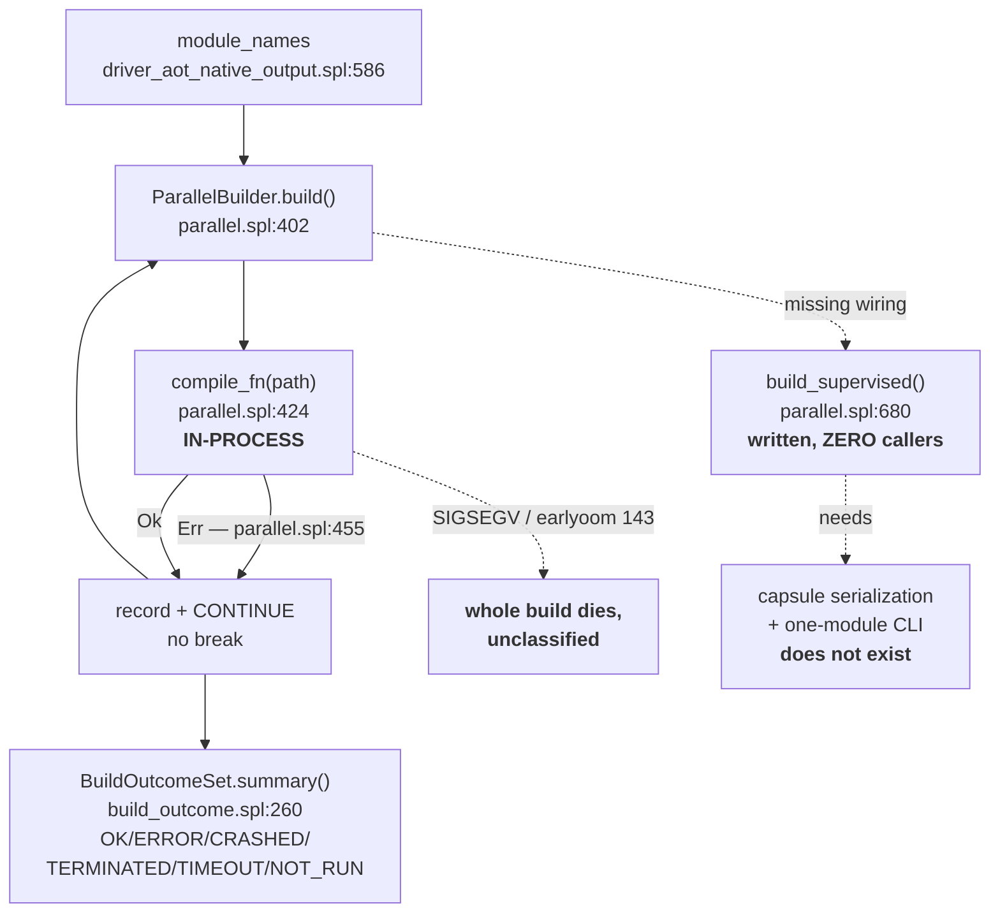

# TL;DR — Unstable Mode, Build Side

**Run-to-end and the six outcome classes are ALREADY DONE. Only process
isolation is missing, and it is blocked on a precondition.**

| Q | answer |
|---|---|
| 1. ERROR stops build? | **No.** `parallel.spl:455-462` records and continues; full census produced. |
| 2. Own process? | **No.** `parallel.spl:424` is a direct call — one SIGSEGV kills the build. |
| 3. earlyoom SIGTERM? | Build dies unclassified. Classifier exists (`build_outcome.spl:106`) but only on the unwired path. 143 is never a failure (`:75-79`). |
| 4. Outcome type? | **Exists:** `BuildUnitOutcome` / `BuildOutcomeSet`, `build_outcome.spl` (`e89f0c6f94a`). |
| 5. No dep model? | **Confirmed still true** — `needs_recompile` and `interface_digest_of` have zero call sites. |

Plan: P0 fix suspected `ParallelBuildConfig` arity break at
`driver_aot_native_output.spl:667`; P1 use `ParallelBuildConfig.bootstrap()`;
P2 decide if capsules serialize; P3 wire `build_supervised` only if P2 passes;
P4 crash fixture. Full detail: `unstable_mode_build_side.md`.
