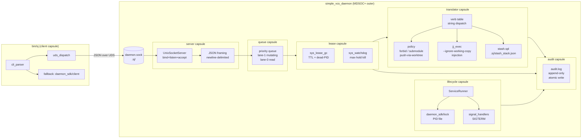

# sj VCS Service — Architecture Design

**Status:** Phase-3 draft (2026-04-26). Supersedes none; referenced by Phase-4 spec.
**Owners:** Phase-3 architect agent. Next step: Phase-4 BDD spec writer.

---

## Summary

`sj` is a per-repo VCS service consisting of two processes: a persistent background daemon
(`simple_vcs_daemon`) and a thin CLI front-end (`bin/sj`). The daemon serializes every jj/git
mutation through a lease-based queue, preventing the parallel-agent `.git/index.lock` and
`working_copy.lock` contention that has caused lost work (see Background). Read-only operations
bypass the queue via a `--ignore-working-copy` fast lane. A git-CLI mimic surface (`sj git
commit`, `sj git checkout -b`, etc.) translates git porcelain to jj idioms so existing muscle
memory and scripts migrate without retraining. The service is built on a new reusable
`std.service` daemon base that other Simple daemons can adopt.

---

## Goals

- Eliminate `.git/index.lock` and `working_copy.lock` conflicts in parallel-agent workflows.
- Serialize all jj/git mutations through a single queue with typed leases and liveness detection.
- Expose jj-native and git-mimic CLI surfaces under one binary (`bin/sj`).
- Provide a reusable `std.service` daemon base (PID file, UDS JSON protocol, priority queue,
  graceful SIGTERM shutdown) for future Simple daemons.
- Migrate all in-tree callers of `gg` and ad-hoc `jj`/`git` shell calls to `sj`.

## Non-Goals

- Not a git hosting server; not a remote VCS proxy.
- Not a multi-repo coordinator; one daemon per working copy.
- Does not replace jj's own operation log; it wraps it.
- Does not provide a TUI (no `jj split` interactive UI; that remains a raw jj call).

---

## Background

Two persistent pain points drove this design:

1. **Parallel-agent lock collisions.** Multiple Claude Code agents running concurrently each
   invoke `jj` or `git` directly. jj 0.32.0 takes `flock(LOCK_EX)` on `working_copy.lock`
   even for read operations (without `--ignore-working-copy`). `git` uses `.git/index.lock` as
   a non-advisory exclusive write barrier. Collisions produce cryptic failures, orphaned lock
   files, and occasionally corrupt jj operation logs. Memory entries
   `feedback_push_via_worktree.md`, `feedback_submodule_race_parallel_dev.md`, and
   `feedback_jj_submodule_gitlinks.md` document the resulting workarounds that accumulated.

2. **Daemon PID-file leak anti-pattern.** Existing Simple daemons (`test_daemon`, `task_daemon`)
   built on `daemon_sdk` do not call `release_daemon_lock` on clean exit, leaving stale PID
   files that block restarts. The service base fixes this by design.

---

## MDSOC+ Outer Capsule Diagram

The daemon is a userland service and therefore follows MDSOC+ (MDSOC outer capsules + ECS
business layer per `doc/04_architecture/mdsoc_architecture_tobe.md`).



---

## ECS Component & System Table

### Entities and Components

| Entity | Component | Data fields | Owning capsule |
|--------|-----------|-------------|----------------|
| `Request` | `RequestMeta` | `id: text, method: text, params: text, client_pid: i64, enqueued_at_ms: i64` | queue |
| `Request` | `LeaseKind` | `Mutating \| Read` | queue |
| `Lease` | `LeaseMeta` | `id: text, holder_pid: i64, acquired_at_ms: i64, ttl_ms: i64` | lease |
| `Lease` | `LeaseKind` | `Mutating \| Read` | lease |
| `Operation` | `OpMeta` | `request_id: text, lease_id: text, started_at_ms: i64, child_pid: i64` | lease |
| `Operation` | `OpResult` | `exit_code: i32, stdout: text, stderr: text, completed_at_ms: i64` | lease |

### Systems (single-threaded poll loop, run each tick)

| System | Reads | Writes | Cadence | Capsule |
|--------|-------|--------|---------|---------|
| `sys_accept` | UDS server fd (non-blocking) | enqueues `Request` entities | every tick | server |
| `sys_dequeue` | queue; current exclusive `Lease` count | creates `Operation`; acquires `Lease` | every tick | queue |
| `sys_lease_gc` | `LeaseMeta` (holder_pid, acquired_at_ms + ttl_ms) | deletes stale `Lease`+`Operation`; emits audit event | every tick | lease |
| `sys_watchdog` | `OpMeta` (started_at_ms, child_pid), `ServiceConfig.max_hold_ms` | `rt_process_kill`; populates `OpResult`; emits audit event | every tick | lease |
| `sys_respond` | `OpResult` | sends JSON response to client UDS fd; deletes `Operation` + `Lease` | every tick | server |
| `sys_audit` | audit event queue | appends to `.sj/audit.log` (atomic tmp+rename) | every tick | audit |

---

## Module Structure

### Service Base (`src/lib/nogc_sync_mut/service/`)

Extends `daemon_sdk` — does not replace it. The file-poll IPC transport is swapped for UDS;
lock + cycle machinery are reused verbatim.

| File | Role |
|------|------|
| `uds_externs.spl` | Declares 5 new Rust FFI externs (see Wire Protocol section). **Critical path: must be added first by Phase-5 I-A, followed by bootstrap rebuild.** |
| `uds_server.spl` | `UnixSocketServer` class: `bind_and_listen`, non-blocking `accept`, `send`, `recv`, `close`. Shaped after `tcp.spl` bind/accept pattern. |
| `queue.spl` | Two-lane priority FIFO over `common/queue/priority.spl`. Lane 1 = mutating (exclusive lease needed), lane 0 = read (shared lease). FIFO ordering preserved within each lane. |
| `lease.spl` | `Lease` entity + components + `sys_lease_gc`. Ghost-reclaim rule: `lsof` empty AND mtime > 30 s AND no live daemon lease for repo. Scans `.git/worktrees/*/index.lock` too. |
| `watchdog.spl` | `sys_watchdog`: SIGTERM at TTL expiry; SIGKILL after 5 s grace; emits `MAX_HOLD_EXCEEDED` typed error. |
| `audit.spl` | Append-only structured log. Fields per line: `ts_iso, event_type, lease_id, pid, verb, detail`. |
| `service_runner.spl` | `ServiceRunner` top-level class. Composes lock + UDS server + queue + ECS world. Registers `release_daemon_lock` in BOTH signal handler AND normal `handle_stop` path (fixes anti-pattern). |
| `mod.spl` | Re-exports public surface. |

### VCS Daemon (`src/app/sj_daemon/`)

| File | Role |
|------|------|
| `main.spl` | Entry point. Instantiates `ServiceRunner` with `VcsHandler`. Accepts `--max-hold` CLI override. |
| `translator.spl` | String-table dispatch: array of `VerbEntry{git_verb, flags_pattern, classification, handler_id, lease_kind, ttl_tier}`. Handlers keyed by `handler_id`. See R-D Canonical Translation Table in state.md. |
| `policy.spl` | Forbid-list pre-check (returns typed error before queue entry). Submodule warn+auto-pin. Push-via-worktree `--via-worktree` flag. |
| `jj_exec.spl` | Thin wrapper over `mcp/jj/jj_runner.spl`. On read-lane calls: appends `--ignore-working-copy --no-pager --color never`. On mutating calls: `--no-pager --color never` only. |
| `stash.spl` | Reads/writes `.sj/stash_stack.json`. Schema: `[{id, commit_id, description, saved_at}]`. |

### CLI Client (`src/app/sj/`)

| File | Role |
|------|------|
| `cli_parser.spl` | Parses three forms: jj-native (`sj describe`), git-mimic (`sj git commit`), raw passthrough (`sj raw jj|git`), and shorthand (`sj push`). Determines `LeaseKind` before any I/O. |
| `main.spl` | `sj_dispatch`: connect to daemon UDS socket; if not running, fall back to in-process call via `daemon_sdk/client.spl` + translator. Exit code passed through verbatim. |

---

## Wire Protocol

Transport: Unix domain socket at `.sj/daemon.sock`. Framing: newline-delimited JSON.

### Request (client → daemon)

```json
{
  "id": "req-<uuid>",
  "method": "exec",
  "params": {
    "argv": ["git", "commit", "-m", "fix typo"],
    "repo_path": "/home/user/myrepo",
    "lease_kind": "mutating"
  },
  "client_pid": 12345
}
```

Special method values: `"exec"` (normal op), `"stop"` (shutdown), `"status"` (health check).

### Response (daemon → client)

```json
{
  "id": "req-<uuid>",
  "result": {
    "stdout": "...",
    "stderr": "...",
    "exit_code": 0
  }
}
```

### Error Taxonomy

| Error type | Exit code | stderr prefix | When |
|------------|-----------|---------------|------|
| `BUSY` | **75** (`EX_TEMPFAIL`) | `ERROR[BUSY]: lease <id> held by pid <pid>, expires <iso8601>` | Exclusive lease currently held |
| `MAX_HOLD_EXCEEDED` | 75 | `ERROR[MAX_HOLD_EXCEEDED]: op killed after <ms>ms` | Watchdog fired |
| `READ_TIMEOUT` | 75 | `ERROR[READ_TIMEOUT]: read op exceeded 5s` | Read TTL expired |
| `FORBIDDEN` | 1 | `ERROR[FORBIDDEN]: <reason>. Use: <alternative>` | Forbidden verb (force-push, bare checkout, etc.) |
| `SUBMODULE_WARN` | 0 (warning, not error) | `WARN[SUBMODULE]: ...` | Submodule mutation; emitted before auto-pin |
| `DAEMON_DOWN` | 75 | `ERROR[DAEMON_DOWN]: daemon not running at <socket>` | Fallback path unavailable |

**BUSY JSON wire form:**
```json
{
  "id": "req-<uuid>",
  "error": {
    "code": "BUSY",
    "lease_id": "lease-abc",
    "holder_pid": 9876,
    "expires_at": "2026-04-26T12:34:56Z"
  }
}
```

Exit code 75 is distinct from jj's exit codes (1 = user error, 2 = internal, 101 = panic).
`sync.spl`'s `exit_code == 0` branch is unaffected. Retry-on-busy callers match `ERROR[BUSY]:`.

---

## Lease State Machine

```
        ┌──────────────────────────────────────────────────────────────┐
        │                                                              │
        ▼                                                              │
    [Idle]                                                             │
        │                                                              │
        │  request dequeued, lease_kind=Mutating                       │
        │  (no live exclusive lease exists)                            │
        ▼                                                              │
  [ExclusiveHeld]──────────────────────────────────► [Reclaiming] ────┘
        │  op completes normally        holder_pid dead OR TTL elapsed
        │
        │  op completes normally
        ▼
    [Idle]
        │
        │  request dequeued, lease_kind=Read
        ▼
  [SharedHeld] (multiple concurrent SharedHeld leases allowed)
        │  op completes OR TTL (5s) elapsed
        ▼
    [Idle / back to SharedHeld if others remain]

  [ExclusiveHeld] ──── max_hold_ms exceeded ────► [Killing]
        │                                              │ SIGTERM; 5s grace; SIGKILL
        │                                              ▼
        │                                    [Reclaiming]
        │                                              │ rm index.lock if ghost
        │                                              │ log RECLAIMED/KILLED
        └──────────────────────────────────────────────┘
```

State transitions:
- **Idle → ExclusiveHeld**: dequeue mutating request, acquire exclusive lease, spawn child op.
- **Idle → SharedHeld**: dequeue read request, acquire shared lease, run jj (--ignore-working-copy).
- **ExclusiveHeld → Idle**: child exits normally, release lease, respond to client.
- **ExclusiveHeld → Reclaiming**: `sys_lease_gc` detects dead PID or TTL elapsed.
- **ExclusiveHeld → Killing**: `sys_watchdog` detects max-hold breach.
- **Killing → Reclaiming**: SIGKILL confirmed, cleanup starts.
- **Reclaiming → Idle**: ghost index.lock removed, audit written, lease deleted.

---

## Translation Layer

The translator uses a static `VerbEntry` string table (see R-D Canonical Translation Table in
`.sstack/jj-wrapper-daemon/state.md`). Dispatch strategy:

1. **Pre-queue forbid check** (policy.spl): if verb matches forbid-list, return `ERROR[FORBIDDEN]`
   immediately without entering queue. Forbidden verbs: `push --force`, bare `push`, bare
   `checkout`, `filter-branch`, and `rebase -i` (see D-1).

2. **Verb-level lease classification** (translator.spl): lease class is resolved from the verb
   row in the string table *before* full argument parsing, so lease acquisition is never delayed.

3. **Classification handlers**:
   - `direct_jj`: single `jj <mapped-verb> <args>` call.
   - `multi_step`: two or more sequential jj calls within the same exclusive lease.
   - `jj_with_flags`: single jj call with flag remapping.
   - `raw_passthrough`: `shell("git <verb> <args>")` under the appropriate lease class. One shared
     handler for ~40 git plumbing verbs; lease class read from string table row.

4. **Special-case handlers**:

   | sj verb | Handler notes |
   |---------|---------------|
   | `sj git commit -m "msg"` | `jj describe -m "msg" && jj new` (two jj calls, one exclusive lease) |
   | `sj git checkout -b <br> [base]` | `jj new <base> && jj bookmark create <br> -r @` |
   | `sj git stash` | `jj new @-`; stash commit ID saved to `.sj/stash_stack.json` |
   | `sj git stash pop` | `jj rebase -s <stash_id> -d @`; pop stash_stack.json |
   | `sj git rebase -i` | `ERROR[FORBIDDEN]`: jj arrange not in 0.32.0; suggest `sj split` / `sj squash --into` / `sj rebase --onto` |
   | `sj push` (shorthand) | `jj bookmark set main -r @- && jj git push --bookmark main` (two jj calls) |
   | `sj git push --via-worktree` | Invokes push-via-worktree path (D-7 opt-in) |
   | `sj git submodule <mut>` | raw-passthrough + warn + auto-pin within exclusive lease (D-8) |

5. **Read-bypass injection** (jj_exec.spl): verbs in the read lane automatically receive
   `--ignore-working-copy --no-pager --color never`. Canonical read-lane verb list:
   `log`, `status`, `diff`, `show`, `op log`, `op show`, `evolog`,
   `file annotate`, `file list`, `file show`, `bookmark list`, `config list`.

---

## Failure Modes & Recovery

### Ghost `.git/index.lock`

**Detection rule (D-6):** ALL three must be true: (a) `lsof .git/index.lock` returns empty,
(b) mtime > 30 s ago, (c) no live daemon lease references a git-interacting verb. Also scan
`.git/worktrees/*/index.lock`. On match: `rm` the lock file, log `GHOST_LOCK_RECLAIMED`.

**Timing:** checked at daemon startup AND after any lease reclaim for a git-interacting verb.

### Max-Hold Kill

`sys_watchdog` fires when `now - acquired_at_ms > max_hold_ms` (default 120 s). Sends SIGTERM
to child PID; waits 5 s; sends SIGKILL. Returns `MAX_HOLD_EXCEEDED` (exit 75) to client. Then
enters Reclaiming state (ghost lock cleanup + audit write).

### BUSY Backoff

Clients receiving exit 75 + `ERROR[BUSY]:` prefix should retry with exponential backoff. The
`sj` CLI prints the `expires_at` timestamp so users know when to expect the lease to free.
The daemon never queues a second exclusive request while a live exclusive lease is held; the
BUSY response is immediate (no wait).

### Daemon Crash Recovery

On next `sj` invocation: `daemon_sdk/lock.spl`'s `try_acquire_daemon_lock` detects the stale
PID file (PID not alive), reclaims it, and starts a fresh daemon. Ghost lock files are scanned
on startup. No manual cleanup needed.

### `jj op restore` Rollback

For jj-side ops (not raw-git passthrough): if a killed operation left the repo inconsistent,
`jj op restore @-` is safe. The daemon logs the interrupted op ID to the audit log so users
can identify it. **Not** used after `jj git push` (network side effect; rollback would only
affect local op log, not remote).

---

## Migration Plan Summary

Four-priority migration order (from R-C recommendations):

1. **`src/lib/nogc_sync_mut/mcp/jj/jj_runner.spl:17`** — single chokepoint; one-line swap
   migrates ~15 MCP tools atomically. Verify `JjResult.exit_code` contract preserved.
2. **`src/compiler_rust/.../vcs_collector.spl:47-71`** — read-only `jj log/status`; validates
   the read-bypass lane in isolation.
3. **`src/app/jj/sync.spl`** — full fetch→rebase→bookmark→push chain; exercises serialization
   queue; requires file-count guard regression check.
4. **`src/app/mcp/main_lazy_vcs_tools.spl`** — covered by existing integration spec.

Bootstrap-exempt callers (must stay raw): `scripts/bootstrap/bootstrap-from-scratch.sh`,
`scripts/setup.sh`, jj install/upgrade scripts. These predate the daemon and must not depend on it.

Migration sweep for `gg` callers: R-C found zero `gg` callers in tracked files. AC-5 is
satisfied by: (a) documenting `gg → sj git` alias mapping in
`doc/07_guide/quick_reference/sj_cli.md`, and (b) installing a `gg` shim alias for users with
muscle memory.

---

## Open Issues / Future Work

1. **`jj arrange` (interactive rebase TUI):** Forbidden in this design (D-1) because jj 0.32.0
   does not ship it. When jj ships an interactive TUI, update `policy.spl` forbid-list and add
   a `direct_jj` row to the verb table for `sj git rebase -i`.

2. **Multi-repo daemon coordination:** Current scope is one daemon per working copy. If parallel
   agents operate on multiple repos simultaneously, each repo has its own daemon. No cross-repo
   coordination is designed; this is intentional.

3. **`sj push` shorthand atomicity:** The two-step `jj bookmark set && jj git push` is currently
   two sequential exclusive leases. A future `atomic_chain` lease type would hold the exclusive
   lock across both steps without releasing between them, preventing interleaving.

4. **Windows support:** UDS is POSIX. `.cmd` wrappers in `bin/` call `.spl` scripts; the service
   base only targets Linux/macOS for now. Windows support requires `rt_named_pipe_*` externs.

5. **Metrics / latency SLO:** No latency targets are set for the service base. A future
   `sys_metrics` system could emit per-op latency to `.sj/metrics.json` for profiling.

---

## Key File Paths

| Path | Role |
|------|------|
| `src/lib/nogc_sync_mut/service/` | `std.service` daemon base library |
| `src/app/sj_daemon/` | `simple_vcs_daemon` application |
| `src/app/sj/` | `bin/sj` CLI client |
| `.sj/daemon.sock` | Per-repo UDS socket |
| `.sj/daemon.pid` | Per-repo PID file |
| `.sj/audit.log` | Per-repo structured audit log |
| `.sj/stash_stack.json` | Per-repo stash commit ID store |
| `doc/07_guide/quick_reference/sj_cli.md` | User-facing sj reference + gg shim docs |
| `test/unit/lib/service/` | Service base unit specs (Phase-4) |
| `test/system/sj_concurrency_spec.spl` | AC-6 concurrency smoke test (Phase-4) |
