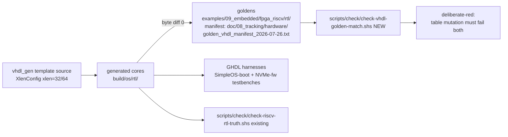

# VHDL Exec-Core Generator Design (structured lane)

**Date:** 2026-07-26 · **Status:** Decided (vhdl-gen-backend campaign) · **Scope:** design only

Inputs: `doc/01_research/hardware/riscv/python_rtl_generation_survey_2026-07-26.md`,
`doc/01_research/hardware/riscv/simple_grammar_vhdl_edsl_sufficiency_2026-07-26.md`,
`doc/01_research/hardware/riscv/riscv32_riscv64_unification_realrtl_aop_jtag_2026-07-21.md`,
`doc/05_design/compiler/misc/VHDL_BACKEND_DESIGN.md`,
`doc/03_plan/hardware/pure_simple_vhdl_riscv_gap_spawn_plan.md` (COMPLETE).

## 1. Two complementary generation lanes

| Lane | Location | Input | Output | Verification |
|---|---|---|---|---|
| (a) Compiler VHDL backend | `src/compiler/70.backend/backend/vhdl*` | `@hardware fn` Simple source | semantic VHDL (product cores, peripherals) | GHDL analyze/elab/synth per gap-spawn plan |
| (b) Structured exec-core generator (NEW) | `src/lib/hardware/vhdl_gen/` | single `XlenConfig`-parameterized template source | `rv32_exec_core.vhd` + `rv64_exec_core.vhd` | byte-identical to silicon-lane goldens |

Lane (b) exists because the silicon-proven cores in
`examples/09_embedded/fpga_riscv/rtl/` (KV260 DDR + BRAM lanes, TEST PASSED on
real silicon 2026-07-26) must not drift: the generator's acceptance is
**byte diff 0** against those goldens, plus **GHDL clean**, plus a
**deliberate-red** check (mutate a decode-table entry → diff and testbench must
both go red). This continues the unification target (85–95% shared source,
profile-name honesty: `rv32imac_zicsr_zifencei`/`ilp32`, `rv64imac`/`lp64`).

## 2. eDSL style (per grammar-sufficiency research)

- **Method chaining, not operator overloading** — Simple has no user-type
  operator overloading; use `a.add(b)`, `sig.eq(v)`, `sig.bit(i)`.
- **Widths are runtime values** via `XlenConfig`
  (`src/lib/hardware/riscv_common/xlen.spl`); no const generics needed —
  elaboration is ordinary Simple code and XLEN is a field.
- **Deterministic emission** — array-driven tables only; never iterate a Dict
  when emitting (per-process random order). Sorted arrays / index-assign.
- **Debug taps via aspect module** — a `debug_tap_aspect` module weaves taps at
  **named generator join points** (the AOP philosophy of
  `src/lib/hardware/debug_hooks/hart_debug.spl`), applied at the generator/IR
  level, not by language-AOP over netlist structure.
- **TAP/DTM/DMI/DM stay hand-written RTL** in `src/lib/hardware/debug/` —
  fail-closed hardware templates; AOP is only for hart join points
  (unification-research conclusion, not re-litigated here).

## 3. Gates and evidence

- **`scripts/check/check-vhdl-golden-match.shs` (new):** regenerates into
  `build/os/rtl/` and byte-diffs against the golden manifest
  `doc/08_tracking/hardware/golden_vhdl_manifest_2026-07-26.txt`.
- **`scripts/check/check-riscv-rtl-truth.shs` (existing):** generated lane is
  `build/os/rtl/`; the check keeps the generated-vs-committed truth honest.
- **Final validation:** the existing GHDL SimpleOS-boot and NVMe-fw testbench
  harnesses run against the *generated* cores (not just the goldens).
- **Board lane: BLOCKED** on a 3.3V PMOD UART adapter (AC-4/AC-11). Per
  `.claude/rules/board-runnable.md` this is recorded as an explicit blocker —
  GHDL/QEMU-side green does not imply board-runnable until the adapter lands.

## 4. Future direction (recorded, not implemented)

- **Netlist-IR eDSL** per the survey's 10 recommendations: construction API
  (never host-AST translation), comb-default-init latch proofing, UG901 BRAM
  templates (`Memory` as first-class node), module signatures/`connect` — the
  long-term unification of lanes (a) and (b) on one IR + one VHDL emitter.
- **Immediate next step:** extend lane (b) coverage to the `*_exec_core_flat.vhd`
  and `*_exec_core_axi.vhd` variants under the same golden-match gate.

## 5. Plan

Campaign tasks and acceptance criteria:
`doc/03_plan/hardware/riscv/vhdl_exec_core_generator_plan.md`.
