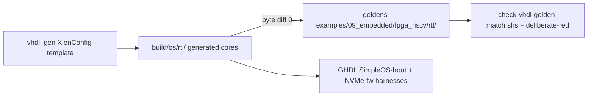

# TLDR — VHDL Exec-Core Generator Design (2026-07-26)

- **Two lanes:** (a) compiler VHDL backend (`src/compiler/70.backend/backend/vhdl*`,
  `@hardware fn` → semantic VHDL, GHDL-verified) for product cores/peripherals;
  (b) NEW structured generator `src/lib/hardware/vhdl_gen/` — one
  `XlenConfig`-parameterized template source emitting `rv32_exec_core.vhd` +
  `rv64_exec_core.vhd` **byte-identical** to the silicon-proven goldens in
  `examples/09_embedded/fpga_riscv/rtl/`.
- **eDSL style:** method chaining (no user operator overloading in Simple);
  widths as runtime `XlenConfig` values (no const generics); deterministic
  array-driven emission (no Dict iteration); `debug_tap_aspect` weaves taps at
  named generator join points; TAP/DTM/DMI/DM stay hand-written RTL in
  `src/lib/hardware/debug/`.
- **Gates:** new `scripts/check/check-vhdl-golden-match.shs` (manifest
  `doc/08_tracking/hardware/golden_vhdl_manifest_2026-07-26.txt`, deliberate-red
  table mutation) + existing `check-riscv-rtl-truth.shs` (generated lane =
  `build/os/rtl/`); final validation = existing GHDL SimpleOS-boot + NVMe-fw
  harnesses against generated cores. Board lane BLOCKED on 3.3V PMOD UART
  adapter (AC-4/AC-11) — explicit per board-runnable rule.
- **Future (recorded only):** netlist-IR eDSL per survey's 10 recommendations
  unifies both lanes; immediate next step = flat/axi variant coverage.

