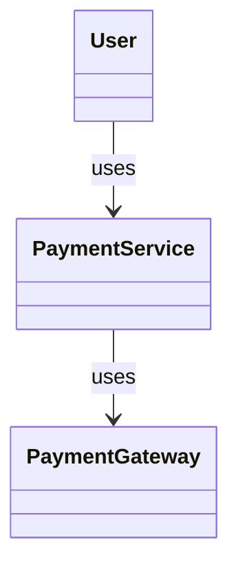

# Design Writing Guide

Design-first development: draft diagrams replaced by test-generated diagrams.

---

## Workflow: Draft -> Test -> Generate -> Replace

```
Draft Diagram  -->  Write Tests  -->  Run with --diagram-all  -->  Replace draft with generated
```

---

## 1. Draft Diagram

Mark drafts in documentation with HTML comments:

```markdown
<!-- draft:class PaymentFlow
User -> PaymentService -> Gateway -> Bank
-->

<!-- draft:sequence PaymentFlow
1. User calls PaymentService.processPayment(order)
2. PaymentService calls Gateway.charge(amount)
3. Gateway returns PaymentResult
-->
```

---

## 2. Write Tests from Draft

```simple
import std.spec
import diagram.integration.{with_all_diagrams}

describe "PaymentFlow":
    @architectural
    @record_diagram(name: "PaymentFlow")
    context "successful payment":
        it "processes payment through gateway":
            with_all_diagrams("payment_success") \:
                result = service.process_payment(order)
                expect result to be_ok
```

| Draft Element | Test Element |
|---------------|--------------|
| Class in diagram | `@architectural` on struct/class |
| Arrow in sequence | Method call in test |
| Return value | `expect` assertion |

---

## 3. Generate Diagrams

```bash
simple test payment_flow_spec.spl --diagram-all --diagram-output target/diagrams/
```

Generates: `{name}_sequence.md`, `{name}_class.md`, `{name}_arch.md`

### Diagram Functions

| Function | Output |
|----------|--------|
| `with_sequence_diagram(name, block)` | `{name}_sequence.md` |
| `with_class_diagram(name, block)` | `{name}_class.md` |
| `with_all_diagrams(name, block)` | All three types |

---

## 4. Replace Draft with Generated

**Before:**
```markdown
<!-- draft:class PaymentFlow
User -> PaymentService -> Gateway
-->
```

**After:**
```markdown
<!-- generated:class PaymentFlow -->

<!-- /generated -->
```

---

## Draft/Generated Markers

```markdown
<!-- draft:class DiagramName -->      <!-- generated:class DiagramName -->
<!-- draft:sequence DiagramName -->    <!-- generated:sequence DiagramName -->
<!-- draft:arch DiagramName -->        <!-- generated:arch DiagramName -->
```

## Test Annotations

| Annotation | Purpose |
|------------|---------|
| `@architectural` | Include in diagrams |
| `@record_diagram` | Enable diagram recording |
| `@record_diagram(name: "X")` | Custom diagram name |

---

## See Also

- [architecture_writing.md](architecture_writing.md) - Skeleton-first architecture
- [../test/sspec_writing.md](../test/sspec_writing.md) - Test writing guide
- [../coding_style.md](../coding_style.md) - Coding conventions
