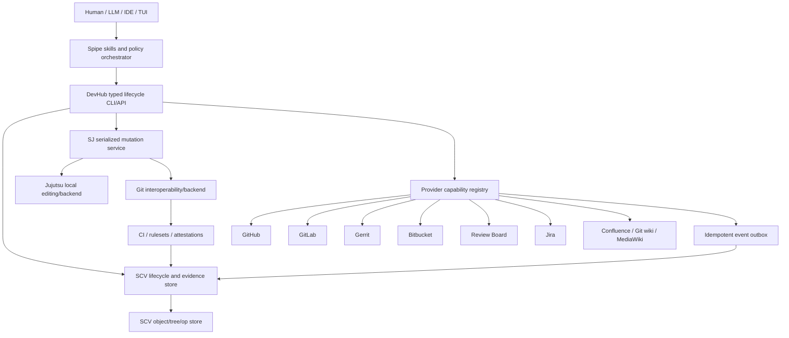

<!-- codex-research -->
# Simple SCV + Jujutsu + Git + DevHub + Spipe
## Unified development, review, release, and work-management design

**Status:** Proposed target architecture and migration plan  
**Repository scope:** `ormastes/simple` and `ormastes/Spipe`  
**Research/audit date:** 2026-08-25  
**Primary objective:** Keep the local power of SCV and Jujutsu while preserving Git/forge interoperability, and expose one auditable workflow for local/remote review, release lines, versions, tasks, feature documents, and wiki publication.

> **Filing note (2026-09-05):** this is the FULL research text. The condensed
> Codex summary of the same audit is
> `scv_jj_git_devhub_spipe_unified_lifecycle_2026-08-25.md`; where the two
> disagree in detail, this document is authoritative. Its companion is
> `scv_jj_git_unified_release_review_work_item_2026-08-25.md`.

---

## Executive decision

Adopt a **trunk-first, change-centric lifecycle** with six clearly separated responsibilities:

| Layer | Authoritative responsibility |
|---|---|
| **SCV** | Durable lifecycle graph and evidence: logical changes, immutable revisions, reviews, findings, gates, features, tasks, release candidates, releases, provenance, remote bindings, and operation history |
| **Jujutsu (`jj`)** | Local editing ergonomics: working-copy commits, anonymous changes, change stacks, safe history rewriting, workspaces, conflict-as-data, and operation-log recovery |
| **Git** | Interoperability and public transport: forge hosting, CI integration, repository interchange, signed annotated release tags, and disaster recovery |
| **SJ** | The only supported mutation gateway: serialization, leases, protected-ref policy, full gate execution, compare-and-swap integration, publication, and audit |
| **DevHub** | One typed human/LLM interface over local SCV objects and remote Git/review/task/wiki/release providers |
| **Spipe** | Process policy and orchestration: phases, reviewer/model routing, escalation, retries, release procedure, skill UX, and evidence collection |

The central rule is:

> **A Git branch, pull request, issue, wiki page, or release is a remote projection of a stable local lifecycle object—not the local object itself.**

This permits local-only review and task management without losing the ability to publish the same change to GitHub, GitLab, Gerrit, Bitbucket, Review Board, Jira, Confluence, or another provider.

### Required branch policy

Use:

- `main` as the public trunk.
- `release/X.Y` only for a simultaneously supported release line.
- Immutable tags such as `v1.4.0`, `v1.4.1`, and `v1.5.0-rc.1` for individual versions.
- Anonymous Jujutsu changes/workspaces for ordinary agent work.
- Ephemeral remote review branches only when a provider requires one.

Do **not** create one permanent branch per released version. A patch release such as `1.4.2` is another immutable tag on `release/1.4`, not a new `release/1.4.2` branch.

### Required local integration policy

The user-facing concept "local main" should be represented as a protected SCV integration ref, displayed as `main@local` but stored independently from the public Git bookmark, for example:

```text
main@origin       fetched public trunk
integration/main  locally reviewed candidate trunk
main              public Git projection; moved only by SJ integration/publication
```

Authors and implementation agents never update these refs directly. They create anonymous logical changes. `sj integrate` is the only operation that may advance `integration/main` or publish to `main`.

### Required review policy

A review always targets an **exact immutable SCV RevisionId**. Local and remote reviews use the same `ReviewSession`, `ReviewRun`, `Finding`, `Approval`, and `RemoteBinding` objects. A pull request is simply an optional binding.

A bounded review cascade should implement the requested "higher model can recursively ask a higher model" behavior:

```text
deterministic evidence
       ↓
fast reviewer model
       ↓  only on uncertainty, disagreement, or elevated risk
strong reviewer model
       ↓  only for a concrete unresolved question
independent specialist / second strong reviewer
       ↓  unresolved critical decision
human authority
```

This is a bounded, auditable escalation DAG—not unbounded recursive self-consultation.

### Required release policy

A product release is an immutable mapping among:

- semantic version,
- SCV RevisionId,
- Git commit,
- signed annotated Git tag object,
- source tree hash,
- gate evidence,
- artifact hashes,
- SBOM,
- build provenance/attestations,
- publication records.

Before publication, a release candidate may be abandoned. After publication, never delete, move, or reuse its version tag. A bad release is withdrawn/yanked and followed by a new patch release.

---

## 1. Current-state audit

### 1.1 SCV already has the correct low-level foundation

The repository already describes and substantially implements:

- a byte-exact content-addressed object store;
- trees, commits, refs, tags, operations, and working-copy state;
- a durable operation log and undo/recovery model;
- parser-aware diff and merge architecture;
- gates, integrity verification, packs, maintenance, and GC;
- private backup and gated public export;
- Git fast-import/full-interoperability work;
- public/private transport separation;
- workspaces and bookmarks.

This means the next design should **not** begin by creating another VCS core. The missing layer is the durable software-lifecycle model above the byte/tree/commit layer.

### 1.2 The current SCV migration posture is appropriately conservative

The active migration documents correctly retain Git/Jujutsu/GitHub as recovery authority while SCV is introduced in observe/shadow/dual-write stages. Preserve that approach.

SCV should become canonical in two steps:

1. **Lifecycle canonicality first:** reviews, tasks, releases, provenance, bindings, and traceability become authoritative SCV objects while Git/Jujutsu remain content-I/O authorities.
2. **Content canonicality later:** only after backend equivalence, fault injection, recovery, and dual-write gates are proven should SCV become the primary content writer.

### 1.3 Jujutsu is the right local editor, but not the final release publisher

Jujutsu provides the useful local semantics this workflow needs:

- working copies represented as commits;
- stable logical changes across rewrites;
- anonymous changes without branch proliferation;
- workspaces;
- revsets and change stacks;
- operation-log recovery;
- conflicts represented in history rather than hidden in an index.

However, Git interoperability has important boundaries. In particular, Jujutsu can create lightweight tags but not annotated tags. Therefore final release tags should be created through a typed SJ operation using Git until SCV has production-grade signed annotated-tag creation and export.

### 1.4 SJ is presently a serialization/translation façade, not a lifecycle gateway

The current SJ translator maps Git-shaped strings to Jujutsu commands and falls back to raw Git. It has no typed model for:

- protected integration;
- review publication;
- release tags;
- exact-revision approvals;
- gate bundles;
- backports;
- provenance;
- provider publication;
- break-glass authority.

This is the correct place to add a typed mutation protocol because SJ already owns per-repository serialization and leases.

### 1.5 DevHub already exists and should be extended, not replaced

The repository already has a substantial `devhub` application with adapters/facades for:

- GitHub;
- Bitbucket;
- Jira;
- Confluence/GitHub wiki;
- MinIO/S3;
- Outlook/email;
- unified Jira/GitHub task listing and mutation.

The target design should preserve the existing compatibility commands while inserting a typed domain/provider layer below them. Creating another developer-integration executable would duplicate authentication, output, retries, provider configuration, and tests.

### 1.6 Spipe has the orchestration shape but lacks the unified lifecycle objects

Spipe already defines phased development and release/review skills. The weak points are:

- release logic edits a hard-coded list of version locations;
- release logic mixes Jujutsu commits with Git-only tag operations;
- pre-publication rollback and post-publication withdrawal are not separated;
- review/provider skills dispatch through hard-coded paths rather than a capability registry;
- continuous lifecycle synchronization is not yet implemented;
- phase state is run-local, not a durable feature/change/review/release graph.

The skills should become thin clients over DevHub and SJ, with their normative behavior compiled from machine-readable policies.

### 1.7 Version information is currently duplicated

The repository has a root `VERSION` and several project/package manifests carrying the same product version. The existing release skill knows only a fixed subset of those paths. A code search also finds the version embedded in bootstrap/compiler identity paths and checks.

The solution is not a longer hard-coded file list. The solution is one canonical release/version manifest plus generated projections and a fail-closed drift checker.

---

## 2. Immediate P0 defects to fix before adding more release automation

### P0-1 — The documented landing path does not execute the complete push gate set

Source inspection shows:

1. the VCS rule documents a larger push-tier gate manifest;
2. `land.shs` directly runs only two rules checks;
3. it then invokes `sj git push --bookmark main`;
4. SJ translates that into `jj git push`;
5. Jujutsu push does not invoke Git pre-push hooks.

Therefore, unless another independent server-side rule rejects the update, the documented path can bypass the broader local push manifest.

**Required correction**

- Make `sj integrate` read and execute the authoritative gate manifest directly against pinned `BASE` and `HEAD` revisions.
- Do not depend on shell hooks for correctness.
- Repeat required checks in CI/forge rules so direct Git/Jujutsu execution cannot bypass the release/integration contract.
- Make the old `land.shs` a compatibility wrapper that calls `sj integrate`, or retire it.
- Add an executable conformance test proving that every policy-marked gate runs on every protected-ref update path.

### P0-2 — Direct/force updates of `main` are incompatible with parallel agents

The current rule simultaneously says "work directly on main" and describes parallel sessions repeatedly moving/force-pushing it. This creates avoidable races, review invalidation, conflict chains, and recovery pressure.

**Required correction**

- Authors work on anonymous Jujutsu changes or isolated workspaces.
- `main`, `release/*`, and release tags are protected.
- Only the integration service can advance them.
- Public `main` is fast-forwarded or updated through a provider merge queue; never routinely force-pushed.
- `--force-with-lease` is limited to ephemeral review projections and still requires an expected remote OID.

### P0-3 — Published release tags must not be deleted by rollback

Current release rollback instructions include deleting tags. That is acceptable only before any public release has been published and only for a clearly marked staging namespace.

**Required correction**

- Candidate tags/refs live under a staging namespace and may be abandoned.
- Published `vX.Y.Z` tags are immutable.
- A defective published release becomes `withdrawn` or `yanked`.
- A corrected artifact receives a new patch version.
- Enable forge immutable-release support where available.

### P0-4 — Review approval is not bound to an exact immutable revision

A review that says only "change X approved" becomes unsound after the change is rewritten.

**Required correction**

Every approval must include:

- `ReviewSessionId`;
- exact `RevisionId`;
- tree/patch digest;
- reviewer identity and authority;
- policy digest;
- evidence bundle digest;
- timestamp;
- optional signature.

Any source change invalidates the approval until revalidation.

### P0-5 — Product version and provenance are not one object

The compiler provenance script already demonstrates that a version string alone cannot identify binary lineage or included fixes.

**Required correction**

`simple --version --json` and every release artifact should expose at least:

```text
product_version
channel
scv_revision_id
scv_change_set_digest
git_commit
source_tree_hash
build_id
build_timestamp_or_reproducible_epoch
compiler_lineage
backend_set
artifact_digest
provenance_attestation_id
```

A human-friendly one-line version remains, but release verification must consume the structured identity.

---

## 3. Research synthesis and resulting design rules

### 3.1 Branches are coordination structures, not free organizational labels

Empirical branching research reports measurable relationships between branching practices and post-release quality, and broader studies show that careless branch creation raises merge and coordination costs. The design consequence is not "branches are always bad"; it is:

- keep active development lines few;
- make branch purpose explicit;
- attach an owner and lifecycle;
- avoid long-lived feature branches;
- use a release branch only when concurrent maintenance/stabilization requires it.

### 3.2 Trunk-based development and small batches fit Jujutsu particularly well

DORA's trunk-based guidance emphasizes few development lines, frequent integration, and small merges. Jujutsu removes much of the reason developers create local branches: anonymous logical changes, easy reordering, and safe rewriting already provide isolation.

Therefore:

- use Jujutsu change stacks for local decomposition;
- integrate one reviewed intent at a time;
- publish remote branches only as provider projections;
- use feature flags, branch-by-abstraction, and compatibility layers for incomplete large features.

### 3.3 Release branches should represent supported lines, not every version

The useful release branch is a maintained compatibility line such as `1.4`, because fixes may need to be applied after `main` has moved toward `1.5` or `2.0`.

Individual release identities belong in immutable tags and release objects:

```text
release/1.4
  ├── v1.4.0
  ├── v1.4.1
  └── v1.4.2

main
  └── v1.5.0-rc.1
```

### 3.4 Semantic versions are API promises, not build identities

Semantic Versioning communicates compatibility at a public-API level. It does not uniquely identify a build, configuration, compiler lineage, source tree, or artifact.

Keep separate version axes:

| Axis | Example | Compatibility meaning |
|---|---|---|
| Product SemVer | `1.5.0-rc.1` | User-facing API/behavior contract |
| Release channel | `dev`, `alpha`, `beta`, `rc`, `stable` | Promotion/quality state |
| SCV store schema | `scv-store/2` | On-disk migration compatibility |
| SCV transport protocol | `scv-wire/1` | Peer/client compatibility |
| DevHub provider API | `devhub-provider/2` | Adapter ABI |
| Spipe skill API | `spipe-skill/2` | Skill invocation/result contract |
| Bootstrap/compiler ABI | e.g. `compiler-abi/7` | Bootstrap and artifact compatibility |
| Package/bundle format | e.g. `smf/3` | Loader/package compatibility |

Never encode all of these into the product SemVer.

### 3.5 Small reviews should be one complete intent

Google's engineering guidance recommends one self-contained change including its tests, notes that small changes are reviewed more quickly and thoroughly, and treats roughly 100 changed lines as often reasonable while roughly 1000 is often too large—without making a rigid line-count law.

Use configurable soft limits:

```text
target:             one intent, often <= 100 human-authored changed lines
warning:            > 400 human-authored changed lines
policy review:      > 1000 human-authored changed lines
exclude by policy:  generated files, vendored code, pure renames, bulk data
```

A large change is not automatically rejected when it is inherently atomic, but it must provide:

- a decomposition explanation;
- design review before detailed review;
- file/symbol review map;
- risk-based review assignment;
- stronger verification profile.

### 3.6 Review should begin with design and risk, then inspect every relevant line

The review engine should order the evidence surface:

1. change intent and acceptance criteria;
2. architecture/API/schema changes;
3. security, concurrency, memory safety, persistence, and compatibility risks;
4. primary implementation symbols;
5. tests and failure injection;
6. generated/vendor evidence;
7. documentation and migration notes.

This prevents reviewers from spending their budget on low-value file ordering before finding a fundamental design error.

### 3.7 Model escalation should use selective prediction, not unconditional recursion

Research on cascaded models and selective deferral supports using inexpensive/fast models for straightforward cases while escalating uncertain or high-risk cases to stronger models or humans. It also cautions that raw model confidence is often poorly calibrated.

Therefore:

- combine multiple uncertainty signals;
- measure calibration on historical review outcomes;
- escalate on concrete unresolved questions;
- cap depth, fan-out, and budget;
- require abstention rather than fabricated certainty;
- use humans as the terminal authority for unresolved critical issues.

### 3.8 Use standards at interoperability boundaries

Adopt:

- **SARIF 2.1** for static-analysis and model-generated review findings;
- an **OSLC Change Management-inspired** vocabulary for features, tasks, changes, releases, and relationships;
- a **CloudEvents-compatible envelope** for provider/webhook/outbox events;
- ForgeFed vocabulary as future-facing inspiration, not an initial hard dependency.

These standards reduce adapter-specific data loss without forcing every provider into identical behavior.

---

## 4. Target architecture



### 4.1 Authority hierarchy

When systems disagree, resolve in this order:

1. **Immutable source bytes/tree:** SCV object hash plus verified Git tree equivalence.
2. **Logical lifecycle identity:** SCV `ChangeId`, `RevisionId`, `ReviewId`, `FeatureId`, `ReleaseId`.
3. **Protected-ref state:** SJ transaction record plus remote compare-and-swap result.
4. **Gate/review evidence:** SCV evidence bundle.
5. **Remote provider metadata:** normalized `RemoteBinding`.
6. **Human-oriented generated documents/UI:** projections that can be regenerated.

### 4.2 Canonical versus projected data

| Data | Canonical owner | Typical projections |
|---|---|---|
| Source tree/revision | SCV + verified Git/JJ aliases during migration | Git commit, Jujutsu commit |
| Logical change | SCV | Gerrit change, GitHub/GitLab PR, Review Board request |
| Review finding | SCV | PR/MR inline comment, Gerrit comment, SARIF upload |
| Feature/acceptance criteria | SCV feature manifest/local docs by default | Jira epic, GitHub issue, Confluence page |
| Task status | Policy-selectable field authority | Jira/GitHub/local task |
| Product release | SCV Release object | Git tag, GitHub/GitLab release, registry artifacts |
| Wiki/document content | Local document by default | Confluence, Git wiki, MediaWiki |
| Runtime agent progress | Spipe run state | Optional remote status/comment |

---

## 5. Core SCV lifecycle model

### 5.1 Stable logical change and immutable revision

```text
Change
  stable identity across rewrites
  one primary intent
  may contain many immutable revisions

Revision
  exact tree/parents/metadata snapshot
  never mutates
  approvals and findings bind here
```

Illustrative Simple/SDN-oriented model:

```text
struct Change:
    id: ChangeId
    title: text
    description: text
    feature_id: FeatureId?
    intent_digest: Hash
    owner: ActorId
    parent_changes: [ChangeId]
    state: ChangeState
    created_operation: OperationId

struct Revision:
    id: RevisionId
    change_id: ChangeId
    tree_id: ObjectId
    parent_revision_ids: [RevisionId]
    patch_digest: Hash
    metadata_digest: Hash
    aliases: RevisionAliases
    created_operation: OperationId

struct RevisionAliases:
    jj_change_id: text?
    jj_commit_id: text?
    git_oid: text?
    provider_patchsets: [ProviderRevisionAlias]
```

### 5.2 Identity policy

Use an SCV-native stable ID as canonical. Do not make a Jujutsu header or a Git commit trailer the sole source of identity because other Git tools can rewrite or strip metadata.

Recommended behavior:

1. Create `ScvChangeId` once using a collision-resistant random/monotonic identifier.
2. Derive `RevisionId` from immutable revision contents.
3. Store Jujutsu/Git/provider IDs as aliases.
4. Export an `SCV-Change-Id` trailer for interoperability.
5. Import existing Gerrit/Jujutsu IDs as aliases.
6. Use patch similarity only to suggest identity recovery; require confirmation when stable metadata is absent.

### 5.3 Review objects

```text
struct ReviewSession:
    id: ReviewId
    change_id: ChangeId
    base_revision_id: RevisionId
    head_revision_id: RevisionId
    target_ref: RefId
    profile: ReviewProfileId
    state: ReviewState
    remote_bindings: [RemoteBindingId]

struct ReviewRun:
    id: ReviewRunId
    review_id: ReviewId
    parent_run_id: ReviewRunId?
    reviewer: ReviewerIdentity
    reviewer_version: text
    role: ReviewRole
    policy_digest: Hash
    prompt_or_instruction_digest: Hash
    evidence_bundle_id: EvidenceBundleId
    verdict: ReviewVerdict
    calibrated_risk: f64?
    unresolved_question_ids: [QuestionId]
    started_operation: OperationId
    completed_operation: OperationId?

enum ReviewVerdict:
    approve
    approve_with_notes
    request_changes
    abstain
    escalate

struct Finding:
    id: FindingId
    review_id: ReviewId
    revision_id: RevisionId
    producer_run_id: ReviewRunId
    rule_id: text
    category: FindingCategory
    severity: Severity
    confidence: ConfidenceEvidence
    anchor: SourceAnchor
    fingerprint: Hash
    message: text
    evidence_refs: [EvidenceRef]
    suggested_patch_id: PatchId?
    state: FindingState
```

### 5.4 Stable source anchors

A local finding should not be identified only by a line number. Store:

```text
path
language/parser
symbol identity
syntax-node kind
syntax-node fingerprint
surrounding token hash
semantic entity ID, when available
fallback line/column range
```

At each new revision:

1. match exact entity/node fingerprint;
2. match symbol plus contextual token hash;
3. use parser-aware move/rename mapping;
4. fall back to diff line mapping;
5. otherwise mark the finding `needs_reanchor`.

Remote provider line positions are generated at publication time.

### 5.5 Gate and evidence objects

```text
struct GateRun:
    id: GateRunId
    revision_id: RevisionId
    gate_id: text
    policy_digest: Hash
    command_or_tool_digest: Hash
    environment_digest: Hash
    started_at: Timestamp
    completed_at: Timestamp?
    verdict: GateVerdict
    evidence_objects: [ObjectId]

struct GateBundle:
    id: GateBundleId
    revision_id: RevisionId
    required_gate_runs: [GateRunId]
    review_approvals: [ApprovalId]
    complete: bool
    bundle_digest: Hash
```

A `PASS` is valid only when the gate reports non-vacuous evidence. Preserve the repository's current fail-closed verdict discipline: `PASS`, `FAIL`, and `ERROR/nothing checked` are distinct.

### 5.6 Release objects

```text
struct ReleaseLine:
    id: ReleaseLineId             # simple/1.4
    product: text
    major: i64
    minor: i64
    source_ref: RefId             # release/1.4
    support_state: SupportState
    support_policy_digest: Hash
    remote_bindings: [RemoteBindingId]

struct ReleaseCandidate:
    id: ReleaseCandidateId
    version: SemVer
    line_id: ReleaseLineId
    source_revision_id: RevisionId
    gate_bundle_id: GateBundleId?
    artifact_set_id: ArtifactSetId?
    release_review_id: ReviewId?
    state: CandidateState

struct Release:
    id: ReleaseId
    version: SemVer
    line_id: ReleaseLineId
    source_revision_id: RevisionId
    source_tree_hash: Hash
    git_commit_oid: text
    git_tag_object_oid: text
    tag_signature: SignatureRef?
    gate_bundle_id: GateBundleId
    artifact_set_id: ArtifactSetId
    sbom_ids: [ObjectId]
    provenance_ids: [ObjectId]
    publications: [PublicationId]
    state: ReleaseState
    immutable: bool
```

### 5.7 Feature, task, and run are different concepts

Do not extend the current process-oriented task daemon into a feature tracker.

```text
Feature = durable user/product/architecture outcome
Task    = durable actionable work item
Change  = source/doc modification intent
Run     = ephemeral process/agent execution
```

Relationships:

```text
Feature implements Requirements
Feature is_explained_by Research/Architecture/Design/Spec documents
Task contributes_to Feature
Change implements Task or Feature
Review evaluates Revision
Gate verifies Revision
Release contains Revision
Finding blocks Change/Release
RemoteBinding projects any lifecycle object
```

---

## 6. Proper use of SCV, Jujutsu, Git, and SJ

### 6.1 Responsibility matrix

| Operation | SCV | Jujutsu | Git | SJ |
|---|---:|---:|---:|---:|
| Track logical change identity | **Owner** | Alias/source | Trailer/alias | Enforce mapping |
| Local working-copy snapshot | Record/import | **Owner during migration** | Not primary | Serialize when needed |
| Rewrite/reorder/split change stack | Record operation | **Owner** | Projection only | Policy wrapper |
| Parser-aware diff/merge | **Owner** | Revision selection | Byte/tree fallback | Dispatch |
| Local review/finding history | **Owner** | Supplies revisions | Optional projection | Freeze exact rev |
| Remote review branch/PR | Binding owner | Produces stack | **Transport** | Publish safely |
| Protected integration | Audit/evidence | Rebase candidate | Public ref | **Only mutator** |
| Release tag | Record/signature mapping | Read only | **Signed annotated tag** | **Only creator** |
| Remote fetch/push | Verify/mirror | Local backend | **Protocol** | **Only supported writer** |
| Recovery | Object/op recovery | Op log/undo | Reflog/bundle/clone | Orchestrate and audit |

### 6.2 Daily local development

Target workflow:

```text
devhub feature open FEAT-123
devhub change create --feature FEAT-123 --title "Add parser-aware review anchors"
sj workspace new --change CHG-...
# edit/test
devhub change snapshot
devhub review open --change CHG-... --target integration/main
devhub review run --profile standard
# address findings
devhub review update
devhub review run --resume
sj integrate --change CHG-... --target integration/main
```

The final CLI names can be adjusted, but the semantic separation must remain.

### 6.3 Multiple agents

Each agent receives:

- an SCV `ChangeId`;
- a Jujutsu workspace or isolated checkout;
- a declared path/symbol ownership set;
- a target feature/task;
- a base revision;
- a maximum allowed integration scope.

Agents may build dependent stacks, but cannot move protected refs.

```text
CHG-A: domain schemas
  └── CHG-B: SCV persistence
       └── CHG-C: DevHub commands
```

SCV records dependencies. Jujutsu provides the local stack. A provider adapter may project the stack as native stacked reviews, dependent PRs/MRs, Gerrit patchsets, or separate Review Board requests.

### 6.4 Read-only direct Git/Jujutsu use

Direct commands remain acceptable for observation and diagnosis:

```text
jj log
jj diff
jj op log
git show
git cat-file
git ls-tree
git fsck
git bundle verify
```

Mutations of protected refs, release tags, provider review refs, or canonical bindings must go through SJ.

### 6.5 Break-glass operation

A total prohibition is unrealistic because a user with filesystem/remote authority can invoke raw tools. The design must make bypass:

- explicit;
- rare;
- auditable;
- server-detectable;
- incapable of silently satisfying release policy.

Illustrative command:

```text
sj raw --reason BUG-123 --expires 30m --authority maintainer -- git ...
```

Requirements:

- no raw operation can create a valid release approval;
- every raw mutation writes an audit event;
- protected remote refs still require CI/ruleset checks;
- the next `scv doctor` reports unexplained backend drift;
- reconciliation creates an incident/recovery record.

---

## 7. Branch and release-line management rule

### 7.1 Normative ref classes

| Ref class | Naming | Lifetime | Owner | Force update |
|---|---|---|---|---|
| Public trunk | `main` | permanent | SJ integration service | deny |
| Local reviewed trunk | `integration/main` | permanent local | SJ integration service | CAS only |
| Release line | `release/X.Y` | support window | SJ release integrator | deny |
| Ephemeral review projection | `review/<change-id>` or provider native | until merged/abandoned + TTL | DevHub provider adapter | lease/CAS allowed |
| Staging candidate | `candidate/<version>/<id>` | until publish/abandon | release service | CAS allowed |
| Immutable release tag | `vX.Y.Z[-prerelease]` | permanent | release service | deny |
| Recovery refs | `recovery/<incident>/<timestamp>` | retention policy | recovery authority | append-only |
| Private/security change | SCV private namespace | policy-defined | security authority | no public projection |

### 7.2 When a release branch is allowed

Create `release/X.Y` only when at least one condition holds:

- the line remains supported while `main` accepts incompatible/new development;
- release stabilization must continue in parallel with new trunk work;
- regulated validation requires a frozen supported line;
- a customer/platform support obligation requires patch releases;
- security fixes must be issued against an older maintained line.

Do not create it merely because a release is being tagged.

### 7.3 Fix and backport rule

Default:

1. fix on `main`;
2. review and integrate on `main`;
3. create an explicit backport change for each maintained line;
4. preserve a `BackportRecord`;
5. review conflicts/resolution independently;
6. run the release-line gate profile;
7. integrate into `release/X.Y`.

Emergency release-line-first fixes are allowed only when:

- the incident policy permits it;
- a forward-port task/change is created atomically;
- the release cannot publish until the forward-port is linked or formally waived.

### 7.4 Backport record

```text
struct BackportRecord:
    source_change_id: ChangeId
    source_revision_id: RevisionId
    target_line_id: ReleaseLineId
    resulting_change_id: ChangeId
    resulting_revision_id: RevisionId?
    conflict_resolution_digest: Hash?
    semantic_equivalence_review_id: ReviewId?
    state: BackportState
```

This prevents duplicate or forgotten backports and makes release notes traceable.

### 7.5 Release-line support state

```text
planned → maintained → security_only → end_of_life
```

A line policy defines:

- end date or decision authority;
- allowed change categories;
- required review profile;
- supported platforms/ABIs;
- minimum test matrix;
- security disclosure behavior;
- artifact retention.

---

## 8. Version architecture

### 8.1 Canonical release manifest

Introduce one canonical manifest, for example:

```text
release/version.sdn
```

Illustrative content:

```yaml
version:
  schema: 1
  product: simple
  semver: 1.0.0-rc.1
  line: 1.0
  channel: rc
  channel_sequence: 1

compatibility:
  public_api_major: 1
  compiler_abi: 7
  bootstrap_protocol: 4
  package_format: 3
  scv_store_schema: 2
  scv_wire_protocol: 1
  devhub_provider_api: 2
  spipe_skill_api: 2

projection:
  legacy_version_file: VERSION
  manifests:
    - src/app/simple.sdn
    - src/lib/simple.sdn
    - src/compiler/simple.sdn
    - src/compiler_rust/simple.sdn
  generated_sources:
    - src/app/cli/generated_version.spl
```

This is illustrative; the implementation must discover the complete set of actual consumers before migration.

### 8.2 Generated projections

Provide:

```text
devhub version render
devhub version check
devhub version explain
```

`render` updates generated mirrors. `check` verifies:

- no undeclared literal product versions;
- all projections equal the manifest;
- prerelease ordering is valid;
- release line and version agree;
- API/ABI changes match version policy;
- generated files carry a source-manifest digest.

A release skill must not use `sed` on a hard-coded path list.

### 8.3 Version decision engine

`devhub release plan` should inspect declared compatibility changes:

| Change | Minimum product bump |
|---|---|
| Breaking public API/behavior | major |
| Backward-compatible public feature | minor |
| Backward-compatible fix | patch |
| Candidate from same target version | prerelease sequence |
| Store/wire/provider schema change | its own compatibility axis; may also require product bump if user-visible |

The result is a recommendation plus evidence, not an unquestionable automatic decision.

### 8.4 Current version migration

`1.0.0-RC` is a valid SemVer prerelease form, but numbered candidates such as `1.0.0-rc.1` provide deterministic ordering and avoid reusing one ambiguous candidate name.

Migration rule:

- accept the current spelling as a legacy input;
- normalize new release candidates to lowercase numbered identifiers;
- never rewrite an already published immutable tag merely for naming consistency.

---

## 9. Release process and state machine

### 9.1 State machine

```text
planned
  → candidate_created
  → source_frozen
  → verified
  → reviewed
  → tagged_staging
  → artifacts_staged
  → publication_ready
  → published
  → verified_remote
  → closed

Failure before published:
  → abandoned

Failure after published:
  → withdrawn
  → replacement release planned
```

### 9.2 Release command surface

```text
devhub release line list
devhub release line create 1.4
devhub release plan --line 1.4 --bump patch
devhub release prepare 1.4.2
devhub release verify RC-...
devhub release review RC-...
devhub release stage RC-...
devhub release publish RC-... --backend github
devhub release verify-remote REL-...
devhub release withdraw REL-... --reason ...
devhub release backport CHG-... --to 1.4
```

Spipe's `/release` skill orchestrates these commands and records returned object IDs. It does not implement Git/provider logic itself.

### 9.3 Prepare

`release prepare` must:

1. resolve an exact source `RevisionId`;
2. verify the release line;
3. generate/check all version projections;
4. create changelog/release-note candidates from linked changes;
5. classify compatibility/API impact;
6. freeze a candidate ref;
7. create a release review session;
8. declare the required artifact/test matrix.

### 9.4 Verify

Required classes:

- tree/object integrity;
- source/backend equivalence;
- full build and test profiles;
- bootstrap/compiler provenance;
- API/ABI compatibility;
- performance/memory regression checks;
- dependency/license/security checks;
- reproducibility or documented non-reproducible inputs;
- SBOM;
- artifact digest generation;
- installation/upgrade/rollback tests;
- release-note traceability.

Each check writes a `GateRun`; the release consumes a `GateBundle`.

### 9.5 Tag and publication

Until SCV signed-tag support is production-ready:

1. SJ verifies the exact release candidate revision.
2. SJ materializes/exports the Git commit.
3. SJ creates a signed annotated Git tag.
4. SCV records the tag object OID, signature, Git commit OID, and SCV RevisionId.
5. SJ pushes branch/tag atomically where supported.
6. DevHub creates a draft remote release.
7. DevHub uploads artifacts, SBOM, and attestations.
8. DevHub verifies remote digests.
9. DevHub publishes/locks the immutable release.
10. SCV records remote publication IDs and verification evidence.

### 9.6 Publication authority

No single reviewer model may publish a product release.

Minimum authority:

- exact revision gate bundle complete;
- release-profile review approved;
- deterministic tag/artifact identity;
- configured human/maintainer or protected automation authority;
- remote compare-and-swap still matches the candidate;
- no unresolved critical finding;
- no unforwarded emergency fix.

### 9.7 Release notes

Release notes are generated from linked lifecycle objects, not inferred only from commit text:

```text
Feature/Task
  → Change
  → Revision
  → Review/Gates
  → Release
```

Each note may include:

- user-visible summary;
- compatibility impact;
- migration action;
- fixed task/issue IDs;
- backport/source line;
- evidence links;
- known limitations.

---

## 10. Unified local and remote review

### 10.1 One review, multiple surfaces

A review can be:

- **local:** only SCV/DevHub;
- **remote:** imported from an existing provider;
- **hybrid:** local canonical review projected to one or more providers.

```text
ReviewSession REV-123
  ├── local TUI/IDE
  ├── GitHub PR #42
  ├── Gerrit change 9187
  └── SARIF result upload
```

Each binding records provider version/head SHA/patchset so comments cannot be accidentally posted against a different revision.

### 10.2 Review lifecycle

```text
draft
  → evidence_collecting
  → reviewing
  → changes_requested | approved | abstained
  → revision_updated
  → revalidation_required
  → approved
  → integrated
```

A new source revision never silently inherits approval. Unchanged findings may be mechanically carried forward only after anchor and evidence revalidation.

### 10.3 Review profiles

| Profile | Intended use | Typical reviewers/gates |
|---|---|---|
| `quick` | tiny low-risk docs/config/refactor | deterministic checks + fast independent model |
| `standard` | normal source change | full changed-scope tests + fast model + escalation |
| `architecture` | API/schema/component boundary | design reviewer before line review |
| `security` | auth, crypto, parsing, unsafe/FFI, secrets | specialist model/tool + human authority |
| `concurrency` | threading, async, queues, memory model | specialist review + stress/model checking |
| `performance` | compiler/runtime/hot path | benchmark evidence + perf specialist |
| `release` | release candidate/backport | complete release gate bundle + independent/human review |
| `mission_critical` | formal/mission-critical mode | proof obligations + dual independent review + human |

### 10.4 Recursive higher-model escalation

Represent escalation as data:

```text
ReviewRun R1: fast model
  verdict: escalate
  unresolved:
    Q1: "Can this ref update race with a concurrent workspace snapshot?"
  evidence: E1, E2
        ↓
ReviewRun R2: strong concurrency reviewer
  parent: R1
  verdict: escalate
  unresolved:
    Q2: "Does lease ordering prove absence of deadlock under recovery?"
  evidence: E3, counterexample trace T1
        ↓
ReviewRun R3: independent specialist
  parent: R2
  verdict: request_changes
  finding: F7
```

Normative limits:

- maximum model depth: 3 by default;
- maximum children per run: 2;
- maximum total review budget per profile;
- cycle detection by normalized question fingerprint;
- a reviewer may not re-ask the same unresolved question to itself;
- every escalation must name the missing evidence or disputed proposition;
- terminal unresolved `critical`/`high` findings require human disposition;
- the implementing agent/model cannot be the sole approving reviewer;
- self-reported confidence alone cannot approve a change.

### 10.5 Escalation triggers

Escalate when any is true:

- reviewer verdict is `abstain` or `escalate`;
- calibrated risk exceeds profile threshold;
- independent reviewers disagree;
- evidence is missing or contradictory;
- change touches a high-risk ownership tag;
- finding severity is high/critical;
- parser/analysis coverage is incomplete;
- review target changed during analysis;
- potential security, concurrency, persistence, release, or formal-proof issue is unresolved.

### 10.6 Evidence-first model prompts

A higher-tier reviewer receives:

- exact unresolved question;
- relevant source entities and full containing context;
- diff and base/head revisions;
- acceptance criteria/design decisions;
- test/gate evidence;
- prior claims and counterclaims;
- explicit authority/policy;
- budget and required verdict schema.

It should not receive a giant unstructured transcript by default.

### 10.7 Review findings interchange

Use SARIF as an interchange projection for:

- static analyzers;
- compiler/lint findings;
- security scanners;
- model-generated review findings;
- imported provider annotations.

SCV remains richer than SARIF: it stores review conversations, escalation relations, approvals, exact revision bindings, evidence objects, and provider mappings. SARIF is one export/import format, not the canonical database.

### 10.8 Local TUI/IDE views

Required views:

- change/stack graph;
- risk-ranked files and symbols;
- design/acceptance-criteria panel;
- unresolved findings;
- evidence/gate panel;
- reviewer/escalation tree;
- local versus remote sync status;
- exact reviewed revision and stale-warning banner;
- suggested patches with apply/preview;
- "publish review" and "integrate" as separate actions.

---

## 11. DevHub provider architecture

### 11.1 Preserve compatibility, add a typed core

Keep existing commands such as:

```text
devhub github ...
devhub bb ...
devhub tasks ...
devhub wiki ...
```

Add domain commands:

```text
devhub change ...
devhub review ...
devhub integrate ...
devhub feature ...
devhub task ...
devhub release ...
devhub sync ...
```

The compatibility commands can call the same provider layer.

### 11.2 Proposed module layout

```text
src/app/devhub/
  domain/
    change.spl
    revision.spl
    review.spl
    finding.spl
    feature.spl
    task.spl
    release.spl
    binding.spl
    sync.spl

  provider/
    capability.spl
    registry.spl
    source_provider.spl
    review_provider.spl
    task_provider.spl
    knowledge_provider.spl
    release_provider.spl
    identity_provider.spl
    automation_provider.spl

    github/
    gitlab/
    gerrit/
    bitbucket/
    reviewboard/
    jira/
    confluence/
    git_wiki/
    mediawiki/

  cmd_change.spl
  cmd_review.spl
  cmd_integrate.spl
  cmd_feature.spl
  cmd_task.spl
  cmd_release.spl
  cmd_sync.spl
```

Existing files can be migrated progressively; do not perform a disruptive rewrite.

### 11.3 Capability records, not a lowest-common-denominator provider

Illustrative shape:

```text
struct ProviderCapabilities:
    source: SourceCapabilities?
    review: ReviewCapabilities?
    task: TaskCapabilities?
    knowledge: KnowledgeCapabilities?
    release: ReleaseCapabilities?
    automation: AutomationCapabilities?

struct ReviewCapabilities:
    create_review: bool
    pre_commit_review: bool
    inline_threads: bool
    batch_review: bool
    approve: bool
    request_changes: bool
    patchsets: bool
    dependent_changes: bool
    native_stacks: bool
    merge_queue: bool
    suggested_patches: bool
```

Operations use capability-specific data without faking absent semantics.

For example, if a provider supports comments and approval but not a true `request_changes` state, DevHub must not silently turn a request-changes verdict into a normal comment. It either:

- keeps the blocking verdict local and posts an explicitly non-equivalent comment; or
- refuses under strict sync policy.

### 11.4 Provider operations

```text
ReviewProvider:
  discover_capabilities
  create
  fetch
  update_metadata
  publish_revision
  publish_findings
  fetch_threads
  resolve_thread
  submit_verdict
  enqueue_or_merge
  close

TaskProvider:
  create
  fetch
  query
  update_fields
  append_comment
  link
  transition
  close

KnowledgeProvider:
  publish
  fetch
  diff
  update
  attach
  search

ReleaseProvider:
  create_draft
  upload_asset
  publish
  verify
  withdraw
  query_attestations
```

### 11.5 Provider-specific strengths

| Provider | Preserve rather than flatten |
|---|---|
| GitHub | grouped PR reviews, inline comments, requested reviewers, stacked-PR/queue capabilities where enabled |
| GitLab | MR discussions, approvals, stacks, pipelines, merge trains |
| Gerrit | stable Change-Id, patchsets, labels, topics, dependent submission |
| Bitbucket | PR comments/approvals/merge strategies with explicit semantic gaps |
| Review Board | true pre-commit review without requiring a pushed branch |
| Jira | arbitrary workflows, issue types, JQL, project-specific fields |
| Confluence | page hierarchy, versioned page updates, storage format |
| Git wiki/MediaWiki | repository/page revision semantics |

### 11.6 Authentication and transport

Continue using proven official CLIs/adapters where useful:

- system `gh` may remain the GitHub auth/transport implementation;
- `glab` may be an optional GitLab transport;
- REST clients remain available for exact typed operations;
- provider-specific auth lives in DevHub configuration/credential stores.

But domain commands must consume typed results, not parse arbitrary human-formatted CLI output.

### 11.7 Structured output contract

Every domain command supports:

```text
--json
--output-version devhub/v1
--idempotency-key ...
--dry-run
--explain
```

Spipe consumes structured output only.

---

## 12. Remote binding and synchronization

### 12.1 RemoteBinding

```text
struct RemoteBinding:
    id: RemoteBindingId
    local_entity_type: EntityType
    local_entity_id: EntityId
    provider_instance: ProviderInstanceId
    remote_kind: text
    remote_id: text
    remote_revision_or_etag: text?
    remote_head_alias: RevisionAlias?
    authority_policy_id: PolicyId
    last_pulled_digest: Hash?
    last_pushed_digest: Hash?
    sync_base_object: ObjectId?
    state: BindingState
```

### 12.2 Synchronization algorithm

Never use timestamp-only last-write-wins.

```text
pull remote
  → normalize provider object
  → compare local, remote, and last sync base
  → compute field-level sync plan
  → expose conflicts
  → apply with expected remote version/ETag
  → record idempotency key and event
  → update sync base
```

### 12.3 Field authority

Illustrative defaults:

| Field | Default authority |
|---|---|
| Feature goal and acceptance criteria | local |
| Architecture/design/spec links | local |
| Change/revision/review evidence | local/SCV |
| Remote URL/number/patchset | provider |
| Status | configurable; often provider for team tracker |
| Assignee/milestone/sprint | configurable/provider |
| Comments | append-only union |
| Labels/links | set merge with ownership namespaces |
| Release evidence and artifact hashes | SCV/release service |
| Wiki managed region | local |
| Wiki unmanaged region | remote/human |

### 12.4 Conflict object

```text
struct SyncConflict:
    id: SyncConflictId
    binding_id: RemoteBindingId
    field: text
    base_value: ObjectId?
    local_value: ObjectId?
    remote_value: ObjectId?
    policy: ConflictPolicy
    state: ConflictState
    resolution_operation: OperationId?
```

No adapter silently overwrites a conflict.

### 12.5 Event outbox

Use a durable outbox with a CloudEvents-compatible envelope:

```text
id
source
type
subject
time
data_schema
correlation_id
causation_id
idempotency_key
provider_delivery_id
payload_digest
```

Webhook redelivery and offline replay become idempotent.

---

## 13. Local feature documents, tasks, and wiki projection

### 13.1 Preserve the repository's layer-oriented document tree

The current documentation hierarchy organizes research, plan, architecture, design, specifications, guides, tracking, and reports by lifecycle layer. Do not duplicate all content into per-feature directories.

Instead, create a durable **feature manifest plus virtual feature view**.

Suggested committed structure:

```text
doc/08_tracking/feature/FEAT-000123/
  feature.sdn
  state.sdn
  bindings.sdn
  index.md              # generated or partially generated feature view
```

The substantive documents remain in their correct layer:

```text
doc/01_research/...
doc/03_plan/...
doc/04_architecture/...
doc/05_design/...
doc/06_spec/...
doc/07_guide/...
```

`feature.sdn` links them.

### 13.2 Feature manifest

```yaml
feature:
  id: FEAT-000123
  title: Unified local and remote code review
  state: implementing
  owner: team/dev-infra
  target_release: 1.1
  goal: >
    Make one exact-revision review usable locally and across forge providers.

  acceptance:
    - id: AC-1
      text: Local review can complete without a remote branch.
    - id: AC-2
      text: The same findings can be published to a GitHub PR.
    - id: AC-3
      text: Approval is invalidated after revision change.
    - id: AC-4
      text: Uncertain model reviews escalate under a bounded policy.

  documents:
    research:
      - doc/01_research/app/devhub/review_interop.md
    architecture:
      - doc/04_architecture/app/devhub/review_service.md
    design:
      - doc/05_design/app/devhub/review_objects.md
    spec:
      - doc/06_spec/02_integration/app/devhub_review_provider_spec.md

  tasks:
    - TASK-000401
    - TASK-000402

  changes: []
  reviews: []
  releases: []
```

### 13.3 Runtime state remains separate

Ephemeral agent/process state belongs under:

```text
.spipe/run/<run-id>/state.sdn
```

It is not the durable feature truth. At a checkpoint, selected results are promoted into Feature/Task/Change/Review objects.

### 13.4 Task commands

```text
devhub task create --feature FEAT-...
devhub task list --backend local
devhub task publish TASK-... --backend jira
devhub task bind TASK-... --backend github --remote-id 123
devhub task sync TASK-...
devhub task diff TASK-...
devhub task close TASK-...
```

Reads may support `--backend all`. Mutations never fan out ambiguously; they target an explicit binding or execute a displayed sync plan.

### 13.5 Feature commands

```text
devhub feature create
devhub feature show
devhub feature link-doc
devhub feature add-acceptance
devhub feature add-task
devhub feature checkpoint
devhub feature publish --backend jira|github
devhub feature publish-docs --backend confluence|git-wiki
devhub feature sync
devhub feature close
```

### 13.6 Wiki synchronization

Default: local Markdown/spec is canonical; remote wiki is a collaboration projection.

Use managed regions where round-trip editing is allowed:

```html
<!-- spipe:managed:start id=architecture digest=... -->
generated/local canonical content
<!-- spipe:managed:end -->

remote-maintained notes may remain outside the managed region
```

`devhub wiki diff` shows local, remote, and sync-base differences before update.

---

## 14. Spipe rules, guides, and skills

### 14.1 One machine-readable policy source

Create:

```text
.spipe/policy/
  vcs.sdn
  review.sdn
  release.sdn
  version.sdn
  task_feature.sdn
  provider_sync.sdn
  model_route.sdn
  authority.sdn
```

Generate:

- Claude/Codex/other agent rules;
- skill front matter and command contracts;
- human guide tables;
- gate manifest entries;
- policy conformance tests.

This prevents prose from claiming enforcement that is not wired.

### 14.2 Policy compiler requirements

```text
spipe policy check
spipe policy compile
spipe policy explain <operation>
spipe policy audit --ref <revision>
```

`check` fails when:

- a declared gate has no executable implementation;
- an executable protected gate has no policy entry;
- generated agent rules differ from the policy digest;
- a skill references a missing command/provider;
- two policies assign contradictory field authority;
- a protected mutation has no server-side enforcement evidence;
- a version projection is undeclared.

### 14.3 VCS policy example

```yaml
policy:
  schema: spipe-vcs/2

  protected_refs:
    - ref: main
      local_projection: integration/main
      mutator: sj.integrate
      update: fast_forward_or_merge_queue
      force: deny
      required_profile: standard

    - ref_pattern: release/*
      mutator: sj.integrate_release
      update: fast_forward
      force: deny
      required_profile: release_line

    - ref_pattern: refs/tags/v*
      mutator: sj.create_release_tag
      annotated: required
      signed: required
      immutable: required

  authoring:
    ordinary_change:
      jj_workspace: preferred
      remote_branch: not_required
      direct_protected_ref_update: deny

  raw_mutation:
    default: deny
    break_glass:
      authority: maintainer
      reason: required
      audit: required
      expiry: required
```

### 14.4 Review policy example

```yaml
review:
  schema: spipe-review/2

  exact_revision_binding: required
  implementer_can_self_approve: false
  approval_invalidated_on_revision_change: true

  small_change:
    target_lines: 100
    warning_lines: 400
    policy_review_lines: 1000
    exclude:
      - generated
      - vendor
      - pure_rename
      - bulk_test_data

  escalation:
    max_model_depth: 3
    max_children_per_run: 2
    repeated_question: deny
    terminal_high_or_critical: human_required
    require_missing_evidence_statement: true

  profiles:
    standard:
      deterministic:
        - changed_scope_tests
        - lint
        - policy_integrity
      reviewer_route: standard_route
      required_independent_approvals: 1

    release:
      deterministic:
        - release_gate_bundle
      reviewer_route: release_route
      required_independent_approvals: 2
      human_authority: required
```

### 14.5 Model routing example

```yaml
model_route:
  routes:
    standard_route:
      - tier: fast
        role: general_code_review
        on:
          approve: stop
          request_changes: stop
          abstain: next
          escalate: next

      - tier: strong
        role: risk_selected
        select_specialist_by:
          - ownership_tag
          - finding_category
          - changed_language
        on:
          unresolved_high_or_critical: next
          disagreement: next

      - tier: independent_strong
        role: adjudicator
        max_children: 1

      - tier: human
        role: maintainer
```

Concrete model brands are configured separately from capability tiers.

### 14.6 Skill set

#### `/change`

Responsibilities:

- resolve/create Feature and Task;
- create SCV ChangeId;
- allocate Jujutsu workspace;
- generate a complete change description;
- enforce one-intent/scope policy;
- checkpoint revisions;
- show stack dependencies.

#### `/review`

Responsibilities:

- open exact-revision review;
- collect deterministic evidence;
- route independent reviewers;
- create findings;
- escalate unresolved questions;
- import/export provider review;
- invalidate/revalidate approvals.

#### `/integrate`

Responsibilities:

- fetch and rebase;
- confirm target/base;
- rerun review if revision changed;
- execute full protected-ref gate manifest;
- CAS update local integration ref;
- publish through Git/provider queue;
- verify remote state;
- record operation/evidence.

#### `/backport`

Responsibilities:

- create backport record/change;
- apply source revision;
- record conflict resolution;
- require semantic-equivalence review;
- update forward-port obligations;
- integrate into release line.

#### `/release`

Responsibilities:

- plan version;
- create candidate;
- generate/check projections;
- assemble gates/artifacts/provenance;
- run release review;
- request publication authority;
- create immutable tag/release;
- verify remote;
- withdraw, never rewrite, after publication.

#### `/feature`

Responsibilities:

- create/update manifest;
- link research/architecture/design/spec;
- manage acceptance criteria and tasks;
- checkpoint phase results;
- generate virtual feature view;
- synchronize remote feature/epic/wiki bindings.

#### `/task-sync` and `/wiki-sync`

Responsibilities:

- show three-way plan;
- respect field authority;
- preserve comments/unmanaged regions;
- apply idempotently;
- create explicit conflicts.

#### `/recover`

Responsibilities:

- inspect SCV/Jujutsu/Git operation state;
- locate last verified checkpoint;
- create recovery refs;
- reconcile aliases/backends;
- never hide unexplained divergence.

### 14.7 Skills are thin

A skill must not:

- issue raw Git/Jujutsu/provider mutations;
- contain provider-specific authentication;
- hard-code version file paths;
- infer approval from unstructured prose;
- mutate a protected ref directly;
- claim a gate ran without a `GateRun` ID.

It calls structured DevHub/SJ operations and records object IDs in Spipe state.

### 14.8 Spipe phase clarification

Distinguish **change integration** from **product release**.

Recommended v2 pipeline:

```text
1 Define
2 Research
3 Architecture
4 Specification
5 Implement
6 Refactor
7 Review
8 Verify
9 Integrate
```

`/release` is a separate product lifecycle entered only for a selected integrated revision.

For compatibility, existing `ship` may remain an alias for `integrate` during migration, but its guide must not imply that every integrated change is a product release.

---

## 15. SJ redesign: from string translator to typed transaction service

### 15.1 Typed operation AST

```text
enum VcsOperation:
    Observe(ObserveRequest)
    Snapshot(SnapshotRequest)
    CreateChange(CreateChangeRequest)
    RewriteStack(RewriteStackRequest)
    Fetch(FetchRequest)
    Rebase(RebaseRequest)
    PublishReviewRef(PublishReviewRefRequest)
    Integrate(IntegrateRequest)
    Backport(BackportRequest)
    CreateReleaseTag(CreateReleaseTagRequest)
    PublishReleaseRefs(PublishReleaseRefsRequest)
    Recover(RecoverRequest)
    RawBreakGlass(RawBreakGlassRequest)
```

A compatibility parser may translate old command strings into this AST, but policy acts on typed operations.

### 15.2 Protected integration transaction

`sj integrate`:

1. acquire repository integration lease;
2. resolve exact ChangeId/RevisionId;
3. fetch remotes;
4. verify remote expected OID;
5. rebase/refresh candidate;
6. compare new RevisionId with reviewed RevisionId;
7. invalidate and rerun review if changed;
8. execute the complete gate manifest against pinned revisions;
9. verify SCV/JJ/Git tree equivalence;
10. CAS-update `integration/main`;
11. export Git object/ref;
12. push through an exact refspec or provider merge queue;
13. verify the remote OID/tree;
14. record one durable transaction/operation event;
15. release lease.

Any uncertain step aborts before protected publication.

### 15.3 Do not rely on hooks

Hooks remain useful compatibility guards, but the transaction calls the gate engine itself. CI/rulesets repeat required checks.

Correctness layers:

```text
local typed gate engine
    + local hook compatibility
    + remote required checks/rulesets
    + post-push remote verification
```

### 15.4 Compare-and-swap refs

Every protected update includes:

```text
expected_old_revision
new_revision
policy_digest
gate_bundle_id
approval_ids
actor/authority
```

A changed remote head produces a retry/rebase/re-review—not a force push.

### 15.5 Audit

Record:

- operation input/output;
- resolved IDs;
- command/backend versions;
- leases;
- policy decision;
- gate/review evidence;
- remote requests and idempotency keys;
- final verified refs;
- failure/rollback actions.

---

## 16. SCV feature backlog

### P0 — Required for safe lifecycle operation

| Feature | Acceptance criterion |
|---|---|
| Persistent native `ChangeId` | survives Jujutsu rewrite and Git round trip through explicit mappings |
| Immutable `RevisionId` | exact source/tree/parents/metadata identity |
| Alias map | SCV/JJ/Git/provider patchset IDs are queryable and verified |
| Typed refs + CAS | protected updates reject stale expected state |
| Review store | sessions, runs, findings, threads, approvals bind to exact revision |
| Gate/evidence store | non-vacuous evidence and policy digests retained |
| Release line/candidate/release objects | immutable version/source/artifact/provenance mapping |
| Signed annotated tag mapping | exact Git tag object and signature recorded |
| Full backend verification | SCV/JJ/Git tree/parent/tag equivalence |
| Audit/break-glass objects | all exceptional writes visible |
| Doctor/recover integration | lifecycle objects included in recovery |

### P1 — Required for seamless local/remote workflows

| Feature | Acceptance criterion |
|---|---|
| `RemoteBinding` and sync base | idempotent three-way provider synchronization |
| Event outbox | replay-safe webhook/provider delivery |
| SARIF import/export | findings round-trip with stable fingerprints |
| Parser-aware finding reanchor | moved symbols/comments revalidated across revisions |
| Change stack graph | dependent changes, partial integration, stack projection |
| Integration queue | serializes locally approved changes and remote merge queue |
| Backport ledger | no duplicate/forgotten backports |
| Feature/task graph | local lifecycle plus remote bindings |
| Support policy | release-line state and allowed changes |
| Artifact/provenance index | release queries by source/artifact/build |

### P2 — Advanced differentiation

| Feature | Acceptance criterion |
|---|---|
| Native structural review UI | entity/symbol-level review and history |
| Semantic conflict explanation | parser-aware conflict causes and alternatives |
| Multi-provider review mirroring | one review bound to multiple providers |
| Policy simulation | "would this integrate/release?" without mutation |
| Historical reviewer calibration | route models/reviewers using measured outcomes |
| Optional federation vocabulary | ForgeFed-compatible projections where mature |
| Native SCV signed release tags | replaces Git tag creation only after conformance proof |

---

## 17. Provider-neutral task, review, and wiki semantics

### 17.1 Common vocabulary

Use a small stable vocabulary:

```text
Entity:
  Feature
  Task
  Change
  Revision
  Review
  Finding
  ReleaseLine
  ReleaseCandidate
  Release
  Document
  Artifact
  GateRun

Relations:
  parent_of
  depends_on
  blocks
  implements
  verifies
  reviews
  documents
  supersedes
  backport_of
  forward_port_of
  released_in
  projected_as
```

Providers can expose additional fields under namespaced extensions.

### 17.2 No false equivalence

Examples:

- Jira arbitrary workflow is not forced into only `open/closed`.
- Gerrit labels are not reduced to only GitHub approve/request-changes.
- A Confluence page hierarchy is not treated as a flat GitHub issue.
- Review Board pre-commit review does not require a fake remote branch.
- GitHub/GitLab inline comments are projections of local structural anchors.

### 17.3 Local-first versus remote-first policy

Per binding:

```yaml
authority:
  mode: local_first | remote_first | field_split | mirror
```

Recommended defaults:

- feature requirements/spec/release evidence: `local_first`;
- team scheduling/status in Jira: `field_split`;
- imported external bug: `remote_first` for status/assignee, local for analysis docs;
- comments: append-only `mirror`;
- wiki: local managed region, remote unmanaged region.

---

## 18. Test and verification architecture

### 18.1 SCV lifecycle tests

- stable ChangeId across amend/split/rebase;
- RevisionId changes for any source/parent/metadata change required by policy;
- alias recovery after Git export/import;
- exact-review approval invalidation;
- finding reanchor on line move, symbol rename, file rename, and semantic rewrite;
- release object immutability;
- signed annotated tag round trip;
- backport duplicate prevention;
- operation-log recovery.

### 18.2 SJ transaction tests

- two concurrent integrations: one CAS succeeds, one retries;
- remote changes after review: approval invalidated;
- every protected path executes all policy-marked gates;
- direct compatibility command cannot bypass typed policy;
- hook absent: transaction still safe;
- local gate passes but remote required check fails: no integration;
- network failure after ref upload: remote verification/recovery is deterministic;
- atomic tag/branch publication failure handling;
- break-glass creates mandatory incident/audit record.

### 18.3 Review tests

- local-only review;
- publish existing local review to GitHub;
- import GitHub review into SCV;
- exact revision mismatch blocks comment publication;
- escalation depth/fan-out/cycle limits;
- model abstention routes upward;
- unresolved critical ends at human;
- implementing reviewer cannot self-approve;
- SARIF round trip;
- comment thread resolution synchronization.

### 18.4 Provider contract suite

Every provider adapter runs the same capability contract:

- discovery;
- create/fetch/update;
- idempotent retry;
- optimistic concurrency/ETag behavior;
- pagination;
- auth failure;
- rate limit;
- partial capability errors;
- webhook duplication/out-of-order events;
- remote deletion/tombstone;
- structured error normalization.

Provider-specific fixtures validate unique semantics.

### 18.5 Task/wiki sync tests

- local-only task;
- local task published to Jira/GitHub;
- remote edit and local edit conflict;
- append-only comment merge;
- label namespace ownership;
- Confluence/Git wiki managed-region update;
- remote unmanaged content preserved;
- deleted remote item creates tombstone/conflict, not silent local delete.

### 18.6 Release tests

- version projection drift;
- API break requires major recommendation;
- candidate abandonment before publication;
- immutable published tag;
- artifact digest mismatch;
- provenance mismatch;
- reproducibility variance;
- release branch backport/forward-port obligation;
- remote release verification;
- withdrawal creates replacement workflow, not tag deletion.

### 18.7 Fault injection

Inject failure after every persistent step in:

- SCV object write;
- ref transaction;
- Jujutsu operation;
- Git export;
- remote push;
- provider review creation;
- finding publication;
- release asset upload;
- release publication;
- sync-base update.

Recovery must be idempotent and explain the last durable state.

---

## 19. Migration plan with exit gates

No phase should be promoted only because code exists. Promotion requires measured exit criteria.

### Phase 0 — Correct policy and landing safety

Work:

- replace direct-main rule;
- define protected refs;
- make full gate manifest callable directly;
- route `land.shs` through typed SJ integration;
- add CI/ruleset independent enforcement;
- separate candidate abandonment from published withdrawal.

Exit:

- all mutation spellings are tested;
- protected update cannot obtain a successful transaction without complete gate evidence;
- direct raw update is detected remotely and cannot create release evidence.

### Phase 1 — Introduce SCV lifecycle identities in shadow mode

Work:

- Change/Revision/Alias;
- Review/Gate evidence skeletons;
- Operation links;
- doctor/backend verification.

Exit:

- every new Jujutsu change has a stable SCV ChangeId;
- every committed revision maps to exact SCV/JJ/Git identities;
- no source authority changes yet.

### Phase 2 — Local review and protected local integration

Work:

- ReviewSession/Run/Finding/Approval;
- SARIF;
- model routing;
- local TUI/CLI;
- `integration/main`;
- typed `sj integrate`.

Exit:

- a change can be created, reviewed, escalated, approved, and integrated locally with no remote branch;
- approval staleness is proven by tests;
- concurrent integration is race-safe.

### Phase 3 — Canonical version and release lifecycle

Work:

- release manifest/projections;
- ReleaseLine/Candidate/Release;
- gate bundle;
- signed Git tag path;
- SBOM/provenance;
- release skill migration.

Exit:

- release is produced without hard-coded file edits;
- exact version/source/artifact/provenance mapping is queryable;
- published tags are immutable;
- current release workflow consumes the new command.

### Phase 4 — GitHub remote review/release projection

Work:

- typed GitHub review provider;
- branch/PR projection;
- comments/reviews sync;
- release/attestation publication;
- remote verification.

Exit:

- the same local review round-trips to a GitHub PR;
- exact head mismatches are blocked;
- local and remote findings remain attributable and deduplicated.

### Phase 5 — Local/remote feature, task, and wiki

Work:

- Feature/Task/Document/Binding;
- local manifests and virtual view;
- Jira/GitHub tasks;
- Confluence/Git wiki;
- three-way sync/outbox.

Exit:

- one feature links all lifecycle docs, tasks, changes, reviews, and releases;
- offline changes and remote edits reconcile without silent loss.

### Phase 6 — Additional code-review/forge providers

Order:

1. GitLab;
2. Gerrit;
3. Review Board;
4. Bitbucket typed completion;
5. optional Azure DevOps/MediaWiki/others.

Exit:

- provider contract suite passes;
- unsupported semantics fail explicitly;
- no provider-specific logic leaks into Spipe skills.

### Phase 7 — SCV content authority promotion

Follow the existing SCV S0–S6 migration gates.

Exit:

- dual-write equivalence;
- backup/restore;
- fault injection;
- conservative GC;
- stable ChangeId;
- measured recovery;
- rollback to Git/Jujutsu authority remains possible until final promotion.

---

## 20. Parallel-agent implementation plan

### Integration ownership

One integration/schema agent owns:

- common IDs and enums;
- provider capability schemas;
- CLI command registry;
- policy schema versions;
- shared test fixtures.

Other agents must not independently edit those shared files without an integration request.

### Lane A — SCV lifecycle domain

Own:

```text
src/lib/scv/lifecycle/
test/.../scv/lifecycle/
doc/06_spec/.../scv_lifecycle*
```

Deliver:

- IDs, objects, serialization;
- alias mapping;
- review/gate/release/feature/task stores;
- migrations and fsck.

### Lane B — SJ typed gateway

Own:

```text
src/app/sj/operation*
src/app/sj/integrate*
src/app/sj/policy*
scripts/check/land.shs compatibility wrapper
```

Deliver:

- typed AST;
- CAS/protected refs;
- gate engine call;
- audit/break-glass;
- exact remote verification.

### Lane C — Review engine and model cascade

Own:

```text
src/lib/review/
src/app/devhub/domain/review*
src/app/spipe/review routing runtime
```

Deliver:

- review state machine;
- findings/anchors;
- escalation DAG;
- calibration data interface;
- SARIF.

### Lane D — DevHub provider core and GitHub

Own:

```text
src/app/devhub/provider/
src/app/devhub/cmd_review.spl
src/app/devhub/cmd_sync.spl
```

Deliver:

- capability registry;
- typed GitHub adapter;
- remote binding/outbox;
- compatibility command migration.

### Lane E — Version/release/provenance

Own:

```text
release/
src/app/devhub/cmd_release.spl
src/app/devhub/cmd_version.spl
scripts/check/check-version-projections*
.github/workflows/release.yml migration
```

Deliver:

- canonical manifest;
- release state machine;
- tag/artifact/provenance;
- immutable publication.

### Lane F — Feature/task/wiki

Own:

```text
src/app/devhub/domain/feature*
src/app/devhub/domain/task*
src/app/devhub/domain/document*
src/app/devhub/provider/jira/
src/app/devhub/provider/confluence/
```

Deliver:

- feature manifest;
- task and wiki sync;
- virtual feature view;
- conflict handling.

### Lane G — Spipe policy, rules, skills, and guides

Own in `Spipe`:

```text
policy/
skills/change/
skills/review/
skills/integrate/
skills/backport/
skills/release/
skills/feature/
skills/task-sync/
skills/wiki-sync/
skills/recover/
```

Deliver:

- canonical policy;
- generated Claude/Codex projections;
- skill conformance tests;
- guide migration and compatibility aliases.

### Lane H — Verification and fault injection

Own:

```text
test/.../lifecycle_conformance/
test/.../provider_contract/
test/.../fault_injection/
scripts/check/check-lifecycle-policy*
```

Deliver:

- adversarial bypass matrix;
- provider simulators;
- crash/replay tests;
- release reproducibility tests;
- coverage dashboard.

---

## 21. Recommended first change stack

Keep these as separate reviewable logical changes:

1. **Document the new protected-ref rule and P0 gate finding.**
2. **Add machine-readable `vcs.sdn` and a policy parser in observe-only mode.**
3. **Make the gate manifest directly invocable against pinned revisions.**
4. **Add typed `IntegrateRequest` and dry-run transaction planning.**
5. **Route `land.shs --dry-run` to the typed planner and compare results.**
6. **Enable typed integration for `integration/main` only.**
7. **Add SCV native ChangeId/RevisionId plus alias maps in shadow mode.**
8. **Add exact-revision ReviewSession and Approval invalidation.**
9. **Add SARIF finding import/export.**
10. **Add bounded review routing with mock reviewer tiers.**
11. **Add canonical `release/version.sdn` and a drift-only checker.**
12. **Migrate one version consumer to generated output.**
13. **Add ReleaseCandidate/Release objects without publication.**
14. **Add typed signed-tag dry-run and Git object verification.**
15. **Add DevHub local review CLI.**
16. **Add GitHub review projection behind an experimental capability flag.**
17. **Migrate Spipe `/review` and `/integrate` to structured commands.**
18. **Migrate `/release`; remove hard-coded version edits only after parity.**

Each change should leave the repository usable and include rollback/recovery evidence.

---

## 22. Metrics

### Development flow

- median/p95 human-authored changed lines per Change;
- change cycle time;
- stack depth;
- integration retry rate;
- protected-ref CAS conflicts;
- remote branch count and age;
- direct mutation/break-glass count.

### Review

- time to first useful finding;
- time to approval;
- findings per category/severity;
- accepted finding rate;
- false-positive/rejected finding rate;
- escaped defect rate by review profile;
- approval invalidation count;
- escalation rate/depth;
- human override rate;
- review cost per integrated change;
- exact-revision binding coverage.

### Release

- version projection drift count;
- candidate-to-publish lead time;
- gate flake rate;
- reproducible artifact rate;
- artifact/provenance verification rate;
- backport lead time;
- forgotten forward-port count;
- withdrawn release count;
- release recovery time.

### Synchronization

- provider sync success/retry rate;
- duplicate webhook suppression;
- sync conflicts by field/provider;
- silent overwrite count, target zero;
- local/remote orphan binding count;
- wiki managed-region preservation rate.

### SCV migration

- SCV/JJ/Git tree equivalence;
- alias completeness;
- checkpoint recovery success;
- object corruption detection;
- backup RPO and restore RTO;
- dual-write divergence;
- GC false-retention and false-deletion tests.

---

## 23. Risks and trade-offs

### Complexity risk

A unified lifecycle model can become a second forge.

Mitigation:

- keep SCV's common vocabulary small;
- use provider extensions;
- implement capabilities incrementally;
- make remote bindings projections rather than replicas of every provider field.

### Source-of-truth ambiguity

Local-first and remote-first users need different behavior.

Mitigation:

- authority is per binding and per field;
- every sync shows a plan;
- conflicts are durable objects;
- defaults are explicit.

### Model-review overconfidence

A stronger model is not automatically correct.

Mitigation:

- evidence-first prompts;
- independent reviewers;
- calibration from outcomes;
- deterministic tools;
- abstention;
- human terminal authority.

### Gate latency

Full gates on every tiny change can destroy flow.

Mitigation:

- risk/scoped profiles for local integration;
- complete release profiles for release;
- cache evidence by exact revision/tool/environment;
- run independent checks in parallel;
- never reuse evidence after relevant inputs change.

### Jujutsu/Git metadata loss

Git tools may rewrite commits and drop logical-change metadata.

Mitigation:

- SCV-native identity;
- alias table;
- exported trailers as aids, not sole authority;
- doctor/reconciliation;
- remote review binding by exact head OID.

### Provider semantic mismatch

A lowest-common-denominator API loses important review/workflow meaning.

Mitigation:

- capability discovery;
- namespaced provider extensions;
- explicit unsupported-operation errors;
- local blocking state remains authoritative where remote lacks an equivalent.

### Migration risk

Replacing all Git/Jujutsu paths at once would be unsafe.

Mitigation:

- shadow and dual-write stages;
- current Git/Jujutsu recovery authority;
- conformance/fault-injection gates;
- compatibility wrappers;
- reversible promotion.

---

## 24. Final normative rules

1. **SCV owns lifecycle identity and evidence.**
2. **Jujutsu owns local change editing during migration.**
3. **Git owns public compatibility transport and final annotated release tags until SCV proves equivalent support.**
4. **SJ is the only supported mutation path for protected refs and release tags.**
5. **DevHub is the single typed local/remote provider interface.**
6. **Spipe skills orchestrate; they do not directly implement VCS/provider mutations.**
7. **Ordinary work uses anonymous changes/workspaces, not remote feature branches.**
8. **`main` and `release/*` are integration-service-owned.**
9. **One release branch represents one supported `X.Y` line; versions are immutable tags.**
10. **Every review/approval binds to an exact immutable RevisionId.**
11. **Higher-model review escalation is bounded, evidence-driven, and ends with human authority for unresolved critical decisions.**
12. **Published releases are never rewritten or deleted; they are withdrawn and superseded.**
13. **Feature/task/wiki synchronization is three-way and field-authoritative, never timestamp-only overwrite.**
14. **Policy is machine-readable; human/agent rules are generated and verified.**
15. **No prose may claim a gate is enforced unless an executable conformance test proves the protected path invokes it.**

---

## Appendix A — Example end-to-end change workflow

```text
# Create/open feature and task
devhub feature show FEAT-123
devhub task create --feature FEAT-123 --title "Persist review findings"

# Create a stable logical change and workspace
devhub change create --task TASK-456 --title "Add SCV Finding storage"
sj workspace new --change CHG-789

# Edit and checkpoint
devhub change snapshot --change CHG-789

# Review locally
devhub review open --change CHG-789 --target integration/main
devhub review run REV-101 --profile standard
devhub review show REV-101

# Address findings and create a new immutable revision
devhub change snapshot --change CHG-789
devhub review update REV-101
devhub review run REV-101 --resume

# Integrate locally after exact-revision approval/gates
sj integrate --change CHG-789 --target integration/main

# Optionally project the same review remotely
devhub review publish REV-101 --backend github
devhub review sync REV-101

# Publish protected trunk only through SJ/provider queue
sj integrate --change CHG-789 --target main --remote
```

---

## Appendix B — Example release workflow

```text
devhub release line show 1.4
devhub release plan --line 1.4 --bump patch
devhub release prepare 1.4.2
devhub release verify RC-2026-...
devhub release review RC-2026-...
devhub release stage RC-2026-...
devhub release publish RC-2026-... --backend github
devhub release verify-remote REL-simple-1.4.2
```

On a post-publication defect:

```text
devhub release withdraw REL-simple-1.4.2 --reason BUG-...
devhub release plan --line 1.4 --bump patch
# prepare/publish 1.4.3; do not move v1.4.2
```

---

## Appendix C — Evidence and source catalog

### Repository evidence inspected

- `doc/01_research/app/tools/scv.md`
- `doc/04_architecture/app/tools/scv.md`
- `doc/05_design/app/tools/scv.md`
- `doc/02_requirements/nfr/scv.md`
- `doc/02_requirements/language/tools/scv.md`
- `doc/03_plan/app/tools/scv_migration_month_plan.md`
- `doc/01_research/app/tools/scv/scv_migration_stabilization_2026-08-25.md`
- `doc/01_research/app/tools/scv/scv_v2_final_report_2026-08-25.md`
- `doc/06_spec/02_integration/app/scv_git_full_interop_spec.md`
- `doc/04_architecture/app/tools/sj_vcs_service.md`
- `src/app/sj/translator.spl`
- `.claude/rules/vcs.md`
- `scripts/check/land.shs`
- `doc/08_tracking/bug/jj_push_bypasses_rules_sdl_gates_2026-08-11.md`
- `src/app/devhub/main.spl`
- `src/app/devhub/cmd_tasks.spl`
- `src/app/devhub/cmd_github.spl`
- `src/app/devhub/adapter_github.spl`
- `doc/05_design/app/devhub/devhub_overview.md`
- `doc/05_design/app/devhub/facade_tasks_git_wiki.md`
- `doc/00_llm_process/skill_command/command/release.md` in Spipe
- `doc/00_llm_process/skill_command/skills/pipe/release/skill.md` in Spipe
- `doc/00_llm_process/skill_command/skills/pipe/verify/bug_review/skill.md` in Spipe
- `doc/00_llm_process/skill_command/skills/pipe/release/repo_and_pull_req/skill.md` in Spipe
- `.claude/skills/lib/spipe_phases.md` in Spipe
- `.github/workflows/release.yml`
- `VERSION`
- `scripts/check/check-compiler-provenance.shs`

### Primary specifications and official guidance

- Jujutsu documentation: Git compatibility, bookmarks, operation log, change/commit identities.
- Semantic Versioning 2.0.0.
- DORA capabilities: trunk-based development, continuous integration, working in small batches.
- GitHub documentation: pull-request reviews/comments, releases, immutable releases, artifact attestations.
- GitLab documentation: merge requests, discussions, stacks, auto-merge, merge trains.
- Gerrit documentation: changes, patchsets, Change-Id, dependent/topic submission.
- Review Board/RBTools documentation: pre-commit review and `rbt post`.
- OASIS SARIF 2.1.
- OASIS OSLC Change Management 3.0.
- CNCF CloudEvents.
- ForgeFed specification.

### Research literature

- Emad Shihab et al., **"The Effect of Branching Strategies on Software Quality,"** ESEM 2012, DOI `10.1145/2372251.2372305`.
- Shaun Phillips et al., **"Branching and Merging: An Investigation into Current Version Control Practices,"** CHASE 2011, DOI `10.1145/1984642.1984645`.
- Caitlin Sadowski et al., **"Modern Code Review: A Case Study at Google,"** ICSE-SEIP 2018, DOI `10.1145/3183519.3183525`.
- Shane McIntosh et al., **"An Empirical Study of the Impact of Modern Code Review Practices on Software Quality,"** Empirical Software Engineering.
- **"Modern Code Reviews—Survey of Literature and Practice,"** ACM Computing Surveys, DOI `10.1145/3585004`.
- Recent work on model cascades, calibrated uncertainty, selective deferral, uncertainty propagation, and human escalation was reviewed to derive the bounded escalation policy. These results support selective escalation, but the proposed code-review routing still requires project-specific calibration and empirical validation.

---

## Appendix D — Decision log

| Decision | Chosen option | Rejected alternative |
|---|---|---|
| Local development isolation | anonymous Jujutsu changes/workspaces | branch per agent/change |
| Public branch model | trunk + supported `release/X.Y` | branch per version |
| Change identity | SCV-native stable ID with aliases | Git OID or trailer alone |
| Review identity | exact SCV RevisionId | branch name/current head |
| Release tag | signed annotated Git tag via SJ during migration | Jujutsu lightweight tag |
| Provider integration | extend DevHub typed capability layer | create a second dev tool |
| Task/feature truth | SCV/local manifest with provider binding | provider issue as universal canonical object |
| Sync | three-way field-authoritative | timestamp last-write-wins |
| Model recursion | bounded evidence-driven DAG | unbounded recursive reviewer calls |
| Gate enforcement | typed transaction + CI | Git hooks alone |
| Skill source | machine-readable Spipe policy/manifest | manually duplicated provider scripts |
