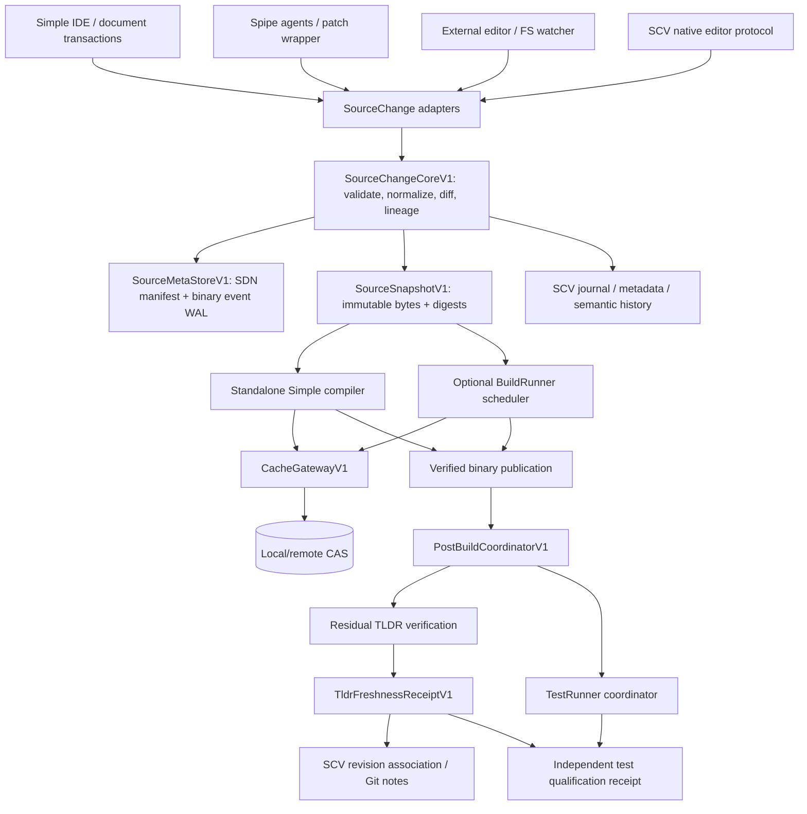
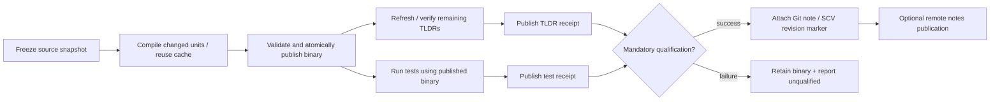

# Simple Compiler — Shared Edit Metadata, Incremental Build, TLDR Freshness, and Asynchronous SCM Checkpoints

**Date:** 2026-10-08  
**Status:** Final architecture/design recommendation; **not implemented or performance-qualified**  
**Projects:** [Simple](https://github.com/ormastes/simple), [Spipe](https://github.com/ormastes/Spipe)  
**Scope:** Simple compiler, Simple IDE, Spipe, SCV/Git/jj, BuildRunner, TestRunner, bootstrap, `.tld`/`__init__.tld`, SMF artifacts  
**Source basis:** Inspected default-branch code and project designs (repository search results observed at revision `2e43233b11fbbd837535d9313a168f729fad7f46`); compared with Git, Tree-sitter, Jujutsu, Salsa, and Bazel documentation. This is **not** an implementation or benchmark report.

> **Terminology:** “TLDR” below means the **compiler's generated public interface summaries** (`.tld`, `__init__.tld`, and their cache/virtual projections), **not** `*_tldr.md` documentation companions. The distinction matters: document TLDR freshness is a separate document-generation gate.  
> The shorthand **“gb”** in the request could not be identified as a defined Simple command in the inspected search results. This proposal implements its described behavior as the **Git/SCV-based post-binary freshness gate**; it does **not** presume an existing `gb` CLI.

---

## 1. Executive decisions

1. **One change engine:** Simple IDE, Spipe agent wrappers, SCV watcher/editor adapters, and arbitrary external editors all feed the same `SourceChangeV1` service. The *contract, normalization, validation, hashing, serialization, and stale-meta recovery* are shared. No independent IDE/Spipe edit log implementations.
2. **SDN + binary only:** Canonical, versioned SDN for manifests, debug inspection, checkpoints and receipts; length-framed binary for high-frequency edit events and optional packed indexes. No JSON control plane and no per-keystroke tracked source-tree files.
3. **SCV metadata is the durable repository owner:** Extend existing `.scv/meta/metadata.sdn` and its WAL. A transient common change log feeds SCV; SCV stores logical file/version change lineage. Git portability uses a concise Git note/receipt, not a duplicate durable database committed to the source tree.
4. **Timestamp is a hint, not truth:** Commit time, mtime, inode and branch name never authorize a TLDR hit. Validity uses a frozen source tree/snapshot, content hashes, producer/grammar/schema/feature configuration, semantic-read coverage, and verified artifact hashes.
5. **Fast freshness checkpoint:** After all TLDRs in an explicit *project/target/profile scope* are verified, publish a `TldrFreshnessReceiptV1`. Attach to an exact Git commit under **`refs/notes/simple-tldr`** (default), or to an SCV revision as a typed associated object. It records the covered source and artifact roots, rather than asserting universal freshness across unbuilt configurations.
6. **No stamp before proof:** Commit-message trailers may be inserted synchronously when already verified. A *new* post-commit verification result is published asynchronously as a **Git note**; never amend existing commits or change their hash merely to attach freshness data. Do not create one Git tag per build.
7. **Binary-first pipeline:** `compile → verify object/link inputs → publish binary → launch residual TLDR verification and TestRunner tasks → issue freshness/test receipts → optionally attach/push note`. A successfully published binary remains available even if later checks fail, but **CI/release cannot claim qualified success until mandatory gates settle**.
8. **Compiler stays standalone:** `simple compile` and `simple build` work with an embedded local cache provider; BuildRunner, TestRunner, SCV, Git, and any daemon are optional adapters. TestRunner reuses the cache gateway and runs the **remaining** freshness checks; it cannot be a prerequisite for compilation.
9. **Avoid work before optimizing storage:** Exact per-module semantic dependency witnesses and partial reparsing have higher expected leverage than repacking SMF. Default development storage should be a **hybrid `.smf/` manifest + CAS**, with a packed `.smf` for tiny artifacts, distribution and launch.

### Critical correctness distinctions

- `binary_ready != tldr_verified != test_passed != commit_published`.
- A **committed** source tree, Git **index**, dirty **working tree**, and unsaved **IDE buffer** are four distinct snapshots. A marker for one must not be silently applied to another.
- A Git note is **supplementary evidence**, not an authority substitute: its schema, coverage, content digests, inputs and referenced CAS objects are independently validated. Absent/incomplete/stale notes produce an incremental verification or full fallback, never a false pass.
- `all TLDR current` means **all expected modules/headers under the declared, sealed scope and configuration**; it cannot mean every hypothetical backend or `@when` variant unless all are explicitly enumerated and verified.

---

## 2. What currently exists — code-grounded review

| Area | Observed implementation or design | Gap to close |
|---|---|---|
| Frontend cache | [`frontend_parse_cache.spl`](https://github.com/ormastes/simple/blob/2e43233b11fbbd837535d9313a168f729fad7f46/src/compiler/10.frontend/frontend_parse_cache.spl) caches flat AST pools keyed by source bytes and scoped compiler identity. Documented front-end cost is dominated by parsing/desugaring. | Region-level reparse; shared source snapshot/metadata adapter. |
| HIR cache | [`driver_hir_cache.spl`](https://github.com/ormastes/simple/blob/2e43233b11fbbd837535d9313a168f729fad7f46/src/compiler/80.driver/driver_hir_cache.spl) hashes the *whole frozen surface closure* for safety. | Replace over-invalidation only after complete dependency/read-set witnesses are proven. |
| TLDR metadata | [`package_tldr_metadata.spl`](https://github.com/ormastes/simple/blob/2e43233b11fbbd837535d9313a168f729fad7f46/src/compiler/80.driver/cache/package_tldr_metadata.spl) already defines `PackageTldrHeaderV1`, variant keys, source witnesses, dependency/SMF digests, interface/action keys, and admission. | Publish a cross-module, cross-commit **freshness receipt** and delta validation. Do not duplicate existing header identities. |
| Semantic cache architecture | [`compiler_semantic_cache_manager_tldr.md`](https://github.com/ormastes/simple/blob/2e43233b11fbbd837535d9313a168f729fad7f46/doc/04_architecture/compiler_semantic_cache_manager_tldr.md) proposes `CacheGatewayV1`, `SummaryStoreV1`, `.tld`/`__init__.tld`/`.rr`, immutable CAS and journal. It clearly labels the `.tld` execution path a **proposal**. | Extend/implement rather than creating a competing cache manager. |
| Simple IDE edit model | [`document/transaction.spl`](https://github.com/ormastes/simple/blob/2e43233b11fbbd837535d9313a168f729fad7f46/src/lib/editor/document/transaction.spl) has ordered byte-offset edits with inverse operations; [`document/registry.spl`](https://github.com/ormastes/simple/blob/2e43233b11fbbd837535d9313a168f729fad7f46/src/lib/editor/document/registry.spl) tracks versions, undo, save and views. | Emit normalized edit events through one shared publisher; avoid parallel logs. |
| SCV metadata | [`metadata_db.spl`](https://github.com/ormastes/simple/blob/2e43233b11fbbd837535d9313a168f729fad7f46/src/lib/scv/metadata_db.spl) uses `.scv/meta/metadata.sdn`, WAL and existing tables including `file_entity_version`, `parse_index`, `event_batch`. | Schema migration for normalized change summaries and TLDR receipts. |
| SCV editor session | [`parser_session.spl`](https://github.com/ormastes/simple/blob/2e43233b11fbbd837535d9313a168f729fad7f46/src/lib/scv/parser_session.spl) records exact `TSInputEdit` ranges; currently explicitly **full-reparses + structural deduplicates**, because retained-tree runtime support is unavailable. [`nvim_protocol.spl`](https://github.com/ormastes/simple/blob/2e43233b11fbbd837535d9313a168f729fad7f46/src/lib/scv/nvim_protocol.spl) treats external changed-range hints as untrusted. | Shared parser edit subscription and genuine incremental parser backend; preserve the existing honest fallback. |
| SCV event ingestion | [`event_coalesce.spl`](https://github.com/ormastes/simple/blob/2e43233b11fbbd837535d9313a168f729fad7f46/src/lib/scv/event_coalesce.spl) batches editor/fs/save/VCS events; [`journal.spl`](https://github.com/ormastes/simple/blob/2e43233b11fbbd837535d9313a168f729fad7f46/src/lib/scv/journal.spl) owns event WAL; [`sj_capsule.spl`](https://github.com/ormastes/simple/blob/2e43233b11fbbd837535d9313a168f729fad7f46/src/lib/scv/sj_capsule.spl) establishes exclusive mutation lease. Its jj bridge is explicitly incomplete/seamed in the inspected source. | Feed the common edit engine into these existing owners; do not bypass the SCV/jj transaction owner. |
| BuildRunner | [`buildrunner/task_database.spl`](https://github.com/ormastes/simple/blob/2e43233b11fbbd837535d9313a168f729fad7f46/src/app/buildrunner/task_database.spl) has immutable task identities/receipts; [`buildrunner/cli.spl`](https://github.com/ormastes/simple/blob/2e43233b11fbbd837535d9313a168f729fad7f46/src/app/buildrunner/cli.spl) verifies and publishes task outputs. | Add post-binary task scheduling/receipts over the same scheduler; no synchronous SCM activity on compile critical path. |
| TestRunner | [`test_runner_single.spl`](https://github.com/ormastes/simple/blob/2e43233b11fbbd837535d9313a168f729fad7f46/src/lib/nogc_sync_mut/test_runner/test_runner_single.spl) explicitly keeps minimal child test execution independent of full discovery/daemon modules. | Add freshness checking to the **coordinator** via an optional adapter, not the minimal child. |
| Existing Git receipt practice | [`sign-local-ci-receipt.shs`](https://github.com/ormastes/simple/blob/2e43233b11fbbd837535d9313a168f729fad7f46/scripts/check/sign-local-ci-receipt.shs) and [`local_ci_receipt/design.md`](https://github.com/ormastes/simple/blob/2e43233b11fbbd837535d9313a168f729fad7f46/doc/05_design/infra/local_ci_receipt/design.md) already use Git notes/receipt patterns. Script/design have had distinct identities and evolving policy; source should be rechecked before reuse. | A **separate** notes ref and signed/unsigned authority policy for TLDR; never mix with `ci-receipts`. |
| Existing binary precedent | [`replay/event_log.spl`](https://github.com/ormastes/simple/blob/2e43233b11fbbd837535d9313a168f729fad7f46/src/lib/nogc_sync_mut/replay/event_log.spl) uses an SDN manifest with binary event payloads. | Reuse the architectural pattern, not its replay wire schema. |
| Static dependency pruning | [`static_when_tldr_build_pruning.md`](https://github.com/ormastes/simple/blob/2e43233b11fbbd837535d9313a168f729fad7f46/doc/05_design/static_when_tldr_build_pruning.md) defines sealed static universes, guarded dependencies and completeness. | Make TLDR freshness *configuration- and guard-universe-scoped*. |

**Do not present proposal documents as landed functionality.** Baseline and acceptance tests must establish whether each feature actually runs through the native compiler, standalone CLI, IDE, SCV and BuildRunner execution paths.

---

## 3. Architecture and owners



### Dependency direction

| Layer | Owns | Must not import |
|---|---|---|
| `src/lib/common/source_change/` | Immutable value types, canonical identities, pure validation rules, binary/SDN *schemas* | IDE app, Spipe CLI, Git, SCV mutable store, BuildRunner |
| `src/lib/nogc_sync_mut/source_change/` | Snapshot capture, event codec/writer, WAL, memory budget, IPC facade | IDE GUI, TestRunner, compilation internals |
| `src/lib/editor/…` | IDE transaction adapter; publishes events after versioned edit succeeds | SCV concrete database internals |
| `src/lib/scv/…` | Event adapter, authoritative SCV file history, metadata migration and revision association | Compiler parser implementation details |
| Spipe repository | Agent/tool edit interception and manifest-compatible event publishing | Independent edit metadata algorithms |
| `src/compiler/10.frontend/` | Token/AST incremental reuse and `.tld` production | SCM writes, source commits |
| `src/compiler/80.driver/cache/` | Semantic witnesses, TLDR freshness verifier, shared CAS admission | Test execution machinery |
| `src/app/buildrunner/` | Optional parallel scheduling and post-build orchestration | Compiler semantic authority |
| TestRunner coordinator | Tests, pending TLDR verification, qualification receipt | Git notes writer or mandatory compiler bootstrap dependency |
| `src/lib/scv/` / SCM adapter | Notes/SCV association and commit-time integration | Rewrite of compiler result or source when stamping |

### Shared interfaces — proposed (do not confuse with existing signatures)

```simple
# src/lib/common/source_change/contracts_v1.spl
struct SourceEditV1:
    path: text                    # canonical repo-relative path
    old_snapshot: text            # digest or validated in-memory version ID
    old_start_byte: u64
    old_end_byte: u64              # half-open
    new_bytes_digest: text
    new_byte_len: u64
    origin: EditOriginV1           # Ide, Spipe, Scv, Fs, Git, External
    transaction_id: text          # groups atomic refactors/renames

struct SourceChangeBatchV1:
    schema: u32
    root_identity: text
    before_root_digest: text
    after_root_digest: text
    sequence: u64
    edits: [SourceEditV1]
    complete: bool                # false = hints only; never a proof

# pure result; no IO or SCM mutation
fn source_change_validate_v1(old: SourceSnapshotV1,
                             batch: SourceChangeBatchV1,
                             new: SourceSnapshotV1) -> Result<ValidatedChangeV1, ChangeErrorV1>

# src/lib/nogc_sync_mut/source_change/service_v1.spl
fn source_change_publish_v1(change: ValidatedChangeV1) -> Result<SourceRevisionV1, ChangeErrorV1>
fn source_change_reconcile_v1(snapshot: SourceSnapshotV1) -> Result<SourceRevisionV1, ChangeErrorV1>
fn source_change_inspect_v1(revision: SourceRevisionV1) -> SourceChangeSummaryV1
```

`SourceSnapshotV1` must include byte-owner/generation, complete file inventory root, digest algorithm, path normalization policy, save-state (buffer/index/worktree/commit), and an explicit immutable generation token. All multiline string/byte spans are defined in **bytes**, not Unicode codepoints. For multi-edit transactions use a defined base-coordinate convention or replay each edit in order against the previous result; never mix coordinate systems.

**No second metadata owner:** editor and Spipe produce events; the shared core normalizes/validates; SCV stores durable repository facts. CacheGateway stores derived parser/semantic artifacts. A separate per-user change daemon is a performance optimization only.

---

## 4. Shared edit capture and stale `.meta` recovery

### 4.1 Input adapters

**Simple IDE:** On successful `DocumentRegistry.apply`/undo/redo, convert `DocumentTransaction` to `SourceChangeBatchV1` using the existing buffer version and exact old/new bytes. Attach save boundaries. Do **not** duplicate undo history. Version updates and event publication should use a transactional outbox: if the metadata writer fails, the edit remains valid and a recovery marker requests snapshot reconciliation.

**Spipe:** Wrap supported agent write/replace/patch/refactor actions and send the *actual observed file diff*, not the agent's stated intent. Prefer a single local library/IPC adapter that can be called by Simple code or a thin JavaScript/CLI wrapper. Record operation class and opaque session ID; never store full prompts, credentials, or chat bodies. If a tool edits a file outside the wrapper, filesystem reconcile handles it.

**SCV/Neovim:** Convert existing exact `TSInputEdit` information and `scv/editor/v1` operations into the same contract. Reuse `scv_coalesce_*` for debounce, atomic-save normalization and VCS bulk updates. An editor-supplied changed-range hint is not an admission proof.

**Git/jj/external editor:** On checkout, rebase, merge, branch switch, direct file modification, watch overflow or lost event cursor, capture the resulting files once and perform a structural/byte diff. Preserve rename/move lineage where exact IDs or verified structural evidence exist; otherwise record delete+add rather than invent lineage.

### 4.2 Validation/fallback precedence

1. Immutable IDE/SCV event chain with base and resulting snapshot hashes matching exactly ⇒ **fast path**.
2. Trusted SCV content/commit delta with verified before/after object hashes ⇒ **diff fast path**.
3. Snapshot mismatch, missing metadata, watcher overflow, app crash, external write, or stale editor version ⇒ **reconcile by bytes**, compare digests and derive diff.
4. If diff cannot be validated cheaply or parser boundary conditions fail ⇒ **full tokenization/reparse**; never false reuse.
5. Store the *recovered diff only* and a `reconciled` provenance flag; do not manufacture missing historical keystrokes.

### 4.3 On-disk layout

```text
.scv/
  meta/
    metadata.sdn            # EXISTING SCV database: extend/migrate
    metadata.sdn.wal        # EXISTING WAL mechanism
    change/
      current.meta.sdn      # new canonical, compact readable checkpoint
      events-00001.meta.bin # new bounded append-only event segments
      events-00002.meta.bin
    tldr/
      index.sdn             # checkpoint pointers, status, SCV revision mapping
  objects/
    ...                    # existing SCV immutable objects

build/.simple/
  source-meta/
    snapshots/             # local snapshots / transient indexes
    edit-spool/            # unattached events awaiting SCV publication
  cache/
    cas/                   # parser/HIR/MIR/SMF objects, not duplicated in SCV
  postbuild/
    jobs.sdn               # durable job state / separate from source tree
    receipts/
```

`.meta` is a **logical metadata artifact family**. For a per-file inspection projection, support `<logical-source>.meta.sdn` generated under `build/.simple/source-meta/inspect/`; do not write an adjacent tracked `foo.spl.meta.sdn` on every keystroke. Users may explicitly export tracked review metadata for a release, but it is not a compiler input or mandatory source modification.

### 4.4 SDN example — `current.meta.sdn`

```sdn
meta:
  schema: simple.source-change/1
  owner: scv
  root_identity: project-root-v1
  sequence: 2815
  snapshot_digest: sha256:<hex64>
  event_segment: events-00002.meta.bin
  event_segment_digest: sha256:<hex64>
  complete: true
  reconciled: false

files:
  - path: src/app/hello.spl
    file_id: <stable-scv-file-id>
    before_digest: sha256:<hex64>
    after_digest: sha256:<hex64>
    operation: modify
    changed_ranges: [[120, 156]]
    source: spipe
    transaction_id: <opaque-id>
    source_revision: 2815
```

This is a **schema illustration**, not an assertion that Simple's current SDN parser accepts all shown literal/container forms without normalization. The schema owner must choose canonical byte encoding/escaping using the repository's existing SDN codec and add a byte-for-byte round-trip test.

### 4.5 Binary wire format — `SMET` v1

A packed binary payload is worthwhile only when event volume/size makes SDN costly. Use explicit little-endian fields and bounded TLV records; **never** serialize host structs, pointers, or allocator IDs directly.

| Field | Width | Rule |
|---|---:|---|
| Magic | 4 B | `SMET` |
| Major/minor | 2+2 B | Reject unknown major; minor via compatible TLV rule |
| Header bytes | 4 B | Minimum bounded size; checked offsets |
| Flags | 4 B | Known critical flags only |
| Root/snapshot digest | 32+32 B | SHA-256 raw bytes, algorithm fixed per version |
| Sequence range | 8+8 B | Monotonic, no overlap within stream |
| Entry count | 4 B | Max configured, checked on decoding |
| Record table offset/bytes | 8+8 B | Overflow-safe arithmetic |
| File/segment checksum | 32 B | SHA-256 over canonical encoded content excluding checksum field |
| Each TLV | kind u16, version u8, flags u8, length u32, payload | Unknown optional: skip; unknown critical: reject |

For frequent event writes, use length+CRC32 per event or frame, followed by periodic SHA-256-sealed segment publication. A CRC detects torn journal tails cheaply; cryptographic digests establish immutable content identity. Verify bytes and path safety before exposing any cache hit. Use batch append, fsync/checkpoint policies tied to durability tier, temp+rename for immutable segment publication, and recover only a fully committed prefix.

### 4.6 SCV database migration

Do **not** replace `.scv/meta/metadata.sdn`. Add a schema-v2 migration with additive typed tables or existing-table extensions:

| New table | Key | Essential columns |
|---|---|---|
| `source_change_batch` | batch_id | start/end seq, before/after root, segment digest, completeness, origin class |
| `source_file_delta` | batch+file_id | previous/next content IDs, path transition, byte range descriptor, diff object ID |
| `tldr_freshness` | scope+variant+root | producer schema, source root, tld root, manifest CAS ID, verification state |
| `scm_receipt_link` | SCM kind+revision+scope | Git/SCV revision ref, receipt digest, attach state and causal task ID |

Keep synthetic first-column keys in accordance with the existing SCV metadata table implementation. All inserts/updates flow through the existing WAL/lease owner. `schema-v1` files remain readable during migration; missing v2 fields never imply fresh summaries.

---

## 5. Source/TLDR freshness identities — no timestamp dependency

### 5.1 Exact identities

Define:

- `SourceRoot`: SHA-256 Merkle root of normalized canonical path, path kind, source digest, directory/module membership and authoritative file inventory. Include files relevant to package discovery, not just currently imported modules.
- `LanguageRoot`: parser/grammar/semantic compiler producer identity; a parser implementation change may invalidate syntax even if source bytes do not change.
- `ConfigRoot`: sealed `@when` static universe + target/backend/features/ABI/configuration, and any semantically relevant environment/providing-plugin identity.
- `TldrRoot`: ordered commitment to each expected module's `.tld` digest, `__init__.tld` digest, schema, producer identity, active resolution/guard coverage and public surface/read-set witnesses.
- `ScopeRoot`: canonical declared inventory/closure definition (`project`, `package`, or `build-target`) and rules for discovering newly added modules.
- `CheckpointKey = H(domain, SourceRoot, LanguageRoot, ConfigRoot, ScopeRoot, TldrSchema, WitnessSchema)`.

**Do not use** wall clock, inode, `git log` time, branch name, untrusted edit range, or `.meta` modification time as fields in the semantic cache key. The *separate* receipt may record `verified_at_utc` as an annotation only.

### 5.2 TLDR current vs outdated

| Current source state | Correct decision |
|---|---|
| Source bytes identical and producer/config/root match | TLDR remains fresh; no regeneration. |
| Only private body changed, public/interface/initializer/effect projection unchanged | Recompute the affected producer, **keep identical TLDR digest**; downstream public dependents stay green if exact read sets permit. |
| Public signature, exported constant, trait/impl candidate set, macro/AOP/initializer effect changed | Recompute TLDR and dependent semantic queries; mark exact affected graph. |
| New source/module, deleted file, resolution-precedence change | Invalidate package membership/absence queries and `__init__.tld`; propagate appropriately. |
| `@when` guard/profile changed | Re-evaluate active semantic closure for **new configuration**; old-config TLDR remains valid for its own key. |
| `.meta` missing/stale | Diff/hash actual source, regenerate derived metadata; no false TLDR pass. |
| TLDR artifact corrupted/missing | Treat as miss and regenerate; do not accept receipt referencing unavailable artifact. |
| Different compiler/parser/plugin version | Compare phase-specific producer identity; invalidate affected phase, not necessarily unrelated phases. |

Existing [`native_module_cache_invalidation.md`](https://github.com/ormastes/simple/blob/2e43233b11fbbd837535d9313a168f729fad7f46/doc/02_requirements/feature/native_module_cache_invalidation.md) already requires exact per-module semantic witnesses; this proposal preserves that correctness rule.

### 5.3 Filesystem vs Git/SCV source-delta detection

| Signal | Use in algorithm | Safe authority? |
|---|---|---|
| mtime + size | Cheap unchanged candidate / skip needless reads inside a validated watcher epoch | **No**, alone |
| Git commit/tree/blob IDs | Exact committed tree comparison; changed path discovery | **Yes for committed snapshot**, with object hash and resolver coverage validation |
| Git `diff --name-status -z` | Changed/added/deleted/renamed file inventory, including path effects | Delta enumeration only |
| Git index + worktree status | Detect stage/unstaged/untracked differences against commit | Not an immutable snapshot until captured |
| SCV content-addressed revision | Source identity and version-to-version diff | Yes, if revision/content object verified |
| Trusted IDE buffer revision | Avoid diff when full event chain is present | Yes within validated retained buffer generation |
| Content SHA-256 | Strong content verification | Yes |
| Commit date/tag time | Human-readable annotation / heuristic | **No** |

**Git example (conceptual):** locate the newest eligible freshness checkpoint whose commit is an ancestor (or whose verified `SourceRoot` can be independently matched), then enumerate changes from its **tree** to target **tree**. Use NUL-delimited diff paths and include add/delete/rename/type-change, staged, unstaged and untracked relevant inputs for a worktree build. Always inspect module directory membership and configuration roots. An unrelated commit changing only documentation need not force source TLDR regeneration.

### 5.4 Delta verification algorithm

```text
verify_tldr_remaining(target_snapshot, scope, variant):
    baseline = find_latest_reachable_eligible_receipt(scope, variant)
    if baseline absent or schema/producer/coverage invalid:
        candidate_set = discover_full_expected_module_inventory(target_snapshot)
    else:
        changed = exact_tree_or_scv_delta(baseline.source_root, target_snapshot)
        changed += staged/unstaged/untracked changes if target is a worktree
        changed += changes in parser, rules, plugins, config, resolution roots
        candidate_set = dependent_closure_from_complete_semantic_read_sets(changed)
        if closure coverage not complete:
            candidate_set = discover_full_expected_module_inventory(target_snapshot)

    for module in candidate_set:
        current_source = capture_stable_bytes(module, target_snapshot)
        old_tld = lookup_verified_summary(module, variant)
        new_tld = load_or_generate_exact_summary(current_source, producer, variant)
        if summary_digest_changed(old_tld, new_tld):
            enqueue_semantic_dependents(module)
        record_verified_module_result(module, new_tld)

    verify complete inventory + all module/initializer/guard summaries
    verify required referenced objects, writer generation and manifest digests
    verify target snapshot still equals frozen input; otherwise restart or report stale
    if ALL covered and no unknown/missing/errors: issue verified receipt
    else: issue nonpassing diagnostic receipt (never a green checkpoint)
```

The *fast path* must still know whether the baseline is eligible for the target scope. A parent Git commit with `TLDR verified` for `build-target=hello` does **not** certify the entire repository. Do not silently broaden its coverage.

---

## 6. Freshness checkpoints in Git and SCV

### 6.1 Four approaches compared

| Technique | Git discoverability | Async after commit? | Rewrites source commit? | Recommendation |
|---|---|---|---|---|
| Commit-message trailer | Excellent (`git log`, `interpret-trailers`) | **No** for same immutable commit | Yes if added later | Optional at commit creation, only if already verified |
| Git note under `refs/notes/simple-tldr` | Good with explicit note ref / `git log --show-notes` | **Yes** | **No** | **Default Git representation** |
| Annotated Git tag per build | Visible, but many refs | Yes | No | **Reject** for per-build use; reserved for releases |
| Tracked `.meta` commit after build | Very visible | Yes | No to old commit, but creates new content commit | Avoid by default: churn, races, self-triggering builds |
| SCV typed revision-associated receipt | Excellent through `scv tldr history` | Yes | No | **Default SCV representation** |

Git trailers must be present when the commit is initially formed. Appending a trailer **after** commit creation modifies its commit object and hash; asynchronous verification therefore writes a note instead. [Git trailers](https://git-scm.com/docs/git-interpret-trailers) and [Git notes](https://git-scm.com/docs/git-notes) support these two distinct behaviors.

### 6.2 Receipt schema — one semantic payload, multiple SCM adapters

```sdn
receipt:
  schema: simple.tldr-freshness/1
  state: verified
  scope: project
  scope_root: sha256:<hex64>
  source_root: sha256:<hex64>
  config_root: sha256:<hex64>
  language_root: sha256:<hex64>
  tldr_root: sha256:<hex64>
  expected_module_count: 142
  verified_module_count: 142
  unavailable_module_count: 0
  required_artifact_root: sha256:<hex64>
  manifest_digest: sha256:<hex64>
  source_vcs: git
  source_revision: <full-commit-id>
  source_git_tree: <full-git-tree-id>
  verified_at_utc: 2026-10-08T00:00:00Z
  verification_mode: incremental
  verifier_digest: sha256:<hex64>
  provenance_build_receipt: sha256:<hex64>
```

`142` is **illustrative**, not a measured count. Timestamp, SCM identifiers, and provenance annotations are distinct from the semantic cache keys. If only a partial closure was checked, set `state: partial` and `scope: build-target`, never `state: verified` for a project. A passing receipt additionally binds the complete expected inventory manifest and its length. No `expected_module_count=0` success without an explicitly legitimate empty scope.

**Trust:** Validate the receipt schema, allowed/declared producer, exact source/config/scope roots, inventory coverage and retained object digests. On protected CI/release paths require an approved verifier identity/signature or independently re-run the required check. A hash proves integrity, **not** that an untrusted author actually performed verification.

### 6.3 Git adapter and commands (proposed workflow)

Write the note to the **frozen Git commit ID that was actually verified**, with `source_git_tree` and `source_root` embedded in the receipt. This makes `git log --show-notes=simple-tldr` human-readable. Independently index receipts by `SourceRoot` in CAS for reuse across cherry-picks/rebases, where commit IDs can change.

```sh
# See an asynchronous freshness receipt (if present)
git notes --ref=simple-tldr show HEAD

# Show commit history annotated with freshness notes
git log --show-notes=simple-tldr --oneline -n 10

# Optional user-configured publication: notes are not assumed to sync by default
git fetch origin refs/notes/simple-tldr:refs/notes/origin/simple-tldr
git push origin refs/notes/simple-tldr
```

The last push should occur only through a conflict-aware writer after review/permission. The tool above demonstrates the Git ref operations, **not** an instruction to auto-push without authorization. For multiple workers, queue notes through SCV's existing repository mutation lease (or Git-native single writer). On remote divergence: fetch, merge/reconcile **typed receipts** by `(commit, scope, config, source_root)` and retry with the expected old ref; never use `notes add -f` to silently overwrite conflicting proofs. `git notes merge -s cat_sort_uniq` is a generic line merge, **not by itself a safe merge of structured SDN documents**.

**Commit-time trailer, only when checkpoint is already valid:**

```text
Improve module dependency pruning

TLDR-Status: verified
TLDR-Source-Root: sha256:<hex64>
TLDR-Receipt: sha256:<hex64>
```

The commit hook checks the **staged index tree**, not the unsaved IDE buffer or current worktree. If the staged tree does not match a previously verified snapshot, insert no `TLDR-Status: verified` trailer; optionally insert `TLDR-Status: pending` or simply omit it. A read-only `commit-msg`/`prepare-commit-msg` integration must remain fast and never force full compilation inside a commit hook. Do not auto-amend commits to add receipts after the fact.

### 6.4 SCV adapter

`TldrFreshnessReceiptV1` becomes an immutable SCV object linked via `scm_receipt_link` to `backend_revision` / logical SCV commit or source-root identity. The authoritative SCV journal/lease transaction publishes this association; it does **not** elevate an unsupported/forced-unparsed SCV commit to public-ready. Existing `scv compile-gate`, `scv test-gate` and `public-ready` remain independent requirements; `tldr-verified` is an additional property, not a substitute.

Suggested commands (new, not currently documented as implemented):

```text
scv tldr status [--scope project|package|target]
scv tldr history [--limit N]
scv tldr verify [--remaining] [--scope project]
scv tldr attach --receipt <digest> --revision <revision>
scv tldr checkpoint --verify --async
```

### 6.5 Fast lookup for last valid checkpoint

1. Read tiny local `tldr/index.sdn` projection: latest eligible receipt by `(scope, variant, producer)`. It is an **acceleration index**, not trusted truth.
2. If the source is committed Git: use `git merge-base --is-ancestor <receipt-commit> <target-commit>` and `git diff --name-status -z <receipt-tree> <target-tree>` to enumerate changes; if not ancestor, try content-root equivalence or full fallback. Include rename/deletion and new package membership.
3. If the source is SCV: walk its revision/source-content index rather than scanning every file.
4. If a dirty worktree or IDE buffer: apply a verified overlay onto the frozen committed/base snapshot; otherwise hash a stable capture.
5. Re-evaluate module membership/absence guards and dependency read sets; regenerate only affected summaries. A local marker may be stale, deleted, or unavailable remotely—never accept without revalidating its payload and referenced artifacts.
6. Publish the new receipt only if complete and passing; leave the prior valid checkpoint untouched if current work is incomplete.

A received note that names a missing CAS manifest cannot certify output availability. It can at most help narrow which modules need checking, subject to complete/fail-closed evidence; otherwise regenerate.

---

## 7. Binary-first asynchronous build/test/commit DAG

### 7.1 Phases and barriers



**Important:** If a TLDR must exist to compile the binary, it is a **critical-path prerequisite**, not deferred. Only **residual project-wide TLDR freshness checks**, metadata compaction, provenance publication and non-required optional checks may start after binary publication. Mandatory test or freshness checks can run concurrently after the binary is ready, but they cannot be skipped or reported passed while pending.

| Event/state | Meaning | User-visible gate |
|---|---|---|
| `SOURCE_FROZEN` | Immutable compile input captured | Input prerequisite |
| `BINARY_READY` | Executable exists and output digest validated | Standalone build success permitted |
| `TLDR_PENDING` | Residual verification scheduled | Explicitly not certified |
| `TLDR_VERIFIED` | All scoped summaries current for frozen source | May create TLDR note |
| `TEST_PASSED` | Test runner completed for exact binary/source | Independent test qualification |
| `SCM_ATTACHED` | Receipt atomically associated with correct revision | Visible in local Git/SCV history |
| `SCM_SYNCED` | Remote notes/SCV transport explicitly acknowledged | Only if publication configured |
| `STALE_SNAPSHOT` | Source changed before receipt could be bound | No success marker; schedule new generation |
| `POSTBUILD_FAILED` | Failure after binary publication | Keep executable; release/CI gate fails |

**Critical design point:** Publication success can be asynchronous; the *qualification verdict* must be synchronous at the time a mandatory gate is evaluated. A gate reading `PENDING` returns pending/nonpass and waits on its orchestrator's properly supervised jobs; it must not convert “scheduled” into “passed.” The process is not complete if required workers are still running.

### 7.2 Post-build task contract

```simple
struct PostBuildTaskV1:
    job_id: text
    frozen_source_root: text
    binary_digest: text
    scope_root: text
    config_root: text
    task_kind: PostBuildKindV1     # VerifyTldr, RunTests, AttachScmReceipt, SyncScm
    mandatory_for: QualificationV1 # None, LocalTest, CI, Release
    dependency_ids: [text]
    max_attempts: u8

fn postbuild_submit_v1(task: PostBuildTaskV1) -> Result<JobReceiptV1, PostBuildErrorV1>
fn postbuild_status_v1(job_id: text) -> JobStatusV1
fn postbuild_wait_required_v1(build_id: text, tier: QualificationV1) -> QualificationReceiptV1
```

Integrate with current BuildRunner task identity, attempt journal, output validation and TaskRunner scheduler **without requiring BuildRunner to be running for standalone compile**. The embedded post-build coordinator may execute tasks as child processes or via an optional daemon. Use a durable bounded job queue and parent ownership: foreground CLI can report `binary ready, qualification pending (job id …)` and exit successfully **only for explicitly non-mandatory checks**. For CI/release, `wait_required` must observe terminal receipts and return failure if any mandatory check is incomplete, missing, stale or failed.

### 7.3 TestRunner: remaining-TLDR check

The TestRunner **coordinator** should call the same `TldrFreshnessVerifierV1` used by the compiler and post-build worker. Do not add a second TLDR parser and do not import the full daemon into minimal per-test children.

1. Start from the exact binary/source snapshot receipt.
2. Get the last admissible freshness checkpoint and already-verified modules in the current build action journal.
3. Determine `remaining = expected_scope − verified_current_generation` plus invalidated dependencies/candidate membership.
4. Run/await `verify_tldr_remaining(remaining)` while tests use the **already-published** binary.
5. At finish, independently attest `binary_digest`, test results, TLDR receipt, source/config/schema identities.
6. If `remaining` is empty, perform only the cheap nonvacuity/receipt validation; do **not** trigger a whole-tree reparse.
7. For strict/CI/release, any `unknown/pending/stale/corrupt` is nonpass. For developer workflows it can be warning/pending without invalidating an already-built binary.

Proposed interface:

```text
simple build --tldr-postcheck=async --scm-stamp=local
simple test --tldr-check=remaining
simple test --tldr-check=project --qualification=ci
simple tldr status --scope=project
simple tldr verify --since-checkpoint
simple postbuild status <job-id>
simple postbuild await <job-id>
```

These command forms are **planned**. Final names should follow the Simple CLI's actual command/option conventions, avoiding gratuitous new subcommands.

### 7.4 Should source commits themselves be asynchronous?

**Default: NO automatic source commit.** The user/agent remains author of source-history changes. **YES** to asynchronous freshness-note/SCV association after binary generation. When specifically authorized by project configuration and command invocation, support an **opt-in asynchronous source commit** with safeguards:

- Freeze an explicit path allowlist and intended Git **index tree** or SCV change ID; never `git add -A` implicitly.
- Wait for required checks of **that same tree**; use one SCM writer/lease per checkout and an expected-current-HEAD comparison.
- Re-check branch/HEAD/index, user worktree and any protected branch policy. On mismatch, abandon or requeue, never overwrite human changes or force push.
- Use configured author/message/trailer policy; do not put a false verified trailer in a new commit before the checks have passed.
- After the source commit is created, attach the receipt asynchronously (if needed) without amending it.
- CLI reports `commit pending`, `commit created <id>`, or a clear failure; a queued commit cannot be described as completed.

This provides “easy freshness-aware commit” without risky surprise commits. Prefer an explicitly invoked `simple scm commit --verify-tldr --async` (proposed) or a fast Git hook + post-commit worker. Local Git hooks are developer conveniences; **server-side policy/CI remains the authority** because local hooks can be bypassed or absent.

---

## 8. How the cache, SMF layout and BuildRunner fit

### 8.1 Shared cache, standalone compiler

```text
Compiler -> CacheGatewayV1
             |-- in-process local CAS (mandatory fallback)
             |-- persistent per-user daemon (optional)
             |-- BuildRunner provider (optional)
             |-- remote CAS (optional)
```

`BuildRunner` owns transport, scheduling and resources; compiler owns semantic action keys and exact artifact eligibility. Compiler can compile without TestRunner, Git, SCV, Spipe, IDE or BuildRunner. Both standalone and managed compilation must use the same canonical input-key contract.

### 8.2 SMF file/directory choices

| Mode | Representation | Choose when |
|---|---|---|
| `packed` | One `.smf` | Small hello binary, startup-critical loader, release/deployment |
| `directory` | `.smf/` manifest + objects | Frequent partial updates, distributed compile, per-unit caching |
| `hybrid` | `.smf/manifest.sdn` + CAS refs, optional local packed bundle | **Recommended development default** |
| `auto` | Profile-guided selection | Tune by I/O/packing/link costs; compare real workloads |

Suggested `.smf/` directory references `tld`, `ast`, `hir`, `mir`, `obj`, `meta`; **do not** duplicate all artifact bytes under every directory. Keep the existing on-wire SMF version/loader intact; directory layout is an optional build artifact representation with its own versioned manifest and pack/unpack compatibility tests.

### 8.3 Bootstrap and phase-specific reuse

- Snapshot compiler, runtime and library producers independently. Keep source, frontend, HIR, MIR/object and linker identities distinct.
- Rebuild only required native library/object closure for the chosen target (`hello world` needs its actual reachable runtime objects, not the entire compiler library inventory).
- A compiler change that affects parsing invalidates frontend products; a backend-only change should not automatically invalidate target-independent AST/TLDR, barring target-aware conditions.
- `full-bootstrap` still validates seed/provenance; ordinary `dynload` relies on previously admitted libraries. Never let a late freshness note substitute for compiler/runtime correctness receipts.
- Include byte and memory cost of digesting, SDN decode, many small files, lock contention, and process startup in performance evaluation.

---

## 9. Failure/race/security matrix

| Scenario | Required behavior |
|---|---|
| IDE event received but save loses power | WAL prefix recovery; compare current bytes; reconcile, never claim missing edits. |
| Editor buffer differs from disk and HEAD | Separate identities; compile chosen buffer snapshot explicitly, refuse to stamp unrelated Git commit. |
| Spipe agent applies multi-file refactor | Atomic logical transaction; per-file byte hashes and one group ID; partial failure becomes incomplete and requires reconcile. |
| Agent bypasses adapter | Watcher/diff fallback, not stale edit-log admission. |
| `.meta` missing, corrupt, reordered or from old generation | Reconstruct only verified diff, discard unsupported lineage, full reparse when needed. |
| Commit timestamp newer than TLDR, but source body unchanged | Compare actual source/public summary, not time. |
| Commit timestamp older but source changed | Detect via content/tree/index overlay; invalidate. |
| `git checkout`/rebase/merge moves HEAD during async work | Keep original frozen job bound; only attach to exact verified commit; new HEAD requires new check. |
| Two concurrent note writers | Single SCM writer + ref compare-and-swap; merge typed nonconflicting receipts; no blind overwrite. |
| Notes ref absent after clone/fetch | Unknown checkpoint; reverify locally; optional explicit note-ref fetch. |
| Repo has submodules, sparse checkout or missing generated inputs | Include resolved module inventory/capabilities in `ScopeRoot`; missing needed source is nonpass. |
| `.tld` file exists but hash/witness/header is wrong | Miss and regenerate, never assume presence ⇒ valid. |
| New overload/trait/impl/aspect/filename shadows old absence result | Invalidate membership/negative-query roots, even without prior direct edge. |
| Compiler emits binary, test later fails | Keep binary; test qualification fails; TLDR may still independently verify. |
| Compiler binary produced, required TLDR verification pending | Report `binary_ready`, `qualification_pending`; CI/release cannot pass yet. |
| User starts new edit during post-build checking | Receipt remains tied to immutable old snapshot; cannot certify new worktree. |
| Source commit requested automatically but staged tree changed | Cancel/abort safely; never create partial/unexpected commit. |
| Corrupt or malicious Git note/SCV receipt | Schema/identity/digest/authorization verification fails; run fallback. |
| Remote cache returns stale object | Recheck digest and complete semantic witnesses; local rebuild/fail closed. |
| Cache daemon unavailable | Bounded fallback to embedded cache client or correct uncached compilation. |
| Metadata leaks prompts/secrets | Store opaque provenance and edits/digests only; respect access policy and retention. |

### Commit and note isolation

Keep `refs/notes/simple-tldr` **separate** from the existing `refs/notes/ci-receipts`. Notes publication is an SCM side-effect, not a compiler artifact key or an input to the source compiler itself. Otherwise adding a stamp could create a self-invalidating loop. Git source refs, notes refs, and SCV metadata generation must be tracked independently.

---

## 10. Detailed implementation work packages

| Phase | Priority | Work package and proposed files | Definition of done |
|---|---|---|---|
| 0 | P0 | Baseline + feature inventory: inspect `CacheGatewayV1` status, `.tld` actual path, TestRunner/BuildRunner behavior; add metrics. | Tests prove current paths; cold/warm/body-edit timings captured with RSS and I/O. |
| 1 | P0 | `src/lib/common/source_change/{contracts,codec_contract,identity}_v1.spl`; `src/lib/nogc_sync_mut/source_change/{service,journal,codec}_v1.spl` | Shared schema round trip; content validation; truncation recovery; CPU/memory budget. |
| 2 | P0 | IDE `DocumentRegistry` adapter; Spipe tool/agent bridge; SCV `nvim_protocol`/coalesce adapter | Identical edits from all three produce identical canonical event digests and diff summaries. |
| 3 | P0 | `src/lib/scv/metadata_db.spl` v2 migration + `src/lib/scv/source_meta_adapter_v1.spl`; source journal recovery | No duplicate writer; legacy metadata migrates idempotently; stale `.meta` reconciles. |
| 4 | P0 | `src/compiler/80.driver/cache/tldr_freshness_v1.spl` + shared receipt contract; reuse existing `package_tldr_metadata.spl` and cache gateway | Cold/full and warm/delta validation agree; missing/invalid witnesses fail closed. |
| 5 | P0 | Git/SCV receipt adapters, commit hook integration, local index and note writer | Correct immutable commit binding; `git log` note visibility; no unexpected HEAD moves/commits. |
| 6 | P0 | PostBuildCoordinator over existing task journal; TestRunner coordinator adapter | Binary published before post-check jobs; correct pending/settled distinction; required gates cannot false-pass. |
| 7 | P1 | Region parser reuse in `src/compiler/10.frontend/` and SCV retained-tree backend; integrate `.tld` producer dependency readings | Byte-for-byte AST/diagnostic parity; small-edit parse avoidance measured. |
| 8 | P1 | Source/summary read-set precision and static `@when` dependency completeness | Body-only edits avoid downstream rebuild; added symbol candidates invalidate properly. |
| 9 | P1 | Hybrid `.smf/` artifact representation with CAS refs + pack adapter | Single-file compatibility retained; no duplicate large object bytes; cold/warm perf gate. |
| 10 | P1 | Bootstrap selective libraries, persistent BuildRunner workers, cache-provider location config | Hello only builds reachable libs; repeat bootstrap saves work without sacrificing provenance. |
| 11 | P2 | Remote note/CAS transport, retention, statistics, compact binary archive, optional authorized async commits | Multi-worktree/remote convergence; remote conflict and crash tests. |

**Migration order matters:** ship change metadata and receipts in shadow/read-only mode first. Allow performance wins only after fresh-vs-reused artifacts and diagnostics match. Rollback feature flags should let builds ignore metadata and perform correct full compilation.

### Naming and compatibility

- Names ending `V1` are proposed contracts, not evidence of existing files.
- Match Simple language naming/enum policy and existing SDN canonical encoding; avoid JSON and stringly typed condition evaluations for static guards.
- Preserve existing `PackageTldrHeaderV1`, `ActionRootJournalV1`, SMF binary schemas and established SCV transaction semantics. Version new contracts independently rather than silently reusing old formats.
- A retired `.meta` schema remains readable for migration, but cannot authorize fresh outputs without complete new witnesses.

---

## 11. Acceptance tests, fixtures and qualification gates

### 11.1 Unit tests

1. Canonical SDN encode/decode and binary TLV encode/decode are deterministic on Linux/Windows/macOS with byte-for-byte golden data.
2. Edit byte offsets, line ending changes, UTF-8 multibyte boundaries, file adds/deletes/renames and multi-file transactions round-trip exactly.
3. Three producer adapters (IDE, Spipe, SCV) yield identical change batch digests for equivalent actual source transitions.
4. Wrong old snapshot, tampered new payload, corrupt/truncated WAL, wrong sequence, missing source and unsupported critical TLV cause fail-closed reconciliation.
5. `SourceRoot` is invariant to edit actor/branch/commit timestamp but changes on source inventory/materialized bytes/config-relevant identities.
6. TLDR validator detects header producer/schema mismatch, missing modules, stale `__init__.tld`, absent semantic negatives, changed `@when` universe and source witness mismatch.
7. A nonempty, complete module inventory is required before asserting `project verified`; partial scopes are never promoted implicitly.
8. No note/CAS reference is accepted if its target snapshot, source/config/root or artifact object differs.

### 11.2 Integration tests — required matrix

| Fixture | Expected result |
|---|---|
| Cold project, no prior receipt | All expected summaries generated/verified; first checkpoint created after success. |
| Warm unchanged project | Fast root/receipt validation; zero regenerations. |
| One-line comment/private-body edit | Minimal reparse; TLDR digest unchanged when public semantics unchanged; no unnecessary dependent object rebuild. |
| Public signature edit | Changed module TLDR and exact downstream dependents invalidated. |
| New import/overload/trait/impl/aspect | Negative-query/membership invalidation; no stale HIR accepted. |
| Switch `os.windows` vs `os.linux` / static `@when` | Config-specific checkpoint isolation and exact active dependencies. |
| Rebase to same source tree but new commit ID | Semantic CAS reuse allowed; new commit association verified. |
| Dirty index vs worktree vs unsaved buffer | Distinct snapshot IDs; only exact target eligible for commit note. |
| SCV event log stale/missing | Diff fallback; new edit provenance labeled `reconciled`. |
| Source changes while post-build jobs run | Old job cannot mark new HEAD fresh; new generation remains pending. |
| Simultaneous compiler/IDE/Spipe/TestRunner workers | Single-flight CAS publication and safe SCV/notes writer serialization. |
| Test fails after successful build | Binary stays; test gate fails; freshness receipt remains independent. |
| Git notes unavailable remotely | Fallback verification and optional explicit sync; never false-green. |
| Git note claims complete but a TLDR object is gone | Miss/regenerate or fail; no shortcut. |
| Bootstrap cold/warm and hello world | Only reachable libraries built, exact outputs/provenance preserved. |
| Packed SMF vs directory SMF | Identical link/runtime behavior and semantic contents across layout modes. |

### 11.3 Benchmark criteria — proposed thresholds (not measured)

Measure **median and p95** wall time, CPU time, peak RSS, disk bytes, file opens, cache hit/miss reason and notes/SCV job latency on the same machine and source revisions. Required workloads: cold full bootstrap, unchanged warm build, hello world, single-line comment, function-body edit, public API change, new module, static variant flip, multiworktree replay, high parallelism and remote cache.

Suggested gates to be tuned from baseline:

- Standalone compiler: **zero** mandatory BuildRunner/TestRunner/SCV/Git process launches.
- Warm unchanged project: zero source-body parse/IR lowering/object emission unless an admitted input changed; fast checkpoint work should be bounded by source inventory and delta, not repeated full-tree parsing.
- Small edit: unchanged AST segment reuse and no gratuitous relowering of unaffected modules; verify with counters **and** fresh-parse parity.
- Post-binary scheduling overhead on compile critical path: one durable queue entry plus minimal O(1) metadata, target **< 10 ms p95** on representative local SSD; adjust after baseline.
- After a passing checkpoint, repeated note inspection must not launch the compiler or TestRunner.
- Metadata disk growth: capped journal segments, periodic compaction; keep raw editing events out of Git source history by default.
- Incorrect reuse / false positive TLDR `verified` verdict: **zero tolerated**. Unknown state is not pass.

Prove a reliable full fallback after deleting all `.meta`, `.scv` derived indexes, Git notes, local cache, or optional daemon. Separate **correctness gates** from performance gates and do not relax correctness to obtain a headline speedup.

### 11.4 Failure-mode observability

Emit per-build structured SDN counters:

```sdn
build_stats:
  binary_ready: true
  snapshot_root: sha256:<hex64>
  tldr:
    baseline_used: true
    expected: 142
    checked: 3
    reused_from_verified_receipt: 139
    regenerated: 1
    pending: 0
    state: verified
  cache:
    frontend_hits: 0
    hir_hits: 0
    obj_hits: 0
  postbuild:
    scheduled: 2
    completed: 2
    mandatory_failed: 0
  scm:
    note: attached-local
    remote_sync: not-requested
```

Numbers shown are illustrative. Counters must include **reason-coded** misses and actual phase timings rather than only totals. Do not emit a convincing `status=verified` summary if it is based on synthetic counts or unvalidated evidence.

---

## 12. Operational commands and mode defaults — proposal

### Example configuration

```sdn
simple:
  build:
    cache_provider: auto
    artifact_layout: hybrid
    cache_root: build/.simple/cache
    temp_root: system
    postbuild:
      tldr_verify: async
      coverage: project
      test: manual
  metadata:
    owner: scv
    store: auto
    canonical: sdn
    event_payload: binary_auto
    reconcile_on_missing: true
  scm:
    backend: auto
    freshness_note_ref: refs/notes/simple-tldr
    attach_note_after_verify: true
    auto_source_commit: false
    auto_push_note: false
  qualification:
    developer: warn_if_pending
    ci: require_tldr_and_tests
    release: require_tldr_and_tests
```

Defaults do not require SCV to be initialized: a compiler-only project uses a private `.simple/` metadata sink or no edit history, with source hashing as fallback. If both Git and SCV are active in a colocated checkout, use one explicit transaction owner and a single source-snapshot/receipt identity; do not let two independent daemons mutate HEAD or index.

### Workflow summary

| Command (proposed) | What happens synchronously | What happens asynchronously |
|---|---|---|
| `simple compile hello.spl` | Compile using in-process cache; publish binary/artifact | None required |
| `simple build --tldr-postcheck=async` | Publish binary, schedule bounded postcheck | Verify remaining TLDRs, issue local receipt |
| `simple test --tldr-check=remaining` | Run tests and confirm mandatory freshness before qualified success | Eligible independent checks can overlap |
| `simple tldr status` | Read local index + verify receipt identity; display `verified/pending/stale/unknown` | Nothing automatically committed |
| `simple scm commit --verify-tldr --async` | Explicitly freeze authorized stage/snapshot and enqueue conditional commit | Verify exact inputs; commit if still authorized; attach note |
| `scv tldr history` | Show retained typed freshness associations | No build required |

When the binary is produced but verification is pending, display **two separate results**: `binary: ready` and `project TLDR freshness: pending`. Never imply that the latter is already successful. In CI and release, success is the conjunction of all required terminal receipts for the same immutable source/binary identities.

---

## 13. Recommended first implementation slice

**Implement the smallest end-to-end vertical slice before true incremental parsing or remote CAS:**

1. Extend the existing IDE document transaction and SCV Neovim editor protocol to emit one validated `SourceChangeBatchV1`, storing to SDN+WAL.
2. Add an Spipe patch/replace adapter that emits exactly the same records; verify equivalent-event digests across all three.
3. Build `TldrFreshnessVerifierV1` over current `PackageTldrHeaderV1` / existing cache gateway using **conservative full invalidation** initially.
4. On a successful frozen project-scope verification, create one `TldrFreshnessReceiptV1`, attach to a Git note or SCV commit, and make it discoverable with `simple tldr status/history`.
5. After the binary output has been atomically published, let a post-build worker verify **only remaining summaries** and attach the receipt. Make CI wait for required jobs, while developer binaries are usable without waiting for optional jobs.
6. Only then optimize read-set precision, incremental parser, SMF layout, selective bootstrap libraries, and remote transport, each behind independent performance/correctness gates.

This delivers the main user-visible feature—**“which exact commit is TLDR-current, what changed since that checkpoint, and which summaries still need work?”**—without first having to complete the entire parser/cache refactor.

---

## 14. References and implementation notes

### Primary project sources

- [Compiler semantic cache manager TLDR — proposed architecture](https://github.com/ormastes/simple/blob/2e43233b11fbbd837535d9313a168f729fad7f46/doc/04_architecture/compiler_semantic_cache_manager_tldr.md)
- [Frontend parse cache implementation](https://github.com/ormastes/simple/blob/2e43233b11fbbd837535d9313a168f729fad7f46/src/compiler/10.frontend/frontend_parse_cache.spl)
- [HIR cache implementation](https://github.com/ormastes/simple/blob/2e43233b11fbbd837535d9313a168f729fad7f46/src/compiler/80.driver/driver_hir_cache.spl)
- [Package TLDR metadata/admission](https://github.com/ormastes/simple/blob/2e43233b11fbbd837535d9313a168f729fad7f46/src/compiler/80.driver/cache/package_tldr_metadata.spl)
- [SCV metadata database](https://github.com/ormastes/simple/blob/2e43233b11fbbd837535d9313a168f729fad7f46/src/lib/scv/metadata_db.spl)
- [SCV SJ transaction capsule](https://github.com/ormastes/simple/blob/2e43233b11fbbd837535d9313a168f729fad7f46/src/lib/scv/sj_capsule.spl)
- [SCV parser session](https://github.com/ormastes/simple/blob/2e43233b11fbbd837535d9313a168f729fad7f46/src/lib/scv/parser_session.spl)
- [Simple IDE document transactions](https://github.com/ormastes/simple/blob/2e43233b11fbbd837535d9313a168f729fad7f46/src/lib/editor/document/transaction.spl)
- [BuildRunner CLI and journal](https://github.com/ormastes/simple/blob/2e43233b11fbbd837535d9313a168f729fad7f46/src/app/buildrunner/cli.spl)
- [Local CI Git notes receipt implementation](https://github.com/ormastes/simple/blob/2e43233b11fbbd837535d9313a168f729fad7f46/scripts/check/sign-local-ci-receipt.shs)
- [Static `@when` TLDR architecture](https://github.com/ormastes/simple/blob/2e43233b11fbbd837535d9313a168f729fad7f46/doc/05_design/static_when_tldr_build_pruning.md)
- [SMF v1.2 normative wire schema and seed divergence audit](https://github.com/ormastes/simple/blob/2e43233b11fbbd837535d9313a168f729fad7f46/src/spec/artifact/smf_v1_2.sdn)

### External reference behavior

- [Git notes](https://git-scm.com/docs/git-notes): notes are supplemental objects attached through separate refs; support asynchronous augmentation without editing source commits; require explicit sync policy and conflict-aware merge.
- [Git commit trailers](https://git-scm.com/docs/git-interpret-trailers): parseable footer metadata inserted when a commit is created; adding one later changes the commit identity.
- [Git hooks](https://git-scm.com/docs/githooks): distinguish commit-time message hooks and post-commit processing; do not treat local hooks as mandatory remote enforcement.
- [Git update-ref](https://git-scm.com/docs/git-update-ref): expected-old-OID compare-and-swap and reference transactions for safe concurrent writers.
- [Git status porcelain](https://git-scm.com/docs/git-status): stable script-oriented index/worktree/untracked change enumeration; `-z` for path correctness.
- [Git diff](https://git-scm.com/docs/git-diff): exact tree/index/worktree comparisons and NUL-delimited changed paths.
- [Tree-sitter incremental parsing](https://tree-sitter.github.io/tree-sitter/using-parsers/3-advanced-parsing.html): `TSInputEdit`, old-tree reparsing, changed-range semantics; positions must be handled separately.
- [Salsa red-green algorithm](https://github.com/salsa-rs/salsa/blob/master/book/src/reference/algorithm.md): incremental semantic query invalidation by tracked dependencies, revisions and value equality.
- [Bazel remote caching](https://bazel.build/remote/caching): action cache vs content-addressed output store, declared inputs, verified reuse.
- [Jujutsu Git compatibility](https://github.com/jj-vcs/jj/blob/main/docs/git-compatibility.md) and [operation log](https://github.com/jj-vcs/jj/blob/main/docs/operation-log.md): distinguish change identity, commit identity, working-copy snapshots and operation epochs in colocated repositories.

---

**Final design position:** **One shared SDN/binary edit-meta service; SCV as durable history authority; content-verified TLDR checkpoints attached to immutable Git/SCV revisions; binary-first asynchronous verification/receipt publication; mandatory TestRunner/CI qualification only after the pending check completes; standalone compilation always correct without SCM, runner, IDE or Spipe.**
