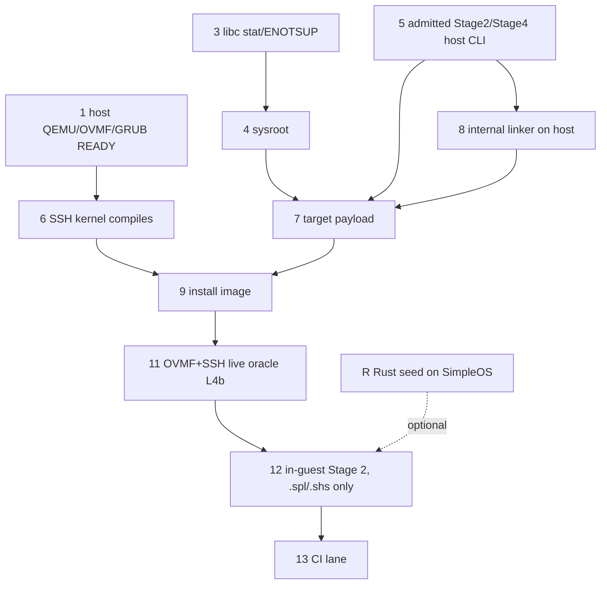

# SimpleOS x86_64 Bootstrap — Infrastructure Readiness (2026-10-04)

Question: can "Simple bootstraps on SimpleOS" run today on x86_64, and what
infrastructure must exist before Simple-side implementation starts?
Order after this: x86_64, then aarch64 and riscv64.

**Answer: no.** Today's tooling gets only as far as GRUB-EFI under OVMF and a
seed-compiled `hello.o` for `x86_64-unknown-simpleos`. Nothing boots a SimpleOS
kernel that runs Simple in the guest. Two blockers come first and are
independent of each other: **(1)** the SimpleOS sysroot runtime archive does not
compile, and **(2)** no admitted pure-Simple host compiler (Stage 2+, or Stage 4
for `os test`) exists on this host. The Rust seed is refused at every admission
point, by design.

Measured on WSL Ubuntu 26.04 (80 cores, KVM). Release head `3f1191dd283`.
Seed `/root/work/host-seed-target/bootstrap/simple`, sha256 `f6077fdd5bfb6f44…`.
Host packages installed for this run (20 s): qemu-system-x86 10.2.1, ovmf
2025.11, grub-efi-amd64-bin 2.14, sshpass 1.10, rust-src. Host clang/lld 21.1.8.

## Measured runs

| # | Command (from repo root) | rc / time | First blocking error |
|---|---|---|---|
| a | `SIMPLE_BIN=<seed> sh scripts/check-simpleos-bootstrap-qemu.shs --smoke` | 1 / 71 s | `[build][x86_64] phase=compiler-admission FAILED: no admitted self-hosted compiler for cranelift` (`qemu_compiler_select_v1` accepts only a runtime-provenance or Stage 4 binary). Even when it passes, this is a FAT32 smoke whose oracle is `isa-debug-exit`, not a bootstrap. |
| b1 | `SIMPLE_BUILD_COMPILER=<seed> sh scripts/os/simpleos-native-build.shs --target x86_64-unknown-simpleos` | 1 / 0 s | `SIMPLE_BUILD_COMPILER is the Rust bootstrap seed, not an admitted self-hosted compiler`. The D1 seed route-around is closed; a Stage 2 `admission.env` is required. |
| b2 | `sh src/os/port/llvm/sysroot.shs` | 1 / 2 s | `runtime_native.c` does not compile against SimpleOS libc: `struct stat` has no `st_mtim`/`st_ctim` (`runtime_fd_stat_v1.h:161-164`), and `ENOTSUP` is undeclared (`runtime_sosix_directory_roots_v1.h:303,409`). The sysroot is left without `simpleos.ld` and without `libsimple_runtime_native.a`. |
| b3 | Seed `native-build` of the L4b SSH kernel (`ssh_ring3_clang_entry.spl`, cranelift, `x86_64-unknown-none`) | 1 / 550 s | 584 files compiled, 2 failed: `src/os/apps/sshd/ssh_session{,_auth}.spl`, `hir: cannot infer field type ... struct 'ANY' field 'key_blob'` |
| b4 | OVMF pflash → `grub-mkstandalone` BOOTX64.EFI → multiboot probe (KVM) | — / 50 s | L1 `[grub-uefi] multiboot loading` reached. The firmware chain works on this host (OVMF_CODE_4M sha256 `50a48d30…`). |
| c1 | Seed `native-build --target x86_64-unknown-simpleos` of `hello.spl` | 1 / 1 s | Object compiled (`compiled=1`). Link failed: `missing linker script: build/os/sysroot/share/simpleos/simpleos.ld` (caused by b2). |
| c2 | Same as c1 with `SIMPLE_LINKER=internal` | 1 / 1 s | `Unsupported SIMPLE_LINKER value: internal`. The seed only knows mold, lld and bfd; the internal linker can only be reached through a pure-Simple compiler. |
| d1 (2026-10-05) | `sh src/os/port/llvm/sysroot.shs` (branch `work/simpleos-selfhost`) | 0 | Builds crt0.o, libsimpleos_c.a, libsimple_runtime[_native].a, simpleos.ld. New fail-closed strong-symbol census: pre-fix `FAIL — 1422 strong symbol(s) checked, 13 duplicate(s)`, after `PASS — 1409 strong symbol(s) checked, 0 duplicates` (`--census`, `--census-selftest`). |
| d2 (2026-10-05) | Pure-Simple Stage 2 (`/root/work/s2-x86/simple`, sha256 `03d617dc4119…`, from `a5cda768103`) `native-build --backend cranelift --target x86_64-unknown-simpleos --entry-closure` of `fn main(): print("hello simpleos from simple")` | 0 / 134 s | Linked by `/usr/bin/ld.lld` (LLD 21.1.8, default path of `simpleos_native_linkers.spl` `link_simpleos_x86_64`): ET_EXEC, entry 0x10000000, 55,864 bytes, sha256 `c70c1e95e085…`. Needed `.got` KEPT in `simpleos.ld` — the x86_64 script discarded it, so every cranelift `GOTPCREL` slot was VA 0..0x18. |
| d3 (2026-10-05) | `PAYLOAD=<d2 ELF> SIMPLEOS_HELLO_NATIVE_MARKER='hello simpleos from simple' QEMU_SMP=4 sh scripts/check/check-simpleos-hello-world-in-guest-ovmf.shs` (OVMF pflash → GRUB-EFI → multiboot kernel, NVMe FAT32 `/FSEXEC.ELF`, ring 3; no `-kernel`, no `isa-debug-exit`) | 0 / 24 s | `PASS — 1 program(s) checked, 7 rung(s) green`. Serial: `hello simpleos from simple` … `[syscall] exit status=0` … `[hello] native program exited rc=0`. Kernel fixes needed: `rt_mutex_*` trap stubs (module inits create mutexes), syscall ring-0/3 classification by kernel TEXT bounds (user base 0x10000000 sat inside `[0x100000, _kernel_end=0x1625f000)`), user heap mapped for libc programs. Kernel built by the Rust seed (as the lane documents). |
| R | `cargo check -Z build-std=std,panic_abort --target src/os/toolchain/rust/x86_64-unknown-simpleos.json -p simple-driver` (unvendored copy plus vendored std deps) | 101 / 64 s | std's own `libc 0.2.189` fails: `unresolved import unistd`, because target_family unix with os none has no libc module. The host-side `target-lexicon` build script panics with `Invalid target name: 'x86_64-unknown-simpleos'` (needed by cranelift). |

Notes on R:
- `src/os/port/rust/target/x86_64-simpleos.json` no longer loads on nightly 1.101, because `target-pointer-width` is a string.
- The in-repo `vendor/` lacks std's dependencies (`hashbrown 0.17.1`, `rustc-literal-escaper`), so `-Z build-std` cannot resolve offline.
- `core,alloc` mode does not apply: every seed crate is a std crate.

## Readiness checklist (dependency order)

| # | Item | Status | Evidence | Next action | Scope |
|---|---|---|---|---|---|
| 1 | Host QEMU x86, OVMF, GRUB-EFI, sshpass, mtools, xorriso | READY | b4 | Add the packages to `scripts/setup` checks | x86 (aarch64: AAVMF; rv64: OpenSBI/U-Boot) |
| 2 | Rust seed, x86_64 Linux | READY | seed builds Linux objects and a `simpleos` hello.o (c1) | — | shared |
| 3 | SimpleOS libc headers, POSIX gaps | READY for the runtime archive (2026-10-05: d1 compiles `runtime_native.c`) | b2 (2026-10-04) | Add `struct timespec st_mtim/st_ctim` (keep the `st_mtime` macros) and `ENOTSUP` to `src/os/libc/include`. Rerun `sysroot.shs` | shared (one libc) |
| 4 | Sysroot: crt0.o, libsimpleos_c.a, libsimple_runtime_native.a, simpleos.ld | READY (x86_64, 2026-10-05) | d1: builds; one strong definition per symbol (census gate in `sysroot.shs`); static `.got` kept | Run the aarch64/riscv64 sysroot scripts through the same census | per-arch sysroot scripts |
| 5 | Admitted pure-Simple host compiler: Stage 2 for payloads, Stage 4 for `os test` | **MISSING** | a, b1. Not cheap: a same-day item5 `--full-bootstrap` spent 40 min on cargo, reached Stage 2 at 44 min, then was SIGKILLed (137) 17 min in. Another attempt aborted because it needs LLVM 23.1.2 or `--backend=cranelift` | A dedicated bootstrap lane on a quiet host with ≥ 16 GB headroom, then Stage 3/4 admission (B-HOST-CLI) | shared |
| 6 | SSH/ring-3 kernel compiles | **BLOCKED** | b3 (`key_blob` on `ANY`) | Type the `key_blob` receiver in `ssh_session*.spl`. Check whether Stage 2 also fails there | mostly shared source |
| 7 | Target payload `bin/release/x86_64-unknown-simpleos/simple` | MISSING (needs 4, 5) | b1 | `SIMPLE_BUILD_COMPILER=<stage2> sh scripts/os/simpleos-native-build.shs` | per-arch |
| 8 | Payload linker: internal `SIMPLE_LINKER=internal` or guest-static `ld.lld` | host `ld.lld`: READY (2026-10-05, d2); internal: MISSING | d2: a pure-Simple Stage 2 links a SimpleOS hello with host `ld.lld` and it runs in-guest (d3). Earlier: c2. The internal path exists in source: `link_simpleos_internal`, BootLayoutPlan, `-T`/`--start-group`/`--gc-sections`/`--defsym`, `.a` archives, and `simpleos_native_linkers.spl` user-link inputs. It has never linked a payload. `test/01_unit/.../native_linking_internal_spec.spl` is an empty blob. No `build/os/clang_static` or LLVM fork checkout on this host | Once 5 exists: link the payload on the host with `SIMPLE_LINKER=internal`, compare with an `ld.lld` link, and write the empty spec | x86_64 and arm64 only; riscv64 is rejected (`internal:simpleos supports x86_64 and arm64`), and RV64 static-IE TLS is still UNRUN design |
| 9 | Install image with the seven `/usr/bin/simple`… paths, FAT32 8.3 | MISSING (needs 7) | x86 plan B-IMAGE | `scripts/os/build_simpleos_install_image.shs` | x86 FAT32; rv64 already has an NVFS root (`0b231cde972`) |
| 10 | NVFS root on x86_64 | MISSING | the rv64 virtio-mmio NVFS root does not port directly; x86 needs NVMe/virtio-pci | Port `nvfs_root_device.spl` to the x86 NVMe BlockDevice | x86-specific driver, shared FS |
| 11 | Live oracle: OVMF + SSH/serial transcript, no `isa-debug-exit` | PARTIAL; in-guest run of a pure-Simple ld.lld-linked user program: READY (2026-10-05, d3, serial oracle) | d3: `check-simpleos-hello-world-in-guest-ovmf.shs` PASS with the program's own stdout and exit status 0. Board run not yet done (board-runnable rule): same ESP/BOOTX64.EFI + NVMe FAT32 path. The L4b ladder script exists and uses OVMF. The `os test` smoke still uses `isa-debug-exit` | Make `ssh_simple_hello_uefi.shs` the gate. Retire the debug-exit oracle in the x64-nvme-fat32 scenario | shared rule |
| 12 | In-guest Stage 2 (Simple builds Simple) | BLOCKED (7-11). No python, JS or perl in the guest (see audit) | — | Drive it with `.spl`/`.shs` only | shared |
| 13 | CI/lane wiring | MISSING | `check-simpleos-bootstrap-qemu.shs` is a smoke, not a bootstrap gate | Rewire it to rungs 1→11 with receipts | shared |
| R | Rust seed cross-built for SimpleOS (optional) | BLOCKED, large | R | Needs: rustc fork registering `os=simpleos`; the `libstd_pal_simpleos` patches (they have no threads/process/net); a `libc` simpleos module; a target-lexicon patch; std deps vendored. The seed must cfg out cranelift-jit/native, inkwell (LLVM 23), rayon, num_cpus, libloading, memmap2, rustls, and process spawn of clang/ld | optional, see below |
| P | Audit for python/JS/perl in the guest path | see below | — | — | shared |

**Rust-in-guest is not required.** Bootstrapping in the guest needs a *Simple*
compiler running in the guest (item 7). The Linux Rust seed only has to produce
the host Stage 2, which then builds the target payload. That is the AC-3 route.
The seed-for-SimpleOS track costs a rustc fork, a std PAL, and a libc port, and
even then it gives a seed without threads, JIT, or process spawn. Keep it as an
optional separate track.

**Recommended order.** This revises the earlier draft, which put the internal linker before the host compiler. First fix 3, which
unblocks 4. Then obtain 5: the internal linker cannot run before this, because
the seed rejects it. Then link the payload on the host with the internal linker
(8), with `ld.lld` as the cross-check. Then boot the payload in the guest
(6, 9, 11). Last, run Stage 2 in the guest (12). Item 6 can be worked on in
parallel with 5.

## Audit: python, JS, and perl (`.spl`/`.shs` only in the guest)

The current in-guest path is `/usr/bin/simple`, clang, lld, and sshd. It has no
python, JS, or perl dependency. The guest shell runs `.shs` through
`src/os/apps/shell/shell_script.spl`. Every item below is a blocker for future
in-guest self-host work:
- `scripts/bootstrap/bootstrap-from-scratch.sh` calls perl: the session helper
  at lines 94/116 and the RSS watchdog at 2314. 21 bootstrap `.shs` files call
  perl. There are 6 `.pl` files and 1 `.py` file (`run-process-group-bounded-log-windows.py`).
  → An in-guest Stage 2 must use a `.spl` driver, or these must be ported to `.spl`/`.shs`.
- `src/os/port/llvm/build.spl:151` requires python3, and LLVM's CMake needs it.
  This affects in-guest clang self-build (B4) only; the host cross build is out of scope.
- The rustc fork `x.py` is python. It affects the Rust-in-guest track only.
- Host-only, out of scope but noted: `scripts/os/prepare_qemu_nonce_media.shs`
  (perl) and `scripts/os/build-simpleos-aarch64-efi-esp.shs` (python3 venv).

## Dependency order

### Shared with aarch64 and riscv64, versus x86-specific

- **Shared:** items 3, 5, 7's compiler, 11's rule, 12, 13, and the python/JS/perl audit.
- **x86-specific:** OVMF/GRUB multiboot, the NVMe and virtio-pci drivers, and x86 NVFS root.
- **aarch64:** has the AAVMF→Limine EFI chain. It needs the payload support in `bootstrap_cross.spl` (it already knows `aarch64-simpleos`).
- **riscv64:** has an NVFS root via OpenSBI+U-Boot. `bootstrap_cross.spl` has no riscv64 triple. The internal linker rejects riscv64, so riscv64 needs the RV64 static-IE work or `ld.lld`.
