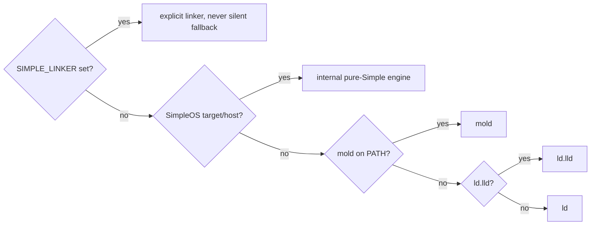

# SimpleOS self-host: cross seed, .shs/.spl-only bootstrap, shared SOSIX core, internal linker

**Date:** 2026-10-04 · **Branch/workspace:** `work/simpleos-selfhost` (own worktree;
rebased on `release/1.0` periodically; slices land on `release/1.0` by PR).
**Order:** x86_64 first, then aarch64, riscv64 (shared rows marked *shared*).
**Readiness inventory:** `simpleos_bootstrap_infra_readiness_2026-10-04.md` (measured).

## Goals

| # | Goal | Done when |
|---|---|---|
| G1 | **Cross seed.** A host seed cross-builds the pure-Simple compiler for `<arch>-unknown-simpleos` | target-native `/usr/bin/simple` built on Linux, sha256 recorded, links with 0 undefined `rt_*`, runs `--version` in the guest under real firmware |
| G2 | **In-guest bootstrap uses only `.shs` + `.spl`** after the seed | guest Stage N->N+1 runs from `.shs`/`.spl` only; an audit lists 0 python/js/perl on the in-guest path |
| G3 | **Shared core via SOSIX** | the hosted runtime and SimpleOS call the same `.spl` core through the SOSIX API interface; no duplicate per-OS copies of the shared logic; host and guest specs exercise the same module |
| G4 | **Linker policy** | SimpleOS (target or host) links with the pure-Simple mold-like engine (`internal`) by default; other hosts: mold -> `ld.lld` -> `ld`; `SIMPLE_LINKER` still overrides; in-guest has no clang/lld dependency |

## Linker policy (G4)

Today (measured): hosts already resolve mold -> lld -> ld (`linker/mold.spl`
`find_linker_path`). SimpleOS reaches the internal engine only with explicit
`SIMPLE_LINKER=internal`; seed-built SimpleOS kernels link via
`clang --target=riscv64-unknown-elf`. The default flip lands only after a real
SimpleOS link through the internal engine passes its gate.

## Slices (each a PR to release/1.0)

| Slice | Content | Gate |
|---|---|---|
| L1 | `simpleos_link_engine_internal()` policy + spec (pure) | spec red->green via seed runner |
| L2 | internal engine links an x86_64 SimpleOS user program; default flip | real-firmware boot + run of that program |
| S1 | cross seed recipe for `x86_64-unknown-simpleos` payload (host Rust seed -> pure-Simple compiler) | payload `--version` in guest |
| S2 | in-guest Stage 2 driver in `.spl`/`.shs` (no python/js/perl) | guest transcript + audit |
| C1 | SOSIX shared-core inventory + first shared module moved behind the interface | host + guest spec on the same module |
| C2 (2026-10-05) | CRC32/CRC32C + XXH64: one implementation each in `std.common.crypto.{crc32,xxhash}` (moved from `src/os/crypto`); hosted bitwise CRC32 (`compress.utilities`, noalloc `hash`) and i64 XXH64 (`zstd/xxh64.spl`) deleted | KAT specs (0xCBF43926, 0xE3069283, official XXH64 vectors) + caller specs unchanged + aarch64/riscv64 freestanding compile probe |
| A1/A2 | aarch64, riscv64 repeat of L2/S1/S2 | per-arch real-firmware transcript |

Board evidence follows `.claude/rules/board-runnable.md`; QEMU-only results
are labelled QEMU-only.
