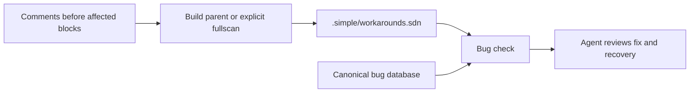

<!-- codex-design -->
# Bug-linked workaround architecture

The application owns three boundaries: pure annotation parsing and index
transforms; I/O coordination for maintenance; and read-only bug-check joins.
They compose under `src/app/bug/`. `BugDatabase` continues to own bug state.

The parent native-build entry performs one changed-path update. Compiler
workers never write the index. Explicit `check-dbs --fullscan bugs` reconciles
tracked candidates. Query paths load index data and bug records without source
walking or Git discovery. A missing index requires explicit initialization.
A different recorded HEAD requires fullscan; no incremental update silently
claims completeness after a branch change.

The coordinator locks, reloads current state, validates the entire batch,
and publishes atomically. Any malformed annotation or failed update retains
the previous valid index. Per-worktree indexes avoid cross-lane pollution.
Index presence supplies no permission to skip compiler admission or tests.

This is application-level composition rather than a new cross-cutting runtime
framework. Cache invalidation remains with existing phase/entry owners.
Recovery is a reviewed source edit followed by a justified rebuild. New host
operations use app facades and, if runtime changes are necessary, existing
SOSIX owners; annotation leaves introduce no runtime host externs.

See the [detail design](../05_design/bug_linked_workarounds.md),
[NFRs](../02_requirements/nfr/bug_linked_workarounds.md), and
[operator guide](../07_guide/tooling/bug_linked_workarounds.md).
