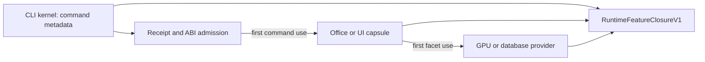

<!-- codex-architecture -->
# Optional CLI provider boundary for Target 5

Status: implementation design, open. The selected Target 5 requirement is
first-demand kernel/extension loading with full feature preservation; this
document identifies the production boundary still missing from the current
CLI. It does not qualify Stage4 or change the selected requirements.

## Observed dependency path

The unified CLI entry `src/app/cli/_CliMain/main_and_help.spl` imports both
`app.office.mod` and `app.ui.cli_entry` and calls each directly. Their
imports make command-specific providers part of the CLI source closure even
when a user requests only `simple -c` or hello:

| Command path | Optional dependency reached | Evidence |
|---|---|---|
| CLI -> Office -> `app.office.gui` -> `simple_web_engine2d_renderer` -> `engine2d.engine` | Vulkan, Metal, CUDA, ROCm backend implementations | `engine.spl` imports every backend; isolated Office entry compiled 532 units but failed on 106 optional symbols. |
| CLI -> UI -> `app.ui.access_cli` -> `std.nogc_sync_mut.ui.access_store` -> `std.database.sql.connection` | C SQLite SFFI | Direct source imports; full CLI link reports 25 SQLite symbols. |

The full CLI source closure now compiles 2,488 units, but its Stage4
`host-gpu` link reports 173 distinct missing symbols. The archive check found
113 in Rust `native_all`; adding that archive to the release-small core would
defeat the size and closure gates. The captured evidence is in
`doc/09_report/compiler/target56_stage4_cli_link_boundary_2026-09-28.md`.

## Boundary

`common` owns a versioned provider descriptor and host-offer/answer contract.
The CLI kernel owns command names, help, artifact lookup, receipt validation,
and first-demand activation. Office and UI own their private implementations.
The linker owns `RuntimeFeatureClosureV1`: it binds each retained symbol,
archive member, constructor, and dynamic dependency to a required kernel
action or an admitted provider action before linking. An optional provider
may be packaged as a cached executable capsule for a whole command or a
versioned dynamic artifact for in-process facets. Command capsules alone do
not replace the required in-process GPU/SFFI demand-load proof.

The CLI must not import provider implementations merely to advertise a
command. A missing, corrupt, or incompatible artifact fails with a typed
provider error before executing any effect. It must not run raw `.spl`
sources or silently link `native_all`. Provider artifacts and their receipt
manifest must be installed atomically with the CLI; a CLI cutover is not
admissible before that packaging gate passes on each supported platform.
Concurrent first use admits one verified provider identity; competing
callers observe the same result. Rollback restores the prior admitted
artifact without changing command semantics.

## Implementation sequence

The Linux SQLite in-process facet now has a first-use bridge in
`src/runtime/runtime_sqlite_demand.c`. An isolated native binary links that
small object rather than the SQLite shared library. First use snapshots the
configured regular provider file into a sealed memfd, checks the configured
SHA-256 against the snapshot, loads that same snapshot, checks ABI v1 and all
27 entry points, and supplies the Simple string callbacks through an explicit
host table. The provider remains mapped while any SQLite handle may exist.
The shared snapshot-fd allocator prevents `/proc/self/fd` pathname reuse
across GPU, generic SFFI, and SQLite admissions. Concurrent callers wait for
one admission verdict. Missing, corrupt, incompatible, or incomplete
providers fail closed; the SQLite wrapper rejects native tagged nil (`3`) as
an invalid pointer handle.

This facet is available through an explicit object link and provider path/
digest environment pair. It is not yet the CLI default, an installed atomic
provider manifest, or a cross-platform solution. The full CLI still lacks
`RuntimeFeatureClosureV1` and the Office/GPU command cutover.

1. Extract the software browser/Office paint path from the all-backend
   `engine2d.engine` import closure without changing its pixel result. Keep
   GPU backends behind versioned first-use facets. The Office product build
   must then link under an admitted optional-product policy.
2. Give UI access storage a stable persistence port. Prefer
   `std.database.pure_sql.PureDatabase` after SQL, error, durability, and
   concurrency parity checks; otherwise package C SQLite only in the UI
   provider artifact. Do not switch the current SQLite store without those
   checks.
3. Produce Office/UI artifacts with immutable source and binary digests,
   ABI/variant receipts, and an atomic install manifest. Existing
   `scripts/check/build-office-standalone-target.shs` is a target-only
   starting point, not a passing product gate: its current Stage2 analogue
   still fails on 106 GPU symbols.
4. Switch the CLI's two direct command imports to metadata-only descriptors
   and verified first-demand activation. Keep stdio and exact exit status
   for interactive commands. Require the installed artifact before removing
   the in-process implementation from the CLI closure.
5. Link the kernel with exact closure admission, then run command parity,
   missing/corrupt/ABI/concurrent/rollback tests and the matched size,
   startup, RSS, and compile time cohorts. Preserve separate warm startup,
   request, and build measurements.

## Verification limits

A shorter import graph or one smaller binary does not establish Target 5.
The release-small hello must meet its independent 15 KiB and matched C gate;
minimal interpreter startup/RSS must meet the Python-relative gate. Office,
UI, GPU, SQLite, and every other provider family must retain behavior on
their supported architectures. Target 6's typed graph publisher and full
entrypoint cutover remain separate requirements.

Implementation handoff: lower-model sidecar lanes **N/A** for this analysis;
the isolated Target 5/6 branch owner owns merges. A normal/highest-capability
review of the implementation and generated manuals is required before the
provider cutover is accepted.
