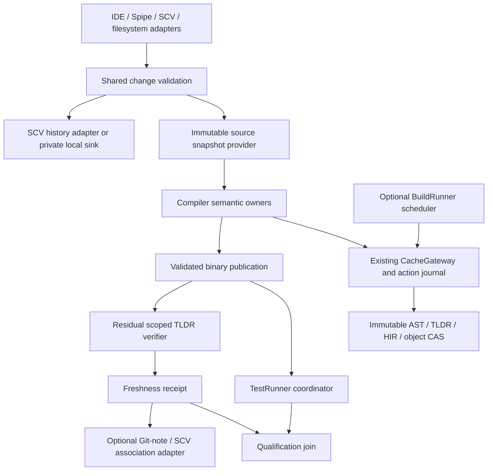

# Incremental build metadata and TLDR architecture

<!-- codex-design -->

Status: proposed architecture integrating independent Astra correctness and performance reviews. Astra's focused final contract review accepted the design after two P1 corrections; implementation qualification remains pending. No cache fast path, benchmark or formal proof is certified by this document.

## Evidence and baseline

The [supplied research](../01_research/local/simple_compiler_incremental_build_tldr_scv_metadata_design_2026-10-08.md) was read in full. Its reference revision is `2e43233b11fbbd837535d9313a168f729fad7f46`. The active Windows compiler was built from `6bf3276a4344923bea1dae84c933b2aeda13db58`; the shared working tree is older `e10963a3b065dde1643c777512c3988526973957`. Inspected remote release was `e23da7a417f3c970467db463d40af20bc764110a`. Missing working-tree paths are not evidence that a module is absent from these other revisions.

This extends [the semantic cache architecture](compiler_semantic_cache_manager.md) and [static guard pruning](static_when_tldr_build_pruning.md). `CompileSnapshotV1`, `CacheGatewayV1`, `PackageTldrHeaderV1`, `ActionRootJournalV1`, existing reader pins and writer epochs remain owners. New source-change DTOs adapt into them; they do not replace their validation with a note or edit log.

Independent findings are retained in the [Astra correctness review](../01_research/local/incremental_build_metadata_astra_review_20261008.md) and [performance/memory review](../01_research/local/incremental_build_metadata_perf_review_20261008.md). In particular, the existing package interface key includes the full SMF digest. Private-body cutoff requires a new versioned public-facet identity and proven read coverage; it is not achieved by simply reusing the current key.

Observed blockers motivating the first implementation wave:

- One selected Hello module launched 40 parse workers, 39 idle. A helper fix passed 26 native checks; full spawn-lifecycle qualification remains pending.
- A runtime-cache batch can hash roughly 815 MB of toolchain bytes for the inspected LLVM23 installation. This is a source-derived estimate, not a trace attributing the whole Hello build.
- Parallel Phase3 invocations fail SCV refresh admission; the current exclusive lock surrounds inventory validation and Git event processing, with a 300-second acquisition budget.
- TLDR consumer dependencies unnecessarily include HIR/MIR producers. A real 54-module consumer projection was prepared, but its native test failed on unresolved `unwrap` before assertions.
- Pure-Simple MIR has provider-local type-identity transport failures. Correctness repair proceeds alongside optimization; it cannot be waived by a cache hit.

## Ownership and dependencies

| Owner | Responsibility | Forbidden dependency |
| --- | --- | --- |
| Common source-change contracts | Canonical paths, byte edits, versioned DTOs and validation rules | Git, mutable SCV database, compiler internals, GUI |
| Snapshot provider | Stable byte capture, event completeness, immutable generation leases | Test execution or source-history mutation |
| Frontend | AST and public-summary production | SCM commits, cache scheduling policy |
| Compiler cache owner | Semantic keys, summary/body witnesses, artifact admission | Trusting a scheduler's claimed cache hit |
| BuildRunner/task core | Resource credits, single-flight scheduling, cancellation and attempt records | Interpreting compiler semantics |
| SCV adapter | Durable history and migration through existing WAL/lease | Second independent metadata writer |
| TestRunner coordinator | Exact-binary tests and required receipt joins | Importing its daemon into every test child |
| SCM adapter | Typed association to immutable revisions | Changing compiler inputs or amending commits to stamp freshness |

MDSOC application is limited to tool adapters and optional orchestration capsules. No kernel/driver ECS or global service locator is introduced. Mutable tables stay owner-private; cross-thread/process results are immutable DTOs with explicit lifetime ownership.

## Compile path

1. Select a snapshot kind and acquire a validated source-generation lease. Plain standalone builds use an embedded filesystem snapshot provider if no event/SCM service exists.
2. Resolve the complete action key through the existing gateway. A receipt is an acceleration index only until its source, configuration, coverage and artifact references validate.
3. Claim each missing summary action once. Parse changed source once; publish the verified AST and public summary atomically. A stale `.tld` never authorizes itself by being newer than the source.
4. Consumers awaiting only a header resume at `HEADER_READY`; they do not wait for the dependency's object emission. Body-dependent semantics request explicit body digests and witnesses.
5. Schedule required dependency objects independently. Link waits for the admitted object closure, including initializers, runtime/ABI owners and aspect effects.
6. Verify link inputs and publish the binary. Schedule only residual scope verification and test work after this barrier.

The standalone and BuildRunner routes share steps 1–6 and action keys. A four-thread worker process may own four separate module tasks; it must not share mutable parser/MIR state. Process reuse is allowed only after task-state reset is verified. Crashes quarantine the current attempt; retry unknown tasks individually to recover attribution. Ordinary compilation errors remain normal task failures and do not force process isolation.

## Authority, concurrency and lifetime

Source authority is acquired once per immutable generation and shared by reference, not rediscovered under an exclusive repository lock for each worker. The short publication lock protects compare-and-swap of a new validated generation; it must not cover parsing, whole-tree hashing or child processes. Capturing a new generation can run beside readers of a pinned old generation.

An event-complete retained generation may avoid rereading unchanged bytes. An arbitrary mutable filesystem without such authority cannot promise O(1) secure unchanged detection: reconcile/capture is an explicit, measured slow path. Mtime and size choose candidates for verification but do not prove content identity.

One single-flight table is keyed by the complete semantic action identity, not by source pathname alone. Lease owner, epoch and nonce fence publication. Waiters release CPU execution credits; otherwise all worker slots could wait for a producer that cannot be scheduled. Cancellation detaches one waiter and only cancels shared production when its ownership policy permits. Immutable outputs survive a producer crash after successful atomic publication.

Reader pins protect source bytes, AST arenas and CAS objects from reclamation. A memory budget caps queued work, decoded ASTs, header batches and output buffers independently. Cache misses must not trigger simultaneous full-tree copies. Cross-host ASTs contain canonical data, never pointers, local SymbolIds, allocator handles or machine-endian dumps.

Physical TLD records, function ABI headers, package TLDR headers, public semantic summaries and SMF containers are distinct products. A successfully decoded container is not proof of complete semantic coverage. Typed semantic fingerprints and CAS retention edges are separate roles: GC must not treat every semantic digest as a referenced object.

## State and receipt correction

Keep `binary_ready`, `tldr_verified`, `tests_passed`, `scm_attached`, and `scm_synced` independent. A TLDR-only receipt can be attached locally when its own verification passes even if tests fail; release qualification still fails. This resolves the supplied research's diagram ambiguity that routed every attachment through test success.

An old frozen snapshot can finish valid verification after the worktree changes. Its receipt remains valid for that old snapshot and may attach to that exact immutable commit. It must not update a `current` pointer for a newer generation. This refines the research's blanket restart wording: restart is required only when the requested result is for the changing current snapshot or the supposedly frozen capture was unstable.

## Migration

First add shadow receipts/counters and repair demonstrable hot-path waste. Then enable admitted generation sharing and single-flight summaries behind independent switches. Add precise semantic read sets only after fresh/reused equivalence tests pass. Editor adapters, durable SCV migration, post-build receipts and later SMF storage evolve in parallel through frozen contracts. Rollback selects correct conservative compilation; it never means ignoring a failed correctness check.

See [detail design](../05_design/incremental_build_metadata_20261008.md) and [parallel plan](../03_plan/agent_tasks/incremental_build_metadata_20261008.md).
