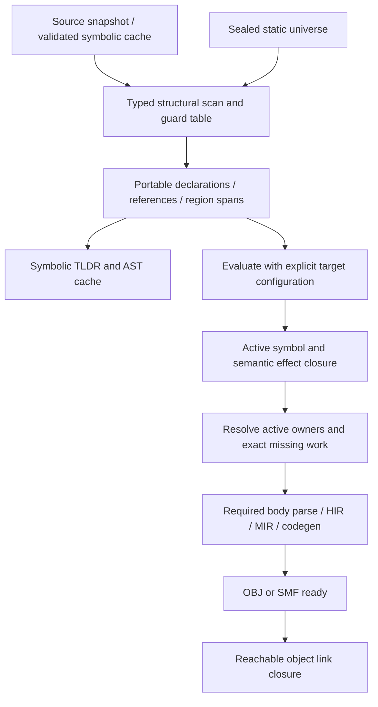

# Typed static guards and build-closure architecture

Status: design, not implementation qualification. 2026-10-06.

The compiler will preserve why each declaration/dependency exists, evaluate that reason before import expansion, and load only the active required symbol/effect closure. The same compiler service serves standalone and build-runner clients. [Selected proposal](../01_research/local/simple_static_when_tldr_build_pruning_plan.md) and [requirements](../02_requirements/feature/static_when_tldr_build_pruning.md) define the full scope.

## Evidence and current gap

The local feature/compiler-layer knowledge receipt `.spipe/static_when_tldr_build_pruning/knowledge_selection.sdn` was consumed. See the companion [code audit](../01_research/local/static_when_tldr_build_pruning_code_audit.md) for detailed owner findings. Evidence is source inspection, not proof all paths execute.

| Owner inspected in C:/dev/simple | Existing behavior and implication |
|---|---|
| `src/compiler/10.frontend/core/parser_preprocessor.spl` | `_pp_tokens`/`_pp_pos` process globals; textual host config comparisons; unknown atom returns false. Cannot supply typed fail-closed cross-target guards. |
| `src/compiler/10.frontend/core/parser.spl` | Calls source preprocessing at parse entry (1116/1164 in inspected working copy); active source loses symbolic provenance. |
| `src/compiler/80.driver/driver_source_loading.spl` | Raw lexical import extraction at `_driver_entry_import_module_paths`; path-only in-process cache before read at `_driver_cached_entry_source_scan`. Guard gate must precede resolver probes and partition config-sensitive cache entries. |
| `src/compiler/35.semantics/semantics/truthiness.spl` | EnumVariant/EnumType and objects are listed as always truthy. Selected Boolable semantics require an explicit compatibility migration, not a cosmetic rename. |
| `src/compiler/00.common/cache_contract/public_summary_v1.spl` | CCH1 legacy summary has dependency IDs/body refs without guard table. Opt-in typed reference profile exists; legacy reference coverage can be unknown. |
| `src/compiler/10.frontend/cache_artifact/public_summary_projector.spl` | Public-only projection is not a complete private body/effect dependency manifest. |
| `src/compiler/00.common/cache_contract/file_ast_v1.spl` | Existing portable codec is a substrate; parser-to-frozen-AST integration and guarded region coverage remain required. |

Prepared bc9 and current working source differ. Earlier cooperative-cache audits of bc9 found admitted source reread before cache hit; do not transfer that fact to this live source's dictionary-hit path. The staged cooperative cache contracts under the owned restart directory are candidates, not landed/native-qualified functionality.

## Boundaries and alternatives

Use MDSOC compiler layers with immutable transform artifacts: common contracts -> frontend scan/projection -> semantic reference production -> driver closure/cache/work dispatch. A low-level common guard module imports neither driver nor app. Effects of target selection remain a transform over immutable symbolic facts. The runner requests compiler work; it cannot reinterpret guards or certify summary completeness.

Retain `@when`; normalize legacy `@cfg` into the same typed algebra. Do not add a second static-if grammar. A SAT/BDD engine would impose unneeded dependencies and adversarial complexity; bounded local simplification suffices. Boolean-equivalent expressions need not all intern identically. Arbitrary CTFE before resolution would create a dependency cycle, so static conversion requires an admitted pre-import descriptor.

The universe is prepared from explicitly admitted builtin/provider metadata before module discovery. Loading it must not execute provider modules or discover a provider by traversing the very conditional imports it controls. Stable provider/member identities survive discovery-order changes; the sealed universe digest changes when aliases, membership, cardinality or conversion policy changes.

Ordinary `if os.windows` is classified as a static guard only when semantic binding proves that the expression denotes the registry-owned predicate. A local variable named `os`, an aliased object, or an arbitrary member with the same spelling must retain its ordinary runtime semantics; textual matching never authorizes pruning. Structural `@when` instead uses the defined restricted pre-import domain namespace, independent of runtime lexical variables. A lexical variable cannot supply or shadow a domain inside that restricted grammar. This distinction must remain visible in diagnostics and shared Boolable phase checking.
## Three distinct graphs

1. Symbolic source/summary graph retains guards and portable semantic identities across targets.
2. Concrete compile-readiness graph requests interface or required semantic body data. A plain public interface can unblock dependent object compilation while its provider object builds.
3. Link graph retains all required actual objects/SMF and link metadata, including dependencies originating in private executable bodies. Public-only TLDR cannot certify this graph complete.

Cold builds without a verified complete manifest must discover required executable/effect references from actual selected source. Warm builds may reuse a source-valid canonical manifest. A summary coverage enum is produced by the semantic owner and verified on decode; a caller boolean cannot authorize dropping edges. Unknown coverage retains work conservatively or requests body discovery. It never becomes an empty complete graph.

## Inactive regions and portable syntax

Scan lexical state, directive syntax and nesting in all regions. Unknown/malformed conditions remain errors even under a false parent. Ignore directive-looking bytes in comments/literals. An unclosed string/comment/directive cannot hide the following program. Inactive interiors are not name-resolved, typed, or body-parsed, and their imports cause no filesystem work. Lexically framed target-specific syntax can remain deferred.

Portable AST must distinguish fully parsed nodes from source-backed deferred regions with exact spans/guard/source digest. It must not advertise complete AST coverage for skipped interiors. A future complete symbolic AST producer may parse all grammatically valid branches; the first producer preserves source regions and records partial syntax coverage explicitly. The same coverage/profile participates in its cache key.

## Cache and invalidation boundaries

Portable source identity uses canonical content/CAS identity; host observation (file ID, size, mtime, trusted watcher/snapshot generation) is separate. Untrusted unchanged metadata still requires content validation. Symbolic summary/AST keys bind source, grammar/parser/schema, semantic producer, domain universe/seal and condition policy, not selected OS/arch when truly target-independent. Target closure keys bind symbolic digest, selected config, root set and resolution/effect policy. OBJ binds target/backend/ABI/options and actual semantic dependency digests; SMF additionally binds runtime-format/ABI and its own validator.

Preweave AST may omit aspect selection if its bytes/meaning are independent; woven TLDR, readsets and output keys must include selector/advice semantics, resolved cut target identities and canonical captured values or versioned snapshots. Pointer addresses are never capture identities; unknown mutable capture state disables affected cache admission. Reverse semantic edges invalidate transitively. Private-body edits can preserve dependent interface identity after revalidation even though the source witness changes; objects that execute the changed body still rebuild.

An inactive dependency is excluded from concrete target closure/invalidation, but its symbolic edge, guard, universe and configuration remain in the symbolic cache. A later configuration/guard change must reactivate discovery. This avoids stale exclusion without probing false-target module paths.

## Ownership, fallback and migration

Guard tables belong to one module scan/context. Cross-job data is canonical immutable bytes or retained validated objects. Parent-owned continuation/work queues integrate the cooperative cache's generation-fenced claim/publish/outbox; waiters yield execution slots and stale producers cannot commit. Existing globals do not become four-context safe by enabling thread flags.

Scalar scanning is authoritative. SIMD/GPU adapters return bounded candidate facts with source/universe/schema identities; the CPU validates framing, indices, counts and canonicalization. Unsupported features, missing device or safe resource exhaustion choose scalar; device disagreement is a diagnostic and disables that result, never successful omission. Arbitrary enums are migrated from old truthiness by a language-policy version with interpreter/native/bootstrap parity tests. Compatibility aliases stay until repository migration and bootstrap qualification, then reliability profiles can reject them.

[Implementation sequence](../03_plan/agent_tasks/static_when_tldr_build_pruning.md) separates pure algebra admission from the first measurable integration. [Detail design](../05_design/static_when_tldr_build_pruning.md) fixes interfaces before agents edit. No source implementation, passing executable specs, speedup, or release is claimed by these documents.