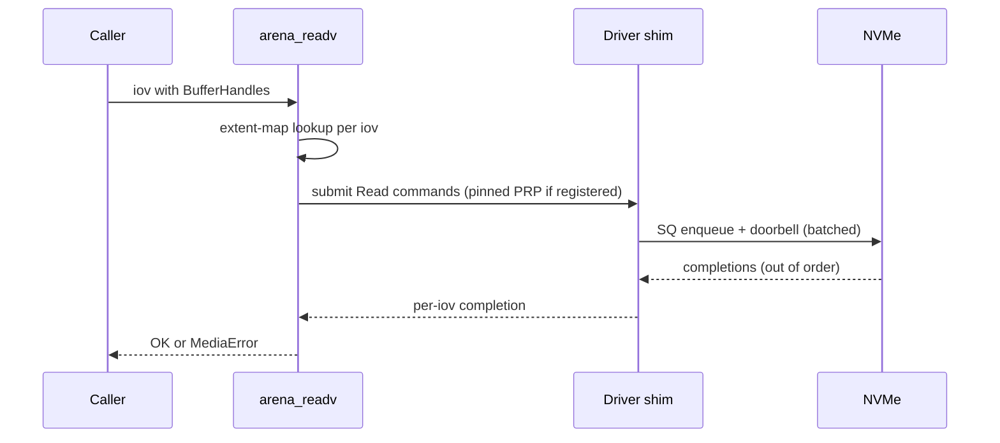

# NVFS (SimpleFS-NV) Design

- **Feature:** `spostgre-nvfs-storage` (SStack `.sstack/spostgre-nvfs-storage/`)
- **Phase:** 3-arch
- **Status:** v0 — Phase 3 design deliverable
- **Last-updated:** 2026-04-18
- **Author:** NVFS track (Claude solo; Codex unavailable per state file)
- **Related:**
  - `./nvfs/svllm_requirements.md` — upfront contribution from svllm
  - `./nvfs/from_spostgre.md` — upfront contribution from spostgre
  - `./spostgre_design.md` — spostgre engine design (consumer)
  - `./svllm/svllm_master_plan.md` — svllm master plan (consumer)
  - `../01_research/spostgre_research.md` — NVMe / ZNS / FDP research

---

## 1. Scope and non-goals

### 1.1 Scope

NVFS (SimpleFS-NV) is an NVMe-aware filesystem targeting Simple userland processes that need:

1. **Large sealed immutable objects** served to pinned DMA buffers (svllm weights, spostgre checkpoint arenas).
2. **Aligned-append arenas** with group-commit durability (spostgre WAL, svllm append_only logs).
3. **Copy-on-write metadata** with atomic publish for generation-numbered records (spostgre pmap root, svllm manifests).
4. **Capability-probed** optional paths for ZNS zones and FDP Placement IDs; gracefully degrades on baseline NVMe.
5. **Six virtual storage classes** with distinct placement / durability / recovery semantics (§3).

### 1.2 Non-goals

- **Not a POSIX filesystem.** No byte-range random writes inside an arena. No POSIX permissions, hard links, case-insensitive paths, or mmap.
- **Not a block-level driver.** NVFS sits above an NVMe driver abstraction (Linux io_uring_cmd / SPDK / bare-metal NVMe driver).
- **Not a networked filesystem.** Single-node only. Replication is an upstream concern.
- **No kernel ECS.** Kernel- and driver-adjacent code per CLAUDE.md stays MDSOC-only.
- **No GC / async-allocating code paths in NVFS core.** Runtime family is `nogc_sync_mut` at M1–M3; `nogc_async_mut` at M4+ for AIO. `gc_*` is forbidden in NVFS.

---

## 2. MDSOC layout (kernel-adjacent; MDSOC-only, no ECS)

Per CLAUDE.md "kernel/drivers stay MDSOC-only," NVFS is implemented as an MDSOC capsule without an inner ECS layer. Its five axes:

### 2.1 Modules

| Namespace | Path | Role | New/Modified |
|---|---|---|---|
| Trait contracts | `src/lib/nogc_sync_mut/fs/nvfs/` (sibling to existing `fs/path.spl`) | Public NVFS API: `Arena`, `ArenaId`, `StorageClass`, `FsCaps`, `Durability`, trait `NvfsCaps`, trait `ArenaIo`, trait `AtomicPublish` | New |
| Core impl | `examples/nvfs/src/core/*` (submodule) | Superblock, checkpoint ring, intent log, inode tree, directory tree, extent-map tree, class dispatch | New |
| Driver shim | `examples/nvfs/src/driver/*` (submodule) | NVMe command submission, doorbell batching, capability probe, io_uring_cmd + SPDK backends | New |
| Shared types | `src/lib/nogc_sync_mut/storage/` (sibling to `fs/`) | Generation, SealToken, PublishResult — shared with spostgre | New |

Symlinks: `examples/nvfs/src/app/` is intended to surface an `nvfs_admin` CLI through `src/app/nvfs/` per the trace32 pattern (deferred to M3).

### 2.2 Dependencies

| NVFS depends on | Why |
|---|---|
| `std.io` (fs primitives) | Underlying device read/write (pre-bare-metal fallback on FAT32) |
| `std.common.crypto` | Superblock CRC32C, intent-log integrity |
| `std.common.encoding` | Little-endian u16/u32/u64 codec for on-disk records |
| NVMe driver abstraction | `src/lib/nogc_sync_mut/nvme/` (new, scoped minimal) |
| **Not** ECS | MDSOC-only (see §2) |

| Depends on NVFS | Why |
|---|---|
| spostgre | Arena lifecycle, aligned-append WAL, atomic publish (pmap-root CAS) |
| svllm | Sealed tensor_pack, pinned reads, atomic manifest publish |
| Future: netstack, WAL-journalled service state | Sealed-log pattern |

No circular dependencies: NVFS → storage-types (leaf); spostgre → NVFS; svllm → NVFS. Verified.

### 2.3 Side effects

| Effect | Scope | Notes |
|---|---|---|
| Disk I/O (NVMe read/write/flush/fua) | Device | Only via driver shim |
| Disk I/O (fallback path, FAT32 via `std.io`) | Filesystem | Bring-up substrate only |
| Memory allocation (nogc_sync_mut) | Arena metadata, extent-map caches | Bounded per-mount |
| Thread creation | Zero (M1–M2); one zone-cleaner thread (M4 ZNS); one GC-unit thread (M5 FDP) | Sync-mutable runtime |
| Time reads | Intent-log timestamps, checkpoint ring entries | Monotonic clock |
| Randomness | None in hot path; CRC seeds are fixed |  |

### 2.4 Capabilities

NVFS declares the following capability tokens (runtime check via capsule manifest):

- `cap_nvme_ns_open` — open an NVMe namespace for exclusive I/O.
- `cap_nvme_admin_probe` — issue Identify / Get Log Page for capability probe.
- `cap_zns_zone_mgmt` — open/close/reset zones (optional, ZNS mount only).
- `cap_fdp_pid_alloc` — allocate Placement IDs (optional, FDP mount only).
- `cap_fs_mount_root` — publish the NVFS superblock at a given mount point.

Upstream consumers (spostgre, svllm) never hold these directly; they hold `cap_nvfs_client` which the capsule boundary converts into per-arena operations.

### 2.5 Ownership

| Owns | Subsystem |
|---|---|
| Superblock A and B replicas | Core mount module |
| Checkpoint ring | Core checkpoint module |
| Intent log | Core intent-log module |
| Inode tree, directory tree, extent-map tree | Core metadata module |
| Segment summaries | Core segment module |
| Zone state machine | Driver/ZNS module (M4) |
| FDP PID map | Driver/FDP module (M5) |
| Capability cache | Core caps module |
| Pinned-buffer registry | Driver/buffer module (M2) |
| DSM trim queue | Driver module |

---

## 3. Virtual storage classes

NVFS exposes 6 classes. Each class is authoritative for placement, durability, and recovery; upstream consumers choose a class at `arena_create`.

### 3.1 Class table

| Class | Purpose | Baseline mapping | ZNS mapping | FDP mapping | Durability default | Recovery on mount |
|---|---|---|---|---|---|---|
| `META_DURABLE` | Superblock, manifests, pmap roots, catalogs | Conventional namespace, FUA writes | Conventional zone | PID=0 | `DURABLE_ON_RETURN` | Preserved; replayed from intent log |
| `DB_WAL` | spostgre WAL, svllm append_only logs | Aligned-append on conventional namespace; group-committed | ZNS zone with `Zone Append` | PID=1 | `DURABLE_GROUP_COMMIT` | Preserved; scanned for recovery |
| `DB_TEMP` | spostgre temp fork, svllm temp, sort/hash spill | Conventional namespace, buffered writes | Dedicated reset-on-mount zone | PID=2 | `BUFFERED` | **Dropped** on every mount |
| `MODEL_IMMUTABLE` | svllm tensor_pack, adapter, spostgre blob fork | Conventional namespace, seal-then-pin | Append-only zone (sealed at close) | PID=3 | `DURABLE_ON_RETURN` after seal | Preserved; read-only |
| `GENERAL_MUTABLE` | spostgre rel.main, rel.pmap, rel.vmap, rel.fmap, svllm mutable state | Conventional namespace, COW on seal | Append zone with reset on reclaim | PID=4 | `BUFFERED` with explicit flush | Preserved; replayed via intent log |
| `CHECKPOINT_SNAPSHOT` | spostgre sealed checkpoint arenas; generation-pinned | Conventional namespace, seal sets read-only | Sealed zone | PID=5 | `DURABLE_ON_RETURN` | Preserved until discard |

### 3.2 svllm taxonomy mapping

svllm's `svllm_requirements.md` names are a client-side aliasing of the NVFS classes:

| svllm name | NVFS class | Notes |
|---|---|---|
| `tensor_pack` | `MODEL_IMMUTABLE` | Seal-after-write + pinned extents |
| `manifest` | `META_DURABLE` | Atomic publish via S6 / R3 convergence |
| `adapter` | `MODEL_IMMUTABLE` | Many small sealed objects |
| `append_only` | `DB_WAL` | Same primitive; durability per-op |
| `temp` | `DB_TEMP` | Drop-on-mount |
| `kv_spill` | `GENERAL_MUTABLE` | Append-only with explicit trim |
| `mutable` | `GENERAL_MUTABLE` | Fallback; overwrite allowed inside NVFS COW model |

This mapping is authoritative. svllm's taxonomy is not a second source of truth; it is a labelled view onto the six NVFS classes.

---

## 4. arena_* API

### 4.1 Core signatures

```
fn arena_create(class: StorageClass, hint: ArenaHint) -> Result<ArenaId, FsErr>
fn arena_append(arena: ArenaId, bytes: Slice<u8>, durability: Durability) -> Result<Offset, FsErr>
fn arena_append_aligned(arena: ArenaId, bytes: Slice<u8>, granule: u32, durability: Durability) -> Result<Offset, FsErr>
fn arena_group_commit(arena: ArenaId) -> Result<Offset, FsErr>       # waits for in-flight durable
fn arena_readv(arena: ArenaId, iov: Slice<ReadReq>) -> Result<(), FsErr>
fn arena_read(arena: ArenaId, off: Offset, buf: Slice<u8>) -> Result<u64, FsErr>
fn arena_seal(arena: ArenaId) -> Result<SealToken, FsErr>
fn arena_discard(arena: ArenaId, keep_gen_above: Generation) -> Result<(), FsErr>
fn arena_clone_range(src: ArenaId, src_off: Offset, dst: ArenaId, dst_off: Offset, len: u64) -> Result<(), FsErr>
fn arena_preferred_granule(arena: ArenaId) -> u32
fn arena_set_hint(arena: ArenaId, hint: ArenaHint) -> Result<(), FsErr>
```

### 4.2 Capability / publish / buffer signatures

```
fn fs_caps() -> FsCaps
fn fs_register_buffer(buf: Slice<u8>) -> Result<BufferHandle, FsErr>
fn fs_unregister_buffer(h: BufferHandle) -> Result<(), FsErr>
fn atomic_pointer_record_publish(scope: RecordScope, name: StaticStr, bytes: Slice<u8>, expected_gen: Option<Generation>) -> Result<PublishResult, FsErr>
fn atomic_pointer_record_read(scope: RecordScope, name: StaticStr) -> Result<(Bytes, Generation), FsErr>
```

### 4.3 Contract details

**Creation.** `arena_create` allocates arena metadata and may pre-allocate if `hint.initial_size` is set. Returns `ArenaId`, an opaque 64-bit handle. Arena does not consume data LBAs until first write.

**Append.** `arena_append` is the primary ingress. It enforces monotonic offsets — even on ZNS Zone Append the returned offset is monotonic per arena (NVFS sequence-numbers zone-append completions).

**Read.** Two forms: scalar `arena_read`, scatter-gather `arena_readv`. Both may target registered pinned buffers (svllm path) or bounce buffers (spostgre M1 path).

**Seal.** `arena_seal` is atomic: it flushes all outstanding writes, commits an intent-log record, and returns a `SealToken`. Sealed arenas are immutable — subsequent appends fail with `FsErr::Sealed`. Seal is idempotent.

**Discard.** `arena_discard` respects generation pinning: if `keep_gen_above < max_live_generation_holding_this_arena`, returns `FsErr::DiscardBlocked(held_gens)`. Upstream retries later. Pinning is reference-counted via snapshot handles from `atomic_pointer_record_read`.

**Clone-range.** `arena_clone_range` is intra-mount. On capable devices it uses NVMe Copy or ZNS Zone Append; otherwise read-then-write (no bounce through caller).

**Hints.** `arena_set_hint` is advisory — NVFS may ignore. Hints carry: access pattern (sequential / random / scan-once), locality group, expected total size.

### 4.4 Failure modes

| Error | When | Caller action |
|---|---|---|
| `OutOfSpace` | No free LBAs | Free other arenas; retry |
| `MediaError(lba, kind)` | NVMe EIO / uncorrectable | Abort op; evict arena; log |
| `Sealed` | Write to sealed arena | Bug in caller; fail fast |
| `DiscardBlocked(gens)` | Live readers hold generations | Delay; retry |
| `CasMismatch(actual_gen)` | atomic publish expected_gen differs | Retry CAS with actual_gen |
| `InvalidArena` | Unknown ArenaId | Bug; fail fast |
| `CapabilityAbsent(feat)` | Feature not supported this mount | Fall back to baseline path |
| `Shutdown` | Mount is unmounting | Drain and return |

---

## 5. On-disk layout

All multi-byte integers are little-endian unless noted. Offsets are device-LBA-relative.

### 5.1 Superblock (A + B replicas)

Two copies at fixed LBAs (LBA 0 and LBA 1024). Each 4 KiB.

```
offset  size  field
0x0000  8     magic "NVFS0001"
0x0008  4     layout_version (u32)
0x000c  4     flags (u32: bit0=zns, bit1=fdp, bit2=cmb)
0x0010  8     mount_generation (u64; bumps every mount)
0x0018  8     device_sector_size (u64; bytes)
0x0020  8     device_capacity_lba (u64)
0x0028  8     checkpoint_ring_start_lba (u64)
0x0030  4     checkpoint_ring_len (u32; slots)
0x0034  4     intent_log_start_lba (u32 × sector)
0x0038  8     intent_log_capacity (u64; bytes)
0x0040  8     inode_tree_root_lba (u64)
0x0048  8     directory_tree_root_lba (u64)
0x0050  8     extent_map_tree_root_lba (u64)
0x0058  8     segment_summary_lba (u64)
0x0060  4     class_count (u32; always 6)
0x0064  72    class_descriptors[6] (12 B each: class_id u32, policy_flags u32, default_granule u32)
0x00ac  ...   reserved, zeroed
0x0ff8  8     crc32c of bytes 0..0xff8 (u64; high 32 zero)
```

Writes alternate A↔B. Mount reads both; picks the one with the higher `mount_generation` and valid CRC.

### 5.2 Checkpoint ring

Circular buffer of 64 B entries at `checkpoint_ring_start_lba`. Default ring length 4096 entries (256 KiB).

```
offset size field
0x00   8    checkpoint_generation (u64)
0x08   8    timestamp_ns (u64)
0x10   8    superblock_lba_published (u64; which replica is canonical)
0x18   8    intent_log_head (u64; byte offset into intent log)
0x20   8    root_pmap_record_lba (u64; 0 = none)
0x28   8    root_manifest_record_lba (u64; 0 = none)
0x30   16   reserved
0x38   8    crc32c
```

Mount finds the highest `checkpoint_generation` with valid CRC, then replays intent log from `intent_log_head`.

### 5.3 Intent log

Append-only log of records describing pending metadata changes.

```
offset size field
0x00   4    length (u32; total bytes including header)
0x04   2    op_code (u16: 1=arena_create, 2=arena_seal, 3=arena_discard, 4=publish, 5=extent_alloc, 6=extent_free)
0x06   2    flags (u16)
0x08   8    sequence (u64; monotonic per mount)
0x10   ?    payload (op-specific)
end-8  8    crc32c
```

Records are padded to 64 B multiples. Rollover on wrap is blocked until a fresh checkpoint retires the oldest record.

### 5.4 Inode tree (COW B-tree)

Arenas are represented as inodes. Node size = 4 KiB. Key = `ArenaId` (u64). Leaf payload:

```
offset size field
0x00   8    arena_id (u64)
0x08   4    class_id (u32)
0x0c   4    flags (u32: bit0=sealed, bit1=pinned, bit2=zns, bit3=fdp)
0x10   8    total_bytes (u64)
0x18   8    create_generation (u64)
0x20   8    seal_generation (u64; 0 if unsealed)
0x28   8    extent_map_root_lba (u64)
0x30   8    hint_packed (u64; encoded ArenaHint)
0x38   24   reserved
```

Internal nodes hold (key, child_lba) pairs. COW: every update allocates a new node; the tree root is published via the intent log.

### 5.5 Directory tree

Optional — present only when upstream names arenas by path. spostgre does not use this; svllm does (for tensor_pack paths). Same COW B-tree shape as inode tree; key = 256 B truncated path hash.

### 5.6 Extent-map tree

Per-arena. Tracks arena-byte-offset → device-LBA-range.

```
offset size field
0x00   8    arena_offset_start (u64)
0x08   8    arena_offset_end (u64; exclusive)
0x10   8    device_lba_start (u64)
0x18   4    flags (u32: bit0=compressed, bit1=pinned_dma, bit2=zns_zone_append)
0x1c   4    zone_id_or_pid (u32; ZNS zone or FDP PID)
```

### 5.7 Segment / zone summaries

Per-segment (conventional) or per-zone (ZNS) counters for reclaim.

```
offset size field
0x00   4    segment_id_or_zone_id (u32)
0x04   4    class_id (u32)
0x08   8    live_bytes (u64)
0x10   8    total_bytes (u64)
0x18   8    write_pointer (u64; ZNS only)
0x20   8    last_touched_generation (u64)
0x28   8    reserved
```

### 5.8 Data-class segments

Raw device LBAs grouped by class. A segment is 64 MiB (or one ZNS zone). The segment summary records which class owns each segment; cross-class migration requires a full copy.

---

## 6. Capability probe table

Probed at mount, cached in `FsCaps`, refreshed on explicit `fs_caps_refresh()`.

| Feature | Probe mechanism | Baseline fallback | Upstream consumers |
|---|---|---|---|
| ZNS | Identify Namespace CSI=02h (Zoned) | Conventional NS | spostgre DB_WAL (S-stretch-1), svllm append_only |
| FDP | Get Log Page FDP Configurations | Conventional NS | spostgre placement (S-stretch-2), svllm tensor_pack placement |
| CMB | PCIe CMB capability register | Host DRAM buffer | WAL buffers (spostgre S-stretch-5) |
| PMR | Persistent Memory Region capability | Host DRAM + flush | Commit latency reduction |
| Flush | NVMe Flush command (always present) | n/a | All `DURABLE_*` ops |
| FUA | Write command bit 30 (FUA) | Append + Flush | spostgre `DURABLE_ON_RETURN` (S7) |
| Compare-and-Write | Identify Controller ONCS bit 1 | Intent-log double-buffer | Atomic publish (S6 / R3 convergence) |
| Multiple Atomicity Mode | Identify Controller AWUPF / AWUN | Intent-log for > AWUPF | spostgre page writes (S5) |
| Copy offload | Identify Controller ONCS bit 8 (Copy) | Read-then-write in NVFS | arena_clone_range (S4 / S-stretch-4) |
| Dataset Management | Identify Controller ONCS bit 2 (DSM) | No-op | arena_discard trim (S-stretch-6) |

The table is normative: NVFS code must implement both the probe path and the fallback path for every row.

---

## 7. Read / write / delete paths

### 7.1 Write path

```mermaid
sequenceDiagram
    participant C as Caller (spostgre/svllm)
    participant A as arena_append_aligned
    participant D as Driver shim
    participant N as NVMe device
    C->>A: bytes, granule, durability
    A->>A: extent-map lookup or extend
    A->>D: submit Write command (aligned, granule)
    D->>N: SQ enqueue + doorbell (batched)
    N-->>D: CQ completion
    alt Durability=DURABLE_ON_RETURN
        D->>N: Flush (or FUA bit set)
        N-->>D: Flush completion
    else Durability=DURABLE_GROUP_COMMIT
        A->>A: enqueue in group; coalesce until threshold/timeout
        A->>D: single Flush per group
        D->>N: Flush
        N-->>D: completion
    else Durability=BUFFERED
        note over A,D: return on CQ; no Flush
    end
    A-->>C: Offset
```

### 7.2 Read path



### 7.3 Delete path (arena_discard)

1. Check generation pinning (`keep_gen_above ≥ max_live_gen_for_arena`).
2. Append `op_code=3 arena_discard` to intent log; fsync.
3. Update segment summaries (live_bytes -= arena.total_bytes).
4. Walk extent-map, enqueue DSM trim commands for each range.
5. Free inode entry on next COW B-tree update.
6. Next checkpoint retires the intent-log record.

### 7.4 Queue / doorbell discipline

Following research §7.1 (SPDK) and §7.2 (io_uring_cmd):

- NVFS batches up to 32 commands per doorbell write.
- One submission queue per arena-class (spostgre WAL on its own SQ to avoid head-of-line blocking).
- Completion polling with a bounded wait (busy-spin for ≤ 4 µs, then interrupt) at M3; pure completion-thread at M1.
- No cross-class queue sharing for `DB_WAL` vs anything else — this is a correctness property for commit-latency tail.

---

## 8. Recovery model

### 8.1 Steady-state invariants

- Superblock A or B is always a valid snapshot (one is always consistent).
- Checkpoint ring head points to a valid checkpoint.
- Intent log from `checkpoint.intent_log_head` to current tail is replayable.
- `DB_TEMP` arenas are disposable — their presence in metadata is not a crash-consistency requirement.

### 8.2 Mount algorithm

```
1. Read superblock A and B. Pick the one with higher mount_generation and valid CRC.
2. Read checkpoint ring. Find the highest checkpoint_generation with valid CRC.
3. Load intent log from checkpoint.intent_log_head.
4. Replay intent-log records in sequence order, updating in-memory tree roots.
5. For every arena of class DB_TEMP: arena_discard(arena, ∞).
6. Probe capabilities; populate FsCaps.
7. Publish new mount_generation = superblock.mount_generation + 1 to the OTHER superblock replica.
8. Fsync the freshly written replica.
9. Open for I/O.
```

### 8.3 Crash-point matrix

| Crash point | Visible effect | Recovery action |
|---|---|---|
| Before superblock B write (mount) | Old superblock A reigns | Next mount uses A; no data loss |
| Mid intent-log append | Partial record at tail | CRC mismatch → truncate at last valid record |
| Mid arena_append (data write pre-flush) | Data block may be partial | Not part of metadata; caller sees no offset; lost write |
| Mid arena_append (data flushed, metadata not) | Data on disk, no extent-map entry | Intent log replay adds extent (M2+); or discovered as leaked extent at mount |
| Mid arena_seal | Seal flag maybe not visible | Intent-log replay replays op_code=2; seal becomes visible |
| Mid atomic publish (CAS path) | Either old or new visible (atomic) | NVFS CAS primitive guarantees atomicity |
| Mid atomic publish (intent-log fallback) | Two intent-log records; reader picks highest sequence | Sequence number breaks the tie |
| Mid arena_discard | Intent log says discarded; data still on disk | Next checkpoint retires extents; leak is bounded |

---

## 9. Optional ZNS mode

### 9.1 Zone lifecycle

```
      (Identify)
          |
     +--> EMPTY
     |      |  arena_create(class, ZNS-capable)
     |      v
     |    IMPLICITLY_OPEN      (first Zone Append)
     |      |
     |      v
     |    EXPLICITLY_OPEN      (pinned open for perf)
     |      |  reaches zone_capacity
     |      v
     |    FULL
     |      |  arena_seal + data copied elsewhere
     |      v
     |    READ_ONLY_LOGICAL
     |      |  arena_discard; live_bytes == 0
     |      v
     |    RESET_PENDING
     |      |  Zone Reset command
     +------+
```

### 9.2 Active / open zone budget

NVFS tracks `max_open_zones` and `max_active_zones` from Identify. Policy:

- `DB_WAL` gets highest open-zone priority (≥ 1 reserved).
- `MODEL_IMMUTABLE` consumes zones only at seal time (Zone Append while writing).
- `DB_TEMP` zones are dedicated; reset on mount closes all of them.
- `GENERAL_MUTABLE` uses a free pool + Zone Reset on discard.

### 9.3 Zone-reset cleaner

M4 background thread:

- Scans `segment_summary` for zones where `live_bytes == 0`.
- Issues Zone Reset.
- Updates the free pool.
- Throttled to `max_active_zones / 2` concurrent resets.

---

## 10. Optional FDP mode

### 10.1 PID assignment

At mount, if FDP is present:

- Allocate 6 RUHs (Reclaim Unit Handles), one per class.
- Map `StorageClass` → PID as in §3.1.
- Writes carry the PID via the Placement Handle field in the Write command.

### 10.2 Reclaim-unit awareness

- `segment_summary.segment_id` maps to RU index.
- Discard triggers RU-release when `live_bytes == 0`.
- Cross-class migration is rare; when required, NVFS allocates a fresh PID-tagged buffer and re-writes.

---

## 11. Coordination with spostgre and svllm

This section reconciles the two upfront contribution docs.

### 11.1 Convergence

| Convergence candidate | Primitive | spostgre usage | svllm usage |
|---|---|---|---|
| C1: atomic-pointer-record | `atomic_pointer_record_publish` | pmap-root CAS (`S6`) | manifest flip (`R3`) |
| C2: arena_seal | `arena_seal` | checkpoint commit (`S3`) | tensor_pack / adapter seal (`R1`) |
| C3: arena_append_aligned | `arena_append_aligned` | WAL (`S2`) | append_only logs |
| C4: pinned-buffer | `fs_register_buffer` | M3 (AIO) | v0 (weight streaming `R6`) |
| C5: durability per-op | `Durability` enum | S2 per-op | R4 per-op-override |

### 11.2 Divergence

| Area | spostgre demand | svllm demand | NVFS resolution |
|---|---|---|---|
| Pinning urgency | P1 at M3 | P0 at v0 | NVFS ships pinned buffers in N2 (satisfies svllm; spostgre adopts later) |
| Clone-range | P0 at M2 | Not needed | spostgre-only; NVFS ships in N2 |
| Generation pinning on discard | P0 (MVCC correctness) | Nice to have | Uniform semantics — both benefit |
| Class taxonomy | 6 MDSOC+ classes | 7 svllm names | svllm names alias MDSOC+ classes per §3.2; single source of truth |

### 11.3 Items NVFS authors must decide (carried from the two R-lists)

- Naming: `atomic_pointer_record_publish` vs `fs_publish_atomic` vs `slot_cas_publish` (cf `from_spostgre.md §Open-1`).
- AIO signature shape at M3 (cf `from_spostgre.md §Open-3`).
- Multi-drive striping: transparent vs explicit (cf `from_spostgre.md §Open-7`).

---

## 12. Phased milestones

### N1 — Metadata skeleton (4 weeks, 1 eng)

- Superblock A+B, CRC32C, read/write.
- Checkpoint ring, append + read head.
- Intent log, append + replay skeleton.
- Inode tree (COW B-tree) with arena_create / arena_seal / arena_discard (metadata only).
- Capability probe stub returning baseline caps.
- `fs_caps()`, `atomic_pointer_record_publish` with intent-log fallback path only.

**Acceptance:**
- Mount / unmount cycle preserves metadata across simulated crashes.
- `atomic_pointer_record_publish` + `_read` round-trip with CAS semantics under crash injection.
- No real data I/O yet.

### N2 — Arena baseline on conventional NVMe (6 weeks, 1 eng)

- `arena_append`, `arena_append_aligned`, `arena_read`, `arena_readv` on conventional namespace.
- `Durability` enum: `BUFFERED`, `DURABLE_ON_RETURN`, `DURABLE_GROUP_COMMIT`.
- Group-commit coalescing.
- `fs_register_buffer` / `fs_unregister_buffer` (svllm unblock).
- `arena_clone_range` fallback (read-then-write).
- DSM trim path on `arena_discard`.

**Acceptance:**
- svllm's R1–R6 testable end-to-end on a baseline NVMe drive.
- spostgre's WAL arena (S2) + checkpoint seal/discard (S3) testable.
- SSD-iq preconditioned WAF within 1.2× of raw device.

### N3 — Capability probes + real caps (3 weeks, 1 eng)

- Real NVMe Identify Controller / Namespace parsing.
- Flush / FUA path.
- Copy offload path (if present).
- Capability-gated CAS primitive using fused Compare-and-Write when available.
- `fs_caps_refresh()`.

**Acceptance:**
- `FsCaps` reflects device truth on 3 test drives (baseline, ZNS, FDP).
- CAS path shows p99 ≥ 30 % lower than intent-log fallback on CAS-capable drive.

### N4 — ZNS optional path (6 weeks, 1 eng)

- ZNS zone lifecycle state machine.
- Zone Append for `DB_WAL` and `MODEL_IMMUTABLE`.
- Zone Reset cleaner thread.
- `DB_TEMP` dedicated zone pool.

**Acceptance:**
- ZNS-only drive can host full spostgre WAL + checkpoints.
- Cleaner keeps `active_zones ≤ device.max_active_zones`.
- End-to-end spostgre M2 milestone passes on ZNS.

### N5 — FDP optional path (3 weeks, 1 eng)

- RUH allocation per class.
- PID-tagged writes.
- RU reclaim on discard.

**Acceptance:**
- FDP-capable drive shows measurable WAF reduction vs N4-conventional on same workload.
- Mount on non-FDP drive is unaffected (graceful fallback).

---

## 13. Open questions

- **OQ-N-1.** Name of `atomic_pointer_record_publish`. Pick in N1.
- **OQ-N-2.** AIO signature: io_uring-style completion queue vs actor mailbox. Decide before N3.
- **OQ-N-3.** Multi-drive striping policy. Deferred to N5.
- **OQ-N-4.** Should `DB_WAL` support multiple concurrent writers on one arena? spostgre says no. svllm append_only says yes. NVFS likely needs a per-arena flag.
- **OQ-N-5.** Checkpoint ring size (4096 entries = 256 KiB). Empirically tune against long-running workloads.
- **OQ-N-6.** When do we garbage-collect orphaned extents after a mid-append crash? Per mount or per checkpoint? Leaning per-checkpoint (bounded leak).
- **OQ-N-7.** Do we expose a `fs_caps().write_amp_hint` f32? spostgre wants it for honest benchmark reporting; NVFS does not know it exactly (device SMART is the source). Propose: pass through SMART endurance counter divided by host-write counter, refreshed hourly.
- **OQ-N-8.** Capability re-probe cadence. spostgre proposes per-checkpoint; svllm has no opinion. Tentatively per-checkpoint or on-mount (static).
- **OQ-N-9.** `MODEL_IMMUTABLE` pinning semantics on ZNS: a Sealed ZNS zone is naturally read-only; do we also forbid the cleaner from relocating it, to satisfy svllm's pinned-extent requirement? Yes — MODEL_IMMUTABLE zones are out of the cleaner's candidate set.
- **OQ-N-10.** Integration with bare-metal NVFS (SimpleOS baremetal path). Defer to post-N5.
