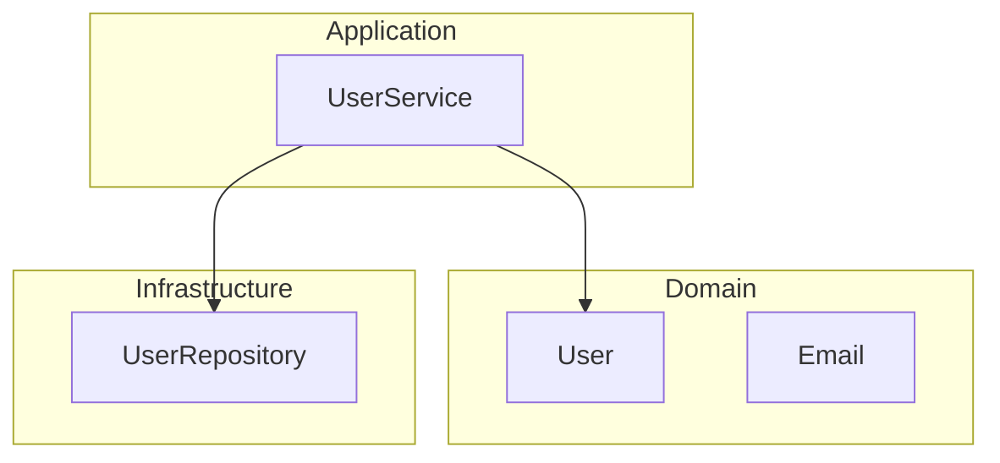

# Architecture Writing Guide

Design-first development: skeleton types, verification, diagram generation.

---

## Workflow: Skeleton -> Verify -> Test -> Diagram

```
Skeleton Types  -->  Lean Verify  -->  SSpec Tests  -->  Diagram Generation
(struct/class)      (gen-lean)        (@architectural)   (--diagram-all)
```

---

## 1. Skeleton Types

Create minimal type definitions — no business logic yet.

```simple
@verify(types)
@architectural
struct User:
    id: UserId
    email: Email
    status: UserStatus

@verify(types)
struct Email:
    value: String
    fn new(value: String) -> Email:
        in: value.contains("@"), "invalid email"
        Email { value }

@verify(types)
enum UserStatus:
    Active
    Inactive
    Pending
```

**Rules:** Types only first. Use domain types, not primitives. Add `in:/out:` contracts. Mark with `@verify` and `@architectural`.

---

## 2. Lean Verification

```bash
simple gen-lean generate --project types   # Generate Lean
simple gen-lean compare                    # Check alignment
cd src/verification/type_inference_compile && lake build  # Run proofs
```

### Verification Levels

| Level | Scope |
|-------|-------|
| `@verify(types)` | Type correctness |
| `@verify(memory)` | Borrow checking |
| `@verify(effects)` | Effect tracking |
| `@verify(all)` | Full verification |

---

## 3. Tests with Architecture Annotations

```simple
import std.spec

describe "User":
    @architectural
    context "creation":
        it "creates user with valid email":
            user = User.new(UserId.new(1), Email.new("user@example.com"))
            expect user.id.value to eq 1

        it "rejects invalid email":
            expect_raises ContractError:
                Email.new("invalid-email")
```

---

## 4. Diagram Generation

```bash
simple test user_spec.spl --diagram-all --diagram-output doc/diagrams/
```

### Architectural Layers

```simple
@architectural_layer(Presentation)    # UI, API controllers
@architectural_layer(Application)     # Use cases, services
@architectural_layer(Domain)          # Business entities
@architectural_layer(Infrastructure)  # Database, external services
```

Generated architecture diagram:



---

## Annotations Summary

| Annotation | Purpose |
|------------|---------|
| `@verify(types/memory/effects/all)` | Generate Lean proofs |
| `@architectural` | Include in architecture diagrams |
| `@architectural_layer(X)` | Assign to layer |

---

## See Also

- [design_writing.md](design_writing.md) - Draft->Test->Generate diagram workflow
- [../test/sspec_writing.md](../test/sspec_writing.md) - Test writing guide
- [../coding_style.md](../coding_style.md) - Coding conventions
