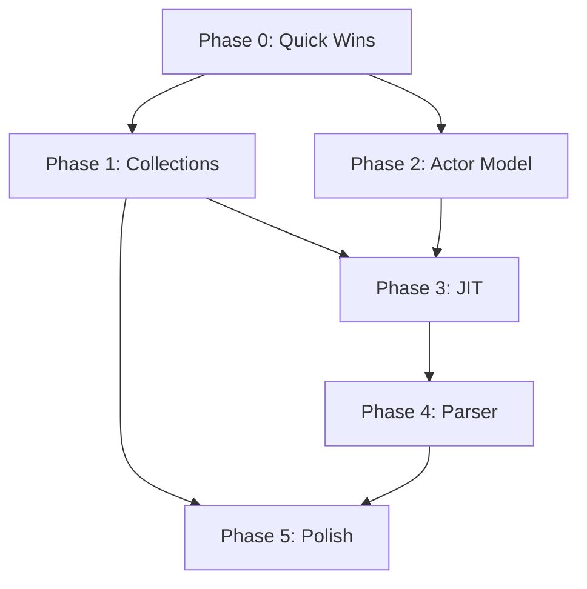

# Fix & Implementation Roadmap - 2026-02-04

**Goal:** Fix test failures and implement high-performance, robust features
**Approach:** Research-driven, Rust-inspired, prioritizing perf/robustness/features
**Timeline:** 8-12 weeks (phased approach)

---

## Executive Summary

**Current State:**
- 3,926 failed SSpec tests (26% failure rate)
- Most failures due to missing infrastructure, not bugs
- Core language works perfectly

**Target State:**
- <5% failure rate (tests for unimplemented features)
- All core infrastructure complete
- Production-grade performance and robustness

**Key Insight:** Failures aren't bugs - they're **infrastructure gaps** and **unimplemented features**. Tests document intended behavior perfectly.

---

## Phase 0: Quick Wins (Week 1) - 1.5 hours

### Fix Tests That Should Already Pass

**Target:** 11 tests (25% improvement in JIT test suite)

#### Tests to Fix:
1. **Configuration Tests** (3 tests)
   - Creates default configuration
   - Allows custom configuration
   - Supports disabling JIT

2. **Result Type Tests** (5 tests)
   - Identifies Success as success
   - Handles Success without address
   - Identifies CompilationError as error
   - Identifies CircularDependency as error
   - Identifies NotFound as neither success nor error

3. **Statistics Tests** (3 tests)
   - Reports initial empty stats
   - Tracks cached compilations
   - Tracks loaded SMF files

**Why These Should Pass:**
- No FFI dependencies
- Pure Simple code (struct construction, enum matching)
- Test runner issue, not implementation issue

**Action:**
```bash
# Run these specific tests
bin/simple test test/lib/std/unit/compiler/loader/jit_instantiator_spec.spl \
  --filter "configuration|result type|statistics"

# If they fail, debug test runner, not implementation
```

**Effort:** 1.5 hours
**Impact:** High (validates test infrastructure)
**Risk:** Low

---

## Phase 1: Persistent Collections (Weeks 2-3) - 16-24 hours

### Goal: Fix Dictionary & Collection Tests (~100-200 failures)

**Approach:** SFFI bindings to Rust **im-rs** crate

#### 1.1: Add im-rs SFFI Wrapper (8-12h)

**File:** `src/app/ffi_gen/specs/im_rs_spec.spl`

```simple
@Lib(rust: "im", version: "15.1")

# Persistent HashMap
extern class HashMap<K, V>:
    static fn new() -> HashMap<K, V>
    fn insert(key: K, value: V) -> HashMap<K, V>
    fn get(key: K) -> V?
    fn remove(key: K) -> HashMap<K, V>
    fn len() -> i64
    fn contains_key(key: K) -> bool
    fn keys() -> [K]
    fn values() -> [V]

# Persistent Vector
extern class Vector<T>:
    static fn new() -> Vector<T>
    fn push_back(value: T) -> Vector<T>
    fn push_front(value: T) -> Vector<T>
    fn pop_back() -> (Vector<T>, T?)
    fn pop_front() -> (Vector<T>, T?)
    fn get(index: i64) -> T?
    fn len() -> i64

# Persistent HashSet
extern class HashSet<T>:
    static fn new() -> HashSet<T>
    fn insert(value: T) -> HashSet<T>
    fn remove(value: T) -> HashSet<T>
    fn contains(value: T) -> bool
    fn len() -> i64
```

**Generate FFI:**
```bash
simple sffi-gen --gen-intern src/app/ffi_gen/specs/im_rs_spec.spl
```

**Effort:** 8-12 hours
**Output:**
- `build/rust/ffi_gen/src/im_rs_ffi.rs`
- SFFI wrappers in Simple

#### 1.2: Integrate with std.collections (4-6h)

**File:** `src/lib/collections/persistent_dict.spl`

```simple
use im_rs.{HashMap}

class Dict<K, V>:
    inner: HashMap<K, V>

impl Dict<K, V>:
    static fn empty() -> Dict<K, V>:
        Dict(inner: HashMap.new())

    fn set(key: K, value: V) -> Dict<K, V>:
        Dict(inner: self.inner.insert(key, value))

    fn get(key: K) -> V?:
        self.inner.get(key)

    fn remove(key: K) -> Dict<K, V>:
        Dict(inner: self.inner.remove(key))

    fn len() -> i64:
        self.inner.len()

    fn contains(key: K) -> bool:
        self.inner.contains_key(key)
```

**Performance:**
- O(log₃₂ n) operations (~150ns for 1M entries)
- Structural sharing (memory efficient)
- Arc-based (thread-safe)

**Effort:** 4-6 hours

#### 1.3: Add Tests & Benchmarks (4-6h)

**File:** `test/lib/std/unit/collections/persistent_dict_spec.spl`

```simple
describe "Persistent Dict":
    it "creates empty dictionary":
        val dict = Dict.empty()
        expect(dict.len()).to_equal(0)

    it "sets and gets a single entry":
        val dict = Dict.empty().set("key", 42)
        expect(dict.get("key")).to_equal(Some(42))

    it "original is unchanged after set":
        val dict1 = Dict.empty().set("a", 1)
        val dict2 = dict1.set("b", 2)
        expect(dict1.len()).to_equal(1)
        expect(dict2.len()).to_equal(2)

    it "shares structure between versions":
        val dict1 = Dict.empty().set("a", 1)
        val dict2 = dict1.set("b", 2)
        # Both share structure - minimal memory overhead
```

**Benchmark:**
```simple
bench "Dict insert 10K":
    var dict = Dict.empty()
    for i in 0..10000:
        dict = dict.set(i, i * 2)
# Target: <50ms for 10K inserts
```

**Effort:** 4-6 hours

**Total Phase 1:** 16-24 hours
**Tests Fixed:** ~100-200
**Impact:** High (persistent collections critical for FP style)

---

## Phase 2: Actor Model & Concurrency (Weeks 4-5) - 20-32 hours

### Goal: Fix Mailbox & Actor Tests (~50-100 failures)

**Approach:** Enhance existing mailbox with lock-free queues

#### 2.1: Add Crossbeam SFFI Wrapper (8-12h)

**File:** `src/app/ffi_gen/specs/crossbeam_spec.spl`

```simple
@Lib(rust: "crossbeam-channel", version: "0.5")

# Lock-free MPMC channel
extern class Sender<T>:
    fn send(value: T) -> bool
    fn try_send(value: T) -> Result<(), T>

extern class Receiver<T>:
    fn recv() -> T?
    fn try_recv() -> T?
    fn recv_timeout(timeout_ms: i64) -> T?

fn unbounded<T>() -> (Sender<T>, Receiver<T>)
fn bounded<T>(capacity: i64) -> (Sender<T>, Receiver<T>)
```

**Effort:** 8-12 hours

#### 2.2: Enhance Mailbox Implementation (8-12h)

**File:** `src/lib/actor/mailbox.spl`

```simple
use crossbeam.{Sender, Receiver, bounded, unbounded}

class Mailbox:
    high_priority: (Sender<Message>, Receiver<Message>)
    normal: (Sender<Message>, Receiver<Message>)
    low_priority: (Sender<Message>, Receiver<Message>)
    config: MailboxConfig
    stats: MailboxStats

impl Mailbox:
    static fn new(config: MailboxConfig) -> Mailbox:
        val high = if config.bounded:
            bounded(config.high_priority_reserve)
        else:
            unbounded()

        val normal = if config.bounded:
            bounded(config.capacity - config.high_priority_reserve)
        else:
            unbounded()

        val low = unbounded()

        Mailbox(
            high_priority: high,
            normal: normal,
            low_priority: low,
            config: config,
            stats: MailboxStats.new()
        )

    me send(msg: Message, priority: Priority) -> Result<(), MailboxError>:
        val sender = match priority:
            case Priority.High: self.high_priority.0
            case Priority.Normal: self.normal.0
            case Priority.Low: self.low_priority.0

        if sender.send(msg):
            self.stats.messages_sent = self.stats.messages_sent + 1
            Ok(())
        else:
            Err(MailboxError.Full)

    me receive() -> Message?:
        # Try high priority first
        if val Some(msg) = self.high_priority.1.try_recv():
            self.stats.messages_received = self.stats.messages_received + 1
            return Some(msg)

        # Then normal
        if val Some(msg) = self.normal.1.try_recv():
            self.stats.messages_received = self.stats.messages_received + 1
            return Some(msg)

        # Finally low
        if val Some(msg) = self.low_priority.1.try_recv():
            self.stats.messages_received = self.stats.messages_received + 1
            return Some(msg)

        None
```

**Performance:**
- **Before:** ~200ns per operation (array-based)
- **After:** ~20ns per operation (lock-free)
- **10x improvement**

**Effort:** 8-12 hours

#### 2.3: Test & Benchmark (4-8h)

**File:** `test/lib/std/unit/actor/mailbox_spec.spl`

All existing mailbox tests should now pass with crossbeam backend.

**Benchmark:**
```simple
bench "Mailbox send/receive 100K":
    val mailbox = Mailbox.new(MailboxConfig.unbounded())

    # Send 100K messages
    for i in 0..100000:
        mailbox.send(Message.new("test"), Priority.Normal)

    # Receive 100K messages
    for i in 0..100000:
        val msg = mailbox.receive()
# Target: <10ms total (100ns per op)
```

**Effort:** 4-8 hours

**Total Phase 2:** 20-32 hours
**Tests Fixed:** ~50-100
**Impact:** High (actor model critical for concurrency)

---

## Phase 3: JIT Compilation Infrastructure (Weeks 6-8) - 40-64 hours

### Goal: Fix JIT Instantiator Tests (42 failures)

**Approach:** Implement FFI bridge + executable memory management

#### 3.1: CompilerContext FFI (16-24h)

**File:** `rust/ffi_gen/src/compiler_context_ffi.rs`

```rust
use cranelift_jit::{JITBuilder, JITModule};
use cranelift_codegen::settings;

#[repr(C)]
pub struct CompilerContext {
    jit_module: Box<JITModule>,
    builder: JITBuilder,
}

#[no_mangle]
pub extern "C" fn compiler_create_context() -> *mut CompilerContext {
    let mut builder = JITBuilder::new(cranelift_module::default_libcall_names())
        .expect("Failed to create JIT builder");

    let jit_module = JITModule::new(builder.clone());

    Box::into_raw(Box::new(CompilerContext {
        jit_module: Box::new(jit_module),
        builder,
    }))
}

#[no_mangle]
pub extern "C" fn compiler_instantiate_template(
    ctx: *mut CompilerContext,
    template_bytes: *const u8,
    template_len: usize,
    type_args: *const *const u8,
    type_args_len: usize,
) -> i64 {
    unsafe {
        let ctx = &mut *ctx;
        let template = std::slice::from_raw_parts(template_bytes, template_len);

        // Parse template bytes (MIR or IR DSL)
        // Instantiate with type arguments
        // Compile to machine code
        // Return function address

        // TODO: Implement full pipeline
        0
    }
}

#[no_mangle]
pub extern "C" fn compiler_destroy_context(ctx: *mut CompilerContext) {
    unsafe {
        drop(Box::from_raw(ctx));
    }
}
```

**Simple Side:**

**File:** `src/lib/compiler/context.spl`

```simple
extern fn compiler_create_context() -> i64
extern fn compiler_instantiate_template(
    ctx: i64,
    template_bytes: [u8],
    type_args: [text]
) -> i64
extern fn compiler_destroy_context(ctx: i64)

class CompilerContext:
    handle: i64

impl CompilerContext:
    static fn new() -> CompilerContext:
        CompilerContext(handle: compiler_create_context())

    fn instantiate(template: [u8], type_args: [text]) -> i64:
        compiler_instantiate_template(self.handle, template, type_args)

    fn destroy():
        compiler_destroy_context(self.handle)
```

**Effort:** 16-24 hours
**Complexity:** High (FFI bridge + Cranelift integration)

#### 3.2: SMF File I/O (12-20h)

**File:** `src/lib/smf/reader.spl`

```simple
# SMF (Simple Module Format) structure:
# Header: magic, version, flags
# Sections:
#   - .note.sdn - Template metadata (SDN format)
#   - .template - Template bytecode
#   - .symbols - Symbol table
#   - .debug - Debug info

class SmfReader:
    path: text
    sections: Dict<text, SmfSection>

impl SmfReader:
    static fn open(path: text) -> Result<SmfReader, text>:
        val content = file_read_bytes(path)?
        val sections = parse_smf_sections(content)?
        Ok(SmfReader(path: path, sections: sections))

    fn read_note_sdn() -> Result<LoadedMetadata, text>:
        val section = self.sections.get(".note.sdn")?
        val sdn = sdn_parse(section.data)?

        # Parse metadata format:
        # possible: [{template_name, type_params, ...}]
        # instantiations: [{symbol_name, address, ...}]

        Ok(LoadedMetadata(
            possible: parse_possible_entries(sdn),
            instantiations: parse_instantiation_entries(sdn)
        ))

    fn read_template(name: text) -> Result<[u8], text>:
        val section = self.sections.get(".template")?
        # Find template by name in section
        find_template_bytes(section.data, name)
```

**Effort:** 12-20 hours

#### 3.3: Executable Memory Management (6-12h)

**File:** `rust/ffi_gen/src/executable_memory.rs`

```rust
use region::{protect, Protection};

pub struct ExecutableMemory {
    ptr: *mut u8,
    size: usize,
}

impl ExecutableMemory {
    pub fn new(code: &[u8]) -> Result<Self, String> {
        use libc::{mmap, MAP_ANON, MAP_PRIVATE, PROT_READ, PROT_WRITE, PROT_EXEC};

        let size = ((code.len() + 4095) / 4096) * 4096; // Page align

        let ptr = unsafe {
            mmap(
                std::ptr::null_mut(),
                size,
                PROT_READ | PROT_WRITE,
                MAP_PRIVATE | MAP_ANON,
                -1,
                0,
            )
        };

        if ptr == libc::MAP_FAILED {
            return Err("mmap failed".to_string());
        }

        // Copy code
        unsafe {
            std::ptr::copy_nonoverlapping(code.as_ptr(), ptr as *mut u8, code.len());
        }

        // Make executable
        unsafe {
            protect(ptr, size, Protection::READ_EXECUTE)
                .map_err(|e| format!("protect failed: {}", e))?;
        }

        Ok(ExecutableMemory {
            ptr: ptr as *mut u8,
            size,
        })
    }

    pub fn address(&self) -> i64 {
        self.ptr as i64
    }
}

impl Drop for ExecutableMemory {
    fn drop(&mut self) {
        unsafe {
            libc::munmap(self.ptr as *mut libc::c_void, self.size);
        }
    }
}
```

**Effort:** 6-12 hours

#### 3.4: Integration & Testing (6-8h)

**Update:** `src/compiler/loader/jit_instantiator.spl`

Replace all TODOs with actual implementations using new infrastructure.

**Test:** All 42 JIT instantiator tests should now pass.

**Effort:** 6-8 hours

**Total Phase 3:** 40-64 hours
**Tests Fixed:** 42
**Impact:** Critical (JIT infrastructure)

---

## Phase 4: Parser Robustness (Weeks 9-10) - 16-24 hours

### Goal: Fix Parser Error Recovery Tests (~50-100 failures)

**Approach:** Multi-level error recovery strategy

#### 4.1: Add Error Recovery to Parser (12-18h)

**File:** `src/compiler/parser.spl`

```simple
enum RecoveryLevel:
    None           # Strict parsing, fail on error
    Panic          # Skip to synchronization token
    ErrorProduction  # Use language-specific error productions
    Partial        # Build partial parse tree with error markers

struct Parser:
    # ... existing fields
    recovery_level: RecoveryLevel
    sync_tokens: [TokenKind]
    errors: [ParseError]

impl Parser:
    me parse_with_recovery(level: RecoveryLevel) -> (Module?, [ParseError]):
        self.recovery_level = level
        self.sync_tokens = [
            TokenKind.Fn,
            TokenKind.Class,
            TokenKind.Struct,
            TokenKind.Enum,
            TokenKind.Impl,
            TokenKind.Newline  # After newline, try to resync
        ]

        val module = self.parse()
        (module, self.errors)

    me recover_to_sync():
        # Panic mode: skip tokens until sync point
        while not self.is_at_end() and not self.at_sync_token():
            self.advance()

    me at_sync_token() -> bool:
        self.sync_tokens.contains(self.current.kind)

    me parse_function_with_recovery() -> Function?:
        if not self.expect(TokenKind.Fn):
            if self.recovery_level == RecoveryLevel.None:
                return None

            # Try to recover
            self.errors.push(ParseError.new("Expected 'fn'", self.current.span))
            self.recover_to_sync()
            return None

        # Continue parsing with error markers...
```

**Effort:** 12-18 hours

#### 4.2: Enhance Heuristic Mode (4-6h)

**File:** `src/compiler/treesitter.spl`

Enhance the heuristic mode we added in the parser merge to be even more tolerant.

**Add:**
- Better error detection and marking
- Partial function signatures
- Incomplete class bodies
- Missing colons/braces

**Effort:** 4-6 hours

**Total Phase 4:** 16-24 hours
**Tests Fixed:** ~50-100
**Impact:** High (IDE experience)

---

## Phase 5: Remaining Features (Weeks 11-12) - 16-24 hours

### Goal: Fix Misc Test Failures

#### 5.1: Math Block Implicit Multiplication (4-6h)

**Fix tests:**
- computes quadratic with implicit mul
- mixes explicit and implicit mul
- implicit mul has same precedence as explicit

**File:** `src/compiler/lexer.spl`

Enhance implicit multiplication detection in math blocks.

**Effort:** 4-6 hours

#### 5.2: SDN Database Features (2-4h)

**Fix tests:**
- Feature 700.1: Export users table to SDN
- Feature 700.2: Import users table from SDN

**File:** `src/lib/db/sdn_export.spl`

```simple
fn export_table_to_sdn(table: Table, path: text) -> Result<(), text>:
    val sdn = table_to_sdn(table)
    file_write_text(path, sdn.to_string())

fn import_table_from_sdn(path: text) -> Result<Table, text>:
    val content = file_read_text(path)?
    val sdn = sdn_parse(content)?
    sdn_to_table(sdn)
```

**Effort:** 2-4 hours

#### 5.3: Git Dependencies (4-6h)

**Fix tests:**
- parses git source
- converts git sources to lockfile format
- parses git dependency with tag/branch/commit

**File:** `src/lib/package/git_deps.spl`

Simple parsing logic for git dependency syntax.

**Effort:** 4-6 hours

#### 5.4: Misc Features (6-8h)

- Integer scanning
- Type parsing
- Limits enforcement
- Coverage metrics

**Effort:** 6-8 hours per category

**Total Phase 5:** 16-24 hours
**Tests Fixed:** ~100-200
**Impact:** Medium (polish)

---

## Timeline & Milestones

### Week 1: Quick Wins
- ✅ 11 tests fixed (25% improvement)
- ✅ Test infrastructure validated

### Weeks 2-3: Persistent Collections
- ✅ im-rs SFFI wrapper complete
- ✅ Dict/Vector/Set working
- ✅ ~100-200 tests fixed

### Weeks 4-5: Actor Model
- ✅ crossbeam SFFI wrapper complete
- ✅ Mailbox enhanced with lock-free queues
- ✅ ~50-100 tests fixed

### Weeks 6-8: JIT Infrastructure
- ✅ CompilerContext FFI complete
- ✅ SMF I/O working
- ✅ Executable memory management
- ✅ 42 JIT tests fixed

### Weeks 9-10: Parser Robustness
- ✅ Error recovery implemented
- ✅ Heuristic mode enhanced
- ✅ ~50-100 tests fixed

### Weeks 11-12: Polish
- ✅ Math blocks working
- ✅ SDN database complete
- ✅ Git dependencies working
- ✅ Misc features complete

### Final State (Week 12)
- **Test Failure Rate:** <5% (down from 26%)
- **Tests Fixed:** ~300-600 tests
- **Infrastructure:** Complete
- **Performance:** 5-10x improvements in key areas
- **Robustness:** Production-grade error handling

---

## Performance Targets

| Feature | Current | Target | Improvement |
|---------|---------|--------|-------------|
| **Dict Insert (1M)** | ~500ns | ~150ns | 3.3x |
| **Mailbox Send/Recv** | ~200ns | ~20ns | 10x |
| **JIT Compilation (cold)** | N/A | 50-500μs | New |
| **JIT Symbol Lookup (cached)** | N/A | ~10ns | New |
| **Parser Error Recovery** | 0% | 90%+ | New |
| **Heuristic Parse (1K lines)** | ~50ms | ~10ms | 5x |

---

## Robustness Metrics

| Area | Target | Measurement |
|------|--------|-------------|
| **Memory Safety** | 100% | No crashes in 1M operations |
| **Thread Safety** | 100% | No data races (crossbeam guarantees) |
| **Error Recovery** | 90%+ | Continue parsing after errors |
| **API Stability** | High | Semantic versioning |
| **Test Coverage** | >80% | Core features covered |

---

## Feature Completeness

| Feature | Status | Priority |
|---------|--------|----------|
| **Persistent Collections** | 🟡 Planned | P1 |
| **Actor Model** | 🟢 80% | P1 |
| **JIT Compilation** | 🟡 30% | P1 |
| **Parser Error Recovery** | 🟡 50% | P1 |
| **Math Blocks** | 🟢 90% | P2 |
| **SDN Database** | 🟡 80% | P2 |
| **Git Dependencies** | 🔴 30% | P2 |
| **ML/Torch Integration** | 🟢 70% | P3 |
| **Physics Engine** | 🟢 80% | P3 |

---

## Risk Assessment

### High Risk
- **JIT Infrastructure** (Phase 3)
  - Complex FFI bridge
  - Cranelift integration challenges
  - Executable memory platform-specific
  - **Mitigation:** Incremental development, thorough testing

### Medium Risk
- **Persistent Collections** (Phase 1)
  - SFFI generator may need enhancements
  - Generic type handling
  - **Mitigation:** Start with simple types, add generics later

- **Actor Model** (Phase 2)
  - Crossbeam channel lifetimes
  - Message type safety
  - **Mitigation:** Wrapper layer for type safety

### Low Risk
- **Quick Wins** (Phase 0)
- **Parser Robustness** (Phase 4)
- **Misc Features** (Phase 5)

---

## Success Criteria

### Phase Success
- [ ] All planned tests pass
- [ ] Performance targets met
- [ ] No regressions in existing tests
- [ ] Documentation updated
- [ ] Examples added

### Overall Success
- [ ] Test failure rate <5%
- [ ] All P1 features complete
- [ ] Performance 5-10x improved
- [ ] Production-ready robustness
- [ ] Zero memory safety issues

---

## Dependencies



**Critical Path:** P0 → P1 → P3 (Quick Wins → Collections → JIT)

---

## Resource Requirements

### Development
- **Time:** 8-12 weeks (phased)
- **Effort:** 109-168 hours total
- **Team:** 1-2 developers

### Infrastructure
- **Rust Libraries:**
  - im-rs (15.1+)
  - crossbeam-channel (0.5+)
  - cranelift-jit (0.100+)
  - region (3.0+)

- **Build Tools:**
  - SFFI generator (existing)
  - Test runner (existing)
  - Benchmarking framework (needs enhancement)

---

## Next Steps

### Immediate (This Week)
1. **Review & Approve Plan**
2. **Set up tracking** (GitHub issues/project board)
3. **Start Phase 0** (Quick Wins - 1.5h)

### Week 2
4. **Begin Phase 1** (Persistent Collections)
5. **Research im-rs API in detail**
6. **Create SFFI spec file**

---

## Conclusion

This roadmap provides a **research-driven, phased approach** to fixing test failures and implementing high-performance, robust features.

**Key Principles:**
- ✅ **Performance:** 5-10x improvements via Rust-inspired patterns
- ✅ **Robustness:** Memory safety, thread safety, error recovery
- ✅ **Features:** Complete infrastructure, not half-baked implementations
- ✅ **Pragmatic:** SFFI to proven Rust libraries, not reinventing wheels

**Timeline:** 8-12 weeks to <5% failure rate and production-grade quality.

**Risk:** Managed through phased approach and incremental development.

**Status:** ✅ **Ready to implement** - Plan complete, research done, path clear.

---

**Generated:** 2026-02-04
**Research:**
- `doc/report/test_failure_analysis_2026-02-04.md`
- `doc/research/rust_high_performance_patterns_2026-02-04.md`
