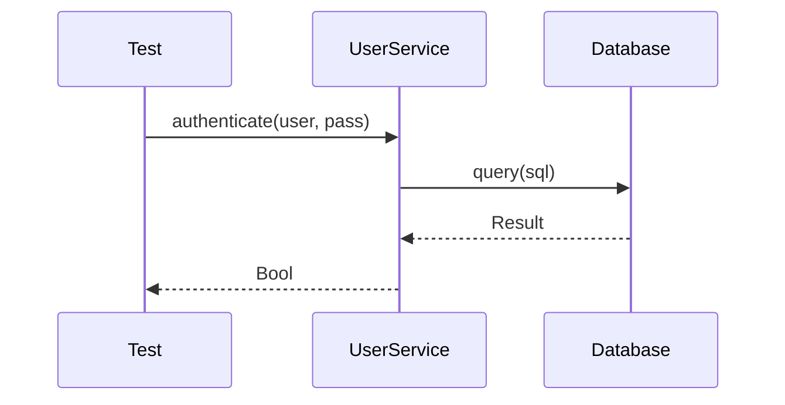

# SSpec User Manual

SSpec is a BDD (Behavior-Driven Development) testing framework for the Simple language, inspired by RSpec.

## Quick Start

```simple
import std.spec.{describe, it, expect, eq}

describe "Calculator":
    it "adds two numbers":
        expect(1 + 1).to(eq(2))
```

Run tests:
```bash
simple test                           # Run all tests
simple test path/to/spec.spl          # Run specific test
simple test --tag slow                # Run tests with tag
```

## Table of Contents

1. [Basic DSL](#basic-dsl)
2. [Matchers](#matchers)
3. [Hooks](#hooks)
4. [Shared Examples](#shared-examples)
5. [Context Sharing](#context-sharing)
6. [Mocking](#mocking)
7. [Tags](#tags)
8. [Screenshot Capture](#screenshot-capture)
9. [Diagram Generation](#diagram-generation)
10. [CLI Options](#cli-options)

---

## Basic DSL

### describe

Creates a top-level example group for a class, module, or feature:

```simple
import std.spec.{describe, it, expect, eq}

describe "UserService":
    it "creates a user":
        let user = UserService.create("alice")
        expect(user.name).to(eq("alice"))
```

### context

Creates nested groups for different scenarios:

```simple
describe "User":
    context "when logged in":
        it "shows dashboard":
            # test code

    context "when logged out":
        it "shows login form":
            # test code
```

### it

Defines a single test example:

```simple
describe "Array":
    it "returns length":
        expect([1, 2, 3].len()).to(eq(3))

    it "can be empty":
        expect([].is_empty()).to(eq(true))
```

### skip

Skip a test temporarily:

```simple
describe "Feature":
    skip "pending implementation":
        # This test won't run
        pass
```

---

## Matchers

### Core Matchers

```simple
import std.spec.{expect, eq, be, be_nil}

# Equality
expect(value).to(eq(expected))
expect(value).not_to(eq(other))

# Identity
expect(obj).to(be(same_obj))

# Nil check
expect(result).to(be_nil())
expect(result).not_to(be_nil())
```

### Comparison Matchers

```simple
import std.spec.{gt, lt, gte, lte}

expect(5).to(gt(3))      # greater than
expect(3).to(lt(5))      # less than
expect(5).to(gte(5))     # greater than or equal
expect(3).to(lte(5))     # less than or equal
```

### Collection Matchers

```simple
import std.spec.{include, be_empty, have_length, have_size}

expect([1, 2, 3]).to(include(2))
expect([]).to(be_empty())
expect([1, 2, 3]).to(have_length(3))
expect({"a": 1}).to(have_size(1))
```

### String Matchers

```simple
import std.spec.{include_string, start_with, end_with, be_blank}

expect("hello world").to(include_string("world"))
expect("hello").to(start_with("hel"))
expect("hello").to(end_with("lo"))
expect("   ").to(be_blank())
```

### Error Matchers

```simple
import std.spec.{expect_raises, raise_error}

expect_raises(fn(): raise Error("oops")).to(raise_error("oops"))
```

---

## Hooks

### before_each / after_each

Run before/after each test:

```simple
import std.spec.{describe, it, before_each, after_each}

describe "Database":
    let db: Option[Database] = None

    before_each:
        db = Some(Database.connect())

    after_each:
        match db:
            case Some(d) => d.close()
            case None => pass

    it "inserts records":
        db.unwrap().insert(record)
```

### before_all / after_all

Run once before/after all tests in a group:

```simple
import std.spec.{describe, it, before_all, after_all}

describe "Server":
    before_all:
        start_test_server()

    after_all:
        stop_test_server()

    it "handles requests":
        # tests run with server available
```

---

## Shared Examples

Reuse test examples across multiple contexts:

```simple
import std.spec.{describe, it, shared_examples, it_behaves_like, expect, eq}

# Define shared examples
shared_examples "a collection":
    it "has a length":
        expect(subject.len()).to(gt(0))

    it "can be iterated":
        let count = 0
        for item in subject:
            count = count + 1
        expect(count).to(eq(subject.len()))

# Use in tests
describe "Array":
    let subject = [1, 2, 3]
    it_behaves_like "a collection"

describe "String":
    let subject = "hello"
    it_behaves_like "a collection"
```

---

## Context Sharing

Define reusable contexts with fixtures:

```simple
import std.spec.{describe, context_def, given, context, it}

# Define reusable context
context_def :admin_user:
    given :user:
        User.new(role="admin")

context_def :with_database:
    given :db:
        Database.connect_test()

# Use in tests
describe "AdminPanel":
    context :admin_user:
        it "shows admin menu":
            expect(user.can_access_admin()).to(eq(true))

    # Compose multiple contexts
    context_compose :admin_user, :with_database:
        it "can manage users":
            db.insert(user)
            expect(db.count_users()).to(gt(0))
```

### let / let_lazy

Memoized values for tests:

```simple
import std.spec.{describe, it, let, let_lazy, get_let}

describe "User":
    # Eager evaluation (before each test)
    let :user:
        User.new("alice")

    # Lazy evaluation (on first access)
    let_lazy :expensive_data:
        compute_expensive_data()

    it "has a name":
        expect(get_let(:user).name).to(eq("alice"))
```

---

## Mocking

### Mock Objects

```simple
import std.spec.{describe, it, Mock, expect, eq}

describe "PaymentService":
    it "processes payment":
        let gateway = Mock.new("PaymentGateway")
        gateway.stub("charge").returns(true)

        let service = PaymentService.new(gateway)
        let result = service.process(100)

        expect(result).to(eq(true))
        expect(gateway.calls("charge")).to(have_length(1))
```

### Spy Objects

```simple
import std.spec.{Spy}

describe "Logger":
    it "logs messages":
        let logger = Spy.new(RealLogger.new())

        logger.info("test message")

        expect(logger.calls("info")).to(include(["test message"]))
```

### Stubs

```simple
import std.spec.{Stub}

describe "API Client":
    it "handles response":
        let http = Stub.new("HttpClient")
        http.when("get", "/users").returns('{"users": []}')

        let client = ApiClient.new(http)
        let users = client.get_users()

        expect(users).to(be_empty())
```

---

## Tags

### Adding Tags

```simple
# In test file
# @slow
# @integration

describe "SlowTest":
    it "takes time":
        sleep(1000)
```

Or using decorator:
```simple
#[tag("slow")]
describe "SlowTest":
    pass
```

### Directory-wide Tags

Create `__init__.spl` in test directory:
```simple
# @gui
# All tests in this directory are tagged with @gui
```

### Running Tagged Tests

```bash
simple test --tag slow           # Run only @slow tests
simple test --tag integration    # Run only @integration tests
simple test --tag gui            # Run only @gui tests
```

---

## Screenshot Capture

For GUI tests (TUI, Vulkan, terminal):

### Tagging GUI Tests

```simple
# @gui
describe "TUI Widget":
    it "renders button":
        let widget = Button.new("Click me")
        widget.render()
```

### Using Screenshot API

```simple
import std.spec.{describe, it, with_screenshot, capture_before, capture_after}

describe "Terminal App":
    it "shows welcome screen", with_screenshot:
        capture_before()
        app.start()
        capture_after()
```

### CLI Options

```bash
# Capture screenshots for @gui tests
simple test --capture-screenshots

# Force recapture all screenshots
simple test --refresh-gui-image

# Custom output directory
simple test --screenshot-output doc/images
```

### Image Storage

Screenshots are saved to:
```
doc/spec/image/
├── unit/ui/tui/
│   └── widgets_spec/
│       ├── renders_button_before.png
│       └── renders_button_after.png
```

---

## Diagram Generation

Generate Mermaid diagrams from test execution:

### Enabling Diagrams

```simple
import std.spec.{describe, it, enable_all_diagrams, traced_it}

enable_all_diagrams()

describe "UserService":
    traced_it "authenticates user":
        let service = UserService.new()
        service.authenticate("user", "pass")
```

### Manual Tracing

```simple
import std.spec.{trace_method, trace_call, trace_return, mark_architectural}

describe "API Flow":
    it "processes request":
        mark_architectural("Gateway")
        mark_architectural("Service")

        trace_method("Gateway", "receive", ["request"])
        trace_method("Service", "process", ["data"])
        trace_return(Some("success"))
```

### Diagram Decorators

```simple
import std.spec.{with_seq_diagram, with_class_diagram, with_arch_diagram}

describe "Payment":
    it "processes payment", with_seq_diagram:
        # Generates sequence diagram
        gateway.charge(amount)

    it "shows relationships", with_class_diagram:
        # Generates class diagram
        service.process(request)

    it "shows architecture", with_arch_diagram:
        # Generates architecture diagram
        mark_architectural("PaymentGateway")
        mark_architectural("Database")
```

### CLI Options

```bash
# Generate sequence diagrams
simple test --seq-diagram

# Generate class diagrams
simple test --class-diagram

# Generate architecture diagrams
simple test --arch-diagram

# Generate all diagram types
simple test --diagram-all

# Filter diagrams
simple test --seq-include "User*,Auth*"
simple test --seq-exclude "Internal*"

# Custom output directory
simple test --diagram-output doc/diagrams
```

### Generated Diagram Example



---

## CLI Options

### Basic Options

```bash
simple test                          # Run all tests
simple test path/to/test.spl         # Run specific file
simple test path/to/dir              # Run all tests in directory
```

### Filtering

```bash
simple test --unit                   # Run unit tests only
simple test --integration            # Run integration tests only
simple test --system                 # Run system tests only
simple test --tag slow               # Run tests with tag
```

### Execution

```bash
simple test --fail-fast              # Stop on first failure
simple test --seed 12345             # Deterministic order
simple test --gc-log                 # Enable GC logging
simple test --gc=off                 # Disable GC
```

### Output Formats

```bash
simple test --format text            # Default colored output
simple test --format json            # JSON output
simple test --format doc             # Documentation format
simple test --json                   # Shortcut for JSON
simple test --doc                    # Shortcut for doc format
```

### Watch Mode

```bash
simple test --watch                  # Auto-rerun on file changes
```

### Doctests

```bash
simple test --doctest                # Run all doctests
simple test --doctest-src            # Run doctests from .spl files
simple test --doctest-doc            # Run doctests from .md files
simple test --doctest-md             # Run doctests from README.md hierarchy
```

### Screenshots & Diagrams

```bash
simple test --capture-screenshots    # Capture GUI screenshots
simple test --refresh-gui-image      # Force recapture all
simple test --screenshot-output DIR  # Custom screenshot directory

simple test --seq-diagram            # Generate sequence diagrams
simple test --class-diagram          # Generate class diagrams
simple test --arch-diagram           # Generate architecture diagrams
simple test --diagram-all            # Generate all diagrams
simple test --diagram-output DIR     # Custom diagram directory
```

---

## File Naming Convention

Test files should follow these patterns:
- `*_spec.spl` - BDD spec files (preferred)
- `*_test.spl` - Test files

Example structure:
```
simple/std_lib/test/
├── unit/
│   ├── core/
│   │   ├── string_spec.spl
│   │   └── array_spec.spl
│   └── ui/
│       └── tui/
│           └── widgets_spec.spl
├── integration/
│   └── api_spec.spl
└── system/
    └── e2e_spec.spl
```

---

## Best Practices

1. **One assertion per test** - Keep tests focused
2. **Descriptive names** - `it "returns empty array when no users exist"`
3. **Use contexts** - Group related tests with `context`
4. **DRY with shared examples** - Reuse common test patterns
5. **Tag appropriately** - Use `@slow`, `@gui`, `@integration` tags
6. **Clean up** - Use `after_each` for cleanup
7. **Isolate tests** - Tests should not depend on each other

---

## See Also

- [Feature Documentation](../feature/feature.md)
- [Diagram Generation Plan](../plan/gui_screenshot_diagram_gen.md)
- [Test Guides](../guide/test.md)
