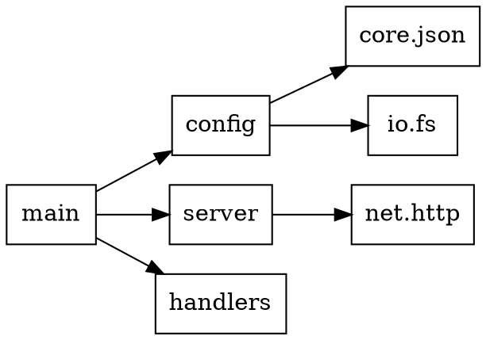

# simple_deps - Dependency Graph

## Overview

Analyzes and visualizes import dependencies between Simple modules.

## Usage

```bash
simple_deps .                      # Show dependency summary
simple_deps . --tree               # Tree view
simple_deps . --graph              # DOT graph output
simple_deps . --cycles             # Find circular dependencies
simple_deps . --why mod_a mod_b    # Why does mod_a depend on mod_b?
simple_deps . --orphans            # Find unused modules
```

## Options

| Flag | Description |
|------|-------------|
| `--tree` | Tree view of dependencies |
| `--graph` | Output DOT format for Graphviz |
| `--cycles` | Detect circular dependencies |
| `--why <a> <b>` | Show dependency path from a to b |
| `--orphans` | Find modules with no dependents |
| `--depth <n>` | Limit tree depth |
| `--json` | JSON output format |

## Output Format

### Summary (default)

```
Dependency Analysis
===================

Modules: 45
Direct dependencies: 123
Transitive dependencies: 456

Most depended upon:
  1. core.result (32 dependents)
  2. core.option (28 dependents)
  3. core.string (24 dependents)
  4. io.fs (18 dependents)
  5. core.json (12 dependents)

Highest dependency count:
  1. main (imports 15 modules)
  2. server (imports 12 modules)
  3. handler (imports 10 modules)
```

### Tree View

```
main
├── config
│   ├── core.json
│   └── io.fs
├── server
│   ├── net.http
│   │   ├── net.tcp
│   │   └── core.string
│   └── core.result
└── handlers
    ├── core.json
    └── core.result
```

### DOT Graph



### Cycles Detection

```
Circular dependencies found:

  1. module_a -> module_b -> module_c -> module_a
  2. handler -> service -> handler

Found 2 circular dependency chains.
```

### Why Path

```bash
$ simple_deps . --why main core.string

main -> server -> net.http -> core.string
main -> handlers -> core.json -> core.string
```

### JSON

```json
{
  "modules": [
    {
      "name": "main",
      "path": "src/main.spl",
      "imports": ["config", "server", "handlers"],
      "imported_by": []
    }
  ],
  "cycles": [],
  "orphans": ["unused_module"],
  "stats": {
    "total_modules": 45,
    "direct_deps": 123,
    "transitive_deps": 456
  }
}
```

## Implementation Notes

1. Scan all .spl files for `import` statements
2. Build dependency graph (adjacency list)
3. Detect cycles using DFS
4. Calculate transitive closure
5. Find orphans (no incoming edges except from tests)

## Import Patterns

```simple
import core.json              # -> core.json
import core.json as j         # -> core.json
import core.{json, result}    # -> core.json, core.result
from core import json         # -> core.json
```

## Dependencies

- `native_fs_read_string` - File reading
- `sys_get_args` - Command-line arguments
- `core.graph` (optional) - Graph algorithms

## Examples

```bash
# Generate SVG visualization
$ simple_deps . --graph | dot -Tsvg > deps.svg

# Check for cycles in CI
$ simple_deps . --cycles --json | jq '.cycles | length'

# Find unused modules
$ simple_deps . --orphans
```
