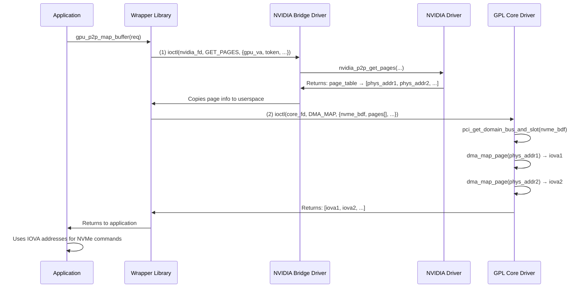

# Dual-Driver Architecture for GPU P2P Memory Mapping

## Purpose

Enable NVMe devices to DMA directly to/from GPU device memory (VRAM) by mapping GPU physical pages to IOVA addresses.

**What this driver DOES provide:**
- ✅ GPU device memory → NVMe DMA mapping (zero-copy data transfers)
- ✅ GPU memory page table acquisition via NVIDIA P2P API
- ✅ IOVA mapping for NVMe controller DMA access

**What this driver does NOT provide:**
- ❌ GPU-to-NVMe MMIO doorbell writes (GPUs cannot access PCIe MMIO regions)
- ❌ Shadow doorbell buffer allocation (uses standard VFIO + CUDA pinned memory)
- ❌ DBC configuration (handled by userspace via NVMe admin commands)

For doorbell mechanisms, see:
- Mode 2/3: Hardware DBC (NVMe controller polls shadow buffer in host RAM)
- Mode 5: Software daemon (CPU polls shadow buffer, writes MMIO on GPU's behalf)

See: `51.Knowledge_and_VFIO_Setup/51.2.NVMe_Fundamentals/README.md` for detailed explanation.

---

## Why Kernel Driver is Required (Cannot Be Done in Userspace)

The following operations require kernel privileges and cannot be performed from userspace:

| Operation | Kernel API | Why Kernel-Only |
|-----------|-----------|-----------------|
| **GPU page table access** | `nvidia_p2p_get_pages()` | Accesses GPU MMU internals, requires NVIDIA kernel module |
| **DMA/IOMMU mapping** | `dma_map_page()` | Configures IOMMU page tables for PCIe devices |
| **PCI device access** | `pci_get_domain_bus_and_slot()` | Kernel manages PCI enumeration and device references |

Only the kernel can manipulate IOMMU tables to create IOVA mappings that allow the NVMe controller to DMA directly to GPU memory.

---

## Problem Statement

Single driver cannot use BOTH:
- GPL-only kernel symbols (`device_create`, `cdev_add`, etc.)
- Proprietary NVIDIA P2P symbols (`nvidia_p2p_get_pages`, etc.)

---

## Alternative: Single Driver with NVIDIA Open-Source (GPL) Driver

> **If using `nvidia-open` (NVIDIA's open-source GPL kernel modules), the dual-driver architecture may not be needed.**

NVIDIA provides open-source kernel modules (`nvidia-open`) licensed under dual MIT/GPL since driver version 515+. When using `nvidia-open`:

- The P2P symbols (`nvidia_p2p_get_pages`, etc.) are exported under GPL
- A single GPL driver can use both Linux kernel GPL symbols AND NVIDIA P2P symbols
- No licensing conflict exists

**Check if nvidia-open is installed:**
```bash
# Check module license
modinfo nvidia | grep license
# GPL means nvidia-open, "NVIDIA" or "Proprietary" means closed-source

# Or check kernel module source
ls /usr/src/nvidia-*/  # nvidia-open-* indicates open-source
```

**When to use which approach:**

| NVIDIA Driver | Recommended Approach |
|--------------|---------------------|
| `nvidia-open` (GPL) | Single unified driver possible |
| Proprietary `nvidia.ko` | Dual-driver architecture required |

For systems with proprietary NVIDIA drivers, continue with the dual-driver solution below.

---

> **Compatibility note**
>
> The legacy `ioctl(GPU_P2P_MAP)` path is no longer handled by the GPL core driver. Use the userspace wrapper API (`gpu_p2p_map_buffer`) to perform the combined NVIDIA get_pages + core DMA map. Sending `GPU_P2P_MAP` directly to `/dev/gpu_p2p_core` will log `Unknown ioctl` (e.g., `cmd=0xc03847e0`) and fail P2P mapping for Modes 5/6.

## Solution: Dual-Driver with Userspace Wrapper

Create **2 separate kernel modules** + **1 userspace wrapper library**:

```
┌─────────────────────────────────────────────────────────────┐
│                    User Application                         │
│            (test_gpu_p2p_ioctl.cpp, benchmarks)            │
└────────────────────────┬────────────────────────────────────┘
                         │ ioctl(GPU_P2P_MAP)
                         ▼
┌─────────────────────────────────────────────────────────────┐
│              Userspace Wrapper Library                      │
│                 libgpu_p2p_wrapper.so                       │
│  - Opens both drivers                                       │
│  - Translates single ioctl → 2-stage operation             │
│  - Manages resource lifecycle                               │
└────────┬─────────────────────────────┬──────────────────────┘
         │ ioctl(GET_PAGES)            │ ioctl(DMA_MAP)
         ▼                             ▼
┌──────────────────────┐      ┌──────────────────────────────┐
│   GPL Core Driver    │      │  Proprietary NVIDIA Bridge   │
│  gpu_p2p_core.ko     │      │   gpu_p2p_nvidia.ko          │
│                      │      │                              │
│  LICENSE: GPL        │      │  LICENSE: Proprietary        │
│                      │      │                              │
│  - /dev/gpu_p2p_core │      │  - /dev/gpu_p2p_nvidia       │
│  - Character device  │      │  - Character device          │
│  - DMA mapping       │      │  - Calls nvidia_p2p_*        │
│  - IOVA management   │      │  - Page table management     │
│  - Doorbell mapping  │      │  - P2P token handling        │
└──────────┬───────────┘      └────────────┬─────────────────┘
           │                               │
           │ Uses GPL symbols              │ Uses NVIDIA symbols
           ▼                               ▼
┌──────────────────────┐      ┌──────────────────────────────┐
│   Linux Kernel       │      │    NVIDIA Driver             │
│   (GPL symbols)      │      │    nvidia.ko                 │
└──────────────────────┘      └──────────────────────────────┘
```

---

## Module 1: GPL Core Driver (`gpu_p2p_core.ko`)

### Purpose
Handle all GPL-only kernel interactions:
- Character device registration
- PCI DMA mapping for GPU memory pages
- IOVA address management for NVMe DMA access

### License
```c
MODULE_LICENSE("GPL");
```

### Device Node
```
/dev/gpu_p2p_core
```

### IOCTL Commands

```c
#define GPU_P2P_CORE_DMA_MAP    _IOWR('G', 0xC0, struct core_dma_req)
#define GPU_P2P_CORE_DMA_UNMAP  _IOW('G',  0xC1, struct core_dma_unmap_req)
```

### Data Structures

```c
// Physical page information from NVIDIA driver
struct core_page_info {
    uint64_t  phys_addr;     // Physical address of GPU page
    uint32_t  page_size;     // Page size (4K, 64K, 128K)
    uint32_t  reserved;
};

// DMA mapping request
struct core_dma_req {
    uint64_t  nvme_pci_bdf;           // NVMe device BDF
    uint32_t  num_pages;              // Number of GPU pages
    uint32_t  flags;
    uint64_t  pages_user_ptr;         // Pointer to core_page_info array
    uint64_t  out_iova_segments_ptr;  // Output: IOVA segments
    uint32_t  max_segments;
    uint32_t  num_segments;           // Output: actual segments
};

// DMA unmap request
struct core_dma_unmap_req {
    uint64_t  mapping_handle;  // Handle from map operation
    uint32_t  flags;
    uint32_t  reserved;
};
```

### Implementation Files
```
gpu_p2p_core/
├── gpu_p2p_core.c           - Main module, char device, DMA mapping
└── core_ioctl.h             - IOCTL definitions
```

### Key Functions
```c
// Uses GPL symbols: pci_get_domain_bus_and_slot, dma_map_page, etc.
static int core_dma_map_pages(struct core_dma_req *req);
static int core_dma_unmap_pages(struct core_dma_unmap_req *req);
```

---

## Module 2: Proprietary NVIDIA Bridge (`gpu_p2p_nvidia.ko`)

### Purpose
Interact with NVIDIA proprietary P2P API:
- Call `nvidia_p2p_get_pages()`
- Call `nvidia_p2p_put_pages()`
- Manage page tables
- No GPL kernel symbols

### License
```c
MODULE_LICENSE("Proprietary");
MODULE_SOFTDEP("pre: nvidia");
```

### Device Node
```
/dev/gpu_p2p_nvidia
```

### IOCTL Commands

```c
#define GPU_P2P_NV_GET_PAGES  _IOWR('N', 0xE0, struct nv_get_pages_req)
#define GPU_P2P_NV_PUT_PAGES  _IOW('N',  0xE1, struct nv_put_pages_req)
```

### Data Structures

```c
// Get pages request
struct nv_get_pages_req {
    uint64_t  gpu_va;        // GPU virtual address
    uint64_t  bytes;         // Size
    uint64_t  p2p_token;     // CUDA P2P token
    uint32_t  va_space;      // CUDA VA space
    uint32_t  flags;
    uint64_t  page_table_handle;  // Output: opaque handle
    uint64_t  pages_user_ptr;     // Output: page info array
    uint32_t  num_pages;          // Output: number of pages
    uint32_t  page_size;          // Output: page size type
};

// Put pages request
struct nv_put_pages_req {
    uint64_t  page_table_handle;  // From get_pages
    uint64_t  gpu_va;
    uint64_t  p2p_token;
    uint32_t  va_space;
    uint32_t  flags;
};
```

### Implementation Files
```
gpu_p2p_nvidia/
├── gpu_p2p_nvidia.c         - Main module, char device
├── nvidia_p2p_wrapper.c     - Calls to nvidia_p2p_* functions
└── nvidia_ioctl.h           - IOCTL definitions
```

### Key Functions
```c
// Uses NVIDIA symbols: nvidia_p2p_get_pages, nvidia_p2p_put_pages
static int nv_get_pages_impl(struct nv_get_pages_req *req);
static int nv_put_pages_impl(struct nv_put_pages_req *req);
```

---

## Component 3: Userspace Wrapper Library

### Purpose
Present unified interface to applications

### Library Name
```
libgpu_p2p_wrapper.so
```

### Public API

```c
// GPU buffer mapping for NVMe DMA
int gpu_p2p_map_buffer(int fd, struct gpu_p2p_req *req);
int gpu_p2p_unmap_buffer(int fd, uint64_t gpu_va);

// Note: gpu_p2p_map_doorbell() has been REMOVED
// GPU-to-MMIO doorbell writes are not possible.
// Use shadow doorbell mechanisms instead.
```

### Implementation Strategy

```c
struct gpu_p2p_context {
    int core_fd;      // /dev/gpu_p2p_core
    int nvidia_fd;    // /dev/gpu_p2p_nvidia
    // Resource tracking
    struct mapping_entry *mappings;
};

int gpu_p2p_map_buffer(int dummy_fd, struct gpu_p2p_req *req) {
    static struct gpu_p2p_context ctx = {-1, -1, NULL};

    // Step 1: Open drivers if not open
    if (ctx.core_fd < 0) {
        ctx.core_fd = open("/dev/gpu_p2p_core", O_RDWR);
        ctx.nvidia_fd = open("/dev/gpu_p2p_nvidia", O_RDWR);
    }

    // Step 2: Get pages from NVIDIA driver
    struct nv_get_pages_req nv_req = {
        .gpu_va = req->gpu_va,
        .bytes = req->bytes,
        .p2p_token = req->p2p_token,
        .va_space = req->va_space,
        ...
    };

    struct core_page_info pages[MAX_PAGES];
    nv_req.pages_user_ptr = (uint64_t)pages;

    if (ioctl(ctx.nvidia_fd, GPU_P2P_NV_GET_PAGES, &nv_req) < 0)
        return -1;

    // Step 3: Map to DMA with GPL driver
    struct core_dma_req core_req = {
        .nvme_pci_bdf = req->nvme_pci_bdf,
        .num_pages = nv_req.num_pages,
        .pages_user_ptr = (uint64_t)pages,
        .out_iova_segments_ptr = req->out_user_ptr,
        .max_segments = req->max_segs,
        ...
    };

    if (ioctl(ctx.core_fd, GPU_P2P_CORE_DMA_MAP, &core_req) < 0) {
        // Cleanup: put pages
        ioctl(ctx.nvidia_fd, GPU_P2P_NV_PUT_PAGES, ...);
        return -1;
    }

    // Step 4: Track mapping for cleanup
    req->num_segs = core_req.num_segments;
    add_mapping(&ctx, req->gpu_va, nv_req.page_table_handle);

    return 0;
}
```

### Files
```
libgpu_p2p_wrapper/
├── gpu_p2p_wrapper.c        - Main implementation
├── gpu_p2p_wrapper.h        - Public API
├── resource_tracker.c       - Mapping lifecycle
└── Makefile                 - Build shared library
```

---

## Data Flow Example

### GPU Buffer Mapping Flow



---

## Advantages

1. **No Licensing Conflict**
   - GPL driver only uses GPL symbols
   - Proprietary driver only uses NVIDIA symbols
   - Userspace library bridges them

2. **Clean Separation**
   - Each module has single responsibility
   - Easy to maintain/debug

3. **User-Transparent**
   - Applications use same API as before
   - Only need to link with wrapper library

4. **Fallback Capability**
   - If NVIDIA driver unavailable, can fallback to host memory
   - Wrapper detects and handles gracefully

---

## Helper Scripts

### check_dbc_support.sh

Checks if NVMe devices support hardware Doorbell Buffer Config (DBC):

```bash
./check_dbc_support.sh
```

**Output example:**
```
=== NVMe Doorbell Buffer Config (DBC) Support Check ===

Device: /dev/nvme0
Model: Samsung SSD 980 PRO
OACS: 0x17f
DBC Support: ✓ YES (bit 8 is SET)
```

DBC support (OACS bit 8) is required for hardware shadow doorbell modes (Mode 2/3).

### load_p2p_and_test.sh

Loads the P2P kernel modules and runs basic tests.

---

## Build System

### Makefile Structure

```makefile
all: core_driver nvidia_driver wrapper_lib

core_driver:
	$(MAKE) -C gpu_p2p_core

nvidia_driver:
	$(MAKE) -C gpu_p2p_nvidia

wrapper_lib:
	$(MAKE) -C libgpu_p2p_wrapper

install:
	sudo insmod gpu_p2p_core/gpu_p2p_core.ko
	sudo insmod gpu_p2p_nvidia/gpu_p2p_nvidia.ko
	sudo cp libgpu_p2p_wrapper/libgpu_p2p_wrapper.so /usr/local/lib/
	sudo ldconfig
```

---

## Testing Strategy

### Unit Tests
1. Test each driver independently
2. Test wrapper library with lightweight test drivers
3. Integration test with both drivers

### Test Sequence
```bash
# Load drivers
sudo insmod gpu_p2p_core.ko
sudo insmod gpu_p2p_nvidia.ko

# Verify device nodes
ls -l /dev/gpu_p2p_core /dev/gpu_p2p_nvidia

# Run tests
LD_LIBRARY_PATH=./libgpu_p2p_wrapper ./test_gpu_p2p_ioctl
```

---

## Migration Path

### Phase 1: Create New Drivers
1. Implement `gpu_p2p_core.ko` (GPL)
2. Implement `gpu_p2p_nvidia.ko` (Proprietary)
3. Test each independently

### Phase 2: Create Wrapper
1. Implement `libgpu_p2p_wrapper.so`
2. Test with existing applications
3. Verify API compatibility

### Phase 3: Update Build System
1. Update CMakeLists.txt
2. Update test linking
3. Update documentation

### Phase 4: Remove Old Driver
1. Archive old `gpu_g2p_map_module.ko`
2. Update scripts
3. Update README

---

## File Structure

```
56.GPU_Queue_GPU_Buffer/driver/
├── DUAL_DRIVER_ARCHITECTURE.md  (this file)
├── gpu_p2p_core/                (GPL driver)
│   ├── Makefile
│   ├── gpu_p2p_core.c
│   ├── core_dma_mapping.c
│   ├── core_doorbell.c
│   └── core_ioctl.h
├── gpu_p2p_nvidia/              (Proprietary driver)
│   ├── Makefile
│   ├── gpu_p2p_nvidia.c
│   ├── nvidia_p2p_wrapper.c
│   └── nvidia_ioctl.h
├── libgpu_p2p_wrapper/          (Userspace library)
│   ├── Makefile
│   ├── gpu_p2p_wrapper.c
│   ├── gpu_p2p_wrapper.h
│   └── resource_tracker.c
├── include/                     (Shared headers)
│   ├── gpu_p2p_types.h         (Common types)
│   └── gpu_p2p_ioctl.h         (Original IOCTL definitions)
└── Makefile                     (Top-level build)
```

---

## Next Steps

1. ✅ Design complete
2. ⏳ Review with user
3. ⏳ Implement GPL core driver
4. ⏳ Implement proprietary NVIDIA driver
5. ⏳ Implement wrapper library
6. ⏳ Test and validate
7. ⏳ Update documentation

---

**Date**: 2025-11-25
**Status**: Design Complete - Ready for Implementation

**Note**: Consider using single driver if `nvidia-open` GPL modules are available on your system.
