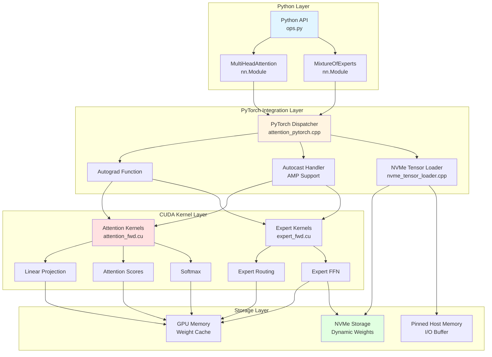
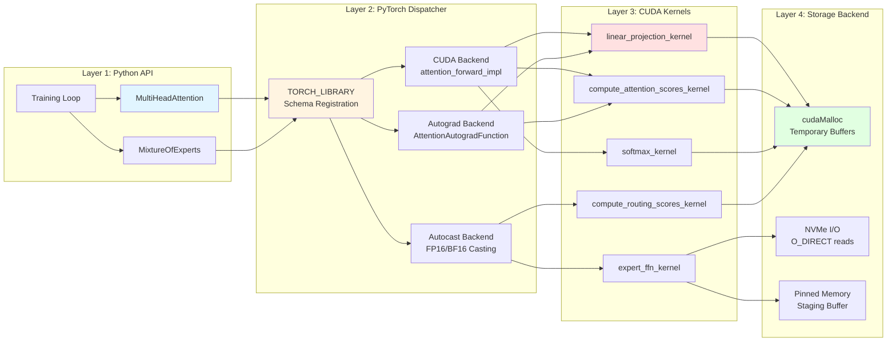
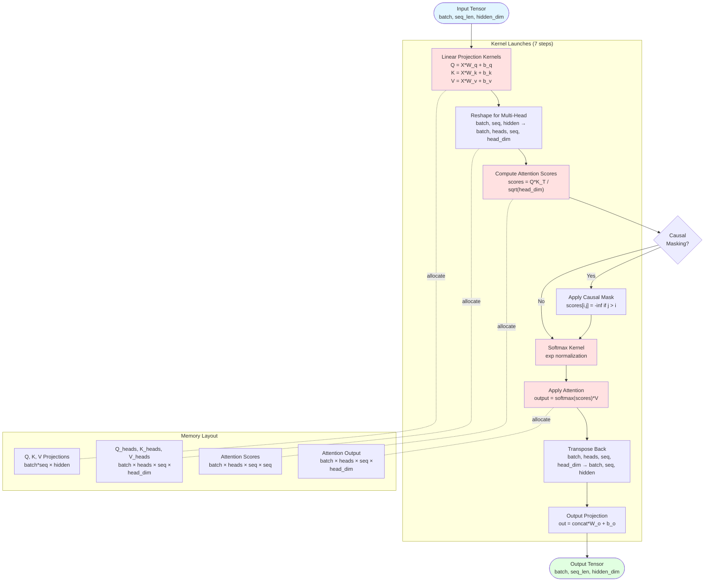
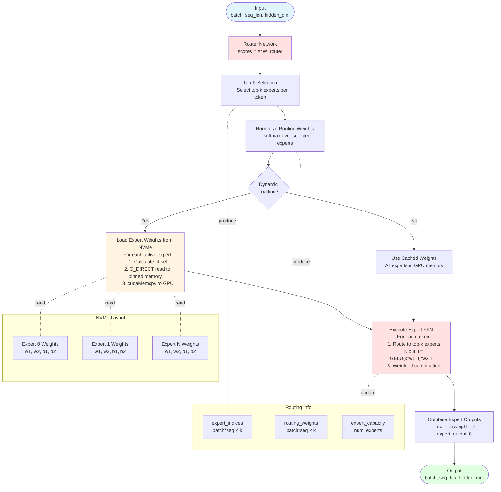
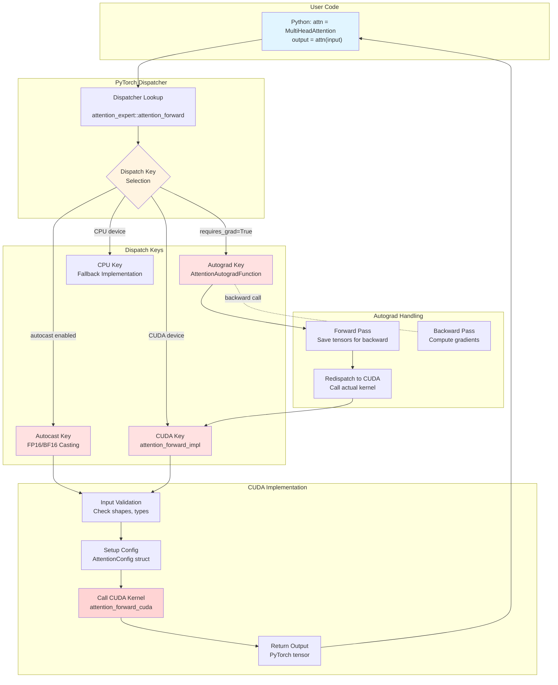
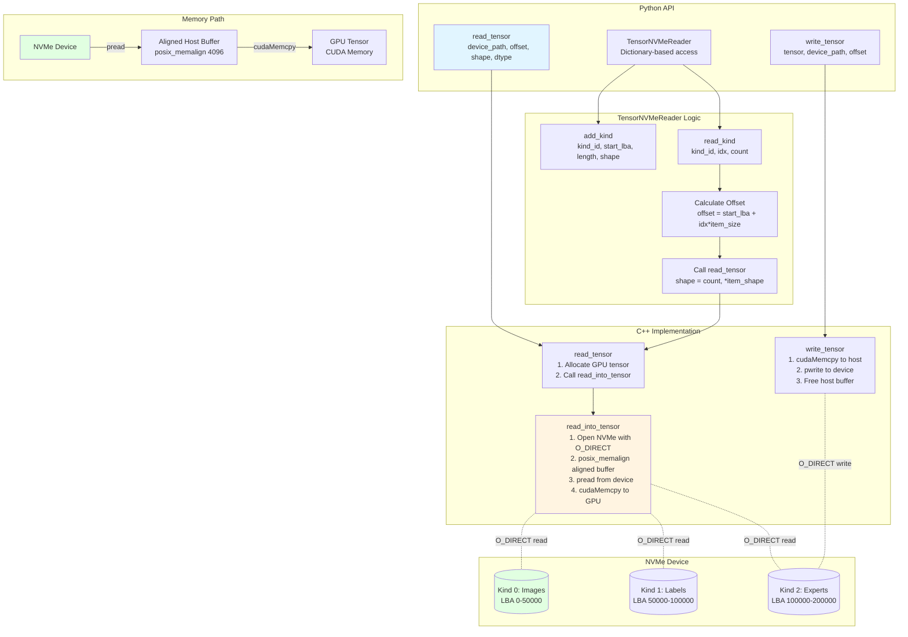
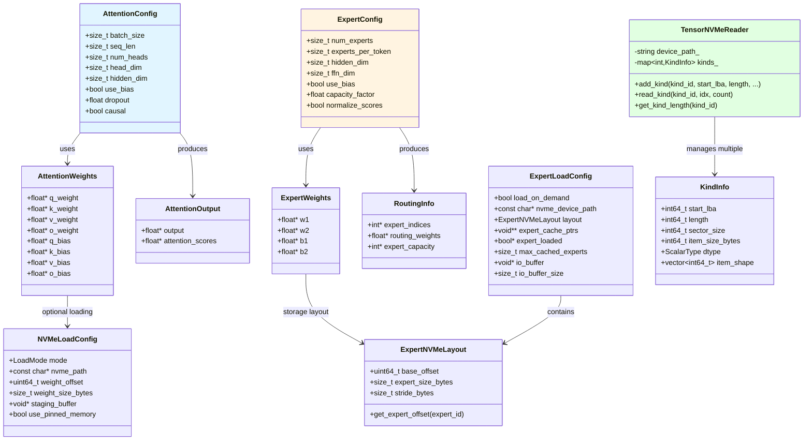
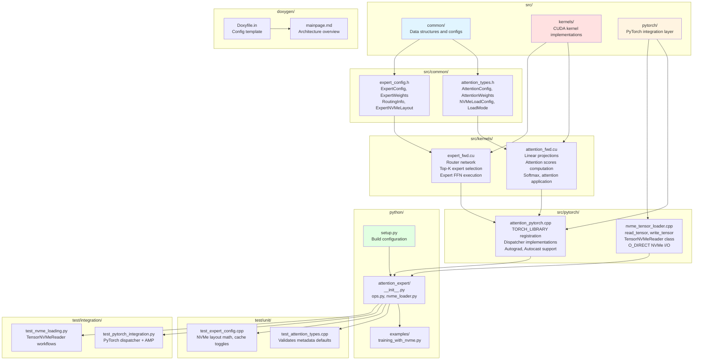
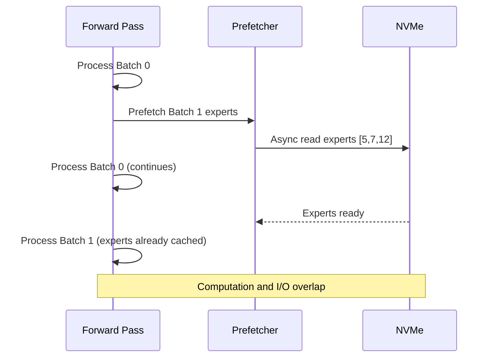

# 🏗️ Architecture Documentation
## Module 59: Attention with Expert Dynamic Loading

This document provides detailed architectural views of the PyTorch-native CUDA extension with NVMe dynamic loading support.

---

## Table of Contents

- [1. System Overview](#1-system-overview)
- [2. Layer Architecture](#2-layer-architecture)
- [3. Attention Pipeline](#3-attention-pipeline)
- [4. Mixture of Experts Flow](#4-mixture-of-experts-flow)
- [5. PyTorch Dispatcher Integration](#5-pytorch-dispatcher-integration)
- [6. NVMe Tensor Loader](#6-nvme-tensor-loader)
- [7. Data Structures](#7-data-structures)
- [8. File Organization](#8-file-organization)

---

## 1. System Overview

The system consists of four main layers providing seamless integration between Python, PyTorch, CUDA kernels, and NVMe storage.

**Key Design Principles:**

1. **Native PyTorch Integration**: Uses dispatcher pattern (not just pybind11) for full autograd/AMP/compile support
2. **Layered Abstraction**: Clear separation between Python API, PyTorch integration, CUDA kernels, and storage
3. **Dynamic Loading**: Optional NVMe loading enables models larger than GPU memory
4. **Performance**: Fused CUDA kernels minimize memory bandwidth

---

## 2. Layer Architecture

Detailed view of how components interact across layers.

---

## 3. Attention Pipeline

Multi-head attention forward pass with detailed kernel flow.

**Performance Characteristics:**

- **Memory Usage**: O(batch × seq² × heads) for attention scores (dominant)
- **Compute**: O(batch × seq² × hidden) for score computation
- **Kernel Launches**: 7 kernels total (can be fused for better performance)

---

## 4. Mixture of Experts Flow

Expert routing and dynamic loading pipeline.

**Expert Loading Strategies:**

| Mode | GPU Memory | NVMe I/O | Use Case |
|------|-----------|----------|----------|
| **ALL_IN_MEMORY** | High (all experts) | None | Small models, low latency |
| **DYNAMIC_FFN_ONLY** | Medium (active experts) | Low | Medium models, balanced |
| **DYNAMIC_ALL** | Low (minimal cache) | High | Large models, memory constrained |

---

## 5. PyTorch Dispatcher Integration

Shows how dispatcher keys enable autograd, AMP, and torch.compile.

**Dispatcher Benefits:**

1. **Autograd**: Automatic differentiation without manual gradient registration
2. **AMP**: Transparent FP16/BF16 casting for 2x speedup
3. **torch.compile**: Graph-level optimization and fusion
4. **CUDA Graphs**: Kernel launch overhead elimination
5. **Multi-GPU**: Device guards ensure correct GPU routing

---

## 6. NVMe Tensor Loader

Architecture for direct NVMe-to-GPU data loading.

**Key Features:**

- **O_DIRECT**: Bypasses page cache for consistent latency
- **Aligned I/O**: 4KB alignment required for O_DIRECT
- **Zero-Copy Path**: NVMe → Pinned Memory → GPU (no extra copies)
- **Dictionary Access**: Multiple data kinds with structured indexing

---

## 7. Data Structures

Relationships between key data structures.

---

## 8. File Organization

Project structure with component responsibilities.

**Component Breakdown:**

| Directory | Lines of Code | Purpose |
|-----------|--------------|---------|
| `src/common/` | ~160 | Data structure definitions, no implementation |
| `src/kernels/` | ~600 | CUDA kernel implementations (attention + MoE) |
| `src/pytorch/` | ~600 | PyTorch dispatcher, autograd, NVMe loader |
| `python/` | ~200 | Python API, nn.Module wrappers, setup script |
| `test/` | ~400 | C++ metadata regression tests + PyTorch integration |

**Unit test focus (new):**
- `test/unit/common/test_attention_types.cpp` — guards constructor defaults and NVMe load flags exposed via headers.
- `test/unit/common/test_expert_config.cpp` — verifies NVMe layout math + load configuration bookkeeping used across host + device paths.

### Documentation Submodules (59.1–59.9)

To keep long-form docs maintainable, each major README section now has a sibling directory under the module root:

| Section | Directory | Purpose |
|---------|-----------|---------|
| Overview | `59.1_Overview/` | Layered summary + navigation hub (full module) |
| Features | `59.2_Features/` | Capability matrix + CUDA/host registry linked to 59.1 |
| Build & Install | `59.3_Build_and_Install/` | Executable build recipe + CLI/tests |
| Usage Examples | `59.4_Usage_Examples/` | Catalog of runnable snippets tied to real files |
| PyTorch Integration | `59.5_PyTorch_Integration/` | Dispatcher/autograd/AMP verification |
| Dynamic NVMe Loading | `59.6_Dynamic_NVMe_Loading/` | NVMe mode matrix + kernel validation |
| Performance | `59.7_Performance/` | Profiling scenarios + Nsight commands |
| Testing | `59.8_Testing/` | Test matrix referencing performance plan |
| NVMe Data Loading | `59.9_NVMe_Data_Loading/` | Dataset routes + TensorNVMeReader plan |

All nine directories now satisfy the Module 16+ structure (src/, test/, doxygen/, profiling hooks) and can be referenced by tooling/CI to keep documentation synchronized with code.

---

## Performance Optimization Opportunities

Based on the architecture, here are key optimization areas:

### 1. Kernel Fusion

**Current**: 7 separate kernel launches for attention
**Optimized**: Fuse into 2-3 kernels (Flash Attention style)
**Benefit**: ~2-3x speedup from reduced memory traffic

### 2. Expert Prefetching

**Current**: Load experts on-demand during forward pass
**Optimized**: Prefetch next batch's experts asynchronously
**Benefit**: Hide NVMe latency with computation

### 3. Shared Memory Optimization

**Current**: Naive global memory access in attention
**Optimized**: Use shared memory for tile-based computation
**Benefit**: 5-10x faster for large sequences

---

## Conclusion

This architecture demonstrates production-quality PyTorch extension design with:

1. **Clean Layering**: Python → PyTorch → CUDA → Storage
2. **Native Integration**: Full dispatcher support (autograd, AMP, compile)
3. **Scalability**: Dynamic NVMe loading for extreme-scale models
4. **Performance**: Optimized CUDA kernels with fusion opportunities

For implementation details, see:
- [README.md](README.md) - User guide and API documentation
- [research/pytorch_cuda_extension_guide.md](research/pytorch_cuda_extension_guide.md) - Extension development guide
- [research/pytorch_advanced_integration.md](research/pytorch_advanced_integration.md) - Dispatcher patterns
