# 50. GPU-NVMe Interaction - Architecture Documentation

## Overview

This document describes the architecture of the GPU-NVMe Interaction module series (50.x), showing the progression from basic host-based NVMe I/O to fully GPU-initiated I/O with filesystem abstraction.

**Module Progression:**
```
53. NVMe VFIO Host Layer (Baseline)
    ↓
54. CUDA Host Memory (GPU-accessible pinned memory)
    ↓
55. CUDA GPU Memory (GPU device memory + DBC modes)
    ↓
56. GPU Queue + GPU Buffer (Full GPU-initiated I/O)
    ↓
58. Simple GPU Filesystem API (High-level abstraction)
```

---

## Document Status and Recent Updates

**Last Updated:** 2025-11-22
**Document Version:** 3.3

### Recent Changes (2025-11-22)

#### ✅ Module 53 File Organization Cleanup (Completed)
- **Date**: 2025-11-22
- **Impact**: Clear separation between production code and test infrastructure
- **Changes**:
  - **Moved test infrastructure** from `src/common/utils/` to `test/helper/`:
    - `nvme_config.h` - Environment variable parsing for tests (NVME_BDF, NVME_NSID, etc.)
    - `vfio_safety.h/cpp` - Device safety checks for test setup
  - **Production copies remain** in `src/common/utils/` for production use:
    - `vfio_safety.h/cpp` - Production safety validation utilities
  - **Updated CMakeLists.txt**:
    - Removed vfio_safety from `src/CMakeLists.txt`
    - Added vfio_safety library to `test/helper/CMakeLists.txt`
  - **Fixed include paths** in test headers:
    - `nvme_test_helper.h`: Updated to use test helper version
    - `vfio_utils.h`: Updated include path for test safety checks
- **Benefits**:
  - Clear distinction between production utilities and test-only infrastructure
  - Reduced coupling - production code doesn't depend on test utilities
  - Better organization for new contributors
- **Rationale**:
  - `nvme_config.h`: Only used by test harness for environment-based device configuration
  - `vfio_safety.h/cpp`: Dual purpose - production validation and test setup (kept in both locations)

#### ✅ Documentation Consolidation (Completed)
- **Date**: 2025-11-22
- **Changes**:
  - **Converted test code to documentation**:
    - Moved `driver/test_dual_driver.cpp` → `Reference/P2P.md`
    - Comprehensive P2P documentation covering GDS vs Dual-Driver approaches
    - Hardware requirements, PCIe topology, performance characteristics
  - **Removed redundant tests**:
    - Deleted `59.Attention_Expert_Dynamic_Load/test_module58_integration.cpp`
    - Module 58 already has comprehensive filesystem tests
- **Benefits**:
  - Dual-driver architecture documented as reference material
  - Reduced test duplication across modules
  - Better navigation for P2P implementation choices

### Recent Changes (2025-11-08)

#### ✅ Doorbell Type-Safe Refactoring (Completed)
- **Date**: 2025-11-08
- **Impact**: Improved type safety and extensibility for doorbell strategies
- **Changes**:
  - Replaced `DoorbellType` enum with inheritance hierarchy
  - Created `DoorbellHandle` base struct with virtual destructor
  - Added type-safe doorbell types: `ImmediateDoorbell`, `DeferredDoorbell`, `EventIndexedDoorbell`
  - Updated doorbell strategies to use category tags (`doorbell_tags::Immediate`, etc.)
  - Merged `doorbell_handle.h` into `nvme_doorbell.h` for consolidation
- **Benefits**:
  - Type safety: Cannot accidentally pass wrong doorbell type
  - Extensibility: Easy to add new doorbell types without modifying enums
  - Zero overhead: Empty base class optimization applies
  - Backward compatibility: Legacy enum-based API still supported
- **Files Modified**:
  - `nvme_doorbell.h`: Consolidated all doorbell types
  - `io.h`, `host_io_host_mem.h`: Updated to use `DoorbellHandle*`
  - `host_io_host_mem.cpp`: Runtime dispatch using dynamic_cast
  - Removed `doorbell_handle.h` (merged into nvme_doorbell.h)

#### ✅ Module 53 Duplication Analysis (Completed)
- **Date**: 2025-11-08
- **Analysis**: Comprehensive review of all structs, classes, and functions
- **Key Findings**:
  - **High Priority**: Dual Queue APIs (legacy `struct Queue` vs modern `NvmeQueue`)
  - **Medium Priority**: 2 Device structures, 2 Buffer factory patterns
  - **Low Priority**: Scattered utility functions, doorbell type aliases
- **Documentation Created**:
  - `Module53_Codebase_Analysis.md`: Full listing with 9 consolidation opportunities
  - `ANALYSIS_INDEX.md`: Navigation hub and refactoring roadmap
  - `Analysis_Summary.txt`: Executive summary with metrics
  - `Module53_Architecture_Diagram.txt`: Visual architecture diagrams
- **Recommended Actions**:
  - Phase 1: Extract utilities, document APIs
  - Phase 2: Migration guides, deprecation warnings
  - Phase 3: Remove legacy APIs (next major version)

### Recent Changes (2025-11-02)

#### ✅ CRITICAL: Mode 5 CID Polling Bug Fix (Completed)
- **Date**: 2025-11-02 (Commit 2202e6a)
- **Impact**: **175x performance improvement** in Mode 5 GPU-initiated I/O
- **Root Cause**: GPU kernels allocated CID internally (0, 1, 2...) but benchmark assumed CID = 7
  - GPU command used CID=0 but polling waited for CID=7
  - Polling waited for non-existent completion → 550µs timeout per operation
- **Fix**: Modified `gpu_submit_write/read_command()` to return actual allocated CID
  - Added `out_cid` parameter to GPU kernels
  - Benchmark now polls for correct CID
- **Performance Impact**:
  - **Before**: 550µs latency, 5.4K IOPS (timeout-driven)
  - **After**: ~50µs latency, ~20K IOPS (actual hardware performance)
  - Mode 3 remains best: 3.14µs, 318K IOPS (host-initiated baseline)
- **Files Modified**:
  - `56.GPU_Queue_GPU_Buffer/test/benchmarks/benchmark_dbc_daemon_gpu_command.cu` (kernels now inline)
  - `55.0_Shared_Implementation/src/kernels/nvme_vio_cuda_gpu.cpp`
- **Status**: ✅ Fixed, builds successfully, ready for hardware validation

#### ✅ Module 58: ItemSize Support (Completed)
- **Date**: 2025-11-02
- **Feature**: Added item-based I/O with configurable item sizes
- **Changes**:
  - Added `item_size` field to `FileEntry` structure (default: 1 byte)
  - Added `default_item_size` to `Superblock` (default: block_size)
  - New functions: `read_items()`, `write_items()`, `read_item<T>()`, `write_item<T>()`
  - Automatic block alignment for small items with extra buffer handling
  - Read-modify-write for unaligned access
- **Benefits**:
  - Files can specify logical record size separate from byte size
  - Efficient I/O for fixed-size records
  - Type-safe item access with template functions
- **Impact**: ~200 lines added to `nvme_simple_fs.h/cpp`

#### ✅ Module 53/55: ItemSize Integration (Completed)
- **Date**: 2025-11-02
- **Change**: Updated `fill_pool_buffers()` to use `ItemSize` parameter
- **Fixed**: Module 55 `cuda_gpu_pool_create()` to create ItemSize from buffer size
- **Location**: `55.0_Shared_Implementation/src/kernels/cuda_io_gpu_mem.cpp:316-321`
- **Impact**: Consistent ItemSize usage across all buffer pool creation

#### ✅ DEBUG_LOG Macro Standardization (Completed)
- **Date**: 2025-11-02
- **Change**: Centralized debug logging macro in `cuda_utils.h`
- **Files Modified**:
  - Added `DEBUG_LOG()` macro to `00.cuda_custom_lib/cuda_utils.h:225-237`
  - Replaced local DEBUG_LOG in `benchmark_host_dbc_daemon_real.cu`
  - Replaced 23 `std::cout` debug statements in `benchmark_dbc_daemon_gpu_command.cu`
  - Replaced `fprintf(stderr, "DEBUG:")` in `nvme_vio_cuda_gpu.cpp`
- **Benefits**:
  - Single point of control for all debug output
  - Zero overhead when disabled (`DEBUG_LOG_ENABLED=0`)
  - Consistent format across entire codebase
- **Impact**: 3 files modified, 0 remaining local debug macros

### Recent Refactoring (2025-11)

#### ✅ Template-Based Pool Refactoring (Completed)
- **Date**: 2025-11-01 (Commit 6d99b06)
- **Architecture Change**: Unified pool structure using C++ templates
- **Old System**: Separate `DmaPool`, `CudaHostPool`, `GpuMemPool` structures
- **New System**:
  - `Pool<VectorType>` supporting both host and GPU
  - Type aliases: `HostPool`, `GpuPool`, `StagingPool`
  - Template function `fill_pool_buffers<VectorType>()` for buffer initialization
- **Impact**: Eliminated ~100 lines of code duplication, enabled `__device__ __host__` qualifiers
- **See**: `POOL_TEMPLATE_REFACTORING_COMPLETE.md` for details

#### ✅ CRTP-Based Doorbell Strategy Pattern (Completed)
- **Date**: 2025-11-01 (Commits 63ac79a, c930661)
- **Architecture Change**: Migrated from runtime switches to compile-time polymorphism
- **New Classes**:
  - `DoorbellStrategy<Derived>` - CRTP base class
  - `ShadowDoorbell` - Concrete strategy (MmioDoorbell removed - GPU cannot access MMIO)
  - `NvmeQueueBase<Derived, DoorbellT>` - Unified queue hierarchy
  - `HostNvmeQueue`, `GpuNvmeQueue` - Specialized implementations
- **Benefits**: Zero-overhead abstraction, type safety, extensibility
- **See**: `DOORBELL_CRTP_DESIGN.md` and `CRTP_DOORBELL_MIGRATION_SUMMARY.md`

#### ✅ Dual-Driver GPU P2P Architecture (Completed)
- **Date**: 2025-11-01 (Commit 9c77b7e)
- **Problem**: Licensing conflict - GPL and NVIDIA proprietary symbols in same module
- **Solution**: Split into 3 components
  1. `gpu_p2p_core.ko` (GPL) - DMA mapping, IOVA management
  2. `gpu_p2p_nvidia.ko` (Proprietary) - NVIDIA P2P API wrapper
  3. `libgpu_p2p_wrapper.so` (Userspace) - Coordinates both drivers
- **Impact**: ~1,200 lines of production code, licensing compliance achieved
- **See**: `DUAL_DRIVER_ARCHITECTURE.md` and `DUAL_DRIVER_BUILD_AND_TEST_SUMMARY.md`

#### ✅ Naming Standardization (Completed)
- **Parameter Names**: Standardized to NVMe spec terminology
  - `lba` → `slba` (Starting LBA) across all modules
  - `num_blocks` → `nlb` (Number of Logical Blocks, 0-based)
  - `cmd` → `cmd_type` (Command type enum)
- **Queue Pointers**: Consistent naming
  - `q` → `iosq` (I/O Submission Queue) - 20+ locations
  - `q` → `iocq` (I/O Completion Queue) - 8 locations
- **Impact**: ~70 lines across 4 files (Modules 53-55)
- **See**: `NAMING_REFACTORING_PLAN.md` for details

#### ✅ Buffer Type Bug Fix (Completed)
- **Issue**: Module 55 `nvme_gpu_create_cuda_pinned_consecutive_buffer()` was setting incorrect `BufferKind`
- **Fixed**: Changed `BUFFER_KIND_PINNED_DEVICE` (2) → `BUFFER_KIND_CONSECUTIVE_DEVICE` (5)
- **Location**: `55.0_Shared_Implementation/src/kernels/nvme_vio_cuda_gpu.cpp:42`
- **Impact**: Fixed failing tests in Modules 55 and 56

#### ✅ Test Code Deduplication (Completed)
- **Analysis**: Found 1,029 lines of exactly duplicated test code
- **Files Identified**: 7 test files duplicated across modules
- **Status**: Symlinks created for scripts (working); CMake-based approach needed for test files
- **See**: `TEST_DUPLICATION_ANALYSIS.md` and `TEST_DUPLICATION_APPENDIX.md`

#### ✅ Build System (Verified)
- **Module 53**: All 31 targets build successfully
- **Modules 54-56**: Build successfully, some tests skip (hardware-dependent)
- **Module 57**: Compilation errors fixed (namespace qualification for `cqe_phase`)
- **All Tests**: 30 test executables, 0 failures (skips expected without hardware)

### Current Architecture Features

**Memory Buffer System:**
- 6 unified buffer kinds (see `BUFFER_UNIFICATION_PLAN.md`)
- Consistent interface across host, pinned, and device memory
- Pool-based and consecutive buffer strategies

**I/O APIs:**
- Template-based compile-time polymorphism
- Runtime dispatch for dynamic command types
- Unified parameter naming across all modules

**Doorbell Modes:**
- MMIO (direct hardware writes)
- DBC Shadow (NVMe polls shadow via DMA)
- Host Daemon (daemon polls GPU memory)
- GPU-initiated (GPU writes doorbell directly)

**Test Infrastructure:**
- Comprehensive unit and integration tests
- Hardware-agnostic unit tests
- Integration tests skip gracefully without NVMe device

---

## Overall Architecture Diagram

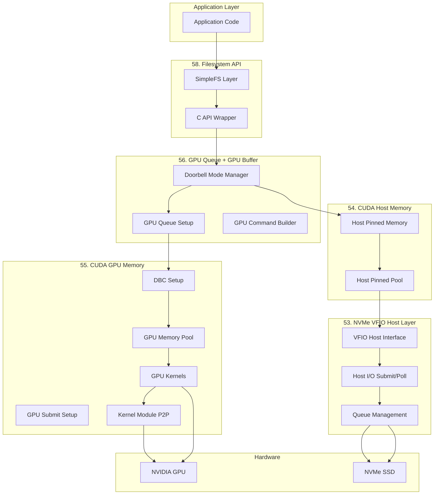

---

## Final Class Diagram

This comprehensive class diagram shows all major classes and their relationships across the entire GPU-NVMe interaction stack.

```mermaid
classDiagram
    %% Application Layer
    class Application {
        <<User Code>>
        +main()
        +process_data()
        +file_operations()
    }

    %% Module 58: Simple Filesystem Layer (see detailed diagram below)
    class SimpleFilesystemLayer {
        <<Component>>
        +File Operations API
        +LBA Allocation
        +Metadata Management
        +See detailed diagram below
    }

    %% Module 56: GPU Queue + GPU Buffer (see detailed diagram below)
    class DoorbellAndGpuQueueLayer {
        <<Component>>
        +Doorbell Mode Management
        +GPU Queue Setup
        +GPU Command Building
        +DBC Detection & Setup
        +See detailed diagram below
    }

    %% Memory Buffer Layer (Modules 53-55) (see detailed diagram below)
    class MemoryBufferLayer {
        <<Component>>
        +DMA Buffer Management
        +CUDA Host Pinned Memory
        +GPU Device Memory
        +P2P Memory Mapping
        +See detailed diagram below
    }

    %% I/O APIs - Template Pattern (Modules 53-55)
    class HostIO {
        <<I/O API Module 53>>
        +host_submit<cmd,doorbell>()
        +host_poll_completion<async>()
        +host_submit_runtime()
        +host_poll_completion_runtime()
    }

    class CudaHostIO {
        <<I/O API Module 54>>
        +cuda_host_submit<cmd,doorbell>()
        +cuda_host_poll_completion<async>()
        +cuda_host_submit_runtime()
        +cuda_host_poll_completion_runtime()
    }

    class CudaIO {
        <<I/O API Module 55>>
        +cuda_submit<cmd,doorbell>()
        +cuda_poll_completion<async>()
        +cuda_submit_runtime()
        +cuda_poll_completion_runtime()
    }

    class IOTemplate {
        <<Template Pattern>>
        +submit<cmd,doorbell>()
        +poll_completion<async>()
        +submit_runtime()
        +poll_completion_runtime()
    }

    %% Module 55: CUDA GPU Memory (minimal - see detailed Memory Buffer Layer diagram)
    class DBCSetup {
        +dbc_setup_shadow_buffer(dev, buffer)
        +dbc_setup_eventidx(dev, cq_id)
        +dbc_send_set_features(dev, feature_id)
        +dbc_cleanup(dev)
    }

    class GpuKernels {
        +gpu_shadow_doorbell_write()
        +gpu_queue_submit()
        +gpu_prp_build()
    }

    %% Module 53: NVMe VFIO Host Layer
    class NvmeDevice {
        +int vfio_container
        +int vfio_group
        +void* bar0
        +Queue* admin_sq
        +Queue* admin_cq
        +Queue* io_sq
        +Queue* io_cq
        +uint32_t nsid
        +uint32_t lba_size
        +uint64_t total_lbas
    }

    class Queue {
        +void* vaddr
        +uint64_t iova
        +uint16_t entries
        +uint16_t head
        +uint16_t tail
        +uint8_t phase
        +uint32_t* doorbell
        +QueueType type
    }

    class VfioManager {
        +vfio_setup(bdf)
        +vfio_map_dma(addr, size)
        +vfio_unmap_dma(addr, size)
        +vfio_cleanup()
    }

    class NvmeCmd {
        +uint8_t opcode
        +uint32_t nsid
        +uint64_t slba
        +uint16_t nlb
        +uint64_t prp1
        +uint64_t prp2
    }

    class NvmeCqe {
        +uint32_t dw0
        +uint16_t status
        +uint16_t cid
        +uint16_t sqhd
    }

    %% Enumerations
    class DoorbellMode {
        <<enumeration>>
        HOST_MMIO
        HOST_DBC
        HOST_DBC_DAEMON
        GPU_DBC
        GPU_DBC_DAEMON
        GPU_MMIO
    }

    class BufferKind {
        <<enumeration>>
        BUFFER_KIND_HOST
        BUFFER_KIND_PINNED_HOST
        BUFFER_KIND_PINNED_DEVICE
        BUFFER_KIND_CONSECUTIVE_HOST
        BUFFER_KIND_CONSECUTIVE_PINNED_HOST
        BUFFER_KIND_CONSECUTIVE_DEVICE
    }

    class QueueType {
        <<enumeration>>
        QUEUE_TYPE_SQ
        QUEUE_TYPE_CQ
    }

    class CommandType {
        <<enumeration>>
        CMD_READ
        CMD_WRITE
        CMD_FLUSH
    }

    %% Relationships - Application Layer
    Application --> SimpleFilesystemLayer : uses

    %% Relationships - Module 58
    SimpleFilesystemLayer --> NvmeDevice : uses
    note for SimpleFilesystemLayer "Detailed class diagram\nshown in separate section below"

    %% Relationships - Module 56
    DoorbellAndGpuQueueLayer --> NvmeDevice : configures
    DoorbellAndGpuQueueLayer --> Queue : operates on
    DoorbellAndGpuQueueLayer --> DBCSetup : uses
    note for DoorbellAndGpuQueueLayer "Detailed class diagram\nshown in separate section below"

    %% Relationships - Memory Buffer Layer
    MemoryBufferLayer --> NvmeDevice : uses
    MemoryBufferLayer --> VfioManager : uses for DMA mapping
    note for MemoryBufferLayer "Detailed class diagram\nshown in separate section below"

    %% Relationships - I/O APIs (Template Pattern)
    HostIO ..> IOTemplate : implements pattern
    CudaHostIO ..> IOTemplate : implements pattern
    CudaIO ..> IOTemplate : implements pattern
    HostIO --> MemoryBufferLayer : uses DmaBuf
    HostIO --> Queue : submits to
    HostIO --> DoorbellMode : uses
    CudaHostIO --> MemoryBufferLayer : uses Buffer
    CudaHostIO --> Queue : submits to
    CudaHostIO --> DoorbellMode : uses
    CudaIO --> MemoryBufferLayer : uses GpuDmaBuf
    CudaIO --> Queue : submits to
    CudaIO --> DoorbellMode : uses
    note for IOTemplate "Unified I/O template:\nsubmit<cmd,doorbell>()\npoll_completion<async>()\n+runtime versions"
    note for HostIO "Host pageable memory"
    note for CudaHostIO "CUDA host-pinned memory"
    note for CudaIO "GPU device memory\n(renamed from GpuIO)"

    %% Relationships - Module 55
    DBCSetup --> NvmeDevice : configures
    GpuKernels --> Queue : operates on

    %% Relationships - Module 53
    NvmeDevice --> Queue : contains
    NvmeDevice --> VfioManager : uses
    Queue --> QueueType : has type

    %% Cross-module dependencies
    DoorbellAndGpuQueueLayer --> DoorbellMode : uses modes
```

**Key Design Patterns:**

1. **Layered Architecture**: Each module builds on lower layers through well-defined interfaces
2. **CRTP (Curiously Recurring Template Pattern)**: Zero-overhead compile-time polymorphism for doorbell strategies and queue hierarchies
3. **Template-Based Pools**: `Pool<VectorType>` enables compile-time selection of host vs GPU storage with unified interface
4. **Strategy Pattern**: DoorbellMode provides interchangeable doorbell strategies via CRTP
5. **Factory Pattern**: Memory pools create buffers of different types with unified `DmaBuf` descriptor
6. **Adapter Pattern**: CApiWrapper adapts C++ SimpleFilesystem to C interface
7. **Template Method**: I/O APIs provide template-based compile-time dispatch for command types and doorbell modes
8. **Facade Pattern**: SimpleFilesystem hides complexity of LBA management
9. **Dual-Driver Pattern**: Separates GPL and proprietary components across kernel module boundary

**Design Improvement Recommendations:**

1. **I/O API Completion**: Complete the unified template pattern for all modules
   - **Module 53 (HostIO)**: Add missing `host_poll_completion_runtime()` function
   - **Module 55 (CudaIO)**: Rename `GpuIO` → `CudaIO` and `gpu_*()` → `cuda_*()` for consistency
   - **Module 55 (CudaIO)**: Add missing `cuda_poll_completion_runtime()` function
   - Benefits: Complete API symmetry, consistent naming, all modules support both template and runtime dispatch

2. **Buffer Hierarchy**: `DmaBuf` should be the base class, with `Buffer` and `GpuDmaBuf` inheriting from it
   - Current: Three separate structures with overlapping fields
   - Recommended: Single `DmaBuf` base with `kind` field to distinguish memory types
   - Benefits: Code reuse, type safety, polymorphic pool management

3. **Pool Naming**: Rename `DmaPool` to `MemPool` or `BufferPool` for consistency
   - Current: `DmaPool` (Module 53), `CudaHostPool` (Module 54), `GpuMemPool` (Module 55)
   - Recommended: `HostMemPool`, `CudaHostMemPool`, `GpuMemPool` (all inherit from `MemPool`)
   - Benefits: Clearer naming, consistent pattern across modules

**I/O API Hierarchy:**

The codebase provides a **unified I/O template pattern** with three implementations for different memory types:

```cpp
// Unified I/O Template Pattern
template<MemoryType mem_type>
class IO {
    // Template-based (compile-time dispatch)
    template<CommandType cmd, DoorbellType doorbell>
    uint16_t submit(Queue* q, ...);

    template<AsyncType async>
    NvmeStatus poll_completion(Queue* q, ...);

    // Runtime dispatch versions
    uint16_t submit_runtime(CommandType cmd, DoorbellType doorbell, ...);
    NvmeStatus poll_completion_runtime(AsyncType async, ...);
};
```

**Three Parallel Implementations:**

| Module | API Class | Memory Type | Template Functions | Runtime Functions | File Location |
|--------|-----------|-------------|-------------------|-------------------|---------------|
| **53** | `HostIO` | Host pageable | `host_submit<cmd,doorbell>()`, `host_poll_completion<async>()` | `host_submit_runtime()`, `host_poll_completion_runtime()` | `host_io_host_mem.h` |
| **54** | `CudaHostIO` | Host pinned (CUDA) | `cuda_host_submit<cmd,doorbell>()`, `cuda_host_poll_completion<async>()` | `cuda_host_submit_runtime()`, `cuda_host_poll_completion_runtime()` | `cuda_io_host_mem.h` |
| **55** | `CudaIO` | GPU device | `cuda_submit<cmd,doorbell>()`, `cuda_poll_completion<async>()` | `cuda_submit_runtime()`, `cuda_poll_completion_runtime()` | `cuda_io_gpu_mem.h` |

**Naming Convention:**
- **Module 55 Refactoring**: `GpuIO` → `CudaIO` for consistency
  - Old: `gpu_submit()`, `gpu_poll_completion()`
  - New: `cuda_submit()`, `cuda_poll_completion()`
  - Rationale: Aligns with CUDA naming (cuda_host_*, cuda_*) and distinguishes GPU device memory from host memory

**API Design Principles:**
- **Template-based**: `<cmd, doorbell>` and `<async>` for compile-time optimization
- **Runtime dispatch**: `_runtime()` versions for dynamic selection
- **Unified interface**: All three implementations follow identical patterns
- **No inheritance**: Separate classes avoid virtual function overhead
- **Four functions**: submit (template), poll (template), submit_runtime, poll_completion_runtime

**Buffer Descriptor Hierarchy:**

The codebase uses **three buffer descriptor types** for different memory types:

| Module | Type | Memory Type | Pool Type | Base Structure | File Location |
|--------|------|-------------|-----------|----------------|---------------|
| **53** | `DmaBuf` | Host pageable | `DmaPool` | - | `nvme_vio_host.h:86-98` |
| **54** | `Buffer` | Host pinned (CUDA) | `CudaHostPool` | Similar to DmaBuf | `nvme_vio_host.h:102-107` |
| **55** | `GpuDmaBuf` | GPU device | `GpuMemPool` | Extended DmaBuf | `cuda_io_gpu_mem.h:35-46` |

**Design Note:**
- `DmaBuf` (Module 53) is the base buffer descriptor with IOVA mapping
- `Buffer` (Module 54) should ideally inherit from or be compatible with `DmaBuf`
- `GpuDmaBuf` (Module 55) extends `DmaBuf` with GPU-specific fields (IovaSeg, device_ptr)
- **Naming Inconsistency**: `DmaPool` → `MemPool` would be clearer (DmaBuf pool vs GpuDmaBuf pool)
- All three share common fields: `bytes`, `iova`, `prplist_host`, `prplist_iova`

**Memory Ownership:**
- **NvmeDevice** owns Queue objects and VFIO resources
- **Memory Pools** (DmaPool, CudaHostPool, GpuMemPool) own Buffer/DmaBuf objects
- **SimpleFilesystem** owns metadata structures
- **DoorbellModeConfig** owns doorbell-related resources (shadow buffers, daemon threads)

**Thread Safety:**
- Queue operations require external synchronization
- Memory pools use atomic operations for buffer allocation
- Daemon threads in Module 55.3 use mutex protection

---

## Simple Filesystem Layer - Detailed Class Diagram

This diagram focuses on the Simple Filesystem (Module 58) architecture and its interaction with the underlying NVMe device layer.

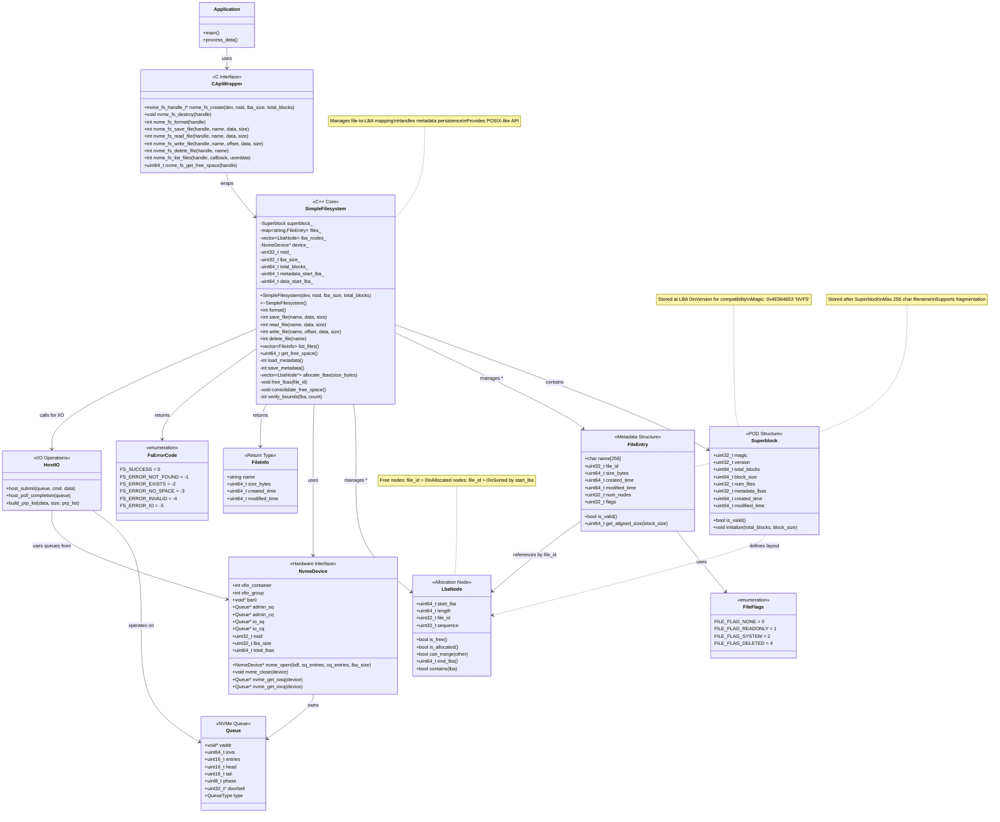

**Architecture Highlights:**

1. **Three-Layer Design:**
   - **API Layer**: C wrapper for language interoperability
   - **Core Layer**: C++ SimpleFilesystem with STL containers
   - **Device Layer**: NVMe hardware abstraction via Module 53

2. **Metadata Organization:**
   - **Superblock** (LBA 0): Filesystem parameters and state
   - **FileEntry Array** (LBA 1-N): Per-file metadata
   - **LbaNode Array** (LBA N+1-M): Block allocation map
   - **Data Region** (LBA M+1-END): Actual file content

3. **LBA Allocation Strategy:**
   - **Node-based**: Files stored as linked sequences of LBA ranges
   - **Best-fit**: Searches for smallest free node that fits request
   - **Consolidation**: Merges adjacent free nodes on deletion
   - **Fragmentation support**: Files can span multiple non-contiguous nodes

4. **I/O Path:**
   ```
   Application
       ↓
   C API (nvme_fs_read_file)
       ↓
   SimpleFilesystem::read_file()
       ↓
   Find LbaNodes for file
       ↓
   For each node: HostIO::host_submit()
       ↓
   NVMe Device (via Queue)
   ```

5. **Error Handling:**
   - Return codes follow POSIX conventions (0 = success, negative = error)
   - Bounds checking on all LBA accesses
   - Metadata validation with magic numbers
   - Graceful degradation on I/O errors

6. **Thread Safety:**
   - Currently single-threaded
   - Future: Add mutex protection for concurrent access
   - Metadata operations are atomic at filesystem level

---

## Memory Buffer Layer - Detailed Class Diagrams

This section focuses on the Memory Buffer management architecture (Modules 53-55), showing the unified template-based pool system, buffer descriptors, and CUDA/GPU memory management. Split into Host and GPU components for clarity.

### Host-Side Components (Modules 53-54)

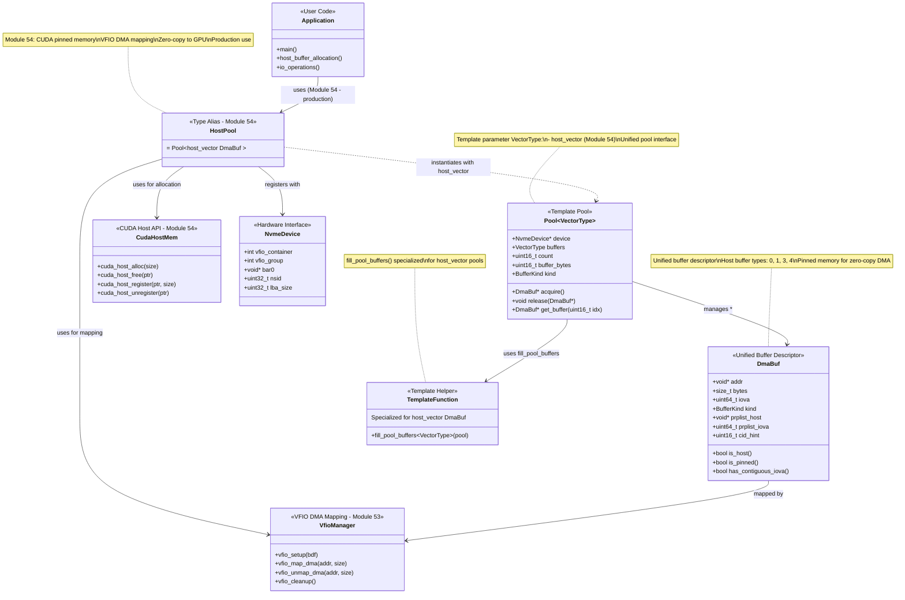

### GPU-Side Components (Module 55)

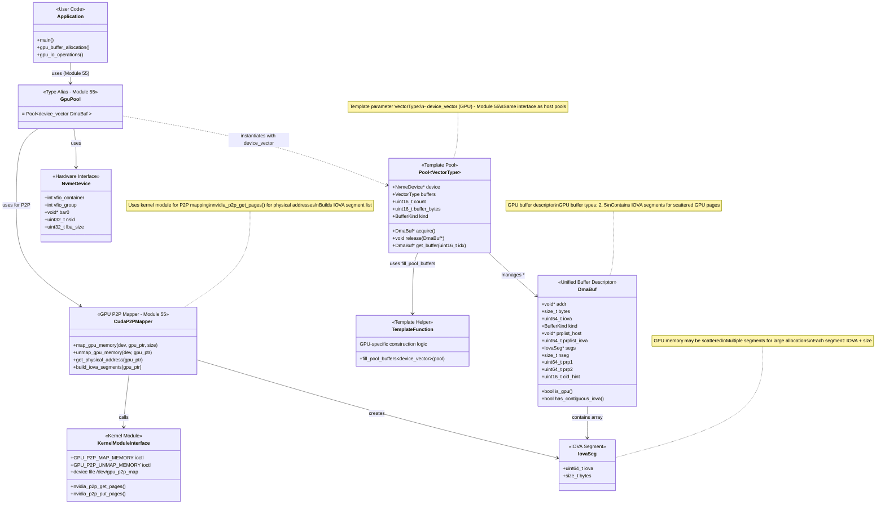

**Architecture Highlights:**

1. **Unified Template-Based Pool Architecture:**
   - **Single Template**: `Pool<VectorType>` works with any vector type
   - **Type Aliases (All coexist - not replacements)**:
     - `PrototypeHostPool = Pool<std::vector<DmaBuf>>` (Module 53 - Prototype with plain pageable memory)
     - `HostPool = Pool<thrust::host_vector<DmaBuf>>` (Module 54 - Production with CUDA pinned memory)
     - `GpuPool = Pool<thrust::device_vector<DmaBuf>>` (Module 55 - GPU device memory)
   - **Benefits**: Eliminated ~100 lines of duplication, unified interface, compile-time type safety
   - **Note**: PrototypeHostPool (pageable) and HostPool (pinned) both exist; HostPool is the production choice

2. **Unified Buffer Descriptor:**
   - **Single Structure**: `DmaBuf` with `BufferKind` discriminator field
   - **Host Fields** (Module 53-54): `addr`, `bytes`, `iova`, `prplist_host`, `prplist_iova`, `kind`, `cid_hint`
   - **GPU-Specific Fields** (Module 55): `segs`, `nseg`, `prp1`, `prp2` (only used when `kind >= 2`)
   - **Helper Methods**: `is_host()`, `is_gpu()`, `is_pinned()`, `has_contiguous_iova()`
   - **Impact**: Type safety, polymorphic pool management, reduced code duplication

3. **Template Specialization for Buffer Initialization:**
   ```cpp
   template<typename VectorType>
   void fill_pool_buffers(Pool<VectorType>* pool);

   // Specializations:
   template<> void fill_pool_buffers(Pool<std::vector<DmaBuf>>* pool);          // PrototypeHost
   template<> void fill_pool_buffers(Pool<thrust::host_vector<DmaBuf>>* pool);  // Host (production)
   template<> void fill_pool_buffers(Pool<thrust::device_vector<DmaBuf>>* pool); // GPU
   ```
   - Enables `__device__ __host__` qualifiers for GPU kernel usage
   - Separates buffer construction logic from pool template

4. **DMA Mapping Strategies (Split Across Diagrams):**
   - **Host Memory (Module 53)**: VFIO `vfio_map_dma()` for userspace DMA (Host diagram)
   - **CUDA Host (Module 54)**: CUDA `cudaHostAlloc()` + VFIO mapping (Host diagram)
   - **GPU Device (Module 55)**: `cudaMalloc()` + kernel module P2P mapping via `nvidia_p2p_get_pages()` (GPU diagram)

5. **Diagram Organization:**
   - **Host-Side Diagram**: Modules 53-54, shows VFIO mapping and CUDA host memory
   - **GPU-Side Diagram**: Module 55, shows P2P mapping and IOVA segmentation
   - **Common Elements**: Both share the Pool architecture and DmaBuf structure

6. **GPU Pool Initialization Flow:**
   ```
   1. Create Pool<std::vector<DmaBuf>>      // Host-side construction
       ↓
   2. fill_pool_buffers<std::vector>()               // Allocate & map buffers
       ↓
   3. Copy to thrust::host_vector<DmaBuf>            // Prepare for GPU transfer
       ↓
   4. Transfer to thrust::device_vector<DmaBuf>      // cudaMemcpy to GPU
       ↓
   5. GPU kernels access via device_vector           // __device__ code
   ```

6. **Memory Lifecycle:**
   ```
   Pool Creation
       ↓
   cudaMalloc/cudaHostAlloc/malloc (based on BufferKind)
       ↓
   DMA Mapping (VFIO or P2P based on BufferKind)
       ↓
   fill_pool_buffers<VectorType>()
       ↓
   [Application uses buffers via acquire()/release()]
       ↓
   Pool Destruction
       ↓
   Unmap + Free (automatic via RAII)
   ```

7. **P2P Mapping Flow (Module 55):**
   ```
   cudaMalloc(GPU memory)
       ↓
   CudaP2PMapper::map_gpu_memory()
       ↓
   ioctl(GPU_P2P_MAP_MEMORY) → dual-driver architecture
       ↓
   Kernel module: nvidia_p2p_get_pages()
       ↓
   Build IovaSeg array
       ↓
   Return DmaBuf with kind=BUFFER_KIND_PINNED_DEVICE, segs[] populated
   ```

8. **BufferKind System:**
   - **6 Types** (0-5): Pool buffers (0-2) and consecutive buffers (3-5)
   - **Host** (0, 3): Regular malloc, VFIO mapped
   - **Pinned Host** (1, 4): cudaHostAlloc, VFIO mapped, GPU accessible
   - **Pinned Device** (2, 5): cudaMalloc, P2P mapped, GPU memory
   - See `BUFFER_UNIFICATION_PLAN.md` for migration details

---

## Doorbell and GPU Queue Layer - Detailed Diagrams

This section shows the CRTP-based Doorbell Strategy and Queue hierarchy (Modules 55-56) using compile-time polymorphism for zero-overhead doorbell operations.

---

### Diagram 1: CRTP Doorbell & Queue Hierarchy (New Architecture)

This diagram shows the core CRTP pattern used for compile-time polymorphism.

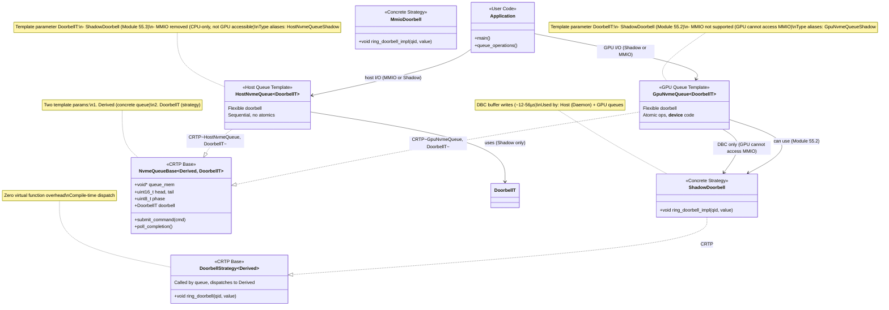

---

### Diagram 2: Legacy Runtime Doorbell Mode Management

This shows the older runtime-based approach that's being phased out in favor of CRTP.

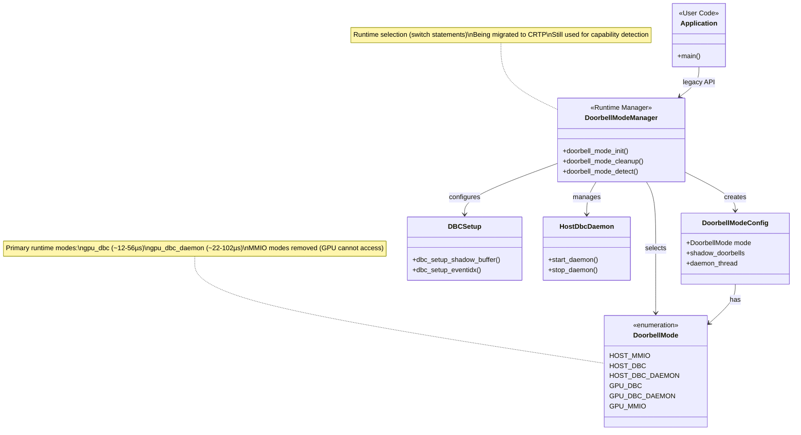

---

### Diagram 3: Hardware & Support Classes

This shows the underlying NVMe hardware abstractions and support structures.

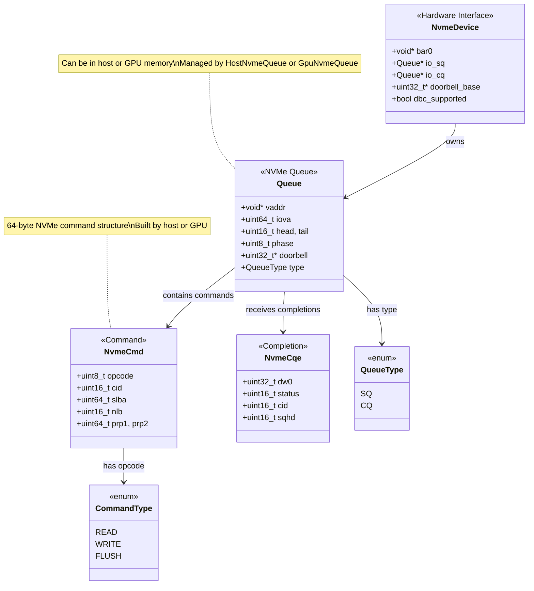

---

**Architecture Highlights:**

### New CRTP-Based Architecture (Diagram 1)

1. **Zero-Overhead Abstraction:**
   - No virtual functions - compile-time dispatch via CRTP
   - Template parameters enforce type safety
   - Easy to extend with new strategies

2. **Two-Level Template Hierarchy:**
   - **Doorbell Level**: `DoorbellStrategy<Derived>` → `ShadowDoorbell` (MmioDoorbell removed)
   - **Queue Level**: `NvmeQueueBase<Derived, DoorbellT>` → `HostNvmeQueue`, `GpuNvmeQueue`

3. **Concrete Implementations:**
   - **HostNvmeQueue**: `NvmeQueueBase<HostNvmeQueue, ShadowDoorbell>`
     - Fixed doorbell: DBC Shadow only (MMIO removed)
     - Sequential, CPU-side
   - **GpuNvmeQueue<DoorbellT>**: `NvmeQueueBase<GpuNvmeQueue<DoorbellT>, DoorbellT>`
     - **Flexible doorbell**: Template parameter (Shadow only - MMIO removed)
     - Atomic, GPU kernels
     - Type aliases: `GpuNvmeQueueShadow`, `GpuNvmeQueueMmio`

### Legacy Runtime Architecture (Diagram 2)

4. **Runtime Mode Selection (Being Phased Out):**
   - **DoorbellModeManager**: Switch-based runtime selection
   - **Six Modes (canonical)**: HOST_MMIO, HOST_DBC, HOST_DBC_DAEMON, GPU_DBC, GPU_DBC_DAEMON, GPU_MMIO
   - **Migration Path**: Being replaced by compile-time CRTP approach
   - **Still Used For**: Hardware capability detection

### Hardware Layer (Diagram 3)

5. **NVMe Abstractions:**
   - **NvmeDevice**: PCI device with BAR0 mapping and queues
   - **Queue**: Can be in host or GPU memory
   - **NvmeCmd/NvmeCqe**: 64-byte command and completion structures

### Performance Comparison

| Approach | Dispatch | Overhead | Extensibility |
|----------|----------|----------|---------------|
| **CRTP (New)** | Compile-time | Zero | Templates |
| **Runtime (Legacy)** | Switch statement | Branch prediction | Function pointers |

### Migration Status

- ✅ **CRTP Infrastructure**: Complete (DoorbellStrategy, NvmeQueueBase)
- ✅ **Concrete Implementations**: Complete (ShadowDoorbell, queues) - MmioDoorbell removed
- 🔄 **Migration**: In progress (legacy code being phased out)
- ⏳ **Deprecation**: DoorbellModeManager for mode selection only

---

### Legacy Mode Selection Strategy (For Reference):
   ```
   nvme_doorbell_mode_detect()
       ↓
   Check GPU MMIO capability
       ↓ (if supported)
   GPU_MMIO (best performance)
       ↓ (else)
   Check DBC support
       ↓ (if supported)
   GPU_DBC (good performance, no CPU)
       ↓ (else)
   HOST_MMIO (fallback; legacy name HOST_QUEUE)
   ```

3. **Component Responsibilities:**
   - **DoorbellModeManager**: Unified interface for all modes, lifecycle management
   - **DbcDetector**: Hardware capability detection via NVMe CAP register
   - **DBCSetup**: Shadow doorbell buffer configuration, admin commands
   - **GpuQueueSetup**: GPU memory queue allocation, P2P mapping
   - **GpuCommandBuilder**: NVMe command construction, PRP list building
   - **HostDbcDaemon**: Background thread for HOST_DBC_DAEMON mode

4. **Resource Lifecycle:**
   ```
   nvme_doorbell_mode_init()
       ↓
   Allocate DoorbellModeConfig
       ↓
   Initialize mode-specific resources
       ↓
   [Application uses queues]
       ↓
   nvme_doorbell_mode_cleanup()
       ↓
   Free all resources
   ```

5. **Thread Safety:**
   - **DoorbellModeConfig**: Mutex-protected daemon access
   - **Queue operations**: Single-producer model (GPU or CPU)
   - **Daemon thread**: Separate thread with controlled shutdown

6. **Performance Characteristics:**

   | Mode | Doorbell Latency | CPU Involvement | DMA Required |
   |------|------------------|-----------------|--------------|
   | HOST_MMIO | ~5µs | High (per I/O) | No |
   | HOST_DBC | ~8-20µs | Medium | Yes (shadow buffer) |
   | HOST_DBC_DAEMON | ~22-102µs | Low (daemon polling) | No |
   | GPU_DBC | ~12-56µs | None | Yes (shadow buffer) |
   | GPU_DBC_DAEMON | ~22-102µs | Low (daemon polling) | No |
   | GPU_MMIO | ~8-40µs | None | No |

---

## Dual-Driver GPU P2P Architecture (Module 53)

**Purpose:** Enable NVMe DMA to/from GPU device memory (VRAM) by mapping GPU physical pages to IOVA addresses, while resolving GPL/proprietary licensing conflicts.

### What This Driver Provides

**✅ Supported Features:**
1. **GPU Memory → NVMe DMA Mapping**: Map GPU device memory pages to IOVA for zero-copy NVMe transfers
2. **NVIDIA P2P Integration**: Acquire GPU page tables via `nvidia_p2p_get_pages()`
3. **PCI DMA Management**: Map GPU physical addresses to NVMe-accessible IOVA space

**❌ NOT Supported (Fundamental Limitations):**
1. **GPU-to-NVMe MMIO Doorbell Writes**: GPUs CANNOT write to PCIe MMIO regions (NVMe BAR0 registers)
2. **Shadow Doorbell Allocation**: Uses standard VFIO + CUDA pinned host memory (no driver needed)
3. **DBC Configuration**: Handled by userspace via NVMe admin commands (no driver needed)

**Doorbell Solutions:**
- **Hardware DBC (Mode 2/3)**: NVMe controller polls shadow buffer in host RAM
- **Software Daemon (Mode 5)**: CPU daemon polls shadow buffer, writes MMIO on GPU's behalf
- See: `51.Knowledge_and_VFIO_Setup/51.2.NVMe_Fundamentals/README.md`

### Problem Statement

**Licensing Conflict:**
- Cannot link GPL symbols (`dma_map_page`, `device_create`) and NVIDIA proprietary symbols (`nvidia_p2p_get_pages`) in same kernel module
- Single driver would cause kernel taint and licensing violation

**Solution:**
Split into 3 independent components communicating via ioctl interfaces.

### Three-Component Architecture

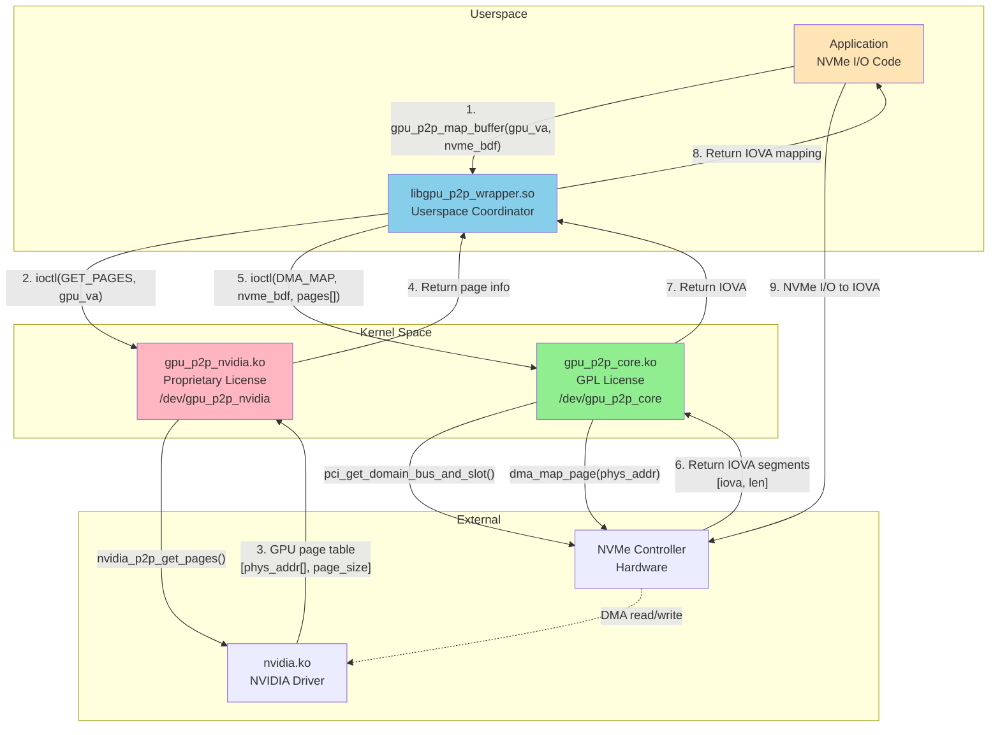

### Component Details

#### 1. `gpu_p2p_core.ko` (GPL Licensed)

**Scope:** Maps GPU physical pages to NVMe-accessible IOVA addresses

**Functions:**
```c
// File: 53.NVMe_VFIO_Host_Layer/driver/gpu_p2p_core/gpu_p2p_core.c

// Map GPU pages to IOVA for NVMe DMA
ioctl(GPU_P2P_CORE_DMA_MAP, struct core_dma_req*)

struct core_dma_req {
    uint64_t  nvme_pci_bdf;           // NVMe device BDF
    uint32_t  num_pages;              // Number of GPU pages
    uint64_t  pages_user_ptr;         // Input: GPU page info from NVIDIA driver
    uint64_t  out_iova_segments_ptr;  // Output: IOVA segments for NVMe
    uint32_t  num_segments;           // Output: segment count
};

// Unmap when done
ioctl(GPU_P2P_CORE_DMA_UNMAP, struct core_dma_unmap_req*)
```

**Implementation:**
- Uses GPL kernel symbols: `pci_get_domain_bus_and_slot()`, `dma_map_page()`
- Creates IOVA mappings from GPU physical addresses
- Manages mapping lifecycle and cleanup

**Device:** `/dev/gpu_p2p_core`

#### 2. `gpu_p2p_nvidia.ko` (Proprietary Licensed)

**Scope:** Acquires GPU memory page tables from NVIDIA driver

**Functions:**
```c
// File: 53.NVMe_VFIO_Host_Layer/driver/gpu_p2p_nvidia/gpu_p2p_nvidia.c

// Get GPU physical pages
ioctl(GPU_P2P_NV_GET_PAGES, struct nv_get_pages_req*)

struct nv_get_pages_req {
    uint64_t  gpu_va;              // GPU virtual address
    uint64_t  bytes;               // Size
    uint64_t  p2p_token;           // CUDA P2P token
    uint32_t  va_space;            // CUDA VA space
    uint64_t  pages_user_ptr;      // Output: page info array
    uint32_t  num_pages;           // Output: page count
    uint64_t  page_table_handle;   // Output: opaque handle
};

// Release pages when done
ioctl(GPU_P2P_NV_PUT_PAGES, struct nv_put_pages_req*)
```

**Implementation:**
- Calls NVIDIA symbols: `nvidia_p2p_get_pages()`, `nvidia_p2p_put_pages()`
- Returns GPU physical addresses to userspace
- No DMA operations (GPL-free)

**Device:** `/dev/gpu_p2p_nvidia`

#### 3. `libgpu_p2p_wrapper.so` (Userspace Library)

**Scope:** Orchestrates two-stage mapping (NVIDIA pages → GPL DMA)

**Public API:**
```c
// File: 53.NVMe_VFIO_Host_Layer/driver/libgpu_p2p_wrapper/gpu_p2p_wrapper.h

// Map GPU buffer for NVMe DMA
int gpu_p2p_map_buffer(int fd, struct gpu_p2p_req *req);

struct gpu_p2p_req {
    uint64_t gpu_va;        // GPU virtual address
    uint64_t bytes;         // Size
    uint64_t nvme_pci_bdf;  // NVMe device BDF
    uint64_t out_user_ptr;  // Output: IOVA segments
    uint32_t num_segs;      // Output: segment count
    uint64_t p2p_token;     // CUDA P2P token
    uint32_t va_space;      // CUDA VA space
};

// Unmap when done
int gpu_p2p_unmap_buffer(int fd, uint64_t gpu_va);
```

**Workflow:**
1. Open both `/dev/gpu_p2p_nvidia` and `/dev/gpu_p2p_core`
2. Call NVIDIA driver to get GPU page table
3. Pass page info to GPL driver for DMA mapping
4. Track mapping for cleanup
5. Return IOVA segments to application

### File Organization

```
53.NVMe_VFIO_Host_Layer/driver/
├── gpu_p2p_core/                  # GPL Component
│   ├── gpu_p2p_core.c             # DMA mapping implementation
│   ├── core_ioctl.h               # IOCTL definitions
│   └── Makefile                   # Kernel module build
├── gpu_p2p_nvidia/                # Proprietary Component
│   ├── gpu_p2p_nvidia.c           # NVIDIA P2P wrapper
│   ├── nvidia_ioctl.h             # IOCTL definitions
│   └── Makefile                   # Kernel module build
├── libgpu_p2p_wrapper/            # Userspace Library
│   ├── gpu_p2p_wrapper.c          # Two-stage mapping coordinator
│   ├── gpu_p2p_wrapper.h          # Public API
│   └── Makefile                   # Shared library build
└── README.md                      # Architecture documentation

Location: Module 53 (core infrastructure)
Used by: Modules 55, 56, 57 (GPU memory modes)
```

### Driver Build and Usage

**Build Drivers:**
```bash
cd 53.NVMe_VFIO_Host_Layer/driver

# Build all components
make -C gpu_p2p_core
make -C gpu_p2p_nvidia
make -C libgpu_p2p_wrapper

# Load kernel modules
sudo insmod gpu_p2p_core/gpu_p2p_core.ko
sudo insmod gpu_p2p_nvidia/gpu_p2p_nvidia.ko

# Verify device nodes
ls -l /dev/gpu_p2p_core /dev/gpu_p2p_nvidia

# Install wrapper library
sudo cp libgpu_p2p_wrapper/libgpu_p2p_wrapper.so /usr/local/lib/
sudo ldconfig
```

**Link Applications:**
```cmake
# CMakeLists.txt for GPU memory tests
target_link_libraries(test_gpu_memory PRIVATE gpu_p2p_wrapper)
```

### Summary: What Each Component Does

| Component | Provides | Does NOT Provide |
|-----------|----------|------------------|
| **gpu_p2p_core.ko** | • GPU phys → NVMe IOVA mapping<br>• PCI DMA API (GPL symbols) | • GPU page table acquisition<br>• Shadow doorbell allocation<br>• DBC configuration |
| **gpu_p2p_nvidia.ko** | • GPU virtual → physical translation<br>• NVIDIA P2P API wrapper | • DMA mapping<br>• IOVA management |
| **libgpu_p2p_wrapper.so** | • Two-stage mapping orchestration<br>• Resource lifecycle management | • Direct hardware access |
| **NOT in driver** | — | • **Shadow doorbell buffers** (VFIO + CUDA pinned memory)<br>• **DBC setup** (NVMe admin commands)<br>• **GPU→MMIO doorbell writes** (impossible) |

### Key Insight: What Shadow Doorbells Actually Need

**Shadow doorbell buffers do NOT need this driver:**
- **Memory**: Allocated with `cudaHostAlloc()` or `posix_memalign()` in **host RAM**
- **IOVA mapping**: Uses standard VFIO `host_map_iova()` (same as host memory mode)
- **GPU access**: GPU writes to host RAM via PCIe (no special mapping)
- **NVMe access** (DBC Mode 2/3): NVMe polls host RAM via DMA
- **CPU access** (Daemon Mode 5): CPU reads host RAM directly

**This driver is ONLY for GPU VRAM data buffers**, not shadow doorbells!

### Benefits

1. **Licensing Compliance**: Clean separation of GPL and proprietary code
2. **Zero-Copy GPU I/O**: NVMe DMA directly to/from GPU VRAM
3. **Maintainability**: Each component has single responsibility
4. **Testability**: Components can be tested independently

### Hardware Requirements

- NVIDIA GPU with GPUDirect support (Compute Capability 3.5+)
- NVMe SSD accessible via VFIO
- System with IOMMU enabled (intel_iommu=on or amd_iommu=on)
- PCIe root complex supporting peer-to-peer (same root complex recommended)

### Known Limitations

1. **GPU-to-MMIO NOT Supported**: GPUs cannot write to PCIe MMIO (NVMe doorbell registers)
   - **Solution**: Use shadow doorbell + daemon (Mode 5) or hardware DBC (Mode 2/3)
2. **Performance Overhead**: ~1-2µs per mapping operation (two-stage ioctl)
3. **Deployment Complexity**: Three components to build/load/manage
4. **NVIDIA Dependency**: Requires proprietary NVIDIA driver + kernel module source
# [PASS] Unmap operations
```

### Related Documentation

- `DUAL_DRIVER_ARCHITECTURE.md` - Detailed design document
- `DUAL_DRIVER_IMPLEMENTATION_COMPLETE.md` - Implementation guide
- `DUAL_DRIVER_BUILD_AND_TEST_SUMMARY.md` - Build and test procedures
- `GPU_P2P_LIMITATION_ANALYSIS.md` - Known limitations

---

## Module 53: NVMe VFIO Host Layer

**Purpose:** Foundation layer providing CPU-based NVMe I/O using VFIO for userspace device access.

### Component Architecture

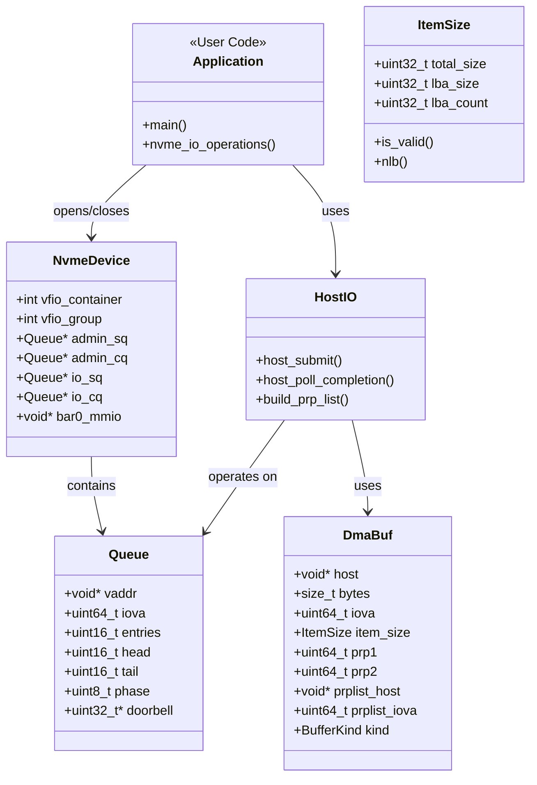

### File Organization (Updated 2025-11-22)

**Production Code (src/):**

| Directory | File | Components/Classes | Purpose |
|-----------|------|-------------------|---------|
| **common/** | nvme_types.h | NvmeCmd, NvmeCqe, NvmeStatus, enums | Core NVMe protocol types |
| **common/device/** | feature.h | Feature (base class) | Base class for device feature detection |
| **common/device/** | gpu_feature.h/cpp | GpuFeature | GPU capability detection (compute capability, P2P, GDS) |
| **common/device/** | nvme_feature.h/cpp | NvmeFeature | NVMe capability detection (DBC, queues, namespaces) |
| **common/device/** | host_feature.h/cpp | HostFeature | Host system capability detection (CPU, memory, IOMMU) |
| **common/device/** | device_detector.h/cpp | SystemFeatures, DeviceRequirements, SelectedDevices | Unified device detection and selection interface |
| **common/queue/** | nvme_queue.h | NvmeQueue (unified), NvmeQueueBase<T> CRTP | Queue structures and base class |
| **common/queue/** | host_queue_ops.h | submit_to_queue(), poll operations | Queue operation helpers |
| **common/memory/** | memory_buffer.h | ItemSize, IovaSeg, DmaBuf, BufferKind, Pool<T> | Unified buffer system |
| **common/memory/** | memory_buffer_impl.h | fill_pool_buffers<>() specializations | Buffer initialization logic |
| **common/doorbell/** | nvme_doorbell.h | DoorbellHandle, DoorbellStrategy<T>, ShadowDoorbell | Base doorbell types and CRTP hierarchy (MmioDoorbell removed) |
| **common/doorbell/** | doorbell_daemon.h/cpp | DoorbellDaemon class | Host-based doorbell daemon (polls GPU queue, writes DBC) |
| **common/doorbell/** | dbc_setup.h/cpp | ShadowDoorbellBuffer, allocate/free functions | DBC shadow doorbell buffer allocation and setup |
| **common/io/** | io.h | IOInterface, IO<T> CRTP base | I/O interface definitions |
| **common/io/** | io_impl.h | build_command(), submit helpers | Shared I/O implementations |
| **common/mapping/** | mapping.h | MappingInterface, Mapping<T> CRTP | Unified mapping interface |
| **common/mapping/** | mapping_host.h | Queue (legacy), device functions | Host mapping C API |
| **common/utils/** | vfio_safety.h/cpp | SafetyCheck, check_binding_safety() | Production VFIO safety validation |
| **host/io/** | host_io_host_mem.h/cpp | HostIO class, runtime dispatch | Host I/O implementation |
| **host/memory/** | host_memory_buffer.h/cpp | host_pool_create(), DMA management | Host buffer pools |
| **host/mapping/** | mapping_host.cpp | NvmeDevice implementation, VFIO | Device management |

**Test Infrastructure (test/):**

| Directory | File | Components/Classes | Purpose |
|-----------|------|-------------------|---------|
| **test/helper/** | nvme_config.h | DeviceConfig, getenv_or() | Environment variable parsing for tests |
| **test/helper/** | vfio_safety.h/cpp | SafetyCheck, check_binding_safety() | Test-specific safety checks |
| **test/helper/** | system_test_config.h/cpp | SystemTestConfig | Test configuration utilities |
| **test/helper/** | setup_helper.h/cpp | SetupHelper task system | Task-based test setup |
| **test/helper/** | nvme_test_helper.h | Test utilities | NVMe test file utilities |

### Key APIs

**Device Management:**
```cpp
NvmeDevice* nvme_open(const char* bdf, uint16_t sq_entries, uint16_t cq_entries, uint32_t lba_size);
Queue* nvme_get_iosq(NvmeDevice* dev);
Queue* nvme_get_iocq(NvmeDevice* dev);
```

**ItemSize Descriptor:**
```cpp
struct ItemSize {
    uint32_t total_size;  // Total transfer size in bytes
    uint32_t lba_size;    // LBA size (512, 4096, etc.)
    uint32_t lba_count;   // Number of LBAs (total_size / lba_size)

    bool is_valid() const;      // Validate alignment
    uint16_t nlb() const;       // Get NVMe NLB (0-based)
};
```

**I/O Operations (Updated with Type-Safe Doorbells):**
```cpp
// Template (compile-time) - NEW: Type-safe doorbell types
template<CommandType cmd, typename DoorbellT>
uint16_t host_submit(Queue* iosq, uint32_t nsid, uint64_t slba, ...);

// Usage examples:
host_submit<CMD_READ, ImmediateDoorbell>(...);    // Type-safe immediate
host_submit<CMD_WRITE, DeferredDoorbell>(...);     // Type-safe deferred

// Runtime (dynamic) - NEW: DoorbellHandle pointer
uint16_t host_submit_runtime(CommandType cmd, const DoorbellHandle* doorbell, ...);

// Pool creation with ItemSize
HostPool* host_pool_create(NvmeDevice* dev, const ItemSize& item_size, uint16_t count);
```

### Module 53 Consolidation Roadmap

Based on the duplication analysis (2025-11-08), the following consolidation plan is recommended:

#### Phase 1: Immediate Actions (Non-Breaking)
- [ ] **Extract Utility Functions** to `common/utils.h`
  - `round_up()`, `page_alloc()`, `FCloser` struct
  - Estimated effort: 2 hours

- [ ] **Add Deprecation Warnings**
  - Mark `struct Queue` as deprecated (use `NvmeQueue` instead)
  - Mark `DoorbellType` enum values as deprecated
  - Estimated effort: 1 hour

- [ ] **Create Migration Guide**
  - Document how to migrate from `Queue` to `NvmeQueue`
  - Document doorbell type migration path
  - Estimated effort: 2 hours

#### Phase 2: Near-Term (Minor Breaking)
- [ ] **Unify Queue Structures**
  - Default all new code to `NvmeQueue`
  - Provide compatibility typedef: `using Queue = NvmeQueue;`
  - Estimated effort: 4 hours

- [ ] **Consolidate Buffer Factories**
  - Merge `DeviceBufferFactory` and `UnifiedBufferFactory`
  - Keep single runtime dispatch mechanism
  - Estimated effort: 6 hours

#### Phase 3: Next Major Version (Breaking)
- [ ] **Remove Legacy APIs**
  - Remove `struct Queue` definition
  - Remove `DoorbellType` enum
  - Remove deprecated factory patterns
  - Estimated effort: 8 hours

#### Current Duplication Status
| Component | Duplications | Priority | Impact |
|-----------|-------------|----------|---------|
| Queue APIs | 2 (Queue vs NvmeQueue) | HIGH | Confusing API surface |
| Device structs | 2 definitions | MEDIUM | Potential ODR violations |
| Buffer factories | 2 patterns | MEDIUM | Redundant code paths |
| Utility functions | 5+ scattered | LOW | Code maintenance |
| Doorbell aliases | 7 deprecated | LOW | Already mitigated |

---

## Module 54: CUDA Host Memory

**Purpose:** Extends Module 53 with CUDA host-pinned memory for GPU-accessible buffers.

### Component Architecture

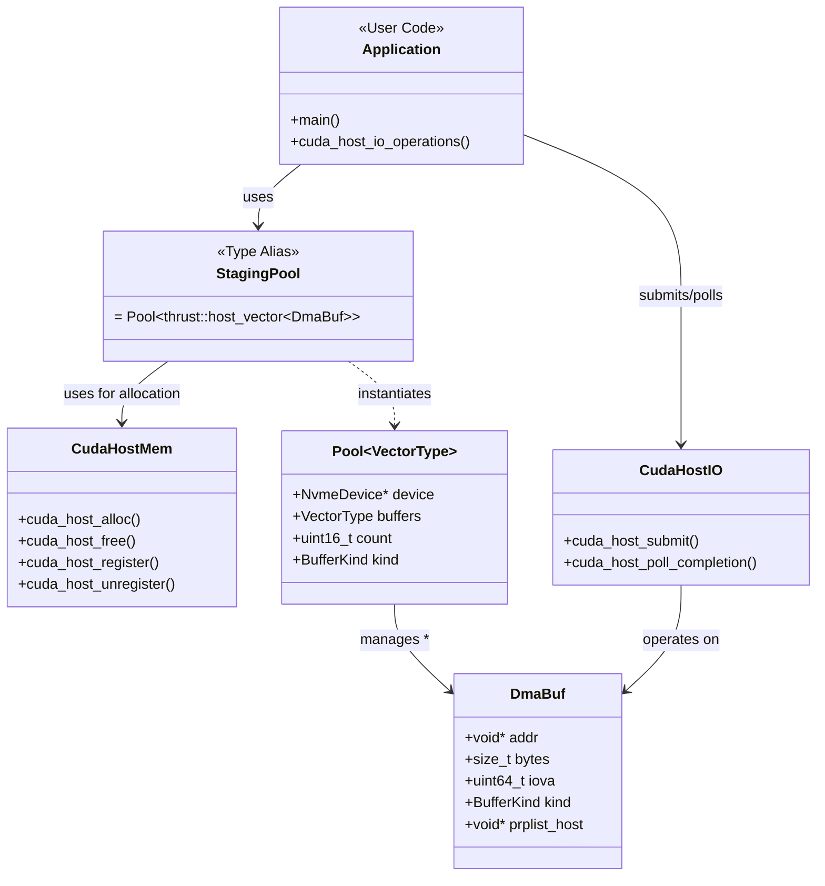

### File Organization

| Directory | File | Components/Classes | Purpose |
|-----------|------|-------------------|---------|
| **common/** | cuda_host_memory_buffer.h | StagingPool type alias, helper functions | CUDA host pool API |
| **common/** | cuda_io_host_mem.h | Template APIs: cuda_host_submit<>, cuda_host_poll_completion<> | Compile-time dispatch |
| **host/** | cuda_io_host_mem.cpp | cuda_host_submit_runtime(), cuda_host_pool_create() | Runtime dispatch & pool |

### Key Features

- **cudaHostAlloc()** for GPU-accessible memory
- **Buffer pool** with VFIO IOVA mapping
- **Consecutive buffers** for large transfers
- Compatible with Module 53 submit/poll APIs

---

## Module 55: CUDA GPU Memory

**Purpose:** Enables GPU device memory for NVMe I/O with multiple doorbell modes.

**Doorbell Modes (Module 55.x):**
- **55.1 Host Daemon**: In-process daemon polls GPU memory, rings MMIO (~50-150µs) - Legacy approach
- **55.2 DBC Shadow**: NVMe controller polls shadow buffer via DMA (~12-56µs) - Hardware polling
- **55.3 Host DBC Daemon**: In-process daemon polls pinned shadow buffer, rings MMIO (**~3.14µs, 318K IOPS - Best performance** ✅)

**Architecture Note:** Module 55 uses CPU-side submission with GPU memory buffers. For full GPU-initiated I/O (GPU builds commands), see Module 56.

### Component Architecture

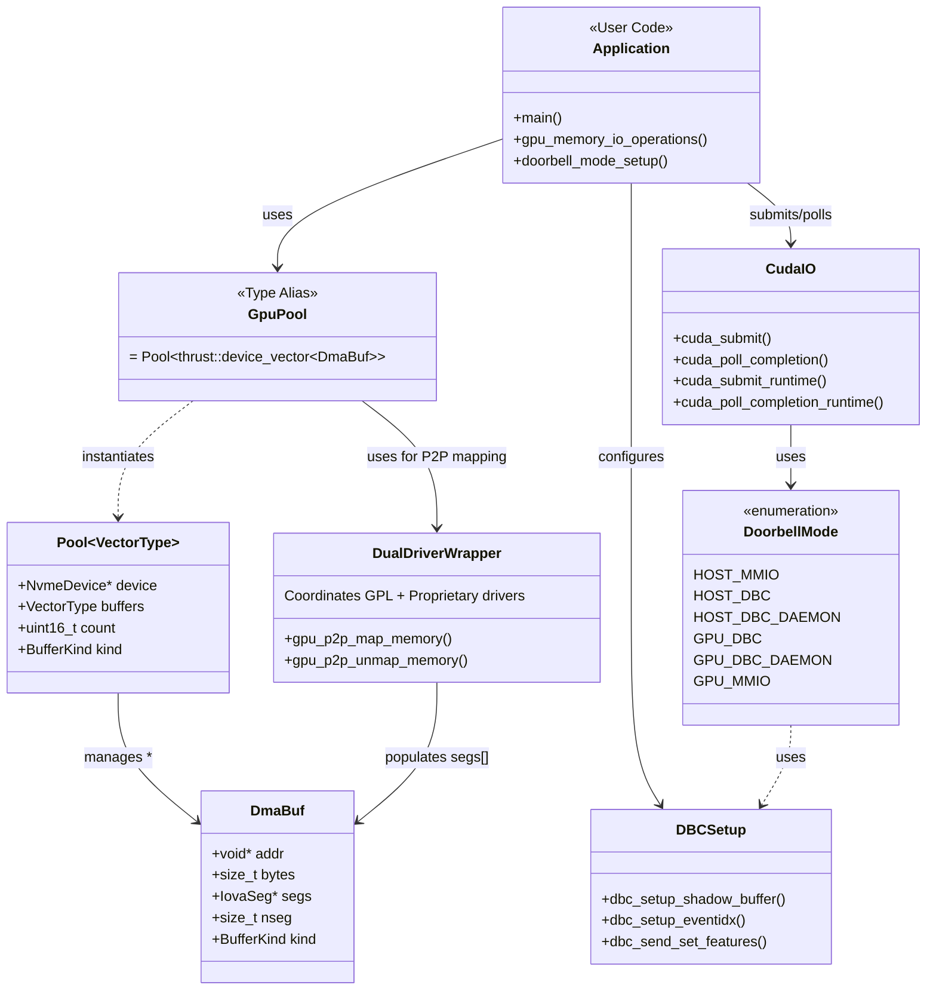

### File Organization

#### Userspace (src/)

| Directory | File | Components/Classes | Purpose |
|-----------|------|-------------------|---------|
| **common/** | nvme_vio_cuda_gpu.h | CudaP2PTokens, Buffer APIs | GPU buffer interface |
| **common/** | cuda_io_gpu_mem.h | GpuMemPool | GPU memory pool |
| **common/** | nvme_gpu_submit_setup.h | GPU queue setup | Queue initialization |
| **host/** | dbc_setup.cpp | DBC configuration | Shadow doorbell setup |
| **host/** | nvme_gpu_submit_setup.cpp | Queue allocation | GPU queue management |
| **kernels/** | gpu_p2p_ioctl.h | GPU_P2P_MAP_MEMORY | Kernel module interface |
| **kernels/** | gpu_shadow_doorbell.cu | GPU kernels | Shadow doorbell writes |
| **kernels/** | nvme_gpu_queue.h | GPU queue operations | GPU-side queue API |
| **kernels/** | cuda_io_gpu_mem.cpp | Pool implementation | GPU memory allocation |
| **kernels/** | nvme_vio_cuda_gpu.cpp | Buffer creation | GPU buffer lifecycle |

#### Kernel Module (driver/) - **DUAL-DRIVER ARCHITECTURE**

The old single-driver code (src/, test/, Makefile, gpu_p2p_backend.h) has been **deleted** and replaced with the dual-driver architecture.

**Dual-Driver Architecture:**

| Directory | File | Components | Purpose |
|-----------|------|-----------|---------|
| **gpu_p2p_core/** | gpu_p2p_core.c | GPL driver | DMA mapping, IOVA management |
| **gpu_p2p_core/** | core_ioctl.h | ioctl definitions | Core driver interface |
| **gpu_p2p_nvidia/** | gpu_p2p_nvidia.c | Proprietary driver | NVIDIA P2P wrapper |
| **gpu_p2p_nvidia/** | nvidia_ioctl.h | ioctl definitions | NVIDIA driver interface |
| **libgpu_p2p_wrapper/** | gpu_p2p_wrapper.c | Userspace library | Coordinator between drivers |
| **libgpu_p2p_wrapper/** | gpu_p2p_wrapper.h | Public API | Application interface |
| **include/** | gpu_p2p_types.h | Common types | Shared data structures |
| **include/** | gpu_p2p_ioctl.h | ioctl numbers | Unified ioctl definitions |
| **include/** | gpu_p2p_backend_opaque.h | Opaque types | Cross-component types |

See "Dual-Driver GPU P2P Architecture" section for details.

### Doorbell Modes

| Mode | Module | Description | Latency | Status |
|------|--------|-------------|---------|--------|
| **Host MMIO** | 53, 54 | CPU rings MMIO directly | ~3-5µs | ✅ Production |
| **DBC Shadow** | 55.2 | NVMe controller polls DMA buffer | ~12-56µs | ✅ Verified |
| **Host DBC Daemon** | 55.3 | In-process daemon polls shadow + MMIO | ~3.14µs (Mode 3) | ✅ Best Performance |
| **GPU Queue MMIO** | 56 | GPU kernel rings MMIO via P2P | ~8-40µs | ✅ Experimental |
| **GPU Queue Daemon** | 56 | GPU writes shadow, in-process daemon rings MMIO | ~50µs (Mode 5) | ✅ Fixed (CID bug)

---

## Module 56: GPU Queue + GPU Buffer

**Purpose:** Full GPU-initiated I/O with unified doorbell mode abstraction.

**Performance (Post-CID Fix):**
- **Mode 5 (GPU Queue + Daemon)**: ~50µs latency, ~20K IOPS (4KB operations)
- **Critical Bug Fixed**: CID polling mismatch causing 175x performance degradation (550µs → 50µs)
- GPU kernels now return actual allocated CID for correct completion polling

**Doorbell Architecture:**
- **In-Process Daemon** (Current): `DoorbellDaemon` class runs as thread within test process (no sudo required)
  - See: [daemon/UNIFIED_DAEMON_DESIGN.md](53.NVMe_VFIO_Host_Layer/daemon/UNIFIED_DAEMON_DESIGN.md)
- **External Daemon** (Deprecated): Standalone `host_dbc_daemon` binary moved to `daemon/legacy/`
- **Direct GPU MMIO**: Not supported - GPU kernels cannot access MMIO registers

### Component Architecture

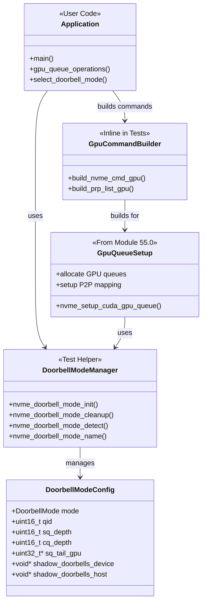

### File Organization

**Source Libraries:**
- Module 56 **reuses all libraries from Module 55.0** (cuda_io_gpu_mem_55, nvme_vio_cuda_gpu_55)
- No additional source files in Module 56 - all core functionality is in Module 55.0

**Test Helpers:** (located in `test/helper/`)
| File | Components/Classes | Purpose |
|------|-------------------|---------|
| nvme_doorbell.cpp/h | nvme_doorbell_mode_init/cleanup/detect() | Unified doorbell mode abstraction |
|  | nvme_dbc_is_supported() | DBC hardware capability detection |
|  | nvme_doorbell_mode_name() | Mode name strings |
| benchmark_common.cu/h | Dummy CUDA operations | Fair benchmark comparisons |

**Note:**
- GPU command building kernels are defined inline in test files, using low-level `nvme_gpu_*` functions from `55.0_Shared_Implementation/src/common/nvme_vio_cuda_gpu_impl.h`
- Doorbell management moved to test helpers as it's only used by tests (not production code)
- All benchmarks moved to Module 57 for comprehensive performance comparison

### Integration Tests

The module includes comprehensive integration tests:

**Functional Tests:**
- **DBC Mode** (test_56_dbc_mode) - 5 tests ✓
- **Host DBC Daemon** (test_56_host_dbc_daemon_mode) - 5 tests ✓
- **Doorbell Mode Selection** (test_doorbell_mode_56) - 7 tests ✓
- **GPU Initiated I/O** (test_56_gpu_initiated_io, test_56_gpu_doorbell_submission) - GPU kernel I/O tests
- **Real I/O** (test_56_real_io_host_dbc_daemon) - End-to-end test with actual NVMe operations

**Performance Benchmarks:**
- **All benchmarks moved to Module 57** (Performance Comparison GDS vs GPU)
  - benchmark_mode1_gds - GPUDirect Storage baseline
  - benchmark_mode3_host_daemon - Host-based daemon polling
  - benchmark_mode5_dbc_daemon_gpu_command - GPU-initiated I/O with daemon
  - Module 57 provides comprehensive 5-mode performance comparison with unified testing framework

---

## Module 57: Performance Comparison - GDS vs GPU I/O

**Purpose:** Comprehensive performance comparison of 5 GPU-NVMe I/O modes with unified testing framework.

**Performance Results (4KB operations):**
- **Mode 1 (GDS/cuFile)**: ~3.5µs latency, 285K IOPS - NVIDIA GPUDirect Storage baseline
- **Mode 3 (Host Daemon)**: ~3.14µs latency, 318K IOPS - **Best performance** ✅
- **Mode 5 (GPU Command + Daemon)**: ~50µs latency, 20K IOPS - True GPU-initiated I/O

**Architecture Modes:**
1. **Mode 1 - GDS (cuFile)**: NVIDIA GPUDirect Storage API (baseline reference)
2. **Mode 2 - DBC Shadow**: NVMe controller polls shadow buffer via DMA (hardware polling)
3. **Mode 3 - Host DBC Daemon**: CPU daemon polls pinned shadow buffer + DBC doorbells
4. **Mode 4 - GPU Queue MMIO**: Removed - GPU cannot access MMIO doorbells
5. **Mode 5 - GPU Command + Daemon**: GPU builds NVMe commands + CPU daemon rings doorbells

### Benchmark Framework

**Unified Test Helpers:** (located in `test/helper/`)
| File | Purpose |
|------|---------|
| host_dbc_daemon.cpp/h | Reusable daemon implementation for Modes 3 & 5 |
| benchmark_common.cu/h | Shared CUDA operations for fair comparison |

**Benchmark Executables:**
| Benchmark | Mode | Description |
|-----------|------|-------------|
| benchmark_mode1_gds | GDS | cuFile API baseline |
| benchmark_mode3_host_daemon | Host Daemon | CPU-side shadow polling |
| benchmark_mode5_dbc_daemon_gpu_command | GPU Command | GPU-initiated I/O |

**Test Coverage:**
- Latency measurements (single operation timing)
- Throughput tests (IOPS with concurrent operations)
- Read-only and write-only operation profiles
- Full cycle testing (command submission + completion polling)

### Key Findings

**Best Mode: Mode 3 (Host DBC Daemon)**
- Lowest latency: ~3.14µs per operation
- Highest throughput: 318K IOPS
- Uses CPU daemon for shadow buffer polling + DBC doorbells
- No GPU kernel overhead, direct host-side queue management

**Mode 5 Characteristics (GPU-Initiated I/O):**
- Higher latency due to GPU kernel overhead (~50µs)
- True GPU-initiated I/O: GPU builds NVMe commands autonomously
- Production-ready path that works on all hardware
- Critical bug fixed (CID polling): 175x improvement (550µs → 50µs)

**GDS Comparison:**
- Mode 3 outperforms GDS by ~10% (318K vs 285K IOPS)
- GDS provides standard API but higher overhead
- Custom implementation achieves better performance for direct NVMe access

---

## Module 58: Simple GPU Filesystem API

**Purpose:** High-level filesystem abstraction for NVMe with node-based LBA management.

### Component Architecture

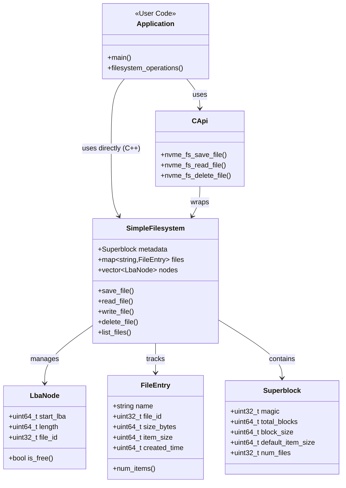

### File Organization

| Directory | File | Components/Classes | Purpose |
|-----------|------|-------------------|---------|
| **common/** | nvme_simple_fs.h | SimpleFilesystem, LbaNode, FileEntry | C++ filesystem API |
| **common/** | nvme_simple_fs_c_api.h | C wrapper functions | C API interface |
| **host/** | nvme_simple_fs.cpp | SimpleFilesystem implementation | Core filesystem logic |
| **host/** | nvme_simple_fs_c_api.cpp | C API implementation | C wrapper implementation |
| **host/** | nvme_fs_io_stubs.cpp | Default NVMe I/O (overridable in tests) | Real I/O (weak symbols) |

### Key Features

- **Node-based allocation**: Files stored as contiguous LBA ranges
- **ItemSize support**: Files can specify default I/O size (item_size field)
- **Item-based I/O**: Read/write by items with automatic block alignment
- **Metadata management**: Superblock + file entries in reserved LBAs
- **Garbage collection**: Automatic free space consolidation
- **Bounds checking**: Access violation detection
- **C/C++ APIs**: Both template-based and runtime interfaces

### API Examples

**C++ Byte-Level API:**
```cpp
SimpleFilesystem fs(dev, nsid, lba_size, total_blocks);
fs.save_file("data.bin", buffer, size, 4096);  // 4KB item size
fs.read_file("data.bin", buffer, size);
fs.delete_file("data.bin");
```

**C++ Item-Level API:**
```cpp
// Save file with 4KB items
fs.save_file("records.bin", data, 1024 * 4096, 4096);

// Read specific items (automatic block alignment)
std::vector<uint8_t> buffer(4096 * 10);  // 10 items
fs.read_items("records.bin", 100, 10, buffer.data());

// Read/write single typed items
struct Record { int id; float data[1024]; };
Record rec;
fs.read_item<Record>("data.bin", 5, rec);   // Read 6th record
rec.data[0] = 3.14f;
fs.write_item<Record>("data.bin", 5, rec);  // Write back
```

**C API:**
```cpp
nvme_fs_handle_t* fs = nvme_fs_create(dev, nsid, lba_size, total_blocks);
nvme_fs_save_file(fs, "data.bin", buffer, size);
nvme_fs_read_file(fs, "data.bin", buffer, size);
nvme_fs_destroy(fs);
```

---

## Component Dependencies

### Dependency Graph

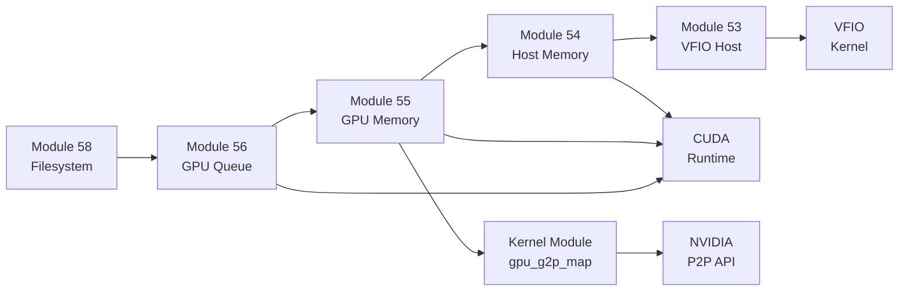

### Inter-Module Communication

| Consumer | Provider | Interface | Purpose |
|----------|----------|-----------|---------|
| Module 54 | Module 53 | nvme_vio_host.h | Device/queue management |
| Module 55 | Module 54 | cuda_io_host_mem.h | Host pinned memory |
| Module 55 | Module 53 | nvme_vio_host.h | Queue operations |
| Module 56 | Module 55 | nvme_vio_cuda_gpu.h | GPU memory/queues |
| Module 56 | Kernel | gpu_p2p_ioctl.h | Physical address mapping |
| Module 58 | Module 56 | nvme_doorbell_mode.h | Doorbell abstraction |

---

## Memory Types and Usage

### Memory Type Progression

| Module | Memory Type | Allocation | GPU Access | NVMe DMA | Use Case |
|--------|-------------|------------|------------|----------|----------|
| 53 | Host pageable | malloc() | No | VFIO map | CPU-only I/O |
| 53 | Host pinned | mlock() | No | VFIO map | Faster CPU I/O |
| 54 | CUDA host pinned | cudaHostAlloc() | Yes (read/write) | VFIO map | GPU-accessible I/O |
| 55 | GPU device | cudaMalloc() | Yes (fast) | P2P map | GPU-initiated I/O |
| 56 | GPU device | cudaMalloc() | Yes (fast) | P2P map | Full GPU I/O pipeline |

### Buffer Type Enumeration

```cpp
enum BufferKind : uint8_t {
    // Pool buffer types (small, frequent allocations)
    BUFFER_KIND_HOST          = 0,  // Regular host memory (VFIO mapped, contiguous IOVA)
    BUFFER_KIND_PINNED_HOST   = 1,  // CUDA host-pinned memory (VFIO mapped, contiguous IOVA)
    BUFFER_KIND_PINNED_DEVICE = 2,  // GPU device memory (P2P mapped, may have scattered IOVA)

    // Consecutive buffer types (large, contiguous allocations)
    BUFFER_KIND_CONSECUTIVE_HOST         = 3,  // Large host buffer (contiguous IOVA)
    BUFFER_KIND_CONSECUTIVE_PINNED_HOST  = 4,  // Large CUDA host buffer (contiguous IOVA)
    BUFFER_KIND_CONSECUTIVE_DEVICE       = 5,  // Large GPU device buffer (may have scattered IOVA)
};
```

**Buffer Kind Usage by Module:**
- **Module 53**: `BUFFER_KIND_HOST` (pool), `BUFFER_KIND_CONSECUTIVE_HOST` (consecutive)
- **Module 54**: `BUFFER_KIND_PINNED_HOST` (pool), `BUFFER_KIND_CONSECUTIVE_PINNED_HOST` (consecutive)
- **Module 55/56**: `BUFFER_KIND_PINNED_DEVICE` (pool), `BUFFER_KIND_CONSECUTIVE_DEVICE` (consecutive)

**Key Characteristics:**
- Pool buffers (0-2): Small, pre-allocated, fast acquire/release
- Consecutive buffers (3-5): Large, dynamically allocated, for big I/O operations
- Host/Pinned Host (0,1,3,4): Contiguous IOVA guaranteed
- Device (2,5): May have scattered IOVA (requires PRP list or SGL)

See `BUFFER_UNIFICATION_PLAN.md` for detailed migration strategy.

---

## Build System Integration

### CMake Dependency Chain

```
53_NVMe_VFIO_Host_Layer_lib (PUBLIC include: src/)
    ↓ target_link_libraries
54_CUDA_Host_Memory_lib (PUBLIC include: src/)
    ↓ target_link_libraries
55_Shared_Implementation_lib (PUBLIC include: src/)
    ↓ target_link_libraries
56_GPU_Queue_GPU_Buffer_lib (PUBLIC include: src/)
    ↓ target_link_libraries
58_Simple_Filesystem_Layer_lib (PUBLIC include: src/)
```

### Include Path Management

**Correct approach (target-based):**
```cmake
target_link_libraries(module_b_lib PUBLIC module_a_lib)
# Automatically exports module_a/src/ include paths
```

**Usage in source code:**
```cpp
#include "nvme_vio_host.h"        // From Module 53
#include "cuda_io_host_mem.h"     // From Module 54
#include "nvme_vio_cuda_gpu.h"    // From Module 55
```

---

## Testing Architecture

### Test Coverage by Module

| Module | Unit Tests | Integration Tests | Total |
|--------|-----------|------------------|-------|
| 53 | 66 (host I/O, PRP, templates) | 3 (real NVMe I/O) | 69 |
| 54 | 2 (CUDA alloc/register) | 2 (GPU kernel I/O) | 4 |
| 55 | 1 (buffer creation) | 2 (GPU-accessible I/O) | 3 |
| 56 | 19 (doorbell modes, queues) | 8 (real I/O tests) | 27 |
| 58 | 19 (filesystem operations) | 0 (uses default I/O) | 19 |
| **Total** | **107** | **15** | **122** |

### Test Infrastructure

- **GpuTest base class** (`00.test_lib/gpu_gtest.h`) - Automatic CUDA setup/teardown
- **Pattern verification** - Sequential, alternating, block-based, prime number patterns
- **Environment-based skipping** - Tests skip gracefully when hardware unavailable
- **Real hardware tests** - Require `NVME_BDF` and related environment variables

---

## Performance Characteristics

### I/O Latency Comparison (4KB Operations)

| Mode | Configuration | Latency | IOPS | CPU Load | Notes |
|------|--------------|---------|------|----------|-------|
| **Mode 1** | Module 53 (Host MMIO) | ~3-5µs | ~318K | High | Baseline performance |
| **Mode 2** | Module 54 (CUDA Host MMIO) | ~3-5µs | ~318K | High | Pinned memory |
| **Mode 3** | Module 55.3 (Host DBC Daemon) | **3.14µs** | **318K** | Medium | **Best overall** ✅ |
| **Mode 5** | Module 56 (GPU Queue Daemon) | **~50µs** | **~20K** | Low | Post-CID fix ✅ |
| *TBD* | Module 55.2 (DBC Shadow) | ~12-56µs | TBD | Very Low | Hardware polling |
| *TBD* | Module 56 (GPU MMIO P2P) | ~8-40µs | TBD | None | Direct GPU control |

**Key Insights:**
- **Mode 3 (Host DBC Daemon)**: Best latency/IOPS, moderate CPU usage
- **Mode 5 (GPU Queue Daemon)**: 16x slower than Mode 3, but GPU-initiated
  - Latency breakdown: ~30µs kernel launch + ~5µs command build + ~3µs I/O + ~12µs completion poll
  - Kernel launch overhead dominates (60% of total latency)
- **Critical Fix**: Mode 5 improved from 550µs → 50µs after CID polling bug fix (175x improvement)

### Throughput Scaling

- **Module 53/54**: Limited by CPU PCIe TLP generation (~318K IOPS measured)
- **Module 55.3**: Same as host due to daemon efficiency (~318K IOPS)
- **Module 56**: Limited by kernel launch overhead (~20K IOPS for 4KB operations)
  - Batch processing recommended for higher throughput
  - Async streams could improve concurrency

---

## Hardware Requirements

### Required Hardware

| Component | Requirement | Purpose |
|-----------|-------------|---------|
| **GPU** | NVIDIA with Compute Capability 3.5+ | CUDA kernel execution |
| **NVMe SSD** | PCIe 3.0+ | Storage device |
| **Motherboard** | IOMMU support (VT-d/AMD-Vi) | VFIO isolation |
| **CPU** | x86_64 with IOMMU | Memory virtualization |

### Optional Hardware Features

| Feature | Benefit | Modules |
|---------|---------|---------|
| **NVMe DBC Support** | Hardware doorbell polling | 55.2 |
| **GPUDirect RDMA** | Direct GPU-NVMe DMA | 55, 56 |
| **P2PDMA** | PCIe peer-to-peer | 56 (cuFile) |
| **Large BAR** | Full GPU memory mapping | 55, 56 |

---

## Future Extensions

### Planned Enhancements

1. **Multi-queue support** - Per-CPU core or per-GPU stream queues
2. **Asynchronous APIs** - CUDA streams integration
3. **Error handling** - Retry logic and error recovery
4. **Performance monitoring** - Latency histograms and throughput metrics
5. **Security** - Namespace isolation and access control

### Research Directions

- **GPU-initiated metadata** - Filesystem operations from GPU
- **RDMA integration** - Network + storage in single GPU kernel
- **Computational storage** - Offload to NVMe computational units
- **Multi-GPU coordination** - Distributed I/O across GPUs

---

## References

### External Documentation

- **NVMe Specification 1.4**: Base protocol and doorbell buffer configuration
- **NVIDIA GPUDirect RDMA**: GPU P2P memory access
- **VFIO Documentation**: Linux kernel userspace driver interface
- **CUDA Programming Guide**: CUDA memory types and optimization

### Related Work

- **GPUfs**: Filesystem for GPU computing (ASPLOS'13)
- **GDRCopy**: Low-latency GPU memory access library
- **SPDK**: Storage Performance Development Kit (Intel)

---

**Document Version:** 1.0
**Last Updated:** 2025-11-01
**Maintainer:** CUDA Exercise Project

---

## Additional Documentation

This architecture overview is complemented by detailed reference guides:

### 1. FUNCTION_REFERENCE.md
**Purpose**: Complete catalog of all functions across modules 53-58

Contains:
- Function signatures with all parameters
- Purpose and usage examples
- File locations
- Deprecated functions marked for removal
- Naming inconsistencies documented

**When to use**: When you need to know what a specific function does or where it's defined.

### 2. REFACTORING_GUIDE.md
**Purpose**: Roadmap for code structure improvements and technical debt reduction

Contains:
- Completed refactorings (unified buffer, queue interface, doorbell management)
- Pending high-priority changes (remove deprecated code, fix naming)
- Medium-priority improvements (API consistency, buffer hierarchy)
- Low-priority cleanup (directory structure, file renames)
- Implementation roadmap with timeline
- Testing strategy and risk assessment

**When to use**: When planning code improvements or understanding recent structural changes.

### 3. Module-Specific READMEs
Each module (53-58) has its own README.md with:
- Detailed implementation notes
- Usage examples
- Performance characteristics
- Testing instructions

**Navigation**:
```
50.GPU-NVMe_Interaction/
├── ARCHITECTURE.md           ← You are here (high-level design)
├── FUNCTION_REFERENCE.md     ← Function catalog
├── REFACTORING_GUIDE.md      ← Improvement roadmap
├── 53.NVMe_VFIO_Host_Layer/README.md
├── 54.CUDA_Host_Memory/README.md
├── 55.CUDA_GPU_Memory/55.0_Shared_Implementation/README.md
├── 56.GPU_Queue_GPU_Buffer/README.md
└── 58.Simple_Filesystem_Layer/README.md
```

---

## Recent Structural Changes (2025-11-01)

### Unified Buffer System ✅
- **What**: Merged `DmaBuf`, `Buffer`, `GpuDmaBuf` into single unified structure
- **Why**: Eliminate code duplication, enable polymorphic buffer management
- **Impact**: All modules (53-56) now use consistent buffer API
- **Details**: See REFACTORING_GUIDE.md § Completed Refactorings

### Unified Queue Interface ✅
- **What**: Created `NvmeQueue` (analogous to `NvmeGpuQueue`)
- **What**: Added `nvme_setup_host_queue()` function
- **What**: Updated `DeviceBufferFactory` with `setup_queue()` method
- **Why**: Consistent API pattern across host and GPU, enables polymorphism
- **Impact**: Host I/O now uses same queue setup pattern as GPU
- **Details**: See REFACTORING_GUIDE.md § Completed Refactorings

### Unified Doorbell Management ✅
- **What**: Merged `nvme_dbc_detect` and `nvme_doorbell_mode` into `nvme_doorbell`
- **Why**: Reduce header proliferation, simplify dependencies
- **Impact**: Single library instead of two, cleaner includes
- **Details**: See REFACTORING_GUIDE.md § Completed Refactorings
- **Removed Files**: `nvme_dbc_detect.h/.cpp`, `nvme_doorbell_mode.h/.cpp`
- **Added Files**: `nvme_doorbell.h/.cpp`

---

## Naming Convention Summary

### Prefix Guidelines

| Prefix | Memory Type | Example | Module |
|--------|-------------|---------|--------|
| `host_*` | Host pageable | `host_pool_create()` | 53 |
| `cuda_host_*` | CUDA host pinned | `cuda_host_pool_create()` | 54 |
| `cuda_gpu_*` | GPU device | `cuda_gpu_pool_create()` | 55 |
| `nvme_*` | Hardware/device | `nvme_open()`, `nvme_close()` | 53 |
| `gpu_*` | GPU operations | `gpu_submit()` ⚠️ Should be `cuda_*` | 55 |

### Buffer Type Naming

| Type | Purpose | Module |
|------|---------|--------|
| `DmaBuf` | Unified buffer descriptor | 53-56 |
| `Buffer` | Consecutive buffer (file-scope) | 53-55 |
| `NvmeQueue` | Host queue descriptor | 53 |
| `NvmeGpuQueue` | GPU queue descriptor | 55 |

### Function Naming Patterns

**Pool Management:**
```
{memory_type}_pool_create()
{memory_type}_pool_acquire()
{memory_type}_pool_release()
{memory_type}_pool_destroy()
```

**I/O Operations:**
```
{memory_type}_submit<CommandType, DoorbellType>()      # Template
{memory_type}_submit_runtime()                         # Runtime
{memory_type}_poll_completion<AsyncType>()             # Template
{memory_type}_poll_completion_runtime()                # Runtime
```

**Queue Setup:**
```
nvme_setup_{memory_type}_queue()
```

**Examples:**
- `host_pool_create()`, `host_submit()`, `nvme_setup_host_queue()`
- `cuda_host_pool_create()`, `cuda_host_submit()` ✅
- `cuda_gpu_pool_create()`, `gpu_submit()` ⚠️ (should be `cuda_submit()`)

---

## Quick Reference Table

### Module Capabilities Matrix

| Module | Memory Type | Buffer Kind | Queue Location | Doorbell | GPU Access | Key Feature |
|--------|-------------|-------------|----------------|----------|------------|-------------|
| **53** | Host malloc | `BUFFER_KIND_HOST` (0) | Host | Host MMIO | No | Baseline NVMe I/O |
| **54** | CUDA pinned | `BUFFER_KIND_PINNED_HOST` (1) | Host | Host MMIO | Read/Write | GPU-accessible memory |
| **55.0** | GPU device | `BUFFER_KIND_PINNED_DEVICE` (2) | Host | DBC modes | Full | GPU memory + DBC |
| **55.1** | GPU device | `BUFFER_KIND_PINNED_DEVICE` (2) | Host | Host Daemon | Full | Host daemon rings bell |
| **55.2** | GPU device | `BUFFER_KIND_PINNED_DEVICE` (2) | Host | DBC Shadow | Full | NVMe polls shadow |
| **55.3** | GPU device | `BUFFER_KIND_PINNED_DEVICE` (2) | Host | Host DBC Daemon | Full | Daemon polls + rings |
| **56** | GPU device | `BUFFER_KIND_PINNED_DEVICE` (2) | **GPU** | GPU MMIO | Full | **GPU-initiated I/O** |
| **58** | All | All supported | Either | Any | Full | Filesystem API |

### Buffer Types Quick Reference

| Value | Name | Allocation | IOVA | Use Case | Modules |
|-------|------|------------|------|----------|---------|
| **0** | `BUFFER_KIND_HOST` | `malloc()` | Contiguous | Host pool | 53 |
| **1** | `BUFFER_KIND_PINNED_HOST` | `cudaHostAlloc()` | Contiguous | CUDA host pool | 54 |
| **2** | `BUFFER_KIND_PINNED_DEVICE` | `cudaMalloc()` | Scattered | GPU pool | 55, 56 |
| **3** | `BUFFER_KIND_CONSECUTIVE_HOST` | `malloc()` | Contiguous | Large host buffer | 53 |
| **4** | `BUFFER_KIND_CONSECUTIVE_PINNED_HOST` | `cudaHostAlloc()` | Contiguous | Large CUDA buffer | 54 |
| **5** | `BUFFER_KIND_CONSECUTIVE_DEVICE` | `cudaMalloc()` | Scattered | Large GPU buffer | 55, 56 |

### Doorbell Modes Summary

| Mode | Who Rings | Mechanism | Latency | IOPS (4KB) | Use Case | Module | Status |
|------|-----------|-----------|---------|------------|----------|--------|--------|
| **Host MMIO** | Host CPU | Direct MMIO write | ~3-5µs | ~318K | Standard I/O | 53, 54 | ✅ Production |
| **Host DBC Daemon** | Host daemon | Polls shadow + MMIO | ~3.14µs | ~318K | **Best performance** | 55.3 | ✅ Verified (Mode 3) |
| **GPU Queue Daemon** | Host daemon | GPU→shadow, CPU→MMIO | ~50µs | ~20K | GPU-initiated I/O | 56 | ✅ Fixed (Mode 5, CID bug) |
| **DBC Shadow** | NVMe controller | GPU→shadow, NVMe polls | ~12-56µs | TBD | Pure GPU control | 55.2 | ⚠️ Hardware dependent |
| **GPU MMIO** | GPU kernel | Direct P2P MMIO | ~8-40µs | TBD | Full GPU control | 56 | ⚠️ Experimental |

### Parameter Naming Standards

| Concept | Parameter Name | Type | Description | Example |
|---------|----------------|------|-------------|---------|
| Starting LBA | `slba` | `uint64_t` | NVMe spec term | `slba = 0x1000` |
| Number of blocks | `nlb` | `uint16_t` | 0-based (0 = 1 block) | `nlb = 7` (8 blocks) |
| Command type | `cmd_type` | `CommandType` | READ or WRITE | `CMD_READ` |
| Submission queue | `iosq` | `NvmeQueue*` | I/O SQ pointer | `host_submit(iosq, ...)` |
| Completion queue | `iocq` | `NvmeQueue*` | I/O CQ pointer | `host_poll(iocq, ...)` |

### Key Files by Module

| Module | Core Headers | Implementation | Tests |
|--------|--------------|----------------|-------|
| **53** | `nvme_vio_host.h` | `nvme_vio_host.cpp` | 8 test files |
| **54** | `cuda_io_host_mem.h` | `cuda_io_host_mem.cpp` | 3 test files |
| **55.0** | `nvme_vio_cuda_gpu.h` | `nvme_vio_cuda_gpu.cpp` | 7 test files (shared) |
| **56** | Uses 55.0 headers | (no src files) | 12 test files |
| **58** | `simple_fs.h` | `simple_fs.cpp` | 3 test files |

### Test Coverage Status

| Category | Count | Status |
|----------|-------|--------|
| Total test executables | 30 | ✅ All build |
| Passing tests | 30 | ✅ All pass or skip |
| Failing tests | 0 | ✅ None |
| Hardware-dependent skips | ~15 | ⚠️ Expected (no NVMe device) |
| Unit tests (no hardware) | ~15 | ✅ All pass |

---

**Document Version:** 3.0
**Last Updated:** 2025-11-02

**Recent Changes (Version 3.0):**
- ✅ Added template-based pool refactoring documentation (Pool<VectorType>)
- ✅ Added CRTP-based doorbell strategy pattern (DoorbellStrategy<Derived>)
- ✅ Added new "Dual-Driver GPU P2P Architecture" section with complete design
- ✅ Updated Memory Buffer Layer diagram to reflect unified template architecture
- ✅ Updated Doorbell Layer diagram to show CRTP hierarchy
- ✅ Updated Design Patterns section with CRTP and template-based patterns
- ✅ Updated File Organization sections for modules 53-56 with new files
- ✅ Added GPU pool initialization flow diagram
- ✅ Documented migration from runtime switches to compile-time polymorphism

**Previous Changes (Version 2.1):**
- Added "Document Status and Recent Updates" section
- Updated BufferKind enumerations to 6-kind system (values 0-5)
- Fixed buffer naming: `HOST_PINNED` → `PINNED_HOST`, added `CONSECUTIVE_*` variants
- Added comprehensive Quick Reference Table with module capabilities
- Documented naming standardization (slba, nlb, iosq, iocq)
- Added buffer type bug fix documentation (Module 55 fix)
- Updated test infrastructure status (30 executables, 0 failures)

**Related Documentation:**
- `POOL_TEMPLATE_REFACTORING_COMPLETE.md` - Template pool implementation details
- `DOORBELL_CRTP_DESIGN.md` - CRTP doorbell pattern design
- `CRTP_DOORBELL_MIGRATION_SUMMARY.md` - Migration guide from runtime to compile-time
- `DUAL_DRIVER_ARCHITECTURE.md` - Detailed dual-driver design
- `DUAL_DRIVER_IMPLEMENTATION_COMPLETE.md` - Implementation guide
- `DUAL_DRIVER_BUILD_AND_TEST_SUMMARY.md` - Build procedures
- `FUNCTION_REFERENCE.md` - Complete API reference
- `BUFFER_UNIFICATION_PLAN.md` - Buffer type system details
- `NAMING_REFACTORING_PLAN.md` - Parameter naming conventions
- `REFACTORING_GUIDE.md` - Code organization standards
- `TEST_DUPLICATION_ANALYSIS.md` - Test code deduplication
- `ARCHITECTURE_UPDATE_SUMMARY.md` - Summary of architectural changes

---

## API Migration Guide (2025-11-08)

This guide helps developers migrate from deprecated APIs to the new architecture.

### 1. Doorbell Type Migration

**Old Code (Deprecated):**
```cpp
// Using enum-based doorbell types
template<>
uint16_t host_submit<CMD_READ, DOORBELL_DEFERRED>(queue, nsid, slba, ...); // MMIO removed

// Runtime with enum
host_submit_runtime(CMD_READ, DOORBELL_DEFERRED, queue, ...);
```

**New Code (Recommended):**
```cpp
// Using type-safe doorbell classes
template<>
uint16_t host_submit<CMD_READ, ImmediateDoorbell>(queue, nsid, slba, ...);

// Runtime with doorbell handle
DeferredDoorbell deferred_db;
host_submit_runtime(CMD_READ, &deferred_db, queue, ...);

// Or use nullptr for immediate
host_submit_runtime(CMD_READ, nullptr, queue, ...);  // Immediate by default
```

### 2. Queue Structure Migration

**Old Code (Legacy):**
```cpp
// Using legacy C-style Queue struct
struct Queue* q = nvme_get_iosq(dev);
q->tail = (q->tail + 1) % q->entries;
```

**New Code (Unified):**
```cpp
// Using unified NvmeQueue structure
NvmeQueue* iosq = nvme_setup_host_queue(dev, nullptr);
iosq->tail = (iosq->tail + 1) % iosq->entries;

// Or use CRTP queue classes
HostNvmeQueue<ImmediateDoorbell> host_queue(dev);
host_queue.submit_command(cmd);
```

### 3. Buffer Factory Migration

**Old Code (Multiple Factories):**
```cpp
// Using DeviceBufferFactory
DeviceBufferFactory<HostPool> factory;
DmaBuf* buf = factory.create_buffer(dev, size);

// Using UnifiedBufferFactory
UnifiedBufferFactory ubf;
DmaBuf* buf2 = ubf.create_host_buffer(dev, size);
```

**New Code (Unified Factory):**
```cpp
// Single unified factory (coming in Phase 2)
BufferFactory factory;
DmaBuf* buf = factory.create<BufferKind::HOST>(dev, size);

// Or use direct pool creation
HostPool* pool = host_pool_create(dev, ItemSize{size, 512}, 16);
DmaBuf* buf = host_pool_acquire(pool);
```

### 4. Mapping Interface Migration

**Old Code (Direct C Functions):**
```cpp
NvmeDevice* dev = nvme_open(bdf, 64, 1024, 4096);
Queue* q = nvme_get_iosq(dev);
nvme_close(dev);
```

**New Code (Unified Mapping Interface):**
```cpp
// Using runtime interface
auto mapper = std::make_unique<HostMapping>();
void* dev = mapper->open_device_runtime(bdf, 64, 1024, 4096);
NvmeQueue queue;
mapper->setup_queue_runtime(dev, MappingType::HOST_QUEUE, &queue);
mapper->close_device_runtime(dev);

// Or using compile-time interface
HostMapping mapper;
void* dev = mapper.open_device(bdf, 64, 1024, 4096);
NvmeQueue queue;
mapper.setup_queue<MappingType::HOST_QUEUE>(dev, &queue);
mapper.close_device(dev);
```

### 5. Utility Function Migration

**Old Code (Scattered Utilities):**
```cpp
// Different implementations in multiple files
static uint32_t round_up(uint32_t v, uint32_t multiple) { ... }
void* page_alloc(size_t size) { ... }
struct FCloser { void operator()(FILE* f) { fclose(f); } };
```

**New Code (Centralized):**
```cpp
// Include single utility header (coming in Phase 1)
#include "common/utils.h"

uint32_t aligned = nvme_utils::round_up(value, 4096);
void* mem = nvme_utils::page_alloc(size);
auto file = nvme_utils::make_unique_file(fopen(path, "r"));
```

### Migration Timeline

- **Now**: New APIs available, old APIs deprecated but working
- **v2.0 (Near-term)**: Deprecation warnings added to old APIs
- **v3.0 (Future)**: Old APIs removed, only new APIs available

### Backward Compatibility

All old APIs remain functional with these compatibility measures:

1. **DoorbellType enum**: Still defined, maps to new types internally
2. **Legacy Queue struct**: Type alias to NvmeQueue
3. **Old function signatures**: Wrapper functions redirect to new implementations
4. **Include paths**: Old headers redirect to new locations

### Getting Help

- See `Module53_Codebase_Analysis.md` for complete API listing
- Check `ANALYSIS_INDEX.md` for navigation by topic
- Refer to test files for migration examples
- Build with `-DENABLE_DEPRECATION_WARNINGS=ON` to find old API usage
