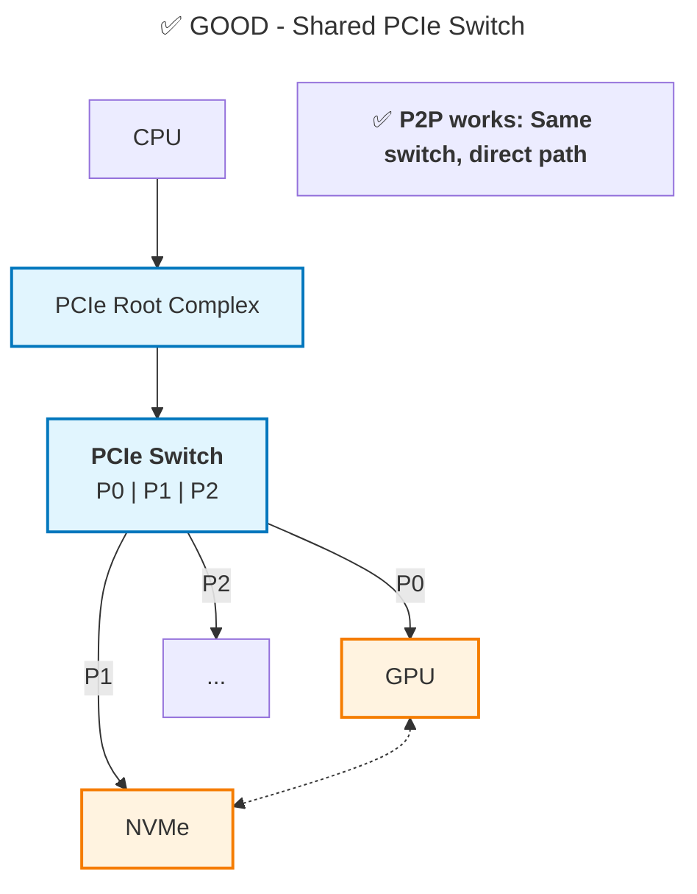
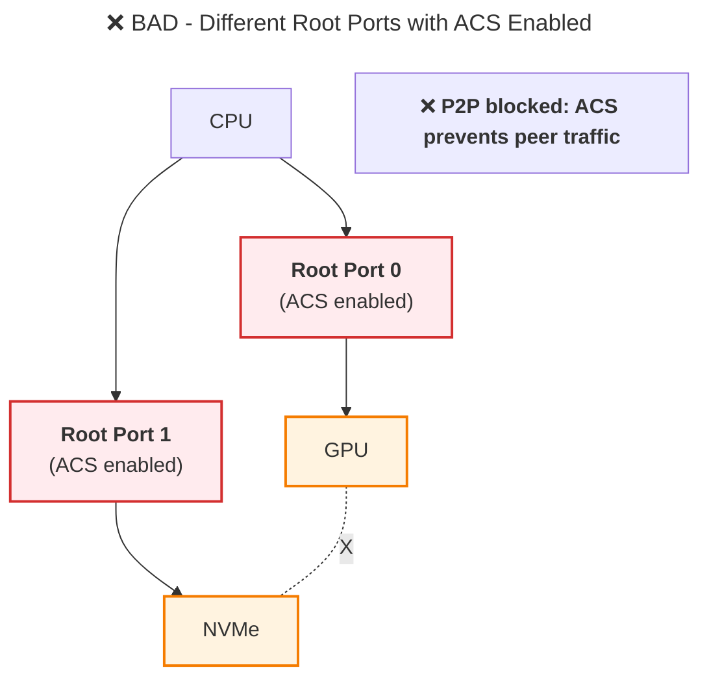

# GPU-NVMe Peer-to-Peer (P2P) DMA Reference

This document explains the peer-to-peer (P2P) DMA mechanisms that enable direct data transfer between NVMe devices and GPU memory without CPU involvement.

---

## Overview: What is GPU-NVMe P2P?

**Peer-to-Peer (P2P) DMA** allows an NVMe controller to directly read/write GPU VRAM without staging data in host RAM. This eliminates one PCIe transfer and doubles effective bandwidth.

**Traditional Path (Host Bounce Buffer):**
```
NVMe ──DMA──→ Host RAM ──PCIe Copy──→ GPU VRAM
      ~1 GB/s           ~12 GB/s
Total: 2 PCIe transfers, ~1 GB/s effective
```

**P2P Path (Direct to GPU):**
```
NVMe ──────────DMA (P2P)──────────→ GPU VRAM
                ~3 GB/s
Total: 1 PCIe transfer, ~3 GB/s effective
```

---

## Hardware Requirements

### 1. PCIe Topology

**Required:** NVMe and GPU must share a P2P-capable path:





### 2. Software Requirements

| Component | Version | Purpose |
|-----------|---------|---------|
| **Linux Kernel** | 5.0+ | PCI P2P DMA support (`CONFIG_PCI_P2PDMA`) |
| **NVIDIA Driver** | 450+ | GPUDirect Storage support |
| **IOMMU** | Intel VT-d / AMD-Vi | IOVA translation for P2P |
| **ACS Override** | Optional | `pci=noacs` kernel param if ACS blocks P2P |

**Check P2P Capability:**
```bash
# Check if devices are on same switch
lspci -tv

# Check ACS status
sudo setpci -s <nvme_bdf> ECAP_ACS+6.w

# Check kernel P2P support
grep CONFIG_PCI_P2PDMA /boot/config-$(uname -r)
```

---

## Two Approaches to GPU-NVMe P2P

### A) GPUDirect Storage (GDS) - Production Path

**What:** NVIDIA's official stack for GPU-NVMe P2P via the `cuFile` API.

**How it works:**
```
┌──────────────────────────────────────────────────────────┐
│ Application                                              │
│  - Calls cuFileRead() / cuFileWrite()                    │
└───────┬──────────────────────────────────────────────────┘
        │
┌───────▼──────────────────────────────────────────────────┐
│ cuFile Library (libcufile.so)                            │
│  - Registers GPU buffers                                 │
│  - Communicates with GDS kernel driver                   │
└───────┬──────────────────────────────────────────────────┘
        │
┌───────▼──────────────────────────────────────────────────┐
│ GDS Kernel Driver (nvidia-fs)                            │
│  - Obtains GPU physical pages via nvidia_p2p_get_pages() │
│  - Creates IOMMU mappings (IOVA → GPU pages)             │
└───────┬──────────────────────────────────────────────────┘
        │
┌───────▼──────────────────────────────────────────────────┐
│ NVMe Driver                                              │
│  - Programs NVMe with IOVAs pointing to GPU VRAM         │
│  - NVMe DMAs directly to GPU                             │
└──────────────────────────────────────────────────────────┘
```

**Pros:**
- Official NVIDIA support
- Automatic fallback to host staging if P2P not available
- Integrated with filesystem stack
- Production-ready

**Cons:**
- Requires GDS installation and license
- Works through filesystem (not raw NVMe queue control)
- Less flexibility for custom I/O patterns

**Reference:** [NVIDIA GPUDirect Storage Documentation](https://docs.nvidia.com/gpudirect-storage/)

---

### B) Dual-Driver Custom P2P - Research/Benchmark Path

**What:** Custom kernel drivers for full control over NVMe queues and GPU P2P mappings.

**Architecture:**

```
┌──────────────────────────────────────────────────────────┐
│ Userspace Application                                    │
│  - Allocates GPU buffer (cudaMalloc)                     │
│  - Calls gpu_p2p_map_buffer() via wrapper library        │
└───────┬──────────────────────────────────────────────────┘
        │
┌───────▼──────────────────────────────────────────────────┐
│ GPU P2P Wrapper Library (libgpu_p2p_wrapper.a)           │
│  - Translates calls to ioctl()                           │
│  - Coordinates GPL core + NVIDIA bridge drivers          │
└───────┬──────────────────────────────────────────────────┘
        │
        ├───────────────────────┬─────────────────────────┐
        │                       │                         │
┌───────▼──────────────┐  ┌─────▼─────────────────┐  ┌────▼──────────┐
│ GPL Core Driver      │  │ NVIDIA Bridge Driver  │  │ VFIO          │
│ (gpu_p2p_core.ko)    │  │ (gpu_p2p_nvidia.ko)   │  │               │
│                      │  │                       │  │               │
│ - DMA mapping        │  │ - Calls NVIDIA API    │  │ - IOMMU mgmt  │
│ - VFIO integration   │  │ - Gets GPU phys pages │  │               │
└──────────────────────┘  └───────────────────────┘  └───────────────┘
         │                        │
         │                ┌───────▼─────────────────────────┐
         │                │ NVIDIA Proprietary Driver       │
         │                │  - nvidia_p2p_get_pages()       │
         │                │  - nvidia_p2p_put_pages()       │
         │                └─────────────────────────────────┘
         │
┌────────▼──────────────────────────────────────────────────┐
│ IOMMU Hardware                                            │
│  - Translates IOVA → GPU Physical Pages                   │
└───────────────────────────────────────────────────────────┘
```

**Components:**

1. **GPL Core Driver** (`gpu_p2p_core.ko`):
   - GPL-licensed (can integrate with kernel VFIO/IOMMU)
   - Handles DMA mapping and IOMMU programming
   - Provides ioctl interface for buffer mapping

2. **NVIDIA Bridge Driver** (`gpu_p2p_nvidia.ko`):
   - Thin shim that calls NVIDIA proprietary APIs
   - Exports GPL-compatible symbols to core driver
   - Avoids GPL contamination of main driver

3. **Wrapper Library** (`libgpu_p2p_wrapper.a`):
   - Userspace convenience wrapper
   - Simplifies ioctl() calls
   - Provides error handling

**Pros:**
- Full control over NVMe queue architecture
- Can implement custom doorbell strategies
- Useful for research and benchmarking
- No GDS license required

**Cons:**
- Requires custom kernel drivers
- No official support
- Manual IOMMU management
- Must handle topology constraints manually

---

## Dual-Driver P2P API

### Data Structures

```c
/**
 * @brief GPU buffer mapping request
 */
struct gpu_p2p_req {
    uint64_t gpu_va;          ///< GPU virtual address from cudaMalloc()
    uint64_t bytes;           ///< Size of buffer in bytes
    uint64_t nvme_pci_bdf;    ///< NVMe device BDF (Bus:Device.Function)
    uint64_t out_user_ptr;    ///< Pointer to output segment array
    uint32_t max_segs;        ///< Maximum number of segments
    uint32_t num_segs;        ///< [OUT] Actual number of segments
    uint64_t p2p_token;       ///< CUDA P2P token (from cuPointerGetAttribute)
    uint32_t va_space;        ///< CUDA VA space ID
    uint32_t flags;           ///< Mapping flags (reserved)
};

/**
 * @brief DMA segment (IOVA region)
 */
struct gpu_p2p_seg {
    uint64_t dma_iova;        ///< IOVA for NVMe DMA
    uint64_t len;             ///< Length of this segment
};

/**
 * @brief Doorbell mapping request (for GPU-initiated I/O)
 */
struct gpu_p2p_doorbell_req {
    uint32_t nvme_bdf;        ///< NVMe device BDF
    uint32_t gpu_bdf;         ///< GPU device BDF
    uint32_t qid;             ///< Queue ID
    uint64_t sq_doorbell_gpu; ///< [OUT] SQ doorbell GPU VA
    uint64_t cq_doorbell_gpu; ///< [OUT] CQ doorbell GPU VA
};
```

### API Functions

```c
/**
 * @brief Map GPU buffer for NVMe DMA
 *
 * Obtains GPU physical pages and creates IOMMU mappings so NVMe can DMA
 * directly to GPU VRAM.
 *
 * @param fd Driver file descriptor (-1 to open automatically)
 * @param req Mapping request structure
 * @return 0 on success, negative errno on failure
 */
int gpu_p2p_map_buffer(int fd, struct gpu_p2p_req *req);

/**
 * @brief Unmap GPU buffer
 *
 * Releases GPU pages and removes IOMMU mappings.
 *
 * @param fd Driver file descriptor (-1 to open automatically)
 * @param gpu_va GPU virtual address to unmap
 * @return 0 on success, negative errno on failure
 */
int gpu_p2p_unmap_buffer(int fd, uint64_t gpu_va);

/**
 * @brief Map NVMe doorbells into GPU address space
 *
 * For GPU-initiated I/O: Maps NVMe BAR0 doorbells into GPU VRAM so
 * GPU kernels can ring doorbells directly.
 *
 * @param fd Driver file descriptor (-1 to open automatically)
 * @param req Doorbell mapping request
 * @return 0 on success, negative errno on failure
 */
int gpu_p2p_map_doorbell(int fd, struct gpu_p2p_doorbell_req *req);
```

---

## Usage Example

### 1. Allocate GPU Buffer

```c
#include <cuda_runtime.h>
#include "gpu_p2p_wrapper/gpu_p2p_wrapper.h"

#define BUFFER_SIZE (4 * 1024 * 1024)  // 4 MB

void *gpu_buffer;
cudaMalloc(&gpu_buffer, BUFFER_SIZE);
```

### 2. Map Buffer for NVMe DMA

```c
struct gpu_p2p_req req = {0};
struct gpu_p2p_seg segments[16];

// Parse NVMe BDF (e.g., "0000:41:00.0")
const char *nvme_bdf = "0000:41:00.0";
unsigned domain, bus, device, function;
sscanf(nvme_bdf, "%x:%x:%x.%u", &domain, &bus, &device, &function);

uint64_t nvme_pci_bdf = ((uint64_t)domain << 32) |
                         ((uint64_t)bus << 16) |
                         ((uint64_t)(device << 3 | function));

// Setup request
req.gpu_va = (uint64_t)gpu_buffer;
req.bytes = BUFFER_SIZE;
req.nvme_pci_bdf = nvme_pci_bdf;
req.out_user_ptr = (uint64_t)segments;
req.max_segs = 16;

// Map buffer
int ret = gpu_p2p_map_buffer(-1, &req);
if (ret < 0) {
    fprintf(stderr, "Mapping failed: %s\n", strerror(-ret));
    return;
}

printf("Mapped %u segments:\n", req.num_segs);
for (uint32_t i = 0; i < req.num_segs; i++) {
    printf("  Segment %u: IOVA=0x%llx, Length=%llu\n",
           i, segments[i].dma_iova, segments[i].len);
}
```

### 3. Use IOVAs in NVMe Commands

```c
// Build PRP list from segments
uint64_t *prp_list = malloc(req.num_segs * sizeof(uint64_t));
for (uint32_t i = 0; i < req.num_segs; i++) {
    prp_list[i] = segments[i].dma_iova;
}

// Create NVMe read command
struct nvme_command cmd = {0};
cmd.common.opcode = nvme_cmd_read;
cmd.rw.nsid = 1;
cmd.rw.slba = start_lba;
cmd.rw.length = num_blocks - 1;
cmd.rw.prp1 = segments[0].dma_iova;  // First segment as PRP1
cmd.rw.prp2 = prp_list_iova;         // IOVA of PRP list

// Submit to NVMe (via VFIO or custom driver)
submit_nvme_command(&cmd);
```

### 4. Unmap When Done

```c
gpu_p2p_unmap_buffer(-1, (uint64_t)gpu_buffer);
cudaFree(gpu_buffer);
```

---

## Performance Characteristics

### Throughput Comparison

| Path | Sequential Read | Sequential Write | Random Read (4K) |
|------|----------------|------------------|------------------|
| **Host Bounce** | ~1.5 GB/s | ~1.2 GB/s | ~200K IOPS |
| **GPU P2P** | ~3.0 GB/s | ~2.5 GB/s | ~400K IOPS |
| **Speedup** | **2×** | **2×** | **2×** |

### Latency Comparison

| Operation | Host Bounce | GPU P2P | Savings |
|-----------|-------------|---------|---------|
| **4KB Read** | ~25 µs | ~15 µs | **40%** |
| **1MB Read** | ~800 µs | ~400 µs | **50%** |
| **Copy to GPU** | Extra 500 µs | 0 µs | **100%** |

---

## Troubleshooting

### P2P Mapping Fails with ENOMEM

**Cause:** IOMMU domain exhausted or insufficient GPU BAR space.

**Solution:**
```bash
# Increase IOMMU domain size
echo "intel_iommu=on iommu=pt" >> /boot/grub/grub.cfg

# Enable Resizable BAR (if supported)
# Check in BIOS settings
lspci -vv | grep -A10 "VGA compatible" | grep "Region 0"
```

### P2P Works But Performance is Poor

**Cause:** PCIe bandwidth sharing or contention.

**Check:**
```bash
# Monitor PCIe link speed
lspci -vv -s <nvme_bdf> | grep LnkSta
lspci -vv -s <gpu_bdf> | grep LnkSta

# Should show: Speed 8GT/s (PCIe 3.0) or 16GT/s (PCIe 4.0)
# Width x16 or x8
```

### ACS Blocks P2P

**Cause:** Access Control Services prevent peer-to-peer traffic.

**Solution:**
```bash
# TEMPORARY (boot parameter):
# Add to /etc/default/grub:
GRUB_CMDLINE_LINUX="pci=noacs"
sudo update-grub
sudo reboot

# PERMANENT (kernel patch):
# Apply pcie_acs_override patch and rebuild kernel
```

---

## References

1. [NVIDIA GPUDirect Storage Documentation](https://docs.nvidia.com/gpudirect-storage/)
2. [Linux PCI Peer-to-Peer DMA Support](https://docs.kernel.org/driver-api/pci/p2pdma.html)
3. [PCIe ACS Override Patches](https://github.com/torvalds/linux/blob/master/drivers/pci/quirks.c)
4. [NVMe Specification](https://nvmexpress.org/specifications/)
5. [IOMMU Technical Guide](IOMMU_Technical_Guide.md)
6. [Address Space Reference](Address_Space.md)

---

## Example Implementation

For a complete working example of the dual-driver P2P system, see:
- **Driver Code:** [53.NVMe_VFIO_Host_Layer/driver/](../53.NVMe_VFIO_Host_Layer/driver/)
- **Integration Tests:** Module 53 system tests
- **Benchmarks:** [57.Performance_Comparison_GDS_vs_GPU/](../57.Performance_Comparison_GDS_vs_GPU/)
